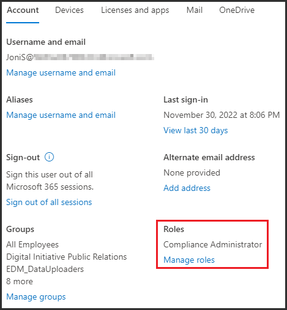

---
lab:
  title: 연습 1 - 규정 준수 역할 관리
  module: Module 1 - Implement Information Protection
---
# 연습 1 - 규정 준수 역할 관리

Joni Sherman의 역할에서 Contoso Ltd.의 최근 고용된 규정 준수 관리 주체로서 사용자의 책임은 규정 준수 요구 사항을 충족하도록 조직의 새 Microsoft 365 테넌트를 구성하는 것입니다. Contoso Ltd.는 유럽 연합(EU)의 새로운 자회사와 미국 본사를 둔 회사로, 새로운 Microsoft 365 테넌트가 다른 국가의 법적 요구 사항과 업계 부문의 규제 표준을 준수하도록 하는 것이 조직에서 필수적입니다.

## 작업 1 – 규정 준수 역할 할당

이 연습에서는 최소 권한의 주체를 따르고 기본 Global 관리istrator를 사용하여 이 랩에 설명된 작업을 수행하는 데 필요한 준수 관리 역할을 Joni Sherman에 할당합니다.

1. 클라이언트 1 VM(LON-CL1)에 lon-cl1\admin** 계정으로 **로그인합니다. 랩 호스팅 공급자가 암호를 제공해야 합니다.

1. Microsoft Edge를 열고 **, 주소 표시줄을 선택하고, MOD 관리istrator로 **Microsoft 365 관리 센터 이동하여 ****https://admin.microsoft.com로그인합니다.** admin@WWLxZZZZZZ.onmicrosoft.com**  관리 암호는 랩 호스팅 공급자가 제공해야 합니다.

1. 대화 상자가 **닫히기 전까지 대화 상자를 이동한** 항목에서 다음**을 선택합니다**.

1. 왼쪽 탐색 창에서 사용자를** 확장**한 다음 활성 사용자를** 선택합니다**.

1. **활성 사용자** 목록에서 Joni Sherman**을 선택합니다**. 그러면 Joni의 사용자 설정이 있는 플라이아웃 페이지가 오른쪽에 열립니다.

1. Joni의 사용자 설정 페이지의 계정 탭 아래에서 **역할**로 스크롤한 **다음 역할** 관리를 선택합니다**.**

      

1. **관리자 역할** 관리 플라이아웃 페이지에서 관리 센터 액세스를** 선택한 **다음 아래로 스크롤하여 범주**별로 모두 표시를 선택합니다**. 보안 및 규정 준수** 범주의 **범주 보기에서 준수 관리istrator를** 선택합니다**.

1. 변경 내용** 저장을 선택하여 **역할을 적용합니다. 페이지 위쪽에 **업데이트**된 관리 역할이 표시되면 왼쪽을 가리키는 화살표를 선택하여 Joni의 사용자 설정으로 돌아갑니다.

1. 활성 사용자** 목록으로 돌아가**려면 오른쪽 위에 X**가 **있는 Joni Sherman의 계정이 표시된 플라이아웃 페이지를 닫습니다.

1. Joni Sherman으로 전환하기 전에 MOD 관리자의 전역 관리자 권한을 사용하여 https://compliance.microsoft.com/auditlogsearch로 이동하여 감사 로깅을 활성화합니다.

1. **감사** 페이지에서. **사용자 및 관리자 활동 기록 시작**을 선택하여 감사 로깅을 활성화합니다.

1. 오른쪽 위에 MA**가 있는 원**을 선택하고 로그아웃**을 선택합니다**.

1. **Microsoft Edge** 브라우저 창을 닫습니다.

이 랩의 다양한 연습을 수행하는 데 필요한 규정 준수 관리 주체 역할을 Joni Sherman에게 성공적으로 할당했습니다. 다음 작업을 계속합니다.

## 작업 2 - Microsoft Purview 포털 살펴보기

이 작업에서는 전역 관리자 계정에서 로그아웃하고 Joni Sherman으로 다시 로그인합니다. 이제 Joni Sherman이 규정 준수 관리자 역할을 할당했으므로 이 랩의 대부분의 연습에서 그녀의 계정으로 충분합니다.

1. 여전히 클라이언트 1 VM(LON-CL1)에 lon-cl1\admin** 계정으로 **로그인해야 합니다.

1. **Microsoft Edge**에서 **https://compliance.microsoft.com**으로 이동합니다.

1. **계정** 선택 창이 표시되면 다른 계정** 사용을 선택합니다**.

1. **로그인** 창이 표시되면 다음으로 JoniS@WWLxZZZZZZ.onmicrosoft.com로그인합니다. Joni의 암호는 랩 호스팅 공급자가 제공해야 합니다.

1. **Microsoft Purview 규정 준수 포털 시작** 페이지가 표시됩니다. 대시보드 타일 및 왼쪽 탐색 창을 탐색합니다.

1. 다양한 설정에 익숙해지세요. 완료되면 브라우저 창을 열어 둡니다.

Joni Sherman의 계정으로 성공적으로 전환했으며 이제 랩을 시작할 준비가 되었습니다.
