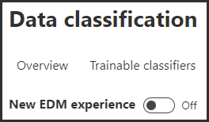

---
lab:
  title: 연습 2 - 중요한 정보 유형 관리
  module: Module 1 - Implement Information Protection
---


# 연습 2 - 중요한 정보 유형 관리

Contoso Ltd.는 이전에 발권 솔루션에서 지원 티켓을 사용할 때 실수로 고객으로부터 개인 정보를 보내는 직원에게 문제가 있었습니다. 나중에 사용자를 교육하려면 3개의 대문자와 6개의 숫자로 구성된 전자 메일 및 문서에서 직원 ID를 식별하려면 사용자 지정 중요한 정보 유형이 필요합니다. 가양성 비율을 낮추기 위해 키워드(keyword) "직원" 및 "ID"가 사용됩니다. 이 작업에서는 새 사용자 지정 중요한 정보 유형, EDM 기반 분류용 데이터베이스 및 키워드(keyword) 사전을 만듭니다.

## 작업 1 – 사용자 지정 중요한 정보 유형 만들기

이 연습에서는 보안 및 규정 준수 센터 PowerShell 모듈을 사용하여 "직원" 및 "ID" 키워드(keyword) 근처의 직원 ID 패턴을 인식하는 새로운 사용자 지정 중요한 정보 유형을 만듭니다.

1. 여전히 클라이언트 1 VM(LON-CL1)에 lon-cl1\admin** 계정으로 **로그인해야 합니다.

1. Microsoft Edge에서 **Microsoft Purview 포털JoniS@WWLxZZZZZZ.onmicrosoft.com로 이동하여 **https://compliance.microsoft.com** 로그인합니다.** Joni의 암호는 랩 호스팅 공급자가 제공해야 합니다.

1. 왼쪽 창에서 데이터 분류를 확장하고 **분류자를 선택합니다 **.****

1. **데이터 분류란 무엇인가요?** 메시지가 표시되면 **닫기**를 선택합니다.

1. 위쪽 창에서 **중요한 정보 유형**을 선택합니다.

    >[!hint] **힌트:** **Purview 포털에 중요한 정보 유형**이 표시되지 않으면 이전 랩의 준수 관리 대한 Joni의 권한 업데이트가 브라우저에서 업데이트되지 않은 것일 수 있습니다. 로그아웃했다가 JoniS로 로그인해야 할 수 있습니다.

1. **중요한 정보 유형** 탭에서 **+ 중요한 정보 유형 만들기**를 선택하여 새 중요한 정보 유형 만들기 마법사를 엽니다.

1. **중요한 정보 유형 이름 지정** 페이지에서 다음 정보를 입력합니다.

    - **이름**: Contoso 직원 ID
    - **설명**: Contoso 직원 ID의 패턴입니다.

1. **다음**을 선택합니다.

1. **이 중요한 정보 유형**에 대한 패턴 정의 페이지에서 + 패턴** 만들기를 선택합니다**.

1. 오른쪽 **새 패턴** 창에서 **+ 기본 요소 추가**를 선택하고 **정규식**을 선택합니다.

1. 새 오른쪽 창에서 **정규식 추가**에서 다음을 입력합니다.

    - **ID**: Contoso ID
    - **정규식**: ```[A-Z]{3}[0-9]{6}```
    - *문자열 일치*

1. **완료**를 선택합니다.

1. **새 패턴** 플라이아웃 페이지의 지원 요소**** 아래에서 **+ 지원 요소 추가 또는 요소** 그룹 드롭다운 메뉴를 선택하고 키워드 목록을** 선택합니다**.

1. 새 오른쪽 창에서 **키워드 목록 추가**에 다음을 입력합니다.

    - **ID**: 직원 ID 키워드
    - **대/소문자 구분 안 함**:
        - *직원*
        - *ID*
    - 대/소문자 구분** 필드 아래에서 Word 일치* 방**사형 *선택

1. **완료**를 선택합니다.

1. 새 패턴 창에서 문자 근접** 값을 *100*자로 줄**입니다.

1. **만들기** 단추를 선택합니다.

1. **이 중요한 정보 유형에 대한 패턴 정의** 페이지로 돌아가서 **다음**을 선택합니다.

1. **준수 정책에** 표시할 권장 신뢰도 수준 선택 페이지에서 기본값을 사용하고 다음**을 선택합니다**.

1. **검토 설정 및 완료** 페이지에서 설정을 검토하고 만들기**를 선택합니다**. 성공적으로 생성되면 완료**를 선택합니다**.

1. 브라우저 창은 열어 둡니다.

100자 범위 내에서 세 개의 대문자, 6개의 숫자 및 키워드(keyword) '직원' 또는 'ID' 패턴으로 직원 ID를 식별하는 새로운 중요한 정보 유형을 만들었습니다.

## 작업 2 – EDM 기반 분류 정보 유형 만들기

추가 검색 패턴으로 직원 데이터의 데이터베이스 스키마를 사용하여 EDM(정확한 데이터 일치) 기반 분류를 만듭니다. 데이터베이스 원본 파일의 형식은 직원의 데이터 필드인 Name, Birthdate, StreetAddress 및 EmployeeID로 지정됩니다.

1. 여전히 클라이언트 1 VM(LON-CL1)에 lon-cl1\admin 계정으로 **로그인해야 하며, Joni Sherman**으로 **Microsoft 365에 로그인해야** 합니다.

1. 필요한 Azure AD 보안 그룹을 만들려면 오른쪽 위 모서리에서 사용자 이미지를 선택하여 Joni Sherman의 계정에서 로그아웃하고 로그아웃**을 선택합니다**.

1. 브라우저 창을 닫고 새 브라우저 창을 엽니다.

1. **Microsoft Edge**에서 **https://admin.microsoft.com**으로 이동합니다.

1. **계정** 선택 페이지가 표시되면 다른 계정** 사용을 선택하고 **MOD 관리istrator**admin@WWLxZZZZZZ.onmicrosoft.com로 **로그인합니다. 관리 암호는 랩 호스팅 공급자가 제공해야 합니다.

1. 왼쪽 창에서 Teams 및 그룹을** 확장**한 다음, 활성 팀 및 그룹을** 선택합니다**.

1. 활성 팀 및 그룹 페이지의 위쪽 탐색 모음에서 보안 그룹을 선택한 **다음, + 보안 그룹** 추가를 선택합니다**.**

    

1. **기본 사항 설정** 화면에서 다음을 입력합니다.
    - **이름**: EDM_DataUploaders
    - **설명**: EDM에 대한 데이터를 업로드하는 사람.

1. **다음**을 선택합니다.

1. **설정 편집** 페이지에서 **역할 할당**을 기본 설정으로 두고 **다음**을 선택합니다.

1. **검토 및 그룹** 추가 완료 페이지에서 설정을 검토하고 그룹** 만들기를 선택합니다**.

1. **새 그룹 생성** 페이지가 표시되면 닫기를** 선택합니다**.

1. **위쪽 탐색 모음에서 보안** 탭이 선택되어 있는지 확인하고 새로 고침**을 선택합니다**. 목록에서 새로 만든 **EDM_DataUploaders** 그룹을 선택하여 오른쪽의 **EDM_DataUploaders** 플라이아웃 페이지를 엽니다.

1. 구성원 탭을 **선택하고 모두 보기 및 멤버** 관리를 선택합니다**.**

1. **그룹 구성원** 관리 화면에서 (+) 구성원** 추가를 선택합니다**.

1. Joni Sherman**을 선택하고 ****추가(1)** 단추를 선택한 다음, 뒤로 화살표 단추를 선택합니다.

1. 조니 셔먼**이 회원 아래에 **나열되어 있는지 확인**합니다**.

1. 오른쪽 창을 X**로 **닫습니다.

1. MOD 관리istrator initials MA**를 사용하여 원을 **선택하고 로그아웃**을 선택합니다**.

1. 브라우저 창을 닫고 새 창을 엽니다.

1. https://compliance.microsoft.com에서 Microsoft Purview 포털로 이동합니다.

1. **계정** 선택 페이지가 표시되면 Joni Sherman**을 선택하고 **로그인합니다. Joni의 암호는 랩 호스팅 공급자가 제공해야 합니다.

1. 데이터 분류를 확장하고 **분류자를** 선택한 **다음 위쪽 창에서 EDM 분류자** 탭을 선택합니다**.**

    >[!note] **참고:** EDM(정확한 데이터 일치) 기반의 SIT(중요한 정보 유형)를 만들고 사용할 수 있도록 하는 것은 다단계 프로세스입니다. 기존 클래식 환경에서 새로운 환경을 사용할 수 있습니다. 이 랩에서는 클래식 환경을 사용하여 EDM 기반의 SIT를 만드는 방법에 대해 설명합니다. 새로운 환경을 사용하여 EDM 기반의 SIT를 만드는 방법에 대한 자세한 내용은 다음을 참조하세요. [정확한 데이터 일치 중요한 정보 유형 워크플로 새로운 경험 만들기](https://learn.microsoft.com/en-us/microsoft-365/compliance/sit-create-edm-sit-unified-ux-workflow?view=o365-worldwide)

1. 클래식 환경을 위해 **새 EDM 환경** 스위치를 **끄기**로 선택했는지 확인합니다.

      

1. **+ EDM 스키마 만들기**를 선택합니다.

1. **새 EDM 스키마** 페이지에서 다음을 입력합니다.
    - **이름**: employeedb
    - **설명**: 직원 데이터베이스 스키마

1. **모든 스키마 필드에서 구분 기호 및 문장 부호 무시**를 사용하도록 설정합니다.

1. 구분 기호 및 문장 부호 선택 드롭다운**을 클릭하여 하이픈 *, 마침표 *, 공백 *, *** 괄호 열기 및 *닫기 괄호** 를 무시하고** 선택합니다.*

1. 첫 **번째 스키마 필드 이름**에 이름을* 입력*하고 필드를 검색할 수 있는** 상자로 표시**합니다.

1. 아래쪽에서 **+ 스키마 데이터 필드 추가**를 선택합니다.

1. 스키마 필드 이름에서 **스키마 필드 #2** 아래에 **Birthdate를 입력*합니다*.**

1. 아래쪽에서 **+ 스키마 데이터 필드 추가**를 다시 선택합니다.

1. **스키마 필드 이름**에서 스키마 필드 #3** 아래에 **StreetAddress*를 입력*합니다.

1. 마지막으로 아래쪽에서 **+ 스키마 데이터 필드 추가**를 선택합니다.

1. 스키마 필드 이름에서 **스키마 필드 #4** 아래에 **EmployeeID*를 입력*** 합니다.

1. 필드를 검색 **할 수 있습니다**.

1. **저장**을 선택합니다.

1. 왼쪽 창에서 EDM 중요한 정보 유형을** 선택합니다**.

1. + EDM 중요한 정보 유형** 만들기를 선택하여 **EDM 규칙 패키지** 마법사를 **엽니다.

1. **데이터 저장소 스키마** 정의 페이지에서 기존 EDM 스키마** 선택을 선택합니다**.

1. employeedb**를 선택하고 **추가**를 선택합니다**.

    >[!note] **참고**: employeedb** 스키마를 선택할 수 없는 경우 **페이지를 새로 고쳐야 할 수 있습니다.

1. 데이터 저장소 스키마를 검토하고 다음**을 선택합니다**.

1. **이 EDM 중요한 정보 유형**에 대한 패턴 정의 페이지에서 + 패턴** 만들기를 선택합니다**.

1. 오른쪽의 **새 패턴** 창에 있는 기본 요소 필드에서 *EmployeeID*를 선택합니다.

1. **기본 요소의 중요한 정보 유형** 아래에서 **+ 중요한 정보 유형 선택**을 선택합니다.

1. 검색 창에서 **Contoso*를 입력*하고 Enter 키를 누릅니**다.

1. **Contoso 직원 ID를** 선택하고 완료**를 선택합니다**.

1. 새 **패턴 페이지에서 완료**를 선택합니다****.

1. 이 EDM 중요한 정보 유형** 화면에 대한 패턴 정의 화면에서 다음 **** 을 선택합니다**.

1. **권장 신뢰도 수준 및 문자 근접**성 선택에서 기본값이 유지되도록 하고 다음**을 선택합니다**.

1. **EDM 중요한 정보 유형 이름 지정 및 설명** 페이지에서 다음을 입력합니다.
    - **이름**: Contoso 직원 EDM
    - **관리자를 위한 설명**: 직원 개인 정보용 EDM 기반 중요한 정보 유형입니다.

1. 다음을 선택하고 **설정을 검토하고 제출**을 선택합니다**.**

1. **EDM 중요한 정보 유형이 만들어진** 페이지에서 완료**를 선택합니다**.

데이터베이스 파일 원본에서 직원 데이터를 식별하기 위한 새 EDM 기반 분류 중요한 정보 유형을 만들었습니다.

## 작업 3 – 키워드(keyword) 사전 만들기

동료가 병가에 보고 한 후 사용자가 이메일을 보낼 때 개인 정보 유출의 몇 가지 위반이 발생했습니다. 그 일이 일어났을 때 질병이나 질병의 이유가 발송되었습니다. 우리는 그런 일이 일어나기를 원하지 않습니다.

1. 여전히 클라이언트 1 VM(LON-CL1)에 lon-cl1\admin 계정으로 **로그인해야 하며, Joni Sherman**으로 **Microsoft 365에 로그인해야** 합니다.

1. **Microsoft Edge**에는 Microsoft Purview 포털 탭이 계속 열려 있어야 합니다. 그렇다면 선택하고 다음 단계로 진행합니다. 닫았다면 새 탭에서 **https://compliance.microsoft.com**으로 이동합니다.

1. 왼쪽 창에서 데이터 분류**를 확장**한 다음 분류자를** 선택합니다**. 위쪽 창에서 중요한 정보 유형** 탭을 선택합니다**.

1. + 중요한 정보 유형 만들기를 선택하여 **새 중요한 정보 유형** 에 대한 마법사를 엽니다.

1. **중요한 정보 유형 이름 지정** 페이지에서 다음을 입력합니다.

    - **이름**: Contoso 질병 목록
    - **설명**: 직원이 병가를 요청할 수 있는 질병 목록입니다.

1. **다음**을 선택합니다.

1. **이 중요한 정보 유형**에 대한 패턴 정의 페이지에서 + 패턴** 만들기를 선택합니다**.

1. **새 패턴** 페이지에서 기본 요소** 아래**의 드롭다운 필드를 선택하고 키워드 사전을** 선택합니다**.

1. **키워드(keyword) 사전** 추가 페이지에서 다음을 입력합니다.

   - **이름**: 질병 사전
   - **키워드:**
      - {b>유행성 감기<b}
      - {b>인플루엔자<b}
      - {b>감기<b}
      - {b>기관지염<b}
      - {b>중이염<b}

1. **완료**를 선택합니다.

1. **지원 요소** 아래에서 **+ 지원 요소 또는 요소 그룹 추가** 드롭다운을 선택하고 **키워드 목록**을 선택하여 키워드 사전용 추가 지원 요소를 추가합니다.

1. **키워드 목록 추가** 페이지에서 다음을 입력합니다.

   - **ID**: 직원 결근
   - **대/소문자 구분 안 함**:
     - 직원
     - {b>결근<b}
     - reason

1. **완료**를 선택합니다.

1. **새 패턴** 페이지에서 구성을 검토하고 **만들기**를 선택합니다.

1. **이 중요한 정보 유형에 대한 패턴 정의** 에서 **다음**을 선택합니다.

1. **규정 준수 정책에 표시할 권장 신뢰 수준 선택**에서 기본값을 사용하고 **다음**을 선택합니다.

1. **설정 검토 후 완료** 페이지에서 설정을 검토하고 **만들기**를 선택합니다. 프로세스가 완료되면 완료**를 선택합니다**.

1. Microsoft Purview 포털의 브라우저 창을 열어 둡니다.

키워드(keyword) 사전을 기반으로 새 중요한 정보 유형을 성공적으로 만들고 가양성 비율을 줄이기 위해 더 많은 키워드(keyword) 추가했습니다. 다음 작업을 진행합니다.

## 작업 4 – 사용자 지정 중요한 정보 유형 작업

사용자 지정 중요한 정보 유형은 정책에서 사용하기 전에 항상 테스트해야 합니다. 그렇지 않으면 사용자 지정 검색 패턴이 오작동하여 데이터 손실 또는 누출이 발생할 수 있습니다.

1. 여전히 클라이언트 1 VM(LON-CL1)에 lon-cl1\admin 계정으로 **로그인해야 하며, Joni Sherman**으로 **Microsoft 365에 로그인해야** 합니다.

1. 왼쪽 아래에 있는 Windows 기호를 선택하여 시작 메뉴를 열고, 메모장** 입력**하고, 시작 메뉴에서 메모장** 선택합니다**.

1. 메모장 창에 다음 텍스트를 입력합니다.

    ``` text
    Employee Joni Sherman EMP123456 is absent because of the flu/influenza.
    ```

1. 파일을** **선택하고 **다른 이름으로** 저장합니다.

1. 왼쪽 창에서 문서를 선택합니다.

1. **파일 이름** 필드에 *SickTestData*를 입력하고 **저장**을 선택합니다.

1. 메모장 창을 닫습니다.

1. **Microsoft Edge**에는 Microsoft Purview 포털 탭이 계속 열려 있어야 합니다. 그렇다면 선택하고 다음 단계로 진행합니다. 닫았다면 새 탭에서 **https://compliance.microsoft.com**으로 이동합니다.

1. 왼쪽 탐색 창에서 데이터 분류**를 확장**한 다음 분류자를** 선택합니다**. 중요한 정보 유형** 탭을 **선택합니다.

1. 오른쪽 위에 있는 **검색** 상자에 *Contoso*를 입력하고 Enter 키를 누릅니다.

1. **Contoso 직원 ID**를 선택합니다.

1. **테스트**를 선택합니다.

1. **테스트**할 파일 업로드 페이지에서 파일** 업로드를 선택합니다**.

1. 왼쪽 창에서 문서를 선택하고 **SickTestData*라는 이름의 *파일을 선택하고 열기**를 선택합니다****.

1. 테스트를** 선택하여 **분석을 시작합니다.

1. **일치 결과** 페이지에서 찾은 일치 항목을 검토합니다.

1. **마침**을 선택하여 테스트를 끝냅니다.

1. 상단 탐색 모음을 사용하여 **중요한 정보 유형**으로 다시 이동합니다.

1. *Contoso*를 검색한 다음 **Contoso 질병 목록**이라는 중요한 정보 유형을 선택합니다.

1. **테스트**를 선택합니다.

1. **테스트할 파일 업로드** 창에서 **파일 업로드**를 선택합니다.

1. 왼쪽 창에서 문서를 선택하고 **SickTestData*라는 이름의 *파일을 선택하고 열기**를 선택합니다****.

1. 테스트를** 선택하여 **분석을 시작합니다.

1. **일치 결과** 페이지에서 찾은 일치 항목을 검토합니다. 검토가 완료되면 마침**을 선택합니다**.

두 가지 사용자 지정 중요한 정보 유형을 성공적으로 테스트하고 검색 패턴이 원하는 패턴을 인식하는지 확인했습니다. 중요한 정보 유형 만들기를 마쳤으며 다음 연습을 진행할 수 있습니다.
