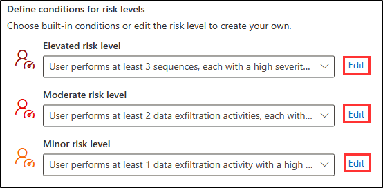
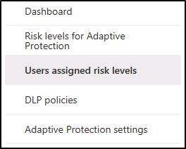

---
lab:
  title: 연습 2 - 내부 위험 관리 구성
  module: Module 5 - Manage insider and privacy risk in Microsoft 365
---

# 연습 5 - 내부 위험 관리 구성

Contoso Ltd의 규정 준수 관리 주체인 Joni Sherman입니다. 사용자의 역할에는 규정 준수를 보장하고 조직 내에서 중요한 정보를 보호하는 작업이 포함됩니다. 최근 Contoso Ltd.는 회사의 평판에 해를 끼치거나 데이터 보안을 손상하거나 법적 문제를 일으킬 수 있는 내부자 위험을 사전에 해결해야 할 필요성을 인식하고 있습니다.

내부자 위험을 효과적으로 관리하기 위해 잠재적인 내부자 위협을 식별, 분석 및 대응하도록 설계된 포괄적인 솔루션인 Microsoft Purview 내부 위험 관리 구현합니다.

## 작업 1: 내부 위험 관리 역할 할당

이 연습에서는 Insider Risk Management 역할을 Joni에 할당하여 Microsoft Purview 포털에서 내부자 위험 작업을 수행할 수 있는 액세스 권한을 부여합니다.

1. 클라이언트 1 VM(LON-CL1) **lon-cl1\admin** 계정에 계속 로그인해야 합니다.

1. Microsoft Edge에서 MOD 관리istrator로 Microsoft Purview 포털로 이동하여 **https://compliance.microsoft.com** 로그인합니다. **admin@WWLxZZZZZZ.onmicrosoft.com**  관리 암호는 랩 호스팅 공급자가 제공해야 합니다.

1. 역할 및 범위**로 **이동한 다음 드롭다운에서 사용 권한을** 선택합니다**.

1. **사용 권한** 페이지의 Microsoft Purview 솔루션**에서 **역할을** 선택합니다**.

1. **Microsoft Purview 솔루션**에 대한 역할 그룹에서 참가자 위험 관리를** 선택합니다**.

1. 오른쪽의 **Insider Risk Management** 플라이아웃 페이지에서 편집**을 선택합니다**.

1. **역할 그룹** 페이지의 구성원 편집 페이지에서 + 사용자** 선택을 선택합니다**.

1. **사용자** 선택 페이지에서 Joni Sherman 옆에 있는 검사 상자를 선택한 다음 선택 단추를 선택합니다****.

1. **역할 그룹** 페이지의 구성원 편집 페이지에서 다음**을 선택합니다**.

1. **역할 그룹 검토 및 완료** 페이지에서 저장**을 선택합니다**.

1. **성공적으로 업데이트된 역할 그룹** 페이지에서 완료**를 선택합니다**.

1. MOD 관리istrator** 계정에서 로그아웃**하고 모든 브라우저 창을 닫습니다.

Joni Sherman에 참가자 위험 관리 역할을 성공적으로 할당하여 Microsoft Purview 포털에서 내부자 위험 작업을 수행할 수 있는 액세스 권한을 부여했습니다.

## 작업 2: 내부 위험 설정 구성

이 작업에서는 Microsoft Purview 포털에서 참가자 위험 관리 설정을 사용자 지정합니다. 이를 통해 Joni Sherman은 조직 내에서 잠재적인 내부자 위험을 효과적으로 관리하고 중요한 정보의 보안을 보장할 수 있습니다.

1. Microsoft Edge에서 **Microsoft Purview 포털JoniS@WWLxZZZZZZ.onmicrosoft.com로 이동하여 **https://compliance.microsoft.com** 로그인합니다.** Joni의 암호는 랩 호스팅 공급자가 제공해야 합니다.

1. 왼쪽 탐색 모음에서 내부 위험 관리를** 선택합니다**.

1. 오른쪽 **위에 있는 기어 아이콘을 선택하여 설정**. 
1. 설정을 탐색합니다.

    - **개인 정보:** 경고 및 사례에서 사용자 이름 또는 익명화된 버전을 표시하도록 선택할 수 있습니다.
    - **정책 지표**: 특정 위험 지표를 사용하여 정책 템플릿을 구성하는 작업이 포함됩니다.
    - **검색 그룹(미리 보기)**: 조직의 특정 사용자 집합에 대한 위험 지표 사용자 지정
    - **정책 기간**: 이벤트 및 활동에 따라 정책 일치에 의해 트리거되는 검토 기간을 정의합니다.
    - **지능형 검색**: 경고 볼륨을 제어하고, 위험 점수 매기기에서 특정 엔터티를 제외하며, Microsoft Defender 경고를 필터링할 수 있습니다.
    - **경고** 내보내기: Office 365 관리 활동 API를 사용하여 SIEM 및 SOAR 솔루션으로 위험 경고 정보를 내보냅니다.
    - **우선 순위 사용자 그룹**: 자세히 검사하고 더 중요한 위험 점수를 매기기 위해 고위험 사용자를 결정합니다.
    - **우선 순위 물리적 자산(미리 보기)**: 활동과 사용자 이벤트의 상관 관계를 지정하는 우선 순위 물리적 자산에 대한 액세스를 식별하고 모니터링합니다.
    - **Power Automate 흐름(미리 보기)**: Microsoft Power Automate 흐름을 사용하여 내부자 위험 관리 작업을 자동화합니다.
    - **Microsoft Teams(미리 보기)**: Microsoft Teams가 내부자 위험 관리 사례에 대한 공동 작업을 수행할 수 있도록 합니다.
    - **분석**: 정책 생성을 안내하는 정책을 구성하지 않고 잠재적인 내부자 위험을 평가합니다.
    - **관리 알림**: 내부자 위험 관리 역할 그룹에 메일 알림 자동으로 보냅니다.
    - **인라인 경고 사용자 지정**: 경고 대시보드에서 직접 정책 튜닝 및 임계값 조정을 허용합니다.

1. 일반** 아래의 참가자 위험 관리 설정 표시줄**에서 개인 정보를** 선택합니다**.

1. 익명화된 버전의 사용자 이름을 표시하지 않음을** 선택합니다**.

1. 저장**을 선택하여 **이 설정을 저장합니다.

1. 일반 아래**의 내부 위험 관리 설정 표시줄에서 정책 지표**를 선택합니다**.**

1. 정책 표시기** 설정 창의 **Office 표시**기에서 **모두** 선택하기 위한 **검사 상자를 선택합니다.

1. 아래로 스크롤하여 저장**을 선택합니다**.

1. 일반** 아래**의 내부 위험 관리 설정 표시줄에서 우선 순위 사용자 그룹을** 선택합니다**.

1. + 우선 순위 사용자 그룹** 만들기를 선택하여 **새 우선 순위 사용자 그룹 마법사**를 엽니다**.

1. **이름 및 우선 순위 사용자 그룹** 설명 페이지에서 다음을 입력합니다.

    - **이름**: 재무 팀
    - **설명**: 재무 운영, 예산 및 보고를 관리하는 팀 구성원

1. **다음**을 선택합니다.

1. **구성원 선택 페이지에서 + 구성원**** 선택을 선택합니다**.

1. 멤버** 선택 창에서 **린 로빈스 **, 데브라 버거 **, **메건 보웬** 옆에 있는 **검사 상자를 선택한 다음, **추가**를 선택하여 **3명의 멤버를 추가합니다.

1. **구성원** 선택 페이지에서 다음**을 선택합니다**.

1. **이 우선 순위 그룹의** 사용자와 관련된 데이터를 볼 수 있는 사용자 선택**에서 + 사용자 및 역할 그룹** 선택

1. **사용자 및 역할 그룹** 선택 페이지에서 참가자 위험 관리** 옆에 **있는 검사 상자를 선택하여 Microsoft Purview에서 참가자 위험 관리 역할을 가진 모든 구성원을 추가**합니다**.

1. **이 우선 순위 그룹의** 사용자와 관련된 데이터를 볼 수 있는 사용자 선택에서 다음**을 선택합니다**.

1. 검토** 페이지에서 제출**을 **선택합니다**.

1. **만든 우선 순위 사용자 그룹** 페이지에서 완료**를 선택합니다**. 그러면 내부 위험 관리 설정 페이지로 돌아갑니다.

1. 내부자 위험 관리를** 선택하여 **기본 참가자 위험 관리 페이지로 돌아갑니다.

참가자 위험 관리 설정을 사용자 지정했습니다. 이제 Joni Sherman은 Microsoft Purview 포털에서 중요한 데이터를 보호하면서 내부자 위험을 사전에 식별하고 완화하는 데 필요한 도구와 기능을 갖추고 있습니다.

## 작업 3: 내부 위험 정책 만들기

이 작업에서는 조직 내에서 중요한 금융 데이터 액세스를 모니터링하고 보호하도록 Microsoft Purview에서 '재무 데이터 보호'라는 정책을 구성합니다.

1. Microsoft Purview에서 Joni로 로그인해야 합니다.

1. 왼쪽 탐색 모음에서 내부 위험 관리를** 선택합니다**.

1. **위쪽 탐색 모음에서 정책** 탭을 선택한 다음+ 정책** 만들기를 선택합니다**.

1. **정책 템플릿** 선택 페이지에서 데이터 누출을** 선택한 **다음, 다음**을 선택합니다**.

1. **이름 지정에서 정책 페이지에서** 다음을 입력합니다.

    - **이름**: 재무 데이터 보호
    - **설명**: 중요한 재무 데이터 액세스 모니터링

1. **다음**을 선택합니다.

1. **사용자 및 그룹** 선택 페이지에서 선택한 모든 사용자 및 그룹** 포함을 그대로 두고 **다음**을 선택합니다**.

1. **콘텐츠 우선 순위 결정 페이지에서** 중요한 정보 유형**만 **선택한 상태로 두고 다음**을 선택합니다**.

1. **우선 순위를 지정**하는 중요한 정보 유형 페이지에서 + 중요한 정보 유형** 추가 또는 편집을 선택합니다**.

1. **중요한 정보 유형** 추가 또는 편집 창에서 은행을_ 검색_하고 미국 은행 계좌 번호** 및 **IBAN(International Banking Account Number)** 옆에 있는 **검사 상자를 선택합니다. 다음으로 크레딧을 _검색하고 신용 카드 번호** 옆에 있는 **검사 상자를 선택한 다음 추가**를 선택하여 **중요한 정보 유형 3개 추가를_ 선택합니다.

1. 중요한 정보 유형으로 **돌아가서 우선 순위를 지정**하려면 다음**을 선택합니다**.

1. **우선 순위 콘텐츠**가 있는 활동만 채점할지 여부를 결정 페이지에서 선택한 모든 활동에** 대한 경고 가져오기를 그대로 두고 **다음**을 선택합니다**.

1. **이 정책** 페이지의 트리거에서 사용자가 반출 작업을** 수행합니다**.

1. 이 정책을** 트리거할 활동 선택에서 **다음을 선택합니다.

   - **SharePoint에서 콘텐츠 다운로드**
   - **조직 외부의 받는 사람에게 첨부 파일이 포함된 전자 메일 보내기**
   - **조직 외부 사용자와 SharePoint 파일 공유**
   - **Microsoft 365 위치에서 제거된 위치 다운로드**

    >[!note] **참고**: 정책 트리거를 선택할 수 없는 경우 표시기를 켜는 팁이 있을 수 있습니다. 이 옵션을 사용할 수 있는 경우 표시기** 켜기를 선택합니다**. **표시기 선택에서 팝업을 켜**고 Office 표시**기에 대해 **모두** 선택 옆**의 검사 상자를 클릭한 다음 저장**을 선택합니다**.

1. **다음**을 선택합니다.

1. **이 정책** 페이지의 트리거 임계값에서 기본 임계값 사용(권장)**을 선택한 **다음, 다음**을 선택합니다**.

1. **표시기** 페이지에서 물리적 액세스 지표**에 대한 **드롭다운을 선택하고 종료 후 물리적 액세스를 선택 취소**하거나 선택한 경우 중요한 자산**에 대한 액세스 실패 후 다음**을 선택합니다**.

1. **검색 옵션** 페이지에서 **시퀀스 검색, **누적 반출 검색**** 및 **위험 점수 부스터** 섹션에서 모두 **** 선택, 다음**을 선택합니다**.

1. **기본 또는 사용자 지정 표시기 임계값 사용 여부 결정 페이지에서 기본 임계값을**** 선택한 **다음, 다음**을 선택합니다**.

1. **검토 설정 및 완료** 페이지에서 제출**을 선택합니다**.

1. **정책을 만든** 페이지에서 완료**를 선택합니다**.

    >[!note] **참고:** 이 페이지에서 설명한 대로 정책 일치가 경고 탭에 표시되기까지 최대 24시간이 걸릴 수 있습니다.

중요한 금융 정보에 대한 무단 액세스를 감지하고 방지하는 데 도움이 되는 '금융 데이터 보호' 정책을 성공적으로 만들었습니다. 정책 일치 항목이 경고 탭에 표시되는 데 최대 24시간이 걸릴 수 있습니다.

## 작업 4: 알림 템플릿 만들기

이 작업에서는 Microsoft Purview의 Insider Risk Management에 알림 템플릿을 만듭니다. 이 템플릿을 사용하면 위험 활동에 대한 사례가 생성될 때 사용자에게 전자 메일 메시지를 자동으로 보내거나, 미리 알림 역할을 하거나, 규정 준수 교육을 위한 정보를 제공할 수 있습니다.

1. 참가자 위험 관리에서 Microsoft Purview에서 Joni로 로그인해야 합니다.

1. 위쪽 탐색 탭에서 알림 템플릿을 선택한 **다음 + 알림 템플릿** 만들기를 선택합니다**.**

1. 오른쪽에 새 **알림 템플릿** 플라이아웃 만들기 페이지에서 필요한 정보를 입력합니다.

    - **템플릿 이름**: 데이터 누출 정책 경고
    - **** 보낸 사람: 조니 셔먼
    - **주체**: 잠재적인 데이터 누수 감지됨
    - **메시지 본문**:

        ````html
        <!DOCTYPE html>
        <html>
        <body>
        <h2>Alert: Potential Data Leak Detected</h2>
        <p>We detected a potential data leak associated with your account. As part of our Insider Risk Management policy, we are required to investigate any suspicious activity related to data breaches.</p>
        <p>Please review your recent actions, report any unusual behavior, and refer to the Contoso User Code of Conduct training at <a href='https://contoso.com'>https://contoso.com</a> for more information.</p>
        <p>Thank you for your cooperation,</p>
        <p><em>Human Resources</em></p>
        </body>
        </html>
        ````

1. **만들기**를 실행합니다.

데이터 누출 정책 경고** 알림 템플릿을 성공적으로 만들**었으며, 잠재적인 데이터 유출이 감지될 때 사용자에게 자동 알림을 보낼 수 있도록 하고, 보안 조치를 강화하고, Contoso 사용자 행동 강령 준수를 촉진했습니다.

## 작업 5: 적응형 보호 탐색

이 작업에서는 Microsoft Purview 내부 위험 관리 적응 보호에 대해 살펴보겠습니다. 빠른 설정 및 사용자 지정 설정 옵션, 사용자 지정 가능한 위험 수준, 과거 활동 검색에 대한 설정 및 위험 수준 기간을 살펴봅니다. 또한 사용자별 위험 수준 및 DLP 정책을 표시하는 탭을 검토하고 포털에서 적응형 보호 기능을 사용하거나 사용하지 않도록 설정하는 위치를 알아봅니다.

1. 참가자 위험 관리에서 Microsoft Purview에서 Joni로 로그인해야 합니다.

1. 위쪽에서 탐색 탭은 적응형 보호(미리 보기)**를 선택합니다**.

1. 내부자 위험 관리에서 적응형 보호(미리 보기)** 단추를 처음 선택하면 **적응형 보호를 설정하는 두 가지 옵션이 표시됩니다.

    

1. 빠른 설정 또는 **사용자 지정 설정**의 **두 가지 옵션을 시작할 수 있습니다**. 빠른 설정은 시작하는 가장 빠른 방법입니다. 시작하기 위해 기존 DLP 또는 내부자 위험 관리 정책이 필요하지 않습니다. 사용자 지정 설정을 사용하면 정책을 보다 세세하게 제어할 수 있으며 기존 DLP 및 내부자 위험 관리 정책이 있는 경우 권장됩니다. 빠른 설치는 시작하는 데 약 72시간이 걸리고 사용자 지정 설정은 약 36시간이 걸립니다.

1. 적응형 보호(미리 보기)** 창 내의 **왼쪽 탐색 창에서 적응형 보호**에 대한 위험 수준을 선택합니다**.

    

1. 적응형 보호에서 사용자 지정 가능한 위험 수준을 탐색합니다.

    - **상승된 위험 수준**: 심각도가 높은 경고 또는 여러 고위험 활동이 있는 사용자에 플래그를 지정합니다.
    - **보통 위험 수준**: 중간 심각도 경고 또는 두 개 이상의 고위험 데이터 반출이 있는 사용자에 중점을 둡니다.
    - **사소한 위험 수준**: 심각도가 낮은 경고 또는 단일 고위험 데이터 반출이 있는 사용자를 해결합니다.

1. 각 위험 수준에는 옆에 있는 편집** 단추를 선택하여 액세스할 수 있는 **사용자 지정 옵션이 있습니다.

    

1. 과거 활동 검색 및 위험 수준 기간에 대한 **옵션을 살펴봅니다 **.****

    - **과거 활동 감지**: 사용자의 일상적인 작업이 위험 수준 조건을 충족하는지 평가하기 위해 5일에서 30일 사이의 조회 기간을 지정합니다.
    - **위험 수준 기간**: 자동 재설정 전에 위험 수준이 사용자에게 할당된 상태로 유지되는 기간을 5일에서 30일 사이로 결정합니다.

1. 적응형 보호**에 대한 위험 수준 탭의 **옵션 검토를 마쳤으면 왼쪽 탐색 창에서 사용자 할당 위험 수준** 탭을 선택합니다**.

    

1. 활성 상태인 **경우 사용자 할당 위험 수준** 탭에는 각 사용자의 이름 또는 익명화된 버전, 현재 위험 수준, 할당 이후 시간 및 자동 재설정까지의 일 수 등이 표시됩니다. 기존 경고 또는 사례를 제거하지 않고 위험 수준을 수동으로 만료할 수 있습니다. 탭에는 각 사용자에 대한 현재 경고 및 확인된 사례의 수도 표시됩니다.

1. 사용자 할당 위험 수준** 탭 탐색을 **마쳤으면 왼쪽 탐색 창에서 DLP 정책** 탭을 선택합니다**.

    

1. DLP 정책** 페이지에는 **각 정책의 이름, 현재 상태, 위치, 포함된 위험 수준, 상태, 생성 날짜 및 마지막으로 수정된 날짜가 표시됩니다.

1. DLP 정책** 탭 탐색을 **마쳤으면 왼쪽 탐색 창에서 적응형 보호 설정** 탭을 선택합니다**.

    

1. **적응형 보호 설정** 탭에서 기능을 켜거나 끌 수 있습니다. 해제하면 위험 수준 할당이 중지되고 기존 위험 수준이 다시 설정되며 전체 비활성화에 최대 6시간이 걸립니다. 정책은 자동으로 삭제되지 않습니다.

내부 위험 관리에서 적응형 보호를 살펴보는 데 성공했습니다.
