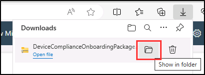
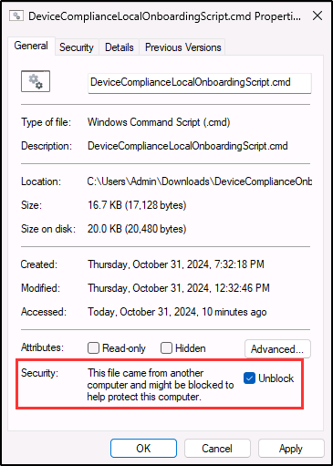

## WWL 테넌트 - 사용 약관

강사 진행 교육 제공의 일부로 테넌트를 제공하는 경우, 강사 진행 교육에서 실습 랩을 지원하기 위해 테넌트를 사용할 수 있습니다.

테넌트를 실습 랩 외부에서 공유하거나 사용해서는 안 됩니다. 이 과정에서 사용되는 테넌트는 평가판 테넌트이며 클래스가 종료된 후 사용하거나 액세스할 수 없으며 확장판에서도 사용할 수 없습니다.

테넌트를 유료 구독으로 변환해서는 안 됩니다. 이 과정의 일부로 얻은 테넌트는 Microsoft Corporation의 재산으로 유지되며 언제든지 액세스 권한을 획득하고 다시 소유할 수 있는 권리를 보유합니다.

# 랩 설정: 규정 준수 관리를 위한 환경 준비

이 연습에서는 규정 준수 관리를 위한 환경을 구성하고 준비합니다. 주요 기능을 활성화하고, 관리 권한을 설정하고, 핵심 요소가 적절하게 구성되었는지 확인합니다.

**작업**:

1. Microsoft Purview 포털에서 감사 사용
1. 디바이스 온보딩 사용
1. 엔드포인트 DLP에 디바이스 온보딩

## 작업 1 - Microsoft Purview 포털에서 감사 사용

이 작업에서는 감사 로깅을 사용하도록 설정하여 Microsoft 365 서비스 전체에서 활동을 추적합니다.

1. **관리자** 계정으로 클라이언트 1 VM(SC-400-CL1)에 로그인합니다. 암호는 랩 호스팅 공급자가 제공합니다.

1. Microsoft Edge를 열고 Microsoft Purview 포털(`https://purview.microsoft.com`)로 이동합니다.

1. Microsoft Purview 포털에 MOD 관리자 `admin@WWLxZZZZZZ.onmicrosoft.com`(여기서 ZZZZZZ는 랩 호스팅 공급자가 제공한 고유 테넌트 ID) 계정으로 로그인합니다. 관리자의 암호는 랩 호스팅 창의 **리소스** 탭에서 찾을 수 있습니다.

1. **새 Microsoft Purview 포털에 오신 것을 환영합니다!** 창에서 계약조건에 동의하는 체크박스를 선택한 다음 **시작**을 선택하여 포털에 액세스합니다.

    

1. 왼쪽 사이드바에서 **솔루션**을 선택한 다음 **감사**을 선택합니다.

1. **검색** 페이지에서 **사용자 및 관리자 활동 기록 시작** 표시줄을 선택하여 감사 로깅을 활성화합니다.

    

1. 이 옵션을 선택하면 파란색 표시줄이 사라집니다.

성공적으로 Microsoft Purview에서 감사를 사용하도록 설정했습니다.

## 작업 2 - 디바이스 온보딩 사용

랩의 후반부에서 엔드포인트 DLP 정책을 지원하려면 Microsoft Purview에서 디바이스 온보딩을 사용하도록 설정합니다.

1. Microsoft Purview 포털에서 **설정** > **디바이스 온보딩** > **디바이스**를 선택합니다.

1. **디바이스** 페이지에서 **디바이스 온보딩 켜기**를 선택합니다.

1. **디바이스 온보딩 켜기** 대화 상자에서 **확인**을 선택하여 디바이스 온보딩을 적용합니다.

1. **디바이스 모니터링 켜기** 대화 상자에서 **확인**을 선택하여 디바이스 모니터링을 적용합니다.

1. 이 프로세스가 완료될 때까지 기다리세요. 디바이스 온보딩이 활성화될 때까지 페이지를 새로 고칩니다.

>[!note]
>이 프로세스를 완료하는 데 5분 정도 걸릴 수 있습니다.

이제 디바이스 온보딩이 사용하도록 설정되고 환경이 다음 단계를 위해 준비됩니다.

## 작업 3 - 엔드포인트 DLP에 디바이스 온보딩

이제 디바이스 온보딩이 완료되면 다음 단계는 Windows 11 디바이스를 온보딩하는 것입니다. 이렇게 하면 디바이스가 엔드포인트 DLP 정책을 적용하고 중요한 데이터를 보호할 준비가 됩니다.

1. Microsoft Purview 포털에서 **설정** > **디바이스 온보딩** > **온보딩**을 선택합니다.

1. **온보딩** 페이지에서 운영 체제로 **Windows 10**을 선택하고 배포 방법으로 **로컬 스크립트(최대 컴퓨터 10대에 사용 가능)** 를 선택한 상태인지 확인합니다.

1. **패키지 다운로드**를 선택합니다.

1. **다운로드** 대화 상자에서 다운로드를 마우스로 가리킨 다음 폴더 아이콘을 선택하여 **폴더에 표시**합니다.

   

1. **DeviceComplianceOnboardingPackage** zip 파일의 압축을 푼 다음 압축이 풀린 폴더를 엽니다.

1. **DeviceComplianceLocalOnboardingScript.cmd** 마우스 오른쪽 단추로 클릭하고 **추가 옵션 표시**를 선택한 다음 **속성**을 선택합니다.

1. 속성 창의 **일반** 탭 아래쪽에 있는 **보안** 섹션에서 **차단 해제**를 선택한 다음 **확인**을 선택하여 이 설정을 저장합니다.

   

1. **DeviceComplianceLocalOnboardingScript.cmd**를 마우스 오른쪽 단추로 클릭하고 **관리자 권한으로 실행**을 선택합니다.

1. **사용자 계정 컨트롤** 대화 상자에서 **예**를 선택합니다.

1. **명령 프롬프트** 화면에서 **Y**를 입력하여 확인합니다.

1. 스크립트가 완료되면 성공 메시지와 **아무 키나 눌러 계속**하라는 메시지가 표시됩니다. 아무 키나 눌러 명령줄 창을 닫습니다. 온보딩을 완료하려면 1분 정도 걸릴 수 있습니다.

Windows 11 디바이스를 성공적으로 온보딩하여 이제 엔드포인트 DLP 정책으로 보호할 수 있습니다.
