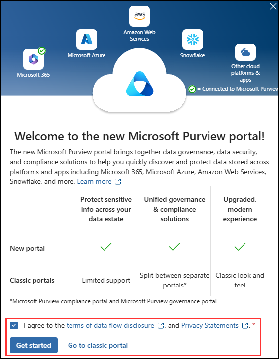

## WWL 테넌트 - 사용 약관

강사 진행 교육 제공의 일부로 테넌트를 제공하는 경우, 강사 진행 교육에서 실습 랩을 지원하기 위해 테넌트를 사용할 수 있습니다.

테넌트를 실습 랩 외부에서 공유하거나 사용해서는 안 됩니다. 이 과정에서 사용되는 테넌트는 평가판 테넌트이며 클래스가 종료된 후 사용하거나 액세스할 수 없으며 확장판에서도 사용할 수 없습니다.

테넌트를 유료 구독으로 변환해서는 안 됩니다. 이 과정의 일부로 얻은 테넌트는 Microsoft Corporation의 재산으로 유지되며 언제든지 액세스 권한을 획득하고 다시 소유할 수 있는 권리를 보유합니다.

# 랩 설정: 규정 준수 관리를 위한 환경 준비

이 연습에서는 규정 준수 관리를 위한 환경을 구성하고 준비합니다. 주요 기능을 활성화하고, 관리 권한을 설정하고, 핵심 요소가 적절하게 구성되었는지 확인합니다.

**작업**:

1. Microsoft Purview 포털에서 감사 사용
1. 랩 연습을 위한 사용자 암호 설정
1. 규정 준수 역할 할당
1. Microsoft Purview 포털 살펴보기

## 작업 1 - Microsoft Purview 포털에서 감사 사용

이 작업에서는 감사 로깅을 사용하도록 설정하여 Microsoft 365 서비스 전체에서 활동을 추적합니다.

1. **관리자** 계정으로 클라이언트 1 VM(SC-400-CL1)에 로그인합니다. 암호는 랩 호스팅 공급자가 제공합니다.

1. Microsoft Edge를 열고 Microsoft Purview 포털(`https://purview.microsoft.com`)로 이동합니다.

1. Microsoft Purview 포털에 MOD 관리자 `admin@WWLxZZZZZZ.onmicrosoft.com`(여기서 ZZZZZZ는 랩 호스팅 공급자가 제공한 고유 테넌트 ID) 계정으로 로그인합니다. 관리자의 암호는 랩 호스팅 창의 **리소스** 탭에서 찾을 수 있습니다.

1. **새 Microsoft Purview 포털에 오신 것을 환영합니다!** 창에서 계약조건에 동의하는 체크박스를 선택한 다음 **시작**을 선택하여 포털에 액세스합니다.

    

1. 왼쪽 사이드바에서 **솔루션**을 선택한 다음 **감사**을 선택합니다.

1. **검색** 페이지에서 **사용자 및 관리자 활동 기록 시작** 표시줄을 선택하여 감사 로깅을 활성화합니다.

    

1. 이 옵션을 선택하면 파란색 표시줄이 사라집니다.

성공적으로 Microsoft Purview에서 감사를 사용하도록 설정했습니다.

## 작업 2 - 랩 연습을 위한 사용자 암호 설정

이 작업에서는 랩에서 사용할 사용자 계정의 암호를 설정합니다.

1. Microsoft Edge에서 **Microsoft 365 관리 센터**(**`https://admin.microsoft.com`**)로 이동합니다.

1. 왼쪽 탐색 창에서 **사용자**를 확장한 다음 **활성 사용자**를 선택합니다.

1. **Joni Sherman** 계정을 찾고 키 아이콘을 선택하여 암호를 재설정합니다.

   다음 연습에서 Joni의 계정을 사용합니다.

   

1. 오른쪽의 **암호 재설정** 플라이아웃 페이지에서 모든 옵션의 선택이 해제되어 있는지 확인한 다음 **암호** 필드에 기억할 수 있는 암호를 입력합니다.

1. 페이지 아래쪽의 **암호 재설정**을 선택한 다음 확인 페이지에서 **닫기**를 선택합니다.

랩 연습에 사용할 Joni의 암호를 성공적으로 재설정했습니다.

## 작업 3 - 준수 관리자 역할 할당

이 작업에서는 Joni Sherman에게 **준수 관리자** 역할을 할당합니다.

1. Microsoft 365 관리 센터에서 Joni의 계정을 선택합니다.

1. **Joni Sherman**의 속성 플라이아웃 메뉴에서 **역할 관리**를 선택합니다.

    

1. **관리자 역할 관리** 플라이아웃 에서 **관리 센터 액세스**를 선택한 다음 아래로 스크롤하여 **범주별로 모두 표시**를 선택합니다.

1. **보안 및 준수**에서 **준수 관리자**를 선택합니다.

1. 페이지 아래쪽에 있는 **변경 내용 저장**을 선택합니다.

1. 오른쪽 상단의 **MA** 아이콘을 선택한 다음 **로그아웃**을 선택하여 MOD 관리자 계정에서 로그아웃합니다.

   

앞으로 이어질 연습을 수행하는 데 필요한 준수 관리자 역할을 Joni에게 성공적으로 할당했습니다.

## 작업 4 - Microsoft Purview 포털 살펴보기

이 작업에서는 Joni Sherman의 계정으로 전환하여 Microsoft Purview 포털을 탐색합니다.

1. **Microsoft Edge**에서 Microsoft Purview 포털(**`https://purview.microsoft.com`**)로 이동합니다.

1. **계정 선택** 창이 나타나면 **다른 계정 사용**을 선택합니다.

1. `JoniS@WWLxZZZZZZ.onmicrosoft.com`으로 로그인합니다(여기서 ZZZZZZ는 랩 호스팅 공급자가 제공한 고유 테넌트 ID입니다). Joni의 암호는 이전 연습에서 설정되었습니다.

1. Microsoft Purview 포털을 탐색하며 인터페이스를 숙지합니다.

성공적으로 Joni Sherman의 계정으로 전환하여 랩을 계속 진행할 준비가 되었습니다.
