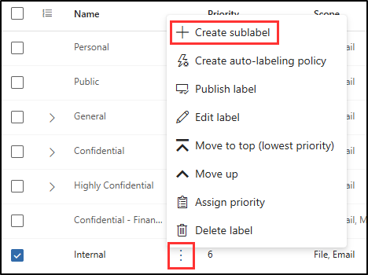

# 연습 2 - 민감도 레이블 만들기

Contoso는 생산성 향상을 위해 Microsoft 365 Copilot을 사용하기 시작했으며, 중요한 HR 데이터를 안전하게 보호하고자 합니다. HR에서는 직원 기록, 급여 세부 정보, 성과 검토와 같은 기밀 정보를 처리하므로, 권한이 있는 직원만 이런 파일에 액세스하거나 편집할 수 있도록 하는 것이 중요합니다. 민감도 레이블은 이 정보를 보호하고 Copilot 같은 도구를 사용하는 경우에도 올바른 보호가 적용되도록 하는 방법입니다.

이 랩에서는 Contoso의 HR 부서에서 Microsoft 365 도구를 사용할 때 문서를 보호하고 안전하게 유지하는 데 사용할 수 있는 민감도 레이블을 만들고 구성합니다.

**작업**:

1. 민감도 레이블 지원 사용
1. 민감도 레이블 만들기
1. 민감도 레이블 게시

## 작업 1 - 민감도 레이블이 있는 파일에 대한 공동 작성 설정

이 작업에서는 민감도 레이블이 있는 파일에 대해 공동 작성을 사용하도록 설정합니다. 이 기능을 사용하면 문서를 보호하면서 여러 사용자가 해당 문서에 대해 공동 작업할 수 있습니다. 또한 OneDrive 및 SharePoint의 파일에 대해 민감도 레이블을 사용하도록 이미 설정하지 않은 경우 사용할 수 있게 됩니다.

1. Microsoft Purview 포털의 왼쪽 사이드바에서 **설정**을 선택합니다.

1. **설정** 페이지에서 **Information Protection**을 선택합니다.

1. **Information Protection 설정** 페이지에서 **민감도 레이블이 있는 파일에 대한 공동 작성** 탭을 선택합니다.

1. **민감도 레이블이 있는 파일에 대한 공동 작성 켜기** 체크박스를 선택합니다.

   이렇게 하면 민감도 레이블의 SharePoint 및 OneDrive 지원도 사용하도록 설정됩니다.

1. 페이지 하단에서 **적용**을 선택합니다.

성공적으로 민감도 레이블이 있는 파일에 대한 공동 작성을 사용하도록 설정했습니다. 이제 여러 사용자가 실시간으로 문서를 안전하게 편집할 수 있으며, OneDrive 및 SharePoint에서 민감도 레이블 지원이 활성화되었습니다.

## 작업 2 - 민감도 레이블 만들기

이 작업에서는 Contoso의 HR 부서에서 내부 문서를 보호하기 위해 사용할 민감도 레이블을 만듭니다. 이 레이블은 직원 데이터와 같은 중요한 정보에 액세스하고 공유할 수 있는 사용자를 제어하는 데 도움이 됩니다. 이 레이블을 적용하면 Microsoft 365 Copilot을 사용하는 경우에도 권한이 있는 HR 담당자만 해당 문서에 액세스할 수 있도록 제한하게 됩니다.

1. Microsoft Purview 포털의 왼쪽 사이드바에서 **솔루션**을 선택한 다음, **정보 보호**를 선택합니다.

1. 왼쪽 사이드바에서 **민감도 레이블**을 선택합니다.

1. **민감도 레이블** 페이지에서 **+ 레이블 만들기**를 선택합니다.

1. **새 민감도 레이블** 구성이 시작됩니다. **이 레이블에 대한 기본 세부 정보 제공**에서 다음을 입력합니다.

    - **이름**: `Internal`
    - **표시 이름**: `Internal`
    - **사용자에 대한 설명**: `Internal sensitivity label.`
    - **관리자**에 대한 설명: `Internal sensitivity label for Contoso.`

1. **다음**을 선택합니다.

1. **이 레이블의 범위 정의** 페이지의 **항목**에서 **파일** 및 **이메일**만 선택합니다. **모임**이 선택되어 있는 경우 선택을 취소합니다.

1. **다음**을 선택합니다.

1. **레이블이 지정된 항목에 대한 보호 설정 선택** 페이지에서 **다음**을 선택합니다.

1. **파일 및 이메일의 자동 레이블 지정** 페이지에서 **다음**을 선택합니다.

1. **그룹 및 사이트의 보호 설정 정의** 페이지에서 **다음**을 선택합니다.

1. **스키마화된 데이터 자산에 자동 레이블 지정(미리 보기)** 페이지에서 **다음**을 선택합니다.

1. **설정 검토 후 완료** 페이지에서 **레이블 만들기**를 선택합니다.

1. **민감도 레이블을 만든** 페이지에서 **아직 정책을 만들지 않음**을 선택한 다음 **완료**를 선택합니다.

회사 문서를 보호하기 위한 내부 민감도 레이블을 성공적으로 만들었습니다. 이 레이블은 HR 데이터용 레이블 등 보다 구체적인 레이블의 기반이 됩니다.

## 작업 3 - HR 직원 데이터에 대한 하위 레이블 만들기

이 작업에서는 HR 문서를 보호하기 위해 **내부** 민감도 레이블 아래에 하위 레이블을 생성합니다. 동적 워터마킹이 추가되어 사용자의 이메일, 액세스 타임스탬프 등 개인화된 세부 정보를 문서에 표시할 수 있습니다. 이 기능은 무단 공유를 억제하고 문서 사용에 대한 가시성을 제공합니다.

1. **민감도 레이블** 페이지에서 새로 만든 **내부** 민감도 레이블을 찾습니다.

1. **내부** 민감도 레이블 옆에 있는 세로 줄임표(**...**)를 선택한 다음 드롭다운 메뉴에서 **+ 하위 레이블 만들기**를 선택합니다.

   

1. **새 민감도 레이블** 마법사가 시작됩니다. **이 레이블에 대한 기본 정보 입력** 페이지에서 다음을 입력합니다.

   - **이름**: `Employee data (HR)`
   - **표시 이름**: `Employee data (HR)`
   - **사용자에 대한 설명**: `This HR label is the default label for all specified documents in the HR Department.`
   - **관리자**에 대한 설명: `This label was created with input from the Head of HR. Contact the HR department for any changes to the label settings.`

1. **다음**을 선택합니다.

1. **이 레이블의 범위 정의** 페이지에서 기본 설정을 선택한 상태로 두고 **다음**을 선택합니다.

1. **레이블이 지정된 항목에 대한 보호 설정 선택** 페이지에서 **액세스 제어** 옵션을 선택한 다음 **다음**을 선택합니다.

1. **액세스 제어** 페이지에서 **액세스 제어 설정 구성**을 선택합니다.

1. 다음 옵션을 사용하여 암호화 설정을 구성합니다.

   - **지금 권한을 할당하시겠습니까 아니면 사용자가 결정하도록 하시겠습니까?**: 지금 권한 할당
   - **콘텐츠에 대한 사용자 액세스 만료**: 안함
   - **오프라인 액세스 허용**: 특정 기간(일 수) 동안만
   - **사용자가 이 기간 동안 콘텐츠에 오프라인으로 액세스할 수 있습니다.**: 15
   - **권한 할당** 링크를 선택합니다.

   

1. **권한 할당** 플라이아웃 페이지에서 **+ 조직의 모든 사용자 및 그룹 추가**를 선택한 다음 **저장**을 선택합니다.

1. **액세스 제어** 페이지에서 **동적 워터마킹 사용** 확인란을 선택한 다음 **텍스트 사용자 지정(선택 사항)** 을 선택합니다.

1. **워터마크에 사용자 지정 텍스트 추가(선택 사항)** 페이지의 사용자 지정 텍스트 필드에 `Confidential | HR only |`을(를) 입력합니다.

1. **UPN** 및 **타임스탬프**의 토큰을 선택한 다음 페이지 하단에서 **저장**을 선택합니다.

   

1. **액세스 제어** 페이지에서 **다음**을 선택합니다.

1. **파일 및 이메일의 자동 레이블 지정** 페이지에서 **다음**을 선택합니다.

1. **그룹 및 사이트의 보호 설정 정의** 페이지에서 **다음**을 선택합니다.

1. **스키마화된 데이터 자산에 자동 레이블 지정(미리 보기)** 페이지에서 **다음**을 선택합니다.

1. **설정 검토 후 완료** 페이지에서 **레이블 만들기**를 선택합니다.

1. **민감도 레이블을 만든** 페이지에서 **아직 정책을 만들지 않음**을 선택한 다음 **완료**를 선택합니다.

HR 문서 전용 하위 레이블을 성공적으로 만들어 직원 데이터를 보호하고 권한이 있는 사용자만 데이터에 액세스할 수 있도록 했습니다. 이제 HR 부서에서 이 레이블을 적용하여 중요한 직원 정보를 안전하게 관리할 수 있습니다.

## 작업 4 - 민감도 레이블 게시

이제 민감도 레이블을 만들었으므로 Contoso의 HR 문서에 적용할 수 있도록 게시해 보겠습니다. 이렇게 하면 HR 파일을 보호하고 Microsoft 365 Copilot 등 도구가 레이블에서 설정한 규칙을 준수하도록 하여 무단 액세스나 우발적 공유를 방지할 수 있습니다.

1. **민감도 레이블** 페이지에서 **레이블 게시**를 선택합니다.

1. 민감도 레이블 게시 구성이 시작됩니다.

1. **게시할 민감도 레이블 선택** 페이지에서 **게시할 민감도 레이블 선택** 링크를 선택합니다.

1. 플라이아웃 페이지에서 **내부** 및 **내부/직원 데이터(HR)** 체크박스를 선택한 다음 아래쪽의 **추가**를 선택합니다.

1. **게시할 민감도 레이블 선택** 페이지로 돌아가서 **다음**을 선택합니다.

1. **관리 단위 할당** 페이지에서 **다음**을 선택합니다.

1. **사용자 및 그룹에 게시** 페이지에서 **다음**을 선택합니다.

1. **정책 설정** 페이지에서 **다음**을 선택합니다.

1. **문서의 기본 설정** 페이지에서 **다음**을 선택합니다.

1. **이메일의 기본 설정** 페이지에서 **다음**을 선택합니다.

1. **모임 및 일정 이벤트의 기본 설정** 페이지에서 **다음**을 선택합니다.

1. **Fabric 및 Power BI 콘텐츠의 기본 설정** 페이지에서 **다음**을 선택합니다.

1. **정책 이름 지정 **페이지에서 다음을 입력합니다.

   - **이름**: `Internal HR employee data`
   - **민감도 레이블 정책에 대한 설명을 입력합니다**: `This HR label is to be applied to internal HR employee data.`

1. **다음**을 선택합니다.

1. **검토 후 완료** 페이지에서 **제출**을 선택합니다.

1. **새 정책이 생성됨**에서 **완료**를 선택하여 레이블 정책 게시를 완료합니다.

내부 및 HR 민감도 레이블을 게시했습니다. 변경 내용이 모든 사용자와 서비스에 복제되려면 최대 24시간이 걸릴 수 있습니다.
