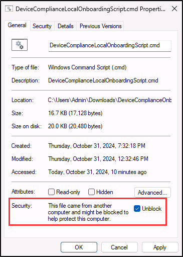

# 연습 3 - DLP 정책 만들기

Contoso는 직원들이 생성형 AI 플랫폼에 중요한 정보를 공유할 수 있다고 우려하고 있습니다. 이 회사에서 DLP 정책을 구현하려면 디바이스를 Microsoft Purview 엔드포인트 DLP에 온보딩해야 합니다. 조직 전체로 확장하기 전에 운영 문제가 없는지 확인하기 위해 소규모 그룹을 사용한 시뮬레이션 모드에서 정책을 테스트하기 시작합니다. 테스트 후에는 정책을 활성화하여 회사 전체에 적용합니다.

**작업**:

1. 디바이스 온보딩 사용
1. 엔드포인트 DLP에 디바이스 온보딩
1. 시뮬레이션 모드에서 DLP 정책 만들기
1. DLP 정책 수정
1. 시뮬레이션 모드에서 정책 활성화

## 작업 1 - 디바이스 온보딩 설정

Contoso는 엔드포인트 DLP 정책을 적용하기 위해 Microsoft Purview에서 디바이스 온보딩을 사용하도록 설정해야 합니다. 이 단계를 통해 조직이 디바이스 전체에서 중요한 정보를 추적하고 보호할 수 있습니다.

1. Microsoft Purview 포털에 계속 Joni Sherman으로 로그인한 상태여야 합니다.

1. 왼쪽 사이드바에서 **설정**을 선택합니다.

1. 왼쪽 사이드바에서 **디바이스 온보딩**을 확장한 다음, **디바이스**를 선택합니다.

1. **디바이스** 페이지에서 **디바이스 온보딩 켜기**를 선택하여 테넌트에 대한 솔루션을 사용하도록 설정합니다.

1. **디바이스 온보딩 켜기** 대화 상자에서 **확인**을 선택하여 디바이스 온보딩을 적용합니다.

1. **디바이스 모니터링 켜기** 대화 상자에서 **확인**을 선택하여 디바이스 모니터링을 적용합니다.

1. 이 프로세스가 완료될 때까지 기다리세요. 디바이스 온보딩이 활성화될 때까지 페이지를 새로 고칩니다.

>[!note]
>이 프로세스를 완료하는 데 5분 정도 걸릴 수 있습니다.

성공적으로 디바이스 온보딩을 사용하도록 설정하여 디바이스를 온보딩하고 엔드포인트 DLP 정책을 적용할 환경을 준비했습니다.

## 작업 2 - 엔드포인트 DLP에 디바이스 온보딩

이제 디바이스 온보딩을 사용하도록 설정했으므로 Contoso는 Windows 11 디바이스를 온보딩하여 엔드포인트 DLP 정책을 적용합니다. 이렇게 하면 시스템이 이 디바이스에서 공유되는 중요한 데이터를 보호할 수 있습니다.

1. 왼쪽 사이드바의 **디바이스** 페이지에서 **디바이스 온보딩**을 확장한 다음, **온보딩**을 선택합니다.

1. **온보딩** 페이지에서 운영 체제로 **Windows 10**을 선택하고 배포 방법으로 **로컬 스크립트(최대 컴퓨터 10대에 사용 가능)** 를 선택한 상태인지 확인합니다.

1. **패키지 다운로드**를 선택합니다.

1. **다운로드** 대화 상자에서 다운로드를 마우스로 가리킨 다음 폴더 아이콘을 선택하여 **폴더에 표시**합니다.

   

1. **DeviceComplianceOnboardingPackage** zip 파일의 압축을 푼 다음 압축이 풀린 폴더를 엽니다.

1. **DeviceComplianceLocalOnboardingScript.cmd** 마우스 오른쪽 단추로 클릭하고 **추가 옵션 표시**를 선택한 다음 **속성**을 선택합니다.

1. 속성 창의 **일반** 탭 아래쪽에 있는 **보안** 섹션에서 **차단 해제**를 선택한 다음 **확인**을 선택하여 이 설정을 저장합니다.

   

1. **DeviceComplianceLocalOnboardingScript.cmd**를 마우스 오른쪽 단추로 클릭하고 **관리자 권한으로 실행**을 선택합니다.

1. **사용자 계정 컨트롤** 대화 상자에서 **예**를 선택합니다.

1. **명령 프롬프트** 화면에서 **Y**를 입력하여 확인합니다.

1. 스크립트가 완료되면 성공 메시지와 **아무 키나 눌러 계속**하라는 메시지가 표시됩니다. 아무 키나 눌러 명령줄 창을 닫습니다. 온보딩을 완료하려면 1분 정도 걸릴 수 있습니다.

Windows 11 디바이스를 성공적으로 온보딩하여 이제 엔드포인트 DLP 정책으로 보호할 수 있습니다.

## 작업 3 - 시뮬레이션 모드에서 엔드포인트 DLP 정책 만들기

이 작업에서는 사용자가 중요한 데이터를 복사하여 생성형 AI 플랫폼에 붙여넣지 못하도록 차단하는 엔드포인트 DLP 정책을 만듭니다. Contoso는 문제가 발생하지 않도록 먼저 소규모 직원 그룹을 사용한 시뮬레이션 모드에서 정책을 테스트할 예정입니다.

1. Microsoft Purview 포털의 왼쪽 사이드바에서 **솔루션**을 선택한 다음, **데이터 손실 방지**를 선택합니다.

1. **정책**을 선택한 다음 **+ 정책 만들기**를 선택합니다.

1. **템플릿으로 시작 또는 사용자 지정 정책 만들기** 페이지에서 **사용자 지정** 및 **사용자 지정 정책**을 선택한 후 **다음**을 선택합니다.

1. **DLP 정책 이름 지정** 페이지에서 다음을 입력합니다.

    - **이름**: `Generative AI sharing DLP policy`
    - **설명**: `Prevent sharing of sensitive data with generative AI platforms.`

1. **다음**을 선택합니다.

1. **관리 단위 할당** 페이지에서 **다음**을 선택합니다.

1. **정책을 적용할 위치 선택** 페이지에서 **디바이스** 위치만 선택합니다. 다른 위치가 선택되어 있으면 선택을 취소했는지 확인합니다.

1. **작업** 열 아래의 **디바이스** 행에서 **편집**을 선택하여 정책 범위를 변경합니다.

   

1. **디바이스 범위** 페이지에서 **특정 사용자 및 그룹**을 선택하고 플라이아웃 페이지에서 **+ 사용자 및 그룹 포함**을 선택합니다.

1. **사용자 및 그룹 선택 페이지**에서 `Retail` 그룹의 체크박스를 선택한 다음 페이지 아래쪽의 **완료**를 선택합니다.

1. **디바이스 범위**에서 **완료**를 선택합니다.

1. **이 정책 적용 위치 선택** 페이지에서 **다음**을 선택합니다.

1. **정책 설정 정의** 페이지에서 **고급 DLP 규칙 만들기 또는 사용자 지정**을 선택하고 **다음**을 선택합니다.

1. **고급 DLP 규칙 사용자 지정** 페이지에서 **+ 규칙 만들기**를 선택합니다.

1. **규칙 만들기** 페이지에서 다음을 입력합니다.

    - **이름**: `Sensitive data protection rule`
    - **설명**: `Detect and restrict sharing of sensitive information with generative AI platforms.`

1. **조건**에서 **+ 조건 추가**를 선택한 다음 **콘텐츠 포함**을 선택합니다.

1. 새로 열린 **콘텐츠 포함** 영역에서 **추가**를 선택하고 **중요한 정보 유형**을 선택합니다.

1. 오른쪽의 **중요한 정보 유형** 플라이아웃 페이지에서 `Credit` 검색 후 **신용 카드 번호** 중요한 정보 유형에 대한 체크박스를 선택합니다.

1. 페이지의 아래쪽에서 **추가**를 선택합니다.

1. **작업** 섹션에서 **+ 작업 추가** 드롭다운을 선택한 다음 **디바이스에서 활동 감사 또는 제한**을 선택합니다.

1. 새로 연 **디바이스에서 활동 감사 또는 제한** 영역의 **서비스 도메인 및 브라우저 활동** 섹션에서 **제한된 클라우드 서비스 도메인에 업로드하거나 허용되지 않은 브라우저에서 액세스** 체크박스를 선택한 다음 이 옵션 아래 **+ 중요한 서비스 도메인에 대해 다른 제한 사항 선택**을 선택합니다.

1. **중요한 서비스 도메인 제한** 플라이아웃 페이지에서 **+ 그룹 추가**를 선택합니다.

1. **중요한 서비스 도메인 그룹 선택**에서 **생성형 AI 웹 사이트**의 체크박스를 선택한 다음, 플라이아웃 페이지 아래쪽의 **추가**를 선택합니다.

1. **중요한 서비스 도메인 제한** 페이지로 돌아가서 **생성형 AI 웹 사이트**가 목록에 있는지 확인하고 플라이아웃 페이지 아래쪽의 **저장**을 선택합니다.

1. **규칙 만들기** 페이지로 돌아가서 **지원되는 브라우저에 붙여넣기** 체크박스를 선택한 다음, 이 옵션에서 **+ 중요한 서비스 도메인에 대해 다른 제한 사항 선택**을 선택합니다.

1. **중요한 서비스 도메인 제한** 플라이아웃 페이지에서 **+ 그룹 추가**를 선택합니다.

1. **중요한 서비스 도메인 그룹 선택**에서 **생성형 AI 웹 사이트**의 체크박스를 선택한 다음, 플라이아웃 페이지 아래쪽의 **추가**를 선택합니다.

1. **중요한 서비스 도메인 제한** 페이지에서 **저장**을 선택합니다.

1. **서비스 도메인 및 브라우저 활동** 섹션의 **규칙 만들기**로 돌아가서 **제한된 클라우드 서비스 도메인에 업로드 또는 허용되지 않는 브라우저에서 액세스**와 **지원되는 브라우저에 붙여넣기**의 작업을 모두 **감사만**에서 **차단**으로 업데이트합니다.

1. **사용자 알림** 섹션에서 **알림을 사용하여 사용자에게 알리고 중요한 정보의 적절한 사용에 관해 사용자를 교육하도록 지원**을 **활성화**합니다.

1. **엔드포인트 디바이스**에서 **사용자에게 정책 팁 알림 표시** 체크박스를 선택합니다.

1. **Microsoft 365 서비스**에서 **정책 팁으로 Office 365 서비스 사용자에게 알림** 확인란을 선택합니다.

1. 플라이아웃 페이지 하단에서 **저장**을 선택합니다.

1. **고급 DLP 규칙 사용자 지정**으로 돌아가서 **다음**을 선택합니다.

1. **정책 모드** 페이지에서 **시뮬레이션 모드에서 정책 실행**을 선택한 후 **다음**을 선택합니다.

1. **검토 및 완료** 페이지에서 정책 설정을 검토한 다음 **제출**을 선택하여 정책을 만듭니다.

1. 정책이 만들어지면 **새 정책이 만들어짐** 페이지에서 **완료**를 선택합니다.

성공적으로 시뮬레이션 모드에서 엔드포인트 DLP 정책을 만들었습니다.

## 작업 4 - DLP 정책 수정

Contoso는 소규모 그룹을 사용하여 정책을 테스트한 후 모든 직원을 포함하도록 정책을 확장할 준비가 되었습니다. 이 작업에서는 정책을 수정하여 전체 회사에 적용함으로써 모든 사용자를 대상으로 중요한 데이터를 보호합니다.

1. **정책** 페이지에서 최근에 만든 **생성형 AI 공유 DLP 정책** 체크박스를 선택한 다음 **정책 편집**을 선택하여 정책 구성을 엽니다.

1. **DLP 정책 이름 지정** 페이지에서 **다음**을 선택합니다.

1. **관리 단위 할당** 페이지에서 **다음**을 선택합니다.

1. **작업** 열 아래의 **디바이스** 행에서 **편집**을 선택하여 정책 범위를 변경합니다.

1. **디바이스 범위** 페이지에서 **모든 사용자 및 그룹**을 선택한 다음 페이지 아래쪽의 **완료**를 선택합니다.

1. **정책 모드** 페이지에 도달할 때까지 **다음**을 선택합니다.

1. **정책 모드** 페이지에서 **시뮬레이션 모드에서 정책 실행**을 선택한 후 **다음**을 선택합니다.

1. **검토 및 완료** 페이지에서 **제출**을 선택한 다음 **정책 업데이트됨** 페이지에서 **완료**를 선택합니다.

모든 직원을 포함하도록 DLP 정책을 성공적으로 업데이트했습니다.

## 작업 5 - 시뮬레이션 모드에서 정책 활성화

이제 정책을 테스트하고 확장했으므로 Contoso는 정책을 켤 준비가 되었습니다. 이 작업에서는 정책을 활성화하여 중요한 데이터를 생성형 AI 플랫폼에 공유하려는 시도를 차단하기 시작합니다.

1. **정책** 페이지에서 **생성형 AI 공유 DLP 정책**을 선택합니다.

1. 생성형 AI 공유 DLP 정책에 대한 설명이 있는 플라이아웃 페이지에서 **시뮬레이션 보기**를 선택합니다.

1. **정책 켜기**를 선택한 다음 **확인**을 선택하여 선택을 확인합니다.

1. DLP 정책이 게시되었음을 확인하는 플라이아웃 알림이 표시되어야 합니다.

   

DLP 정책을 성공적으로 활성화했습니다. 이제 중요한 데이터를 복사해 생성형 AI 플랫폼에 붙여넣을 수 없도록 데이터를 보호합니다.
