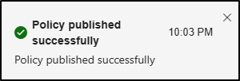

# 연습 4 - DLP 정책 만들기

Contoso는 직원들이 생성형 AI 플랫폼에 중요한 정보를 공유할 수 있다고 우려하고 있습니다. 이를 해결하기 위해 직원 ID를 포함한 중요한 데이터를 공유하는 것을 검색하고 차단하기 위한 DLP 정책을 시행할 예정입니다. 이 연습에서는 직원 ID를 식별하기 위해 사용자 지정 중요한 정보 유형을 만들었습니다. 이러한 식별자가 보호될 수 있도록 이를 DLP 정책에 포함할 것입니다.

**작업**:

1. 시뮬레이션 모드에서 DLP 정책 만들기
1. 시뮬레이션 모드에서 정책 활성화

## 작업 1 - 시뮬레이션 모드에서 엔드포인트 DLP 정책 만들기

이 작업에서는 사용자가 중요한 데이터를 복사하여 생성형 AI 플랫폼에 붙여넣지 못하도록 차단하는 엔드포인트 DLP 정책을 만듭니다. Contoso는 문제가 발생하지 않도록 먼저 소규모 직원 그룹을 사용한 시뮬레이션 모드에서 정책을 테스트할 예정입니다.

1. Microsoft Purview 포털의 왼쪽 사이드바에서 **솔루션**을 선택한 다음, **데이터 손실 방지**를 선택합니다.

1. **정책**을 선택한 다음 **+ 정책 만들기**를 선택합니다.

1. **템플릿으로 시작 또는 사용자 지정 정책 만들기** 페이지에서 **사용자 지정** 및 **사용자 지정 정책**을 선택한 후 **다음**을 선택합니다.

1. **DLP 정책 이름 지정** 페이지에서 다음을 입력합니다.

    - **이름**: `Generative AI sharing DLP policy`
    - **설명**: `Prevent sharing of sensitive data with generative AI platforms.`

1. **다음**을 선택합니다.

1. **관리 단위 할당** 페이지에서 **다음**을 선택합니다.

1. **정책을 적용할 위치 선택** 페이지에서 **디바이스** 위치만 선택합니다. 다른 위치가 선택되어 있으면 선택 취소되었는지 확인하고 **다음**을 선택합니다.

1. **정책 설정 정의** 페이지에서 **고급 DLP 규칙 만들기 또는 사용자 지정**을 선택하고 **다음**을 선택합니다.

1. **고급 DLP 규칙 사용자 지정** 페이지에서 **+ 규칙 만들기**를 선택합니다.

1. **규칙 만들기** 페이지에서 다음을 입력합니다.

    - **이름**: `Sensitive data protection rule`
    - **설명**: `Detect and restrict sharing of sensitive information with generative AI platforms.`

1. **조건**에서 **+ 조건 추가**를 선택한 다음 **콘텐츠 포함**을 선택합니다.

1. 새로 열린 **콘텐츠 포함** 영역에서 **추가**를 선택하고 **중요한 정보 유형**을 선택합니다.

1. 오른쪽의 **중요한 정보 유형** 플라이아웃 페이지에서 `Contoso` 검색 후 이전 연습에서 만든 **Contoso 직원 ID** 중요한 정보 유형에 대한 확인란을 선택합니다.

1. 검색 필드에 `Credit` 입력 후 **신용 카드 번호** 중요한 정보 유형에 대한 확인란을 선택합니다.

1. 페이지 하단의 **추가**를 선택하여 **Contoso 직원 ID** 및 **신용 카드 번호** 중요한 정보 유형을 추가합니다.

1. **작업** 섹션에서 **+ 작업 추가** 드롭다운을 선택한 다음 **디바이스에서 활동 감사 또는 제한**을 선택합니다.

1. 새로 열린 **디바이스에서 활동 감사 또는 제한** 영역의 **서비스 도메인 및 브라우저 활동** 섹션에서 **제한된 클라우드 서비스 도메인에 업로드하거나 허용되지 않은 브라우저에서 액세스** 확인란을 선택한 다음 이 옵션에서 **+ 중요한 서비스 도메인에 다른 제한 선택**을 선택합니다.

1. **중요한 서비스 도메인 제한** 플라이아웃 페이지에서 **+ 그룹 추가**를 선택합니다.

1. **중요한 서비스 도메인 그룹 선택**에서 **일반 AI 웹사이트** 확인란을 선택한 다음 페이지 하단의 **추가**를 선택합니다.

1. **중요한 서비스 도메인 제한** 페이지에서 **생성형 AI 웹사이트**의 **작업**을 **차단**으로 설정한 후 페이지 하단에서 **저장**을 선택합니다.

1. **규칙 만들기** 페이지로 돌아가서 **지원되는 브라우저에 붙여넣기** 체크박스를 선택한 다음, 이 옵션에서 **+ 중요한 서비스 도메인에 대해 다른 제한 사항 선택**을 선택합니다.

1. **중요한 서비스 도메인 제한** 플라이아웃 페이지에서 **+ 그룹 추가**를 선택합니다.

1. **중요한 서비스 도메인 그룹 선택**에서 **생성형 AI 웹 사이트**의 체크박스를 선택한 다음, 플라이아웃 페이지 아래쪽의 **추가**를 선택합니다.

1. **중요한 서비스 도메인 제한** 페이지에서 **생성형 AI 웹사이트**의 **작업**을 **차단**으로 설정한 후 페이지 하단에서 **저장**을 선택합니다.

1. **서비스 도메인 및 브라우저 활동** 섹션의 **규칙 만들기**로 돌아가 **제한된 클라우드 서비스 도메인에 업로드 또는 허용되지 않은 브라우저에서 액세스**와 **지원되는 브라우저에 붙여넣기**의 작업이 모두 **감사만**으로 설정되어 있는지 확인합니다.

1. **사용자 알림** 섹션에서 **알림을 사용하여 사용자에게 알리고 중요한 정보의 적절한 사용에 관해 사용자를 교육하도록 지원**을 **활성화**합니다.

1. **엔드포인트 디바이스**에서 **사용자에게 정책 팁 알림 표시** 체크박스를 선택합니다.

1. 플라이아웃 페이지 하단에서 **저장**을 선택합니다.

1. **고급 DLP 규칙 사용자 지정**으로 돌아가서 **다음**을 선택합니다.

1. **정책 모드** 페이지에서 **시뮬레이션 모드에서 정책 실행**을 선택한 후 **다음**을 선택합니다.

1. **검토 및 완료** 페이지에서 정책 설정을 검토한 다음 **제출**을 선택하여 정책을 만듭니다.

1. 정책이 만들어지면 **새 정책이 만들어짐** 페이지에서 **완료**를 선택합니다.

성공적으로 시뮬레이션 모드에서 엔드포인트 DLP 정책을 만들었습니다.

## 작업 2 - 시뮬레이션 모드에서 정책 활성화

이제 정책을 테스트하고 확장했으므로 Contoso는 정책을 켤 준비가 되었습니다. 이 작업에서는 정책을 활성화하여 중요한 데이터를 생성형 AI 플랫폼에 공유하려는 시도를 차단하기 시작합니다.

1. **정책** 페이지에서 **생성형 AI 공유 DLP 정책**을 선택합니다.

1. 생성형 AI 공유 DLP 정책에 대한 설명이 있는 플라이아웃 페이지에서 **시뮬레이션 보기**를 선택합니다.

1. **정책 켜기**를 선택한 다음 **확인**을 선택하여 선택을 확인합니다.

1. DLP 정책이 게시되었음을 확인하는 플라이아웃 알림이 표시되어야 합니다.

   

DLP 정책을 성공적으로 활성화했습니다. 이제 중요한 데이터를 복사해 생성형 AI 플랫폼에 붙여넣을 수 없도록 데이터를 보호합니다.
