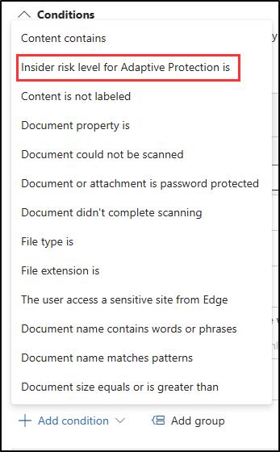

# 연습 6 - 적응형 보호 정책 만들기

Contoso는 데이터가 생성형 AI 플랫폼으로 복사되는 것을 방지하기 위한 DLP 정책을 구현했습니다. 그러나 이 회사에서는 위험한 동작을 하는 사용자에게 더 엄격한 조치를 적용하기 위해 보다 동적인 제어의 필요성을 확인했습니다.  이 문제를 해결하기 위해 Contoso는 Microsoft Purviews 적응형 보호를 사용하여 사용자의 내부 위험 수준에 따라 DLP 정책의 적용을 자동으로 조정함으로써 고위험 사용자에게 보다 많은 제한을 적용하면서 다른 사용자에 대한 유연성을 유지하고자 합니다.

**작업**:

1. DLP 정책에 적응형 보호 조건 추가
1. 내부 위험 관리에서 적응형 보호 사용

## 작업 1 - DLP 정책에 적응형 보호 조건 추가

이제 Contoso가 적응형 보호를 사용할 준비가 되었으므로 먼저 기존 DLP 정책에 적응형 조건을 추가합니다. 이 조건은 내부 위험 관리에서 식별한 내부 위험 수준에 따라 정책의 제한을 동적으로 조정합니다.

1. **Microsoft Edge**에서 **솔루션** > **데이터 손실 방지**를 선택하여 DLP로 이동합니다.

1. 왼쪽 사이드바에서 **정책**을 선택합니다.

1. 이전 연습에서 만든 **생성형 AI 공유 DLP 정책** 정책을 선택한 다음 **정책 편집** 버튼을 선택합니다.

1. **DLP 정책 이름 지정** 페이지에서 **고급 DLP 규칙 사용자 지정** 페이지에 도달할 때까지 **다음**을 선택합니다.

**고급 DLP 규칙 사용자 지정** 페이지에서 연필 아이콘을 선택하여 **중요한 데이터 보호 규칙**을 편집합니다.

1. **규칙 편집** 플라이아웃 페이지의 **조건** 섹션에서 **+ 조건 추가** 드롭다운을 선택한 다음 **적응형 보호의 내부 위험 수준** 조건을 선택합니다.

   

1. **적응형 보호의 내부 위험 수준** 섹션에서 **높은 위험 수준** 체크박스를 선택합니다.

1. **규칙 편집** 페이지 아래쪽의 **저장**을 선택합니다.

1. **고급 DLP 규칙 사용자 지정** 페이지에서 **검토 및 완료** 페이지에 도달할 때까지 **다음**을 선택합니다.

1. **검토 및 완료**에서 **제출**을 선택한 다음 **정책 업데이트됨** 페이지에서 **완료**를 선택합니다.

적응형 보호를 포함한 DLP 정책을 성공적으로 구성하여 사용자의 위험 수준에 따라 정책을 적용을 자동으로 조정할 수 있도록 함으로써 위험 수준이 낮은 직원의 생산성에 영향을 주지 않고 데이터 보호를 개선했습니다.

## 작업 2 - 내부 위험 관리에서 적응형 보호 사용

이 작업에서는 내부 위험 수준을 설정하고 내부 위험 관리에서 적응형 보호를 사용하도록 설정하여 적응형 보호를 구성합니다. 이렇게 하면 DLP 정책이 사용자 동작 및 위험 수준에 따라 동적으로 조정됩니다.

1. Microsoft Purview 포털에서 **솔루션** > **내부 위험 관리**를 선택합니다.

1. **내부 위험 관리** 페이지의 왼쪽 사이드바에서 **적응형 보호**를 선택합니다.

1. **적응형 보호** 페이지의 왼쪽에 있는 **내부 위험 수준** 탭을 선택합니다.

1. **내부 위험 수준** 페이지의 **내부 위험 정책**에서 이전 작업에서 만든 **중요한 데이터 보호** 정책을 선택합니다.

1. **내부 위험 수준 조건**의 기본 제공 조건을 사용하고 페이지 아래쪽의 **저장**을 선택합니다.

1. 왼쪽의 **데이터 손실 방지** 탭을 선택하고 **생성형 AI 공유 DLP 정책**을 사용할 수 있는지 확인합니다.

1. **적응형 보호 설정** 탭을 선택하고 **적응형 보호** 스위치를 **켜짐**으로 전환한 다음 페이지 아래쪽의 **저장**을 선택합니다.

성공적으로 내부 위험 관리에서 적응형 보호를 사용하도록 설정하여 개별 사용자의 위험 수준에 따라 DLP 정책을 동적으로 적용함으로써 일상적인 비즈니스 작업 중단을 최소화하면서 데이터 보호를 강화했습니다.
