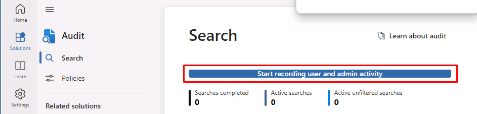

---
lab:
  title: '랩 설정: 관리를 위한 환경 준비'
  module: Module 0 - Lab Setup
---

## WWL 테넌트 - 사용 약관

강사 진행 교육 제공의 일부로 테넌트를 제공하는 경우, 강사 진행 교육에서 실습 랩을 지원하기 위해 테넌트를 사용할 수 있습니다.

테넌트를 실습 랩 외부에서 공유하거나 사용해서는 안 됩니다. 이 과정에서 사용되는 테넌트는 평가판 테넌트이며 클래스가 종료된 후 사용하거나 액세스할 수 없으며 확장판에서도 사용할 수 없습니다.

테넌트를 유료 구독으로 변환해서는 안 됩니다. 이 과정의 일부로 얻은 테넌트는 Microsoft Corporation의 재산으로 유지되며 언제든지 액세스 권한을 획득하고 다시 소유할 수 있는 권리를 보유합니다.

# 랩 설정 - 관리를 위한 환경 준비

이 랩에서는 관리 작업을 위한 환경을 구성하고 준비합니다. 제공된 단계를 따르면 필수 기능과 설정이 미리 사용하도록 설정되어 예정된 랩 작업에서 더 쉽게 학습할 수 있습니다. 이 준비에는 필요한 기능 활성화, 관리 권한 설정, 핵심 요소의 적절한 구성 확인이 포함됩니다.

## 작업 - 랩 연습을 위한 사용자 암호 설정

이 작업에서는 랩에 필요한 사용자 계정의 암호를 설정합니다.

1. 클라이언트 1 VM(LON-CL1)에 **lon-cl1\admin** 계정으로 로그인합니다. 암호는 랩 호스팅 공급자가 제공합니다.

1. **Microsoft Edge**에서 https://admin.microsoft.com로 이동하여 Microsoft Purview 포털에 MOD 관리자 admin@WWLxZZZZZZ.onmicrosoft.com로 로그인합니다(여기서 ZZZZZZ는 랩 호스팅 공급자에서 제공한 고유 테넌트 ID).

1. 왼쪽 탐색 창에서 **사용자**를 확장한 다음 **활성 사용자**를 선택합니다.

1. **활성 사용자** 페이지에서 **Joni Sherman**의 사용자 계정 위로 마우스를 가져가면 키가 나타납니다.

1. **암호 초기화** 키를 선택하면 오른쪽에 **암호 초기화** 플라이아웃 페이지가 표시되어 Joni의 암호를 다시 설정합니다.

1. **암호 초기화** 플라이아웃 페이지에서 확인란이 선택되어 있지 않은지 확인합니다.

1. **암호** 필드에 MOD 관리자 계정의 암호와 같이 기억할 수 있는 Joni의 비밀번호를 입력합니다.

    >**팁**: 랩 호스팅 공급자가 제공해야 하는 관리자 계정과 동일한 암호로 Joni의 암호를 다시 설정할 수 있습니다.

1. **암호 초기화** 단추를 선택하여 Joni의 암호를 다시 설정합니다.

1. **암호가 다시 설정됨** 페이지에서 **닫기** 단추를 선택하여 **활성 사용자** 페이지로 돌아갑니다.

1. 4-8단계를 반복하여 **Megan Bowen**과 **Lynne Robbins**의 암호를 다시 설정합니다.

## 작업 2 - 준수 관리자 역할 부여

1. 사용자 목록에서 **Joni Sherman**을 선택합니다.

1. **계정** 탭의 **역할** 섹션에서 **역할 관리**를 선택합니다.

1. **관리 센터 액세스**를 선택한 다음 **카테고리별로 모두 표시**를 선택합니다.

1. **보안 및 규정 준수** 섹션 아래까지 아래로 스크롤하여 **준수 관리자**를 선택합니다. 하단에서 **변경 내용 저장**을 선택합니다.

1. Joni의 사용자 창을 닫습니다.

## 작업 3 - Microsoft Purview 포털에서 감사 사용

이 작업에서는 Microsoft Purview 규정 준수 포털에서 감사를 사용하도록 설정합니다. 이 추적 기능을 통해 포털 작업의 표시 여부와 책임성을 모니터링할 수 있습니다.

<!-- 
1. You should still be signed in to Client 1 VM (LON-CL1) as the **lon-cl1\admin** account and Microsoft 365 with the MOD Administrator account.
-->

1. **Microsoft Edge**에서 https://purview.microsoft.com으로 이동합니다.

1. **데이터 흐름 공개 약관에 동의합니다** 체크박스를 선택한 다음 **시작**을 선택합니다.

1. 왼쪽 탐색에서 **솔루션**을 선택한 다음 **감사**를 선택합니다.

1. 검색 페이지에서 **사용자 및 관리자 활동 기록 시작** 버튼을 선택하여 감사 로깅을 활성화합니다.

    

## 작업 4 - Microsoft Teams에서 이름으로 검색 사용 설정

이 작업에서는 랩 설정을 위해 Microsoft Teams의 **이름으로 검색** 기능을 사용하도록 설정합니다. 이를 통해 조직 내에서 사용자 위치를 쉽게 찾고 연결할 수 있습니다. 정보 장벽 작업 시 가용성을 보장하기 위해 사전에 단계에 따라 활성화합니다.

<!-- 
1. You should still be signed in to Client 1 VM (LON-CL1) as the **lon-cl1\admin** account and Microsoft 365 with the MOD Administrator account.
-->

1. **Microsoft Edge**에서 https://admin.teams.microsoft.com으로 이동합니다.

1. 왼쪽 탐색에서 **Teams**를 선택한 다음 **Teams 설정**을 선택합니다.

1. **이름으로 검색** 섹션까지 아래로 스크롤하여 토글을 **켜기**로 전환하여 **Exchange 주소록 정책을 사용하여 범위 디렉터리 검색**을 사용하도록 설정합니다.

1. **저장**을 선택하여 이 설정을 저장한 다음 **확인**을 선택합니다.

## 작업 5 - SharePoint Online 및 OneDrive에서 정보 장벽 사용

이 작업에서는 SharePoint Online 및 OneDrive에서 정보 장벽을 사용하도록 설정하여 안전한 협업을 승격하고 무단 통신을 방지합니다.

<!-- 
1. You should still be signed in to Client 1 VM (LON-CL1) as the **lon-cl1\admin** account.
-->

1. 시작 메뉴에서 **Windows PowerShell**를 검색하고 **관리자 권한으로 실행**을 선택하여 관리자 권한으로 실행되는 PowerShell 창을 엽니다.

1. **사용자 계정 컨트롤** 창에서 **예**를 선택하여 실행을 확인합니다.

1. 다음 cmdlet을 실행하여 최신 버전의 SharePoint Online PowerShell 모듈을 설치합니다.

    ```powershell
    Install-Module -Name Microsoft.Online.SharePoint.PowerShell
    ```

1. PowerShell NuGet 공급자를 설치하라는 메시지가 표시되면 **Y**를 입력하여 공급자를 설치합니다.

1. 신뢰할 수 없는 리포지토리에서 설치하라는 메시지가 표시되면 **Y**를 입력하여 PSGallery에서 모듈을 설치합니다.

1. 다음 cmdlet을 실행하여 SharePoint Online 관리 센터에 연결합니다.

    ```powershell
    Connect-SPOService -Url https://WWLxZZZZZZ-admin.sharepoint.com
    ```

    >**참고:** ZZZZZZ를 반드시 업데이트합니다. ZZZZZZ는 랩 호스팅 공급자가 제공한 고유 테넌트 ID입니다.

1. 랩 호스팅 공급자에서 제공한 admin@WWLxZZZZZZ.onmicrosoft.com으로 로그인합니다.

1. 다음 명령을 실행하여 SharePoint 및 OneDrive에서 정보 장벽을 사용하도록 설정합니다.

    ```powershell
    Set-SPOTenant -InformationBarriersSuspension $false
    ```

<!--
1. Close the PowerShell window once this is complete.
-->

1. 나중에 사용할 수 있도록 PowerShell을 열어 두세요.