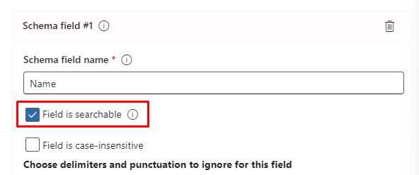
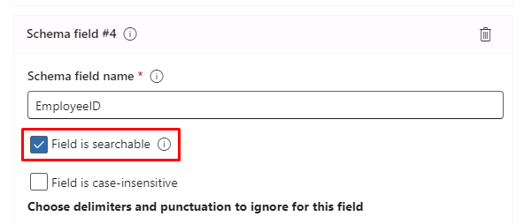
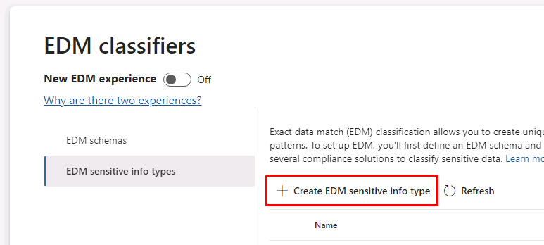

---
lab:
  title: 연습 3 - 중요한 정보 유형 관리
  module: Module 1 - Implement Information Protection
---

<!--
# Lab 1 - Exercise 3 - Manage Sensitive Information Types
-->

# 연습 1 - 중요한 정보 유형 관리

Contoso Ltd.에서는 이전에 직원들이 티켓 솔루션에서 지원 티켓 관련 작업을 진행할 때 고객의 개인 정보를 실수로 보내는 문제가 발생했습니다. 그래서 이후 이러한 문제가 발생하지 않도록 사용자 교육을 진행하려고 합니다. 그러려면 이메일과 문서에서 대문자 3자와 숫자 6개로 구성된 직원 ID를 식별하는 사용자 지정 중요한 정보 유형이 필요합니다. 가양성 비율을 낮추기 위해 "직원" 및 "ID"를 키워드로 사용할 예정입니다. 이 작업에서는 새로운 사용자 지정 중요한 정보 유형, EDM 기반 분류용 데이터베이스 및 키워드 사전을 만듭니다. 

## 작업 1 - 사용자 지정 중요한 정보 유형 만들기

이 연습에서는 보안 및 준수 센터 PowerShell 모듈을 사용하여 새 사용자 지정 중요한 정보 유형을 만듭니다. 이 유형은 "직원" 및 "ID" 키워드와 비슷한 직원 ID 패턴을 인식합니다.

<!--
1. You should still be signed in to Client 1 VM (LON-CL1) as the **lon-cl1\admin** account.
-->

1. **Microsoft Edge**에서 오른쪽 상단의 줄임표를 선택하고 **새 InPrivate 창**을 선택하여 InPrivate 창을 엽니다.

1. https://purview.microsoft.com으로 이동하여 **Joni Sherman**, JoniS@WWLxZZZZZZ.onmicrosoft.com(여기서 ZZZZZZ는 랩 호스팅 공급자에서 제공하는 고유 테넌트 ID)로 Microsoft Purview 포털에 로그인합니다. Joni의 암호는 랩 호스팅 공급자가 제공합니다.

1. 왼쪽 창에서 **솔루션**을 선택한 다음 **데이터 손실 방지**를 선택합니다.

1. **분류자**를 확장한 다음 **중요한 정보 유형**을 선택합니다.

    >**힌트:** Purview 포털에 **중요한 정보 유형**이 표시되지 않으면 이전 랩에서 규정 준수 관리자로 업데이트된 Joni의 권한이 브라우저에서 업데이트되지 않은 것입니다.  로그아웃했다가 JoniS로 로그인해야 할 수 있습니다.

1. **데이터 분류란 무엇인가요?** 메시지가 표시되면 **닫기**를 선택합니다. 

1. **+ 중요한 정보 유형 만들기**를 선택하여 새 중요한 정보 유형 만들기 마법사를 엽니다.

1. **중요한 정보 유형 이름 지정** 단계에서 다음을 입력합니다.

    - **이름**: Contoso 직원 ID
    - **설명**: Contoso 직원 ID의 패턴입니다.

1. **다음**을 선택합니다.

1. **이 중요한 정보 유형에 대한 패턴 정의** 페이지에서 **+ 패턴 만들기**를 선택합니다.

1. 오른쪽 **새 패턴** 창에서 **+ 기본 요소 추가**를 선택하고 **정규식**을 선택합니다.

1. **정규식 추가**에 다음을 입력합니다.

    - **ID**: Contoso ID
    - **정규식**: ```[A-Z]{3}[0-9]{6}```
    - ** 문자열 일치** 라디오 단추를 선택합니다.

1. **완료**를 선택합니다.

1. **지원 요소** 아래에서 **+ 지원 요소 또는 요소 그룹 추가**를 선택한 후 **키워드 목록**을 선택합니다.

1. **키워드 목록 추가**에 다음을 입력합니다.

    - **ID**: 직원 ID 키워드
    - **대/소문자 구분 안 함**:
        - *직원*
        - *ID*
    - **단어 일치** 라디오 단추를 선택합니다.

1. **완료**를 선택합니다.

1. **새 패턴** 창에서 **문자 근접** 값을 *100*자로 줄입니다.

1. **생성** 단추를 선택합니다.

1. **이 중요한 정보 유형에 대한 패턴 정의** 단계로 돌아가서 **다음**을 선택합니다.

1. **규정 준수 정책에 표시할 권장 신뢰도 수준 선택** 단계에서 기본값을 사용하고 **다음**을 선택합니다.

1. **설정 검토 및 완료** 단계에서 설정을 검토하고 **만들기**를 선택합니다. 만들어지면 **완료**를 선택합니다.

1. InPrivate 브라우저 창을 열어 둡니다.

100자 범위 내에 대문자 3자, 숫자 6개, 그리고 '직원' 및 'ID' 키워드가 포함되어 있는 패턴의 직원 ID를 식별하는 새 중요한 정보 유형을 만들었습니다.

## 작업 2 - EDM 기반 분류 정보 유형 만들기

추가 검색 패턴으로 직원 데이터의 데이터베이스 스키마를 사용하여 EDM(정확한 데이터 일치) 기반 분류를 만듭니다. 데이터베이스 원본 파일 서식은 직원의 Name, Birthdate, StreetAddress, EmployeeID 데이터 필드에 따라 지정됩니다.

<!--
1. You should still be signed in to Client 1 VM (LON-CL1) as the **lon-cl1\admin** account, and you should be signed in to Microsoft 365 as **Joni Sherman**.

1. To create the required Azure AD security group, sign out of Joni Sherman's account by selecting the user image in the upper right corner and select **Sign out**.

1. Close the browser window and open a new browser window.

1. In **Microsoft Edge**, navigate to **https://admin.microsoft.com**.

1. When the **Pick an account** page is displayed, select **Use another account** and sign in as **MOD Administrator** admin@WWLxZZZZZZ.onmicrosoft.com (where ZZZZZZ is your unique tenant ID provided by your lab hosting provider).  Admin's password should be provided by your lab hosting provider.
-->

1.  **MOD 관리자**로 로그인되어 있는 일반 **Microsoft Edge** 창을 엽니다.

1. https://admin.microsoft.com(으)로 이동합니다.

1. 왼쪽 창에서 **Teams 및 그룹**을 선택한 다음, **활성 Teams 및 그룹**을 선택합니다.

1. 그룹 목록 위에서 **보안 그룹** 탭을 선택한 다음, **+ 보안 그룹 추가**를 선택합니다.

    

1. **기본 사항 설정** 단계에서 다음을 입력합니다.
    - **이름**: EDM_DataUploaders
    - **설명**: EDM용 데이터를 업로드하는 사용자입니다.

1. **다음**을 선택합니다.

1. **설정 편집** 단계에서는 기본 설정을 그대로 두고 **다음**을 선택합니다.

1. **검토 및 그룹 추가 완료** 단계에서 설정을 검토하고 **그룹 만들기**를 선택합니다.

1. 만든 후 **닫기**를 선택합니다.

1. **보안 그룹** 탭이 선택되어 있는지 확인한 후, **새로 고침**을 선택합니다. 

1. 목록에서 새로 만들어진 **EDM_DataUploaders** 그룹을 선택하여 오른쪽에 있는 **EDM_DataUploaders** 플라이아웃 페이지를 엽니다.

1. **구성원** 탭을 선택하고 **구성원 모두 보기 및 관리**를 선택합니다.

1. **(+) 구성원 추가**를 선택합니다.

1. **Joni Sherman**을 선택한 후, 하단에 있는 **추가 (1)** 버튼을 선택합니다. 

1. 플라이아웃 창의 왼쪽 위 모서리에서 뒤로 화살표 버튼을 선택합니다.

1. **Joni Sherman**이 **구성원** 아래에 있는지 확인합니다.

1. 오른쪽 상단에 있는 **X**를 누르고 **EDM_DataUploaders** 창을 닫습니다.

<!--
1. Select the circle with the MOD Administrator initials **MA** and select **Sign out**.

1. Close the browser window and open a new one.

1. Navigate to the Microsoft Purview portal at https://compliance.microsoft.com.

1. When the **Pick an account** page is displayed, select **Joni Sherman** and sign in.
--> 

1. **Joni Sherman**으로 로그인한 **Microsoft Edge** InPrivate 창을 엽니다.

1. 중단한 지점에서 다른 곳으로 이동한 경우 왼쪽 창에서 **데이터 손실 방지**를 선택합니다.

1. **분류자**를 확장한 다음 **EDM 분류자**를 선택합니다.

    >**참고:** EDM(정확한 데이터 일치) 기반의 SIT(중요한 정보 유형)를 만들고 사용할 수 있도록 하는 것은 다단계 프로세스입니다. 기존 클래식 환경에서 새로운 환경을 사용할 수 있습니다. 이 랩에서는 클래식 환경을 사용하여 EDM 기반의 SIT를 만드는 방법에 대해 설명합니다. 새로운 환경을 사용하여 EDM 기반의 SIT를 만드는 방법에 대한 자세한 내용은 다음을 참조하세요. [정확한 데이터 일치 중요한 정보 유형 워크플로 새로운 경험 만들기](https://learn.microsoft.com/en-us/microsoft-365/compliance/sit-create-edm-sit-unified-ux-workflow?view=o365-worldwide)

1. 클래식 환경을 위해 **새 EDM 환경**이 **끄기**로 전환되었는지 확인합니다.

    

1. **+ EDM 스키마 만들기**를 선택합니다.

1. **새 EDM 스키마** 페이지에서 다음을 입력합니다.
    - **이름**: employeedb
    - **설명**: 직원 데이터베이스 스키마

1. **모든 스키마 필드에서 구분 기호 및 문장 부호 무시**를 사용하도록 설정합니다.

1. **무시할 구분 기호 및 문장 부호 선택** 드롭다운을 클릭하고 선택합니다.

    - **Hyphen**
    - **Period**
    - **Space**
    - **여는 괄호**
    - **닫는 괄호**

1. 첫 번째 **스키마 필드 이름**에 *Name*을 입력하고 **필드 검색 가능** 체크박스를 선택합니다.

    

1. 하단의 **+ 스키마 데이터 필드 추가**를 선택합니다.

1. **스키마 필드 이름**의 **스키마 필드 2** 아래에 *Birthdate*를 입력합니다.

1. **+ 스키마 데이터 필드 추가**를 선택합니다.

1. **스키마 필드 이름**의 **스키마 필드 3** 아래에 *StreetAddress*를 입력합니다.

1. **+ 스키마 데이터 필드 추가**를 선택합니다.

1. **스키마 필드 이름**의 **스키마 필드 #4** 아래에 *EmployeeID*를 입력하고 **필드 검색 가능** 체크박스를 선택합니다.

    

1. **저장**을 선택합니다.

1. **EDM 분류자**의 왼쪽 창에서 **EDM 중요한 정보 유형**을 선택합니다.

1. **+ EDM 중요한 정보 유형 만들기**를 선택하여 **EDM 규칙 패키지** 마법사를 엽니다.  

    

1. **데이터 저장소 스키마 정의** 단계에서 **기존 EDM 스키마 선택**을 선택합니다.

1. **employeedb**를 선택하고 **추가**를 선택합니다.

1. 데이터 저장소 스키마를 검토하고 **다음**을 선택합니다.

1. **이 EDM 중요한 정보 유형에 대한 패턴 정의** 단계에서 **+ 패턴 만들기**를 선택합니다.

1. **새 패턴** 창의 **주요 요소** 필드에서 **EmployeeID**를 선택합니다.

1. **+ 중요한 정보 유형 선택**을 선택합니다.

1. **검색** 바에서 *Contoso*를 입력하고 **입력**을 누릅니다.

1. **Contoso 직원 ID**를 선택하고 **완료**를 선택합니다.

1. **새 패턴** 창에서 **완료**를 선택합니다.

1. **이 EDM 중요한 정보 유형에 대한 패턴 정의** 단계에서 **다음**을 선택합니다.

1. **권장 신뢰도 수준 및 문자 근접 선택** 단계에서 기본값을 그대로 두고 **다음**을 선택합니다.

1. **EDM 중요한 정보 유형 이름 지정 및 설명** 단계에서 다음을 입력합니다.
    - **이름**: Contoso 직원 EDM
    - **관리자를 위한 설명**: 직원 개인 정보용 EDM 기반 중요한 정보 유형입니다.

1. **다음**을 선택합니다.

1. 설정을 검토하고 **제출**을 선택합니다. 만든 후 **완료**를 선택합니다.

1. Microsoft Purview 포털을 사용하여 브라우저를 열어 둡니다.

데이터베이스 파일 원본에서 직원 데이터를 식별하는 데 사용할 새 EDM 기반 분류 중요한 정보 유형을 만들었습니다.

## 작업 3 - EDM 기반 분류 데이터 원본 만들기

다음으로는 EDM 기반 분류를 중요한 데이터가 포함된 데이터베이스와 연결하기 위해 EDM Upload Agent 도구를 사용하여 중요한 정보 유형에 해당하는 실제 데이터를 해시하여 업로드해야 합니다.

<!--
1. You should still be signed in to Client 1 VM (LON-CL1) as the **lon-cl1\admin** account, and you should be signed in to Microsoft 365 as **Joni Sherman**.

1. In **Microsoft Edge**, navigate to **https://go.microsoft.com/fwlink/?linkid=2088639** to access the EDM download agent.
-->

1. InPrivate 창에서 새 탭을 열고 https://go.microsoft.com/fwlink/?linkid=2088639로 이동하여 EDM 다운로드 에이전트에 액세스합니다.

1. 다운로드한 파일을 선택하여 설치 프로그램을 실행합니다.

1. **다음**을 선택합니다.

1. **사용권 계약 조건에 동의합니다**를 선택하고 **다음**을 선택합니다.

1. 기본 **대상 폴더** 경로를 변경하지 말고 **다음**을 선택합니다.

1. **설치**를 선택합니다.

1. **사용자 계정 컨트롤** 창이 열리면 **예**를 선택합니다.

1. 설치가 완료되면 **마침**을 선택합니다.

1. 시작 메뉴를 열고 **메모장**을 검색하여 선택합니다.

1. 메모장 창에 다음 텍스트를 입력합니다.

    ``` text
    Name,Birthdate,StreetAddress,EmployeeID
    Joni Sherman,01.06.1980,1 Main Street,CSO123456
    Lynne Robbins,31.01.1985,2 Secondary Street,CSO654321
    ```

1. **파일**, **다른 이름으로 저장**을 차례로 선택하여 파일을 저장합니다.

1. 왼쪽 창에서 **문서**를 선택하고 **파일 이름** 필드에 다음 이름을 입력합니다. *EmployeeData.csv*

1. **파일 형식:** 드롭다운을 선택하고 **모든 파일 (*.*)** 을 선택합니다.

1. **인코딩:** 드롭다운을 선택하고 **UTF-8**을 선택한 다음 **저장**을 선택합니다.

<!--
1. Close Notepad.

1. Select the windows symbol in the 
bar with the right mouse button and select **Windows PowerShell (Admin)** and run as administrator.

1. When the **User Account Control** window opens, select **Yes**.
-->

1. 나중에 사용할 수 있도록 메모장을 열어 둡니다.

1. 작업 표시줄에서 권한이 있는 PowerShell 창을 선택합니다.

1. 다음의 EDM Upload Agent 디렉터리로 이동합니다.

    ``` text
    cd "C:\Program Files\Microsoft\EdmUploadAgent"
    ```

1. 다음 명령 cmdlet을 실행하여 계정에 테넌트에 대한 데이터베이스 업로드 권한을 부여합니다.

    ``` text
    .\EdmUploadAgent.exe /Authorize
    ```

1. **계정 선택** 창이 표시되면 JoniS@WWLxZZZZZZ.onmicrosoft.com으로 로그인합니다(여기서 ZZZZZZ는 랩 호스팅 공급자가 제공한 고유 테넌트 ID임).  Joni의 암호는 랩 호스팅 공급자가 제공합니다.

1. PowerShell에서 다음 스크립트를 실행하여 EDM 기반 분류 중요한 정보 유형의 데이터베이스 스키마 정의를 다운로드합니다.

    ``` text
    .\EdmUploadAgent.exe /SaveSchema /DataStoreName employeedb /OutputDir "C:\Users\Admin\Documents\"
    ```

    참고: 마지막으로 실행한 명령이 실패하면 **EDM_DataUploaders** 그룹 멤버 자격이 적용될 때까지 시간이 좀 더 걸리는 것일 수 있습니다. 스키마 파일을 다운로드할 수 있을 때까지는 최대 1시간이 걸릴 수 있습니다.  실패할 경우 다음 작업으로 진행하고 이 단계는 나중에 돌아옵니다.

1. PowerShell에서 다음 스크립트를 실행하여 데이터베이스 파일을 해시한 다음 EDM 기반 분류 중요한 정보 유형에 업로드합니다.

    ``` text
    .\EdmUploadAgent.exe /UploadData /DataStoreName employeedb /DataFile "C:\Users\Admin\Documents\EmployeeData.csv" /HashLocation "C:\Users\Admin\Documents\" /Schema "C:\Users\Admin\Documents\employeedb.xml"
    ```

1. 다음 명령을 사용하여 업로드 진행률을 확인합니다.

    ``` text
    .\EdmUploadAgent.exe /GetSession /DataStoreName employeedb
    ```

1. 상태가 **완료됨**이면 EDM 데이터를 사용할 준비가 된 것입니다.

    

<!--
1. Close the PowerShell window.
-->

1. 나중에 사용할 수 있도록 PowerShell을 열어 두세요.

EDM 기반 분류 중요한 정보 유형용 데이터베이스 파일을 해시하여 업로드했습니다.

## 작업 4 - 키워드 사전 만들기

회사 내의 사용자가 병가를 낸 직원 관련 이메일을 외부로 전송하는 보내는 과정에서 개인 정보 유출 관련 위반이 몇 차례 발생했습니다.  그래서 질병이나 병가 이유와 질환 내용 등이 유출되었습니다.  이런 일은 발생하지 않아야 합니다.

<!--
1. You should still be signed in to Client 1 VM (LON-CL1) as the **lon-cl1\admin** account, and you should be signed in to Microsoft 365 as **Joni Sherman**.

1. In **Microsoft Edge**, the Microsoft Purview portal tab should still be open. If so, select it and proceed to the next step. If you closed it, then in a new tab, navigate to **https://purview.microsoft.com**.
-->

1. **Joni Sherman**으로 로그인된 InPrivate 창을 열고, 닫혀 있었다면 https://purview.microsoft.com 페이지로 돌아갑니다.

1. 왼쪽 창에서 **데이터 손실 방지**를 선택하세요*.

1. **분류자**를 확장한 다음 **중요한 정보 유형**을 선택합니다.

1. **+ 중요한 정보 유형 만들기**를 선택하여 새 중요한 정보 유형 만들기 마법사를 엽니다.

1. **중요한 정보 유형 이름 지정** 페이지에서 다음을 입력합니다.

    - **이름**: Contoso 질병 목록
    - **설명**: 직원이 병가를 요청할 수 있는 질병 목록입니다.

1. **다음**을 선택합니다.

1. **이 중요한 정보 유형에 대한 패턴 정의** 페이지에서 **+ 패턴 만들기**를 선택합니다.

1. **새 패턴** 페이지에서 **기본 요소** 아래의 드롭다운 필드를 선택하고 **키워드 사전**을 선택합니다.

1. **키워드 사전 추가** 페이지에서 다음을 입력합니다.

   - **이름**: 질병 사전
   - **키워드:**
      - {b>유행성 감기<b}
      - {b>인플루엔자<b}
      - {b>감기<b}
      - {b>기관지염<b}
      - {b>중이염<b}  

1. **완료**를 선택합니다.

1. **지원 요소** 아래에서 **+ 지원 요소 또는 요소 그룹 추가** 드롭다운을 선택하고 **키워드 목록**을 선택하여 키워드 사전용 추가 지원 요소를 추가합니다.

1. **키워드 목록 추가** 페이지에서 다음을 입력합니다.

   - **ID**: 직원 결근
   - **대/소문자 구분 안 함**:
     - 직원
     - {b>결근<b}
     - reason

1. **완료**를 선택합니다.

1. **새 패턴** 페이지에서 구성을 검토하고 **만들기**를 선택합니다.

1. **이 중요한 정보 유형에 대한 패턴 정의**에서 **다음**을 선택합니다.

1. **규정 준수 정책에 표시할 권장 신뢰도 수준 선택** 단계에서 기본값을 사용하고 **다음**을 선택합니다.

1. **설정 검토 후 완료** 페이지에서 설정을 검토하고 **만들기**를 선택합니다.  프로세스가 완료되면 **완료**를 선택합니다.

<!--
1. Leave the browser window in the Microsoft Purview portal open.
-->

키워드 사전을 기반으로 하여 새 중요한 정보 유형을 만들고 가양성 비율을 낮추기 위해 키워드를 더 추가했습니다. 다음 작업을 계속 진행하세요.

## 작업 5 - 사용자 지정 중요한 정보 유형 사용

사용자 지정 중요한 정보 유형은 정책에서 사용하기 전에 항상 테스트해야 합니다. 그렇지 않으면 사용자 지정 검색 패턴이 오작동하여 데이터가 손실되거나 유출될 수 있습니다.

<!--
1. You should still be signed in to Client 1 VM (LON-CL1) as the **lon-cl1\admin** account, and you should be signed in to Microsoft 365 as **Joni Sherman**.
-->

1. 작업 표시줄에서 **메모장**을 열고, 상단 바에서 **+ 아이콘**을 선택하여 새 탭을 엽니다.

1. 메모장 창에 다음 텍스트를 입력합니다.

    ``` text
    Employee Joni Sherman EMP123456 is absent because of the flu/influenza.
    ```

1. **파일**, **다른 이름으로 저장**을 차례로 선택합니다.

1. 왼쪽 창에서 **문서**를 선택합니다.

1. **파일 이름** 필드에 *SickTestData*를 입력하고 **저장**을 선택합니다.

<!--
1. Close the Notepad window.

1. In **Microsoft Edge**, the Microsoft Purview portal tab should still be open. If so, select it and proceed to the next step. If you closed it, then in a new tab, navigate to **https://purview.microsoft.com**.

-->

1. InPrivate 브라우저 창을 열고, 여전히 **데이터 손실 방지** 상태인지 확인합니다.

1. **분류자**를 확장한 후, 하위 메뉴에서 **중요한 정보 유형**을 선택합니다.

1. 오른쪽 위에 있는 **검색** 상자에 *Contoso*를 입력하고 Enter 키를 누릅니다.

1. **Contoso 직원 ID**를 선택합니다.

1. **테스트**를 선택합니다.

1. **테스트할 파일 업로드** 창에서 **파일 업로드**를 선택합니다.

1. **문서**를 선택한 다음 **SickTestData** 파일과 **열기**를 차례로 선택합니다.

1. 하단의 **테스트**를 선택하여 분석을 시작합니다.

1. **일치 결과** 페이지에서 확인된 일치 항목을 검토합니다.

1. **마침**을 선택하여 테스트를 끝냅니다.

1. **Contoso 직원 EDM** 창을 닫고 **Contoso 질병 목록**을 선택합니다.

1. **테스트**를 선택합니다.

1. **테스트할 파일 업로드** 창에서 **파일 업로드**를 선택합니다.

1. **문서**를 선택한 다음 **SickTestData** 파일과 **열기**를 차례로 선택합니다.

1. **테스트**를 선택하여 분석을 시작합니다.

1. **일치 결과** 페이지에서 확인된 일치 항목을 검토합니다. 검토가 완료되면 **완료**를 선택합니다.

사용자 지정 중요한 정보 유형 2개를 테스트했으며, 검색 패턴이 적절한 패턴을 인식하는지 유효성을 검사했습니다. 이제 중요한 정보 유형 만들기를 완료했으므로 다음 연습을 진행할 수 있습니다.
