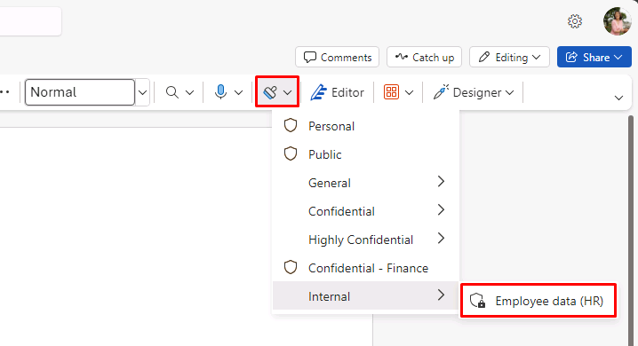

---
lab:
  title: 연습 5 - 민감도 레이블 관리
  module: Module 1 - Implement Information Protection
---

<!-- 
# Lab 1 - Exercise 5 - Manage Sensitivity Labels
-->

# 연습 2 - 민감도 레이블 관리

이 랩에서는 Contoso Ltd.의 시스템 관리자인 Joni Sherman으로 작업을 수행하게 됩니다. Joni가 소속된 독일 레드니츠헴바치 소재 조직에서는 현재 민감도 관련 계획을 구현하는 중입니다. 구체적으로 설명하자면, 조직 정보 보호 정책의 일환으로 HR 부서의 모든 직원 문서에 민감도 레이블을 표시하는 계획이 진행되고 있습니다.

## 작업 1 – 민감도 레이블을 지원하도록 설정

이 작업에서는 MSOnline 모듈과 SharePoint Online PowerShell 모듈을 설치하고 테넌트에서 민감도 레이블을 지원하도록 설정합니다.

<!--
1. Sign in to the Client 1 VM (LON-CL1) as the **lon-cl1\admin** account.

1. Open an elevated PowerShell window by selecting the start menu with the right mouse button and then select **Windows PowerShell** and run as administrator.

1. Confirm the **User Account Control** window with **Yes** and press Enter.
-->

1. 작업 표시줄에서 이전에 권한이 상승된 PowerShell 창을 엽니다.

1. 다음 cmdlet을 입력하여 최신 MS Online PowerShell 모듈 버전을 설치합니다.

    ```powershell
    Install-Module -Name MSOnline
    ```

1. Nuget 보안 대화 상자와 신뢰할 수 없는 리포지토리 보안 대화 상자에서 예를 나타내는 **Y**를 확인하고 **Enter 키**를 누릅니다. 처리를 완료하는 데 시간이 걸릴 수 있습니다.

1. 다음 cmdlet을 입력하여 MS Online 서비스에 연결합니다.

    ```powershell
    Connect-MsolService
    ```

1. **계정에 로그인** 양식에서 **Joni Sherman**(JoniS@WWLxZZZZZZ.onmicrosoft.com)으로 로그인합니다(여기서 ZZZZZZ는 랩 호스팅 공급자가 제공한 고유 테넌트 ID임). Joni의 암호는 랩 호스팅 공급자가 제공합니다.

1. 다음 cmdlet을 입력하여 도메인 값을 가져와 저장합니다.

    ```powershell
    $domain = get-msoldomain
    ```

1. 다음 cmdlet을 입력하여 SharePoint 관리자 URL을 구성합니다.

    ```powershell
    $adminurl = "https://" + $domain.Name.split('.')[0] + "-admin.sharepoint.com"
    ```

1. 다음 cmdlet을 입력하여 SharePoint Online 관리 센터에 로그인합니다.

    ```powershell
    Connect-SPOService -url $adminurl
    ```

1. **MOD 관리자**로 로그인합니다. admin@WWLxZZZZZZ.onmicrosoft.com(여기서 ZZZZZZ는 랩 호스팅 공급자가 제공한 고유 테넌트 ID입니다). <!--Admin's password should be provided by your lab hosting provider.-->

1. 다음 cmdlet을 입력하여 민감도 레이블이 지원되도록 설정합니다.

    ```powershell
    Set-SPOTenant -EnableAIPIntegration $true
    ```

1. Yes에 해당하는 **Y** 키를 눌러 변경 내용 적용을 확인하고 Enter 키를 누릅니다.

<!--
1. Close the PowerShell window.
-->

1. PowerShell 창을 나중에 사용할 수 있도록 열어둡니다.

Teams 및 SharePoint 사이트에서 민감도 레이블이 지원되도록 설정했습니다.

## 작업 2 - 민감도 레이블 만들기

이 작업에서는 HR 부서가 HR 직원 문서에 적용하기 위해 요청한 민감도 레이블을 만듭니다. 구체적으로는 내부 문서용 민감도 레이블과 HR 부서용 하위 레이블을 만들 예정입니다.

<!--
1. You should still be signed in to Client 1 VM (LON-CL1) as the **lon-cl1\admin** account.

1. In **Microsoft Edge**, navigate to **https://purview.microsoft.com** and sign in to the Microsoft Purview portal as **Joni Sherman** JoniS@WWLxZZZZZZ.onmicrosoft.com (where ZZZZZZ is your unique tenant ID provided by your lab hosting provider).  Joni's password should be provided by your lab hosting provider.
-->

1. **Joni Sherman**으로 로그인된 InPrivate 창을 열고, 닫혀 있었다면 https://purview.microsoft.com 페이지로 돌아갑니다.

1. 왼쪽 창에서 **솔루션**을 선택한 후, **정보 보호**를 선택합니다.

1. **민감도 레이블**을 선택합니다.

1. 기존 레이블 목록 위의 행에서 **+ 레이블 만들기**를 선택합니다.

1. **레이블 툴팁 이름 지정 및 만들기** 단계에서 다음 정보를 입력합니다.

    - **이름**: 내부
    - **표시 이름**: 내부
    - **사용자를 위한 설명**: 내부용 민감도 레이블입니다.
    - **관리자를 위한 설명**: Contoso 내부용 민감도 레이블입니다.

1. **다음**을 선택합니다.

1. **이 레이블의 범위 정의** 단계에서 **항목**을 선택한 다음 **파일** 및 **이메일**을 선택합니다. 이 페이지의 다른 옵션을 선택한 경우 해당 옵션의 선택을 취소합니다.

1. **다음**을 선택하여 **설정 검토 후 완료** 단계에 도달할 때까지 진행합니다.

1. **+ 레이블 만들기**를 선택합니다.

1. **민감도 레이블이 생성됨** 단계에서 **정책을 아직 만들지 않음**을 선택한 후, **완료**를 선택합니다.

1. 민감도 레이블 페이지에서 새로 만든 **내부** 레이블을 강조 표시(선택하지는 않음)하고 세로 **...** 를 선택합니다.

    

1. 드롭다운 메뉴에서 **+ 하위 레이블 만들기**를 선택합니다.

1. **이 레이블에 대한 기본 세부 정보 제공**에서 다음 정보를 입력합니다.

   - **이름**: 직원 데이터(HR)
   - **표시 이름**: 직원 데이터(HR)
   - **사용자를 위한 설명**: 이 HR 레이블은 HR 부서의 지정된 모든 문서에 적용할 기본 레이블입니다.
   - **관리자를 위한 설명**: Jones 씨(HR 부서 책임자)의 자문을 받아 이 레이블을 만들었습니다. 레이블 설정을 변경하려면 Jones 씨에게 문의하세요.

1. **다음**을 선택합니다.

1. **이 레이블의 범위 정의** 페이지에서 **항목**을 선택한 다음 **파일** 및 **이메일**을 선택합니다. 이 페이지의 다른 옵션을 선택한 경우 해당 옵션의 선택을 취소합니다. **다음**을 선택합니다.

1. **레이블이 지정된 항목에 대한 보호 설정 선택** 단계에서 **액세스 제어** 체크박스를 선택합니다. **다음**을 선택합니다.

1. **액세스 제어** 단계에서 **액세스 제어 설정 구성**을 선택합니다.

1. 암호화 설정에 다음 정보를 입력합니다.

   - **지금 권한을 할당하시겠습니까 아니면 사용자가 결정하도록 하시겠습니까?**: 지금 권한 할당
   - **콘텐츠에 대한 사용자 액세스 만료**: 안함
   - **오프라인 액세스 허용**: 특정 기간(일 수) 동안만
   - **사용자가 이 기간 동안 콘텐츠에 오프라인으로 액세스할 수 있습니다.**: 15

1. **권한 할당** 링크를 선택합니다.

1. 권한 할당 측면 메뉴에서 **인증된 사용자 추가**를 선택합니다.

1. **저장**을 선택합니다.

1. **액세스 제어** 단계에서 **다음**을 선택합니다.

1. **다음**을 선택하여 **설정 검토 후 완료** 단계에 도달할 때까지 진행합니다.

1. **+ 레이블 만들기**를 선택합니다.

1. **민감도 레이블이 생성됨** 단계에서 **정책을 아직 만들지 않음**을 선택한 후, **완료**를 선택합니다.

조직 내부 정책용 민감도 레이블과 HR(인적 자원) 부서용 민감도 하위 레이블을 만들었습니다.

## 작업 3 - 민감도 레이블 게시

이제 내부 및 HR 민감도 레이블을 게시합니다. 그러면 HR 사용자가 게시된 민감도 레이블을 HR 문서에 적용할 수 있습니다.

<!--
1. You should still be signed in to Client 1 VM (LON-CL1) as the **lon-cl1\admin** account, and you should be signed in to Microsoft 365 as **Joni Sherman**.  Sign in as JoniS@WWLxZZZZZZ.onmicrosoft.com (where ZZZZZZ is your unique tenant ID provided by your lab hosting provider).  Joni's password should be provided by your lab hosting provider.

1. In **Microsoft Edge**, the Microsoft Purview portal tab should still be open. If so, select it and proceed to the next step. If you closed it, then in a new tab, navigate to **https://purview.microsoft.com**.
-->

1. Purview의 민감도 레이블 페이지에 계속 있어야 합니다.

1. **+ 레이블 만들기**를 사용한 동일한 행에서 **레이블 게시**를 선택합니다.

1. **게시할 민감도 레이블 선택** 링크를 선택합니다.

1. 새 창에서 **내부** 및 **내부/직원 데이터(HR)** 체크박스를 선택한 다음 **추가**를 선택합니다.

1. **게시할 민감도 레이블 선택** 단계에서 **다음**을 선택합니다.

1. **다음**을 선택하여 **정책 이름 지정** 단계에 도달할 때까지 진행합니다.

1. 다음 정보를 입력합니다.

   - **이름**: 내부 HR 직원 데이터
   - **민감도 레이블 정책에 대한 설명 입력**: 내부 HR 직원 데이터에 적용할 HR 레이블입니다.

1. **다음**을 선택합니다.

1. **검토 및 완료** 단계에서 **제출**을 선택합니다.

1. **새 정책이 생성됨**에서 **완료**를 선택하여 레이블 정책 게시를 완료합니다.

내부 및 HR 민감도 레이블을 게시했습니다. 변경 내용이 모든 사용자와 서비스에 복제되려면 최대 24시간이 걸릴 수 있습니다.

## 작업 4 - 민감도 레이블 사용

이 작업에서는 Word 및 Outlook 전자 메일에서 민감도 레이블을 만듭니다. 여기서 만든 문서는 OneDrive에 저장되며 전자 메일을 통해 HR 직원에게 전송됩니다.

<!--
1. You should still be signed in to Client 1 VM (LON-CL1) as the **lon-cl1\admin** account, and you should be signed in to Microsoft 365 as **Joni Sherman** JoniS@WWLxZZZZZZ.onmicrosoft.com (where ZZZZZZ is your unique tenant ID provided by your lab hosting provider).  Joni's password should be provided by your lab hosting provider.

1. In **Microsoft Edge**, the Microsoft Purview portal tab should still be open. Select the address bar and navigate to **https://www.microsoft365.com**.
-->

1. **Joni Sherman**으로 로그인한 InPrivate 창에서 새 탭을 열고 https://www.microsoft365.com로 이동합니다.

1. **로그인**을 선택합니다.

1. Microsoft 365 시작 메시지를 스크롤하여 닫습니다.

1. 페이지 왼쪽 상단에서 **앱 론처** 메뉴(점 9개)를 선택하고 **Word**를 선택합니다.

1. 새 문서를 만들려면 **빈 문서**를 선택합니다.

1. **개인 정보 옵션** 메시지가 표시되면 **닫기**를 선택하여 해당 창을 닫습니다.

1. Word 문서에 다음 내용을 입력합니다.

    ``` text
    Important HR employee document.
    ```

1. 위쪽 창에서 **민감도**를 선택하여 드롭다운 메뉴를 엽니다. **내부 > HR(직원 데이터)** 을 선택하여 레이블을 적용합니다.

    

    >**참고:** 이 연습의 작업 1에서 실행한 스크립트가 테넌트에서 Word의 민감도 레이블을 활성화했습니다.  이렇게 활성화한 레이블을 Microsoft Word Online에서 실제로 사용하려면 1시간이 걸릴 수도 있습니다.  Word에 민감도 레이블 메뉴가 표시되지 않으면 나중에 이 랩을 다시 진행하거나 이 연습의 작업 1을 올바르게 완료했는지 확인해야 할 수 있습니다.

    >"이 레이블은 웹용 Word에서 적용할 수 없습니다..."라는 경고가 표시될 수 있습니다. 이 메시지가 표시되면 몇 분 정도 기다렸다가 Word를 다시 실행한 후 다시 시도하세요.

    

1. Word 로고 옆의 창 왼쪽 상단 모서리에서 **문서**를 선택하여 이름을 변경합니다.

1. 파일 이름으로 **HR 문서**를 입력하고 **Enter 키**를누릅니다.

1. 탭을 닫습니다. 

1. Microsoft 365에서 **앱 론처** 메뉴를 선택하고 **Outlook**을 선택하여 실행합니다.

1. 환영 메시지가 표시되면 **X**를 선택하여 닫습니다.

1. Outlook의 창 왼쪽 상단에서 **새 메일**을 선택합니다.

1. **받는 사람** 필드에 **Allan**이라는 이름을 입력하고 드롭다운 목록에서 **Allan Deyoung**을 선택합니다.

1. **주제 추가** 필드에 **HR용 직원 데이터**를 입력합니다.

1. 이메일 본문(페이지 하단의 큰 콘텐츠 패널)에 다음 메시지를 삽입합니다.

    ``` text
    Dear Mr. Deyoung, 

    Please find attached the important HR employee document. 

    Kind regards,

    Joni Sherman
    ```

1. 상단 메뉴에서 클립 기호를 선택하여 첨부 파일을 추가합니다. 문서를 첨부할 **제안 파일** 아래의 **HR Document.docx**를 선택합니다.

    >전파 시간으로 인해 파일 이름이 여전히 **Document.docx**로 표시될 수 있습니다. **추천 파일**에 있는 유일한 .docx 파일이어야 합니다.

1. **전송**을 선택하여 첨부 문서가 포함된 이메일을 발송합니다.

1. 브라우저 창은 열어 둡니다.

민감도 레이블이 적용된 HR Word 문서를 만들었습니다. 이 문서는 OneDrive에 저장되었습니다. 그런 다음 HR 부서 직원에게 문서를 전자 메일로 보냈습니다. 해당 전자 메일에도 민감도 레이블이 설정되었습니다.

## 작업 5 - 자동 레이블 지정 구성

이 작업에서는 유럽 GDPR(일반 데이터 보호 규정) 관련 정보가 포함되어 있는 것으로 확인된 문서와 전자 메일에 레이블을 자동으로 지정하는 민감도 레이블을 만듭니다.

<!--
1. You should still be signed in to Client 1 VM (LON-CL1) as the **lon-cl1\admin** account.

1. In **Microsoft Edge**, navigate to **https://purview.microsoft.com** and sign in to the Microsoft Purview portal as **Joni Sherman**.

1. In the Microsoft Purview portal, on the left navigation pane, select **Information Protection**.
-->

1. Purview 탭으로 돌아가거나 https://purview.microsoft.com로 이동하여 다시 엽니다.

1. 여전히 민감도 레이블 페이지에 없는 경우 가장 왼쪽 창에서 **정보 보호**를 선택한 다음 **민감도 레이블**을 선택합니다.

1. 기존 **내부** 레이블을 강조 표시(선택하지는 않음)한 다음 점 3개를 선택합니다.

1. **+ 하위 레이블 만들기** 메뉴 항목을 선택합니다.

1. **이 레이블에 대한 기본 세부 정보 제공**에서 다음을 입력합니다.

   - **이름**: 독일 GDPR
   - **표시 이름**: 독일 GDPR
   - **사용자를 위한 설명**: 이 문서나 전자 메일에는 독일 지역에 적용되는 유럽 GDPR(일반 데이터 보호 규정) 관련 데이터가 포함되어 있습니다.
   - **관리자를 위한 설명**: 독일 GDPR 문서에 자동 적용되는 레이블입니다.

1. **다음**을 선택합니다.

1. **이 레이블의 범위 정의** 단계에서 **항목**, **파일**, **이메일**을 선택합니다. 이 페이지의 다른 옵션을 선택한 경우 해당 옵션의 선택을 취소합니다. **다음**을 선택합니다.

1. **레이블이 지정된 항목의 보호 설정 선택** 단계에서 **다음**을 선택합니다.

1. **파일 및 이메일에 자동 레이블 지정** 단계에서 **파일 및 이메일에 자동 레이블 지정**의 토글을 켜기로 전환합니다.

1. **해당 조건과 일치하는 콘텐츠 검색** 섹션에서 **+조건 추가**를 선택하고 **다음이 포함된 콘텐츠**를 선택합니다.

1. **콘텐츠 포함** 섹션에서 **추가**를 선택한 다음 **중요한 정보 유형**을 선택합니다.

1. 오른쪽에 열리는 **중요한 정보 유형** 검색 패널에서 다음을 입력하고 **Enter 키**를 누릅니다:

    ``` text
    German
    ```

1. 상단의 **모두 선택** 체크박스를 눌러 독일과 관련된 모든 민감도 정보 유형을 선택한 다음 하단의 **추가**를 선택합니다.

1. **파일 및 이메일에 자동 레이블 지정** 단계로 돌아가서 **다음**을 선택합니다.

1. **다음**을 선택하여 **설정 검토 후 완료** 단계에 도달할 때까지 진행합니다.

1. **+ 레이블 만들기**를 선택합니다.

1. **민감도 레이블이 생성됨** 단계에서 **정책을 아직 만들지 않음**을 선택한 후, **완료**를 선택합니다.

1. 민감도 레이블 페이지에서 **레이블 게시**를 선택합니다.

1. **게시할 민감도 레이블 선택** 링크를 선택합니다.

1. **게시할 민감도 레이블** 창에서 **내부** 및 **내부/GDPR 독일** 체크박스를 선택합니다. 그런 다음, **추가**를 선택합니다.

1. **게시할 민감도 레이블 선택** 단계에서 **다음**을 선택합니다.

1. **다음**을 선택하여 **정책 이름 지정** 단계에 도달할 때까지 진행합니다.

1. **정책 이름 지정**에서 다음 정보를 입력합니다.

   - **이름**: 독일 GDPR 정책
   - **민감도 레이블 정책에 대한 설명 입력**: 독일 지역 GDPR용 민감도 레이블 자동 적용 정책입니다.

1. **다음**을 선택합니다.

1. **검토 및 완료** 단계에서 **제출**을 선택합니다.

1. 만든 후 **완료**를 선택합니다.

독일 지역의 GDPR 문서에 대한 민감도 레이블 자동 적용을 성공적으로 만들고 게시했습니다.

자동 적용 민감도 레이블이 적용될 때까지는 최대 24시간이 걸릴 수 있습니다. 단, 25,000개(일일 제한)가 넘는 문서에 레이블을 적용하면 이 기간은 더 이상 적용되지 않습니다.
