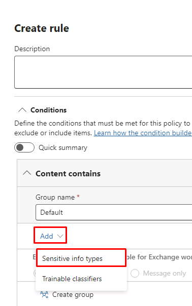
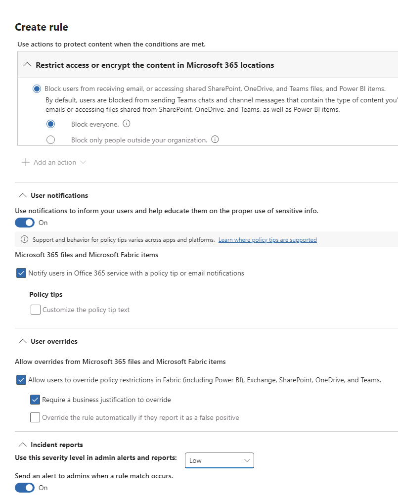

---
lab:
  title: 연습 1 - DLP 정책 관리
  module: Module 2 - Implement Data Loss Prevention
---
## WWL 테넌트 - 사용 약관

강사 진행 교육 제공의 일부로 테넌트를 제공하는 경우, 강사 진행 교육에서 실습 랩을 지원하기 위해 테넌트를 사용할 수 있습니다.

테넌트를 실습 랩 외부에서 공유하거나 사용해서는 안 됩니다. 이 과정에서 사용되는 테넌트는 평가판 테넌트이며 클래스가 종료된 후 사용하거나 액세스할 수 없으며 확장판에서도 사용할 수 없습니다.

테넌트를 유료 구독으로 변환해서는 안 됩니다. 이 과정의 일부로 얻은 테넌트는 Microsoft Corporation의 재산으로 유지되며 언제든지 액세스 권한을 획득하고 다시 소유할 수 있는 권리를 보유합니다.

<!--
# Lab 2 - Exercise 1 - Manage DLP Policies
-->

# 연습 4 – DLP 정책 관리

Contoso Ltd.에 새로 입사한 준수 관리자인 Joni Sherman이 회사 Microsoft 365 테넌트에서 데이터 손실 방지 기능을 구성하는 작업을 맡게 되었습니다. Contoso Ltd.는 미국의 운전 학원이며, 중요한 고객 정보가 조직 외부로 유출되지 않도록 해야 합니다.

## 작업 1 - 테스트 모드에서 DLP 정책 만들기

이 연습에서는 Microsoft Purview 포털에서 중요한 데이터를 사용자들이 공유하지 못하도록 하는 데이터 손실 방지 정책을 만듭니다. 여기서 만들 DLP 정책은 사용자가 신용 카드 정보를 포함하는 콘텐츠를 공유하려고 하면 알림을 표시합니다. 그러면 사용자는 해당 정보를 전송해야 하는 정당한 이유를 제시할 수 있습니다. 아직은 콘텐츠 공유 작업을 차단하여 사용자에게 영향을 주지 않기 위해 테스트 모드에서 정책을 구현할 예정입니다.

1. 클라이언트 1 VM(LON-CL1)에 **lon-cl1\admin** 계정으로 로그인합니다.

<!--
1. In **Microsoft Edge**, navigate to **https://purview.microsoft.com** and sign in to the Microsoft Purview portal as **Joni Sherman**. sign in as JoniS@WWLxZZZZZZ.onmicrosoft.com (where ZZZZZZ is your unique tenant ID provided by your lab hosting provider).  Joni's password should be provided by your lab hosting provider.

1. If the **Stay signed in?** dialog box appears, select the **Don’t show this again** checkbox and then select **No**.
-->

1. **Joni Sherman**으로 로그인한 InPrivate 브라우저 창에서 Purview 탭으로 이동하거나 https://purview.microsoft.com으로 이동합니다.

1. 왼쪽 탐색 창에서 **데이터 손실 방지**를 선택합니다.

1. **정책**을 선택합니다.

1. 정책 페이지에서 **+ 정책 만들기**를 선택하여 새 데이터 손실 방지 정책을 만들기 위한 마법사를 시작합니다.

1. **템플릿으로 시작하거나 사용자 지정 정책 만들기** 단계에서 **카테고리** 아래 **사용자 지정**을 선택한 다음 **규정**에서 **사용자 지정 정책**을 선택합니다. **다음**을 선택합니다.

1. **DLP 정책 이름 지정** 단계에서 다음을 입력합니다.

   - **이름**: 신용 카드 DLP 정책
   - **설명**: 신용 카드 번호가 공유되지 않도록 보호

1. **다음**을 선택합니다.

1. **관리 단위 할당(미리 보기)** 단계에서 **다음**을 선택합니다.

1. **정책을 적용할 위치 선택** 페이지에서 **Teams 채팅 및 채널 메시지** 체크박스만 활성화하고 **다음**을 선택합니다.

    

1. **정책 설정 정의** 단계에서 **다음**을 선택합니다.

1. **고급 DLP 규칙 사용자 지정** 페이지에서 **+ 규칙 만들기**를 선택합니다.

1. **규칙 만들기** 플라이아웃 페이지의 **이름** 필드에 _신용 카드 정보_를 입력합니다.

1. **조건**에서 **+ 조건 추가**를 선택하고 드롭다운 목록에서 **콘텐츠 포함**을 선택합니다.

1. 새 **콘텐츠 포함** 섹션에서 **추가**를 선택하고 드롭다운 목록에서 **중요한 정보 유형**을 선택합니다.

    

1. **중요한 정보 유형** 검색 필드에서 **신용 카드 번호**를 찾아 선택한 다음 **추가**를 선택합니다.

1. **콘텐츠 포함** 섹션 아래에서 **+ 조건 추가**를 선택하고 드롭다운 목록에서 **콘텐츠가 Microsoft 365에서 공유됨**을 선택합니다.

1. 새 **콘텐츠가 Microsoft 365에서 공유됨** 섹션에서 **내 조직 내부 사용자와만** 옵션을 선택합니다.

1. 계속 아래로 스크롤하여 **+ 작업 추가**를 선택한 다음 **Microsoft 365 위치에서 액세스 제한 또는 콘텐츠 암호화**를 선택합니다.

1. 라디오 단추를 선택하여 **모두 차단**으로 이동합니다.

1. **사용자 알림** 섹션까지 아래로 스크롤하고 토글을 **켜기**로 전환하여 사용자 알림을 사용하도록 설정합니다.

1. **정책 팁으로 Office 365 서비스 사용자에게 알림** 옆의 확인란을 선택합니다.

1. **사용자 재정의** 섹션에서 **사용자가 Fabric(Power BI 포함), Exchange, SharePoint, OneDrive 및 Teams에서 정책 제한을 재정의할 수 있도록 허용** 확인란을 선택합니다.

1. **재정의하려면 비즈니스 타당성 필요** 확인란을 선택합니다.

1. **인시던트 보고서** 섹션에서 **관리자 경고 및 보고서에서 이 심각도 수준 사용** 옆의 드롭다운을 선택한 다음 **낮음**을 선택합니다.

    

1. 규칙 만들기를 완료하려면 **저장**을 선택합니다.

1. **고급 DLP 규칙 사용자 지정** 단계로 돌아가서 **다음**를 선택합니다.

1. **정책 모드** 단계에서 **시뮬레이션 모드에서 정책 실행**을 선택한 다음 **시뮬레이션 모드에서 정책 팁 표시**를 선택합니다. 그런 후 **다음**을 선택합니다.

1. **검토 및 완료** 단계에서 설정을 검토하고 **제출**을 선택합니다.

1. 만든 후 **완료**를 선택합니다.

이제 Microsoft Teams 채팅 및 채널에서 신용 카드 번호를 검사한 다음, 사용자가 해당 정책을 재정의하기 위해 비즈니스 타당성을 제공할 수 있도록 하는 DLP 정책을 만들었습니다.

## 작업 2 - DLP 정책 수정

이 작업에서는 이전 단계에서 만든 기존 DLP 정책이 메일에서도 신용 카드 정보를 검사한 다음, 사용자가 해당 콘텐츠를 메일로 공유하려고 하면 알림을 표시하도록 수정합니다.

<!--
1. You should still be signed in to Client 1 VM (LON-CL1) as the **lon-cl1\admin** account, and you should be signed in to Microsoft 365 as **Joni Sherman**.

1. In **Microsoft Edge**, the Microsoft Purview portal tab should still be open. If so, select it and proceed to the next step. If you closed it, then in a new tab, navigate to **https://purview.microsoft.com**.

1. In the Microsoft Purview portal, in the left navigation pane, select **Data Loss Prevention**.

1. Select **Policies**.
-->

1. Purview의 정책 페이지에서 새로 만든 **신용 카드 DLP 정책** 옆의 체크박스를 선택한 다음 **정책 편집**(연필 아이콘)을 선택하면 정책 마법사가 열립니다.

1. **다음**을 선택하여 **정책을 적용할 위치 선택** 단계에 도달할 때까지 진행합니다.

1. **이메일 교환** 옵션의 체크박스를 선택한 다음 **검토 및 완료**에 도달할 때까지 **다음**를 선택합니다.

1. **제출**을 선택하여 정책의 변경 내용을 적용합니다.

1. 정책이 업데이트되면 **완료**를 선택합니다.

이제 기존 DLP 정책이 수정되었으며 해당 정책이 콘텐츠를 검사하는 위치가 변경되었습니다.

## 작업 3 - PowerShell에서 DLP 정책 만들기

이 작업에서는 PowerShell을 사용하여 Contoso EmployeeID를 보호하고 Exchange에서 공유되지 않도록 DLP 정책을 만듭니다. 사용자는 중요한 데이터를 공유하려고 하며 Contoso EmployeeID가 포함된 메일을 보낼 수 없다는 알림을 받습니다.

<!--
1. You should still be signed in to Client 1 VM (LON-CL1) as the **lon-cl1\admin** account.

1. In the start menu, select **Windows PowerShell**.

1. In the **PowerShell** window, enter
-->

1. 작업 표시줄에서 PowerShell 창을 열고 다음을 입력합니다.

    ```powershell
    Connect-IPPSSession
    ```

1. **Joni Sherman**JoniS@WWLxZZZZZZ.onmicrosoft.com으로 로그인합니다. 여기서 ZZZZZZ는 랩 호스팅 공급자가 제공한 고유 테넌트 ID입니다.  Joni의 암호는 랩 호스팅 공급자가 제공합니다.

1. PowerShell에 다음 명령을 입력하여 모든 Exchange 사서함을 검사하는 DLP 정책을 만듭니다.

    ```powershell
    New-DlpCompliancePolicy -Name "EmployeeID DLP Policy" -Comment "This policy blocks sharing of Employee IDs" -ExchangeLocation All
    ```

1. PowerShell에 다음 명령을 입력하여 이전 단계에서 만든 DLP 정책에 DLP 규칙을 추가합니다.

    ```powershell
    New-DlpComplianceRule -Name "EmployeeID DLP rule" -Policy "EmployeeID DLP Policy" -BlockAccess $true -ContentContainsSensitiveInformation @{Name="Contoso Employee IDs"}
    ```

1. 다음 명령어를 사용하여 **EmployeeID DLP 규칙**을 검토합니다.

    ```powershell
    Get-DLPComplianceRule -Identity "EmployeeID DLP rule"
    ```

이제 PowerShell을 사용하여 Exchange에서 Contoso EmployeeID를 검색하는 DLP 정책을 만들었습니다.

## 작업 4 - DLP 정책 테스트

이 작업에서는 이전 작업에서 만든 DLP 정책을 테스트합니다.

<!--
1. You should still be signed in to Client 1 VM (LON-CL1) as the **lon-cl1\admin** account and signed in to Microsoft 365 as Joni Sherman.
-->

1. **Joni Sherman**으로 로그인한 InPrivate 창에서 탭이 이전에 닫혀 있었다면 https://outlook.office.com으로 이동합니다.

1. 왼쪽 상단의 **새 메일** 버튼을 선택하여 새 이메일 메시지를 작성합니다.

1. **받는 사람** 필드에 _Megan_을 입력하고 **Megan Bowen**의 이메일 주소를 선택합니다.

1. **주제 추가** 필드에 _직원 정보 도움말_을 입력합니다.

1. 이메일 본문에 다음을 입력합니다.

    ``` text
    Please help me with the start dates for the following employees:
    ABC123456
    DEF678901
    GHI234567

    Thank you, 
    Joni Sherman
    ```

1. 메시지 창의 왼쪽 상단에 있는 **보내기** 버튼을 선택하여 이메일을 보냅니다.

1. 이메일을 전송할 수 없으며 DLP 정책에 의해 차단되었다는 메시지가 표시됩니다.

    

DLP 정책을 성공적으로 테스트했습니다.

## 작업 5 - 테스트 모드에서 정책 활성화

이 작업에서는 보호 조치를 시행하도록 테스트 모드에서 만든 신용 카드 정보 DLP 정책을 활성화합니다.

<!--
1. You should still be signed in to Client 1 VM (LON-CL1) as the **lon-cl1\admin** account, and you should be signed in to Microsoft 365 as **Joni Sherman**.

1. In **Microsoft Edge**, the Microsoft Purview portal tab should still be open. If so, select it and proceed to the next step. If you closed it, then in a new tab, navigate to **https://purview.microsoft.com**.
-->

1. **데이터 손실 방지**의 **정책**에 있는 Purview 탭으로 이동합니다. 그렇지 않으면 새 탭에서 https://purview.microsoft.com를 다시 엽니다.

1. 정책 페이지에서 **신용 카드 DLP 정책** 옆의 체크박스를 선택하고 **정책 편집**(연필)을 선택하면 정책 마법사가 열립니다.

1. **다음**을 선택하여 **정책 모드** 단계에 도달할 때까지 진행한 후 **정책 즉시 켜기**를 선택합니다. **다음**을 선택합니다.

1. **검토 및 완료**에서 **제출**을 선택합니다.

1. 업데이트가 완료되면 **완료**를 선택합니다.

DLP 정책을 활성화했습니다. 이제 이 정책은 신용 카드 정보 공유 시도가 검색되면 해당 시도를 차단하며, 사용자가 차단 작업 재정의를 위해 비즈니스 사유를 제공할 수 있도록 합니다.

## 작업 6 - 정책 우선 순위 수정

이전 작업에서 DLP 정책 2개를 만들었습니다. 이번에는 두 정책 중 제한 수준이 더 높은 정책에 제한 수준이 낮은 정책보다 높은 우선 순위를 지정해야 합니다. 이러한 이유로 EmployeeID DLP 정책을 더 높은 우선 순위로 이동하려고 합니다.

<!--

1. You should still be signed in to Client 1 VM (LON-CL1) as the **lon-cl1\admin** account, and you should be signed in to Microsoft 365 as **Joni Sherman**.

1. In **Microsoft Edge**, the Microsoft Purview portal tab should still be open. If so, select it and proceed to the next step. If you closed it, then in a new tab, navigate to **https://purview.microsoft.com**.

1. In the Microsoft Purview portal, in the left navigation pane, select **Data Loss Prevention**.

1. Select **Policies**.
-->

1. 정책 페이지에서 **EmployeeID DLP 정책** 옆의 세로 점 3개를 선택하여 **작업** 목록을 열고 **맨 위로 이동(최고 우선순위)** 을 선택합니다.

1. 필요한 경우 ** 새로 고침**을 선택하고 정책 표의 **우선 순위** 열에서 우선 순위를 검토합니다.

DLP 정책의 우선 순위를 수정했습니다. 두 정책의 작업 내용이 일치하면 우선 순위가 높은 정책이 시행됩니다.

## 작업 7 - Microsoft Defender에서 파일 모니터링 사용

Microsoft Defender의 파일 정책을 사용하여 OneDrive 및 SharePoint Online 위치에서 파일을 보호하려고 합니다. 파일 정책을 만들기 전에 Microsoft 365 Defender가 조직의 파일을 검색할 수 있도록 파일 모니터링을 사용하도록 설정해야 합니다.

<!--
1. You should still be signed in to Client 1 VM (LON-CL1) as the **lon-cl1\admin** account.

1. In **Microsoft Edge**, the Microsoft Purview portal tab should still be open. Select the **Profile picture** of Joni Sherman in the top right and select **Sign out**, then close the browser.

1. Open **Microsoft Edge** and navigate to **https://security.microsoft.com** and sign in to the Microsoft 365 Defender portal as **MOD Administrator** admin@WWLxZZZZZZ.onmicrosoft.com (where ZZZZZZ is your unique tenant ID provided by your lab hosting provider). Admin's password should be provided by your lab hosting provider.
-->

1. 작업 표시줄에서 **MOD 관리자**, admin@WWLxZZZZZZ.onmicrosoft.com로 로그인된 일반 Edge 창을 엽니다(여기서 ZZZZZZ는 랩 호스팅 공급자가 제공하는 고유한 테넌트 ID입니다). 관리자의 암호는 랩 호스팅 공급자가 제공합니다.

1. 새 탭에서 https://security.microsoft.com로 이동하여 Microsoft Defender 포털로 이동합니다.

1. 왼쪽 탐색에서 아래로 스크롤하여 **시스템**을 선택한 다음 하위 메뉴에서 **설정**을 선택합니다.

1. **클라우드 앱**을 선택합니다.

1. **클라우드 앱**의 왼쪽 창에서 **Information Protection** 섹션까지 아래로 스크롤하여 **파일**을 선택합니다.

1. **파일 모니터링 사용** 확인란을 선택한 후 **저장**(아직 선택하지 않은 경우)을 선택합니다.

Microsoft 365 Defender에서 파일 모니터링을 사용하도록 설정했으며 이제 파일 정책을 사용하여 파일에서 중요한 콘텐츠를 검사할 수 있습니다.

## 작업 8 - Microsoft Defender용 파일 정책 만들기

이 작업에서는 Microsoft Defender에서 파일 정책을 만들어 OneDrive 및 SharePoint Online의 파일을 검사하고 신용 카드 정보가 포함된 파일이 공유되는 경우 자동으로 격리하려고 합니다.

<!--
1. You should still be signed in to Client 1 VM (LON-CL1) as the **lon-cl1\admin** account.

1. In **Microsoft Edge**, the Microsoft Defender for Cloud Apps portal tab should still be open. Select the **Profile picture** of the MOD Admin in the top right and select **Sign out** next to the cogwheel, then close the  browser.

1. Open **Microsoft Edge** and navigate to **https://security.microsoft.com** and sign in to the Microsoft 365 Defender portal as **Joni Sherman** JoniS@WWLxZZZZZZ.onmicrosoft.com (where ZZZZZZ is your unique tenant ID provided by your lab hosting provider). Joni Sherman's password should be provided by your lab hosting provider.
-->

1. Microsoft Defender 포털의 왼쪽 탐색에서 **클라우드 앱**, **정책**, **정책 관리**를 차례로 선택합니다.

1. 정책 페이지의 드롭다운 목록에서 **+ 정책 만들기**와 **정책 파일 만들기**를 차례로 선택합니다.

1. **정책 템플릿** 선택 영역을 **템플릿 없음**으로 둡니다.

1. 기본적인 세부 사항은 다음 정보를 참조하세요.

   - **정책 이름**: 파일에 대한 신용 카드 정보
   - **정책 심각도**: 낮음(단일 켜짐 아이콘)
   - **범주**: DLP(파일 정책의 기본값)
   - **설명**: 신용 카드 번호가 파일에서 공유되지 않도록 보호

1. 아래의 **다음과 모두 일치하는 파일** 섹션에서 **퍼블릭(인터넷), 외부, 퍼블릭**을 선택한 다음 **내부**를 선택합니다.

1. **검사 방법** 드롭다운 목록에서 **데이터 분류 서비스**를 선택합니다.

1. **검사 유형 선택...** 드롭다운 목록에서 **중요한 정보 유형...** 을 선택합니다.

1. **중요한 정보 유형 선택** 대화 상자에서 **신용 카드 번호**를 선택한 후, 오른쪽 위 모서리에서 **완료**를 선택합니다.

1. **경고** 아래에서 **각각의 일치 파일에 대한 경고 만들기** 확인란을 선택하고 옵션을 검토합니다. **기본 설정으로 저장**을 선택하여 설정을 기본값으로 유지합니다.

1. **거버넌스 작업** 섹션에서 **Microsoft 비즈니스용 OneDrive**를 확장하고 **사용자 격리에 넣기**를 선택합니다.

1. **거버넌스 작업** 섹션에서 **Microsoft SharePoint Online**을 확장하고 **사용자 격리에 넣기** 확인란을 선택합니다.

1. 페이지의 맨 아래에서 **만들기**를 선택합니다.

이제 OneDrive와 SharePoint에 저장된 파일을 지속적으로 검사해 신용 카드 정보를 찾은 다음 조직 내부에서 해당 정보가 공유되는 경우 격리하는 파일 정책을 만들었습니다.

## 작업 9 - Power Platform에 대한 DLP 정책 만들기

회사에서 Power Automate 흐름을 사용하여 SharePoint Online과 Salesforce 간에 데이터를 공유합니다. 이 작업에서는 기존 흐름은 계속 작동하도록 허용하지만 SharePoint Online과 비업무용으로 정의된 앱 간에 데이터를 공유하는 흐름 생성을 방지하는 Power Platform용 DLP 정책을 만듭니다.

<!--
1. Sign in to Client 2 VM (LON-CL2) as the **lon-cl2\admin** account.

1. In **Microsoft Edge**, navigate to **https://admin.powerplatform.microsoft.com** and Sign in to the Power Platform admin center as **MOD Administrator** admin@WWLxZZZZZZ.onmicrosoft.com (where ZZZZZZ is your unique tenant ID provided by your lab hosting provider).  Admin's password should be provided by your lab hosting provider.

-->

1. **MOD 관리자**로 로그인한 일반 브라우저 창에서 새 탭을 열고 https://admin.powerplatform.microsoft.com로 이동하여 Power Platform 관리 센터로 이동합니다.

1. 왼쪽 탐색에서 **정책**을 선택한 다음 하위 메뉴에서 **데이터 정책**을 선택합니다.

1. **+ 새 정책**을 선택합니다.

1. **정책 이름 지정하기** 단계에서 _테넌트 전체 SharePoint 정책_을 입력한 다음 **다음**을 선택합니다.

1. **비업무용 | 기본값** 탭의 **커넥터 할당** 단계에서 **SharePoint** 및 **Salesforce**를 선택한 다음 페이지 상단에서 **업무용으로 이동**을 선택합니다.

1. **업무용** 탭을 선택하여 SharePoint와 Salesforce가 모두 표시되는지 확인한 다음 **다음**을 선택합니다.

1. **사용자 지정 커넥터 패턴** 단계에서 **다음**을 선택합니다.

1. **범위 정의** 단계에서 **모든 환경 추가**를 선택한 후 **다음**을 선택합니다.

1. **정책 검토 및 만들기** 단계에서 정책 설정을 검토한 다음 **정책 만들기**를 선택합니다.

이제 사용자가 SharePoint Online 커넥터 및 SalesForce가 아닌 커넥터를 사용하여 흐름을 만들지 못하도록 하는 PowerPlatform DLP 정책을 만들었습니다.
