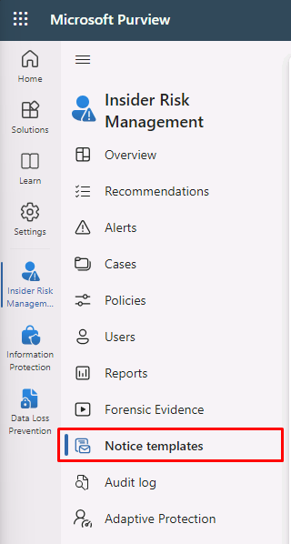

---
lab:
  title: 연습 2 - 내부 위험 관리 구성
  module: Module 5 - Manage insider and privacy risk in Microsoft 365
---

<!--
# Lab 5 - Exercise 2 - Configure Insider Risk Management
-->
# 연습 5 - 내부 위험 관리 구성

사용자는 Contoso Ltd.의 준수 관리자인 Joni Sherman입니다. 사용자의 역할에는 규정 준수를 보장하고 조직 내 중요한 정보를 보호하는 것이 포함됩니다. 최근 Contoso Ltd.에서는 잠재적으로 회사의 평판에 해를 끼치거나 데이터 보안을 손상시키거나 법적 문제로 이어질 수 있는 내부 위험을 적극적으로 해결해야 할 필요성을 인식했습니다.

내부 위험을 효과적으로 관리하려면 잠재적인 내부자 위협을 식별, 분석 및 대응하도록 설계된 포괄적인 솔루션인 Microsoft Purview 내부 위험 관리를 구현합니다.

## 작업 1 - 내부 위험 관리 역할 할당

이 연습에서는 Joni에게 내부 위험 관리 역할을 할당하여 Microsoft Purview 포털에서 내부 위험 작업을 수행할 수 있는 액세스 권한을 부여합니다.

<!--
1. Sign in to the Client 1 VM (LON-CL1) as the **lon-cl1\admin** account.

1. In Microsoft Edge, navigate to **https://purview.microsoft.com** and sign in to the Microsoft Purview portal as MOD Administrator, **admin@WWLxZZZZZZ.onmicrosoft.com** (where ZZZZZZ is your unique tenant ID provided by your lab hosting provider). Admin’s password should be provided by your lab hosting provider.
-->

1. 계속해서 로그인되지 않은 경우 클라이언트 1 VM(LON-CL1)에 **lon-cl1\admin** 계정으로 로그인합니다.

1. **MOD 관리자**로 로그인한 일반 브라우저 창에서 Purview 탭으로 이동합니다. 이전에 닫혀 있었다면 https://purview.microsoft.com로 이동합니다.

1. 왼쪽 탐색에서 **설정**을 선택합니다.

1. 하위 메뉴에서 **역할 및 범위**, **역할 그룹**을 차례로 선택합니다.

1. 검색 또는 **이름** 열을 정렬하여 목록에서 **내부 위험 관리**를 찾아 선택합니다.

1. 오른쪽의 **내부 위험 관리** 플라이아웃 페이지에서 **편집**을 선택합니다.

1. **역할 그룹의 멤버 편집** 단계에서 **사용자 선택**을 선택합니다.

1. **사용자 선택** 창에서 **Joni Sherman** 옆의 확인란을 선택한 다음 **선택** 버튼을 선택합니다.

1. **역할 그룹의 멤버 편집** 단계에서 **다음**을 선택합니다.

1. **역할 그룹 검토 및 완료** 단계에서 **저장**을 선택합니다.

1. 업데이트가 완료되면 **완료**를 선택합니다.

<!--
1. Sign out of the **MOD Administrator** account and close all browser windows.
-->

Joni Sherman에게 내부 위험 관리 역할을 성공적으로 할당하여 Microsoft Purview 포털에서 내부 위험 작업을 수행할 수 있는 액세스 권한을 부여했습니다.

## 작업 2 - 내부 위험 설정 구성

이 작업에서는 Microsoft Purview 포털에서 내부 위험 관리 설정을 사용자 지정합니다. 이를 통해 Joni Sherman은 조직 내에서 잠재적인 내부 위험을 효과적으로 관리하고 중요한 정보의 보안을 보장할 수 있습니다.

<!--
1. In **Microsoft Edge**, navigate to **https://purview.microsoft.com** and sign in to the Microsoft Purview portal as JoniS@WWLxZZZZZZ.onmicrosoft.com (where ZZZZZZ is your unique tenant ID provided by your lab hosting provider).
-->

1. **Joni Sherman**으로 로그인한 InPrivate Edge 브라우저 창을 열고 내 Purview 탭으로 이동합니다. 이전에 닫혀 있었다면 https://purview.microsoft.com(으)로 이동합니다.

1. 왼쪽 탐색에서 **설정**을 선택합니다.

1. **솔루션 설정** 섹션에서 **내부 위험 관리**를 선택합니다.

1. 설정을 살펴봅니다.

    - **분석**: 정책 만들기를 안내하는 정책을 구성하지 않고 잠재적인 내부 위험을 평가합니다.
    - **데이터 공유**: Office 365 관리 활동 API를 사용하여 위험 경고 정보를 SIEM 솔루션으로 내보냅니다.
    - **인라인 경고 사용자 지정**: 경고 대시보드에서 직접 정책 튜닝 및 임계값을 조정할 수 있습니다.
    - **지능형 검색**: 경고 볼륨을 제어하고, 위험 점수에서 특정 엔터티를 제외하고, Microsoft Defender 경고 필터링을 허용합니다.
    - **Microsoft Teams**: 내부 위험 관리 사례에 대한 공동 작업을 위해 Microsoft Teams를 사용하도록 설정합니다.
    - **알림**: 내부 위험 관리 역할 그룹에 자동으로 이메일 알림을 보냅니다.
    - **정책 표시기**: 특정 위험 표시기를 사용하여 정책 템플릿을 구성하는 작업이 포함됩니다.
    - **정책 적용 기간**: 이벤트 및 작업을 기반으로 정책 일치로 트리거되는 검토 기간을 정의합니다.
    - **Power Automate 흐름(미리 보기)**: Microsoft Power Automate 흐름을 사용하여 내부 위험 관리 작업을 자동화합니다.
    - **우선순위 물리적 자산**: 활동을 사용자 이벤트와 연관시키는 우선순위 물리적 자산에 대한 액세스를 식별하고 모니터링합니다.
    - **우선 순위 사용자 그룹**: 면밀한 검사와 더 중요한 위험 점수를 매기기 위해 고위험 사용자를 결정합니다.
    - **개인 정보**: 경고 및 사례에 사용자 이름 또는 익명화된 버전 표시를 선택할 수 있습니다.

1. 내부 위험 관리 설정 메뉴에서 **개인정보**를 선택합니다.

1. **익명화된 버전의 사용자 이름 표시 안 함**을 선택한 다음 **저장**을 선택합니다.

1. 내부 위험 관리 설정 메뉴에서 **정책 지표**를 선택합니다.

1. **Office 표시기**를 선택하여 메뉴를 확장하고 **모두 선택**의 확인란을 선택한 다음 아래로 스크롤하여 **저장**을 선택합니다.

1. 내부 위험 관리 설정 메뉴에서 **우선순위 사용자 그룹**을 선택합니다.

1. **+ 우선 순위 사용자 그룹 만들기**를 선택하여 **새 우선 사용자 그룹 마법사**를 엽니다.

1. **우선순위 사용자 그룹 이름 및 설명** 단계에서 다음을 입력합니다.

    - **이름**: 재무 팀
    - **설명**: 재무 운영, 예산 책정, 보고를 관리하는 팀 멤버

1. **다음**을 선택합니다.

1. **멤버** 단계에서 **+ 멤버**를 선택합니다.

1. **멤버** 창에서 **Debra Berger**, **Lynne Robbins**, **Megan Bowen** 옆의 확인란을 선택한 다음 **추가**를 선택하여 세 명의 멤버를 추가합니다.

1. **다음**을 선택합니다.

1. **이 우선순위 그룹의 사용자와 관련된 데이터를 볼 수 있는 사람 선택**에서 **+ 사용자 및 역할 그룹 선택**을 선택합니다.

1. **사용자 및 역할 그룹 선택** 창에서 **내부 위험 관리** 옆의 확인란을 선택하여 Purview에 내부 위험 관리 역할이 있는 모든 멤버를 추가한 다음 **추가**를 선택합니다.

1. **다음**을 선택합니다.

1. **검토** 페이지에서 **제출**을 선택합니다.

1. 만든 후 **완료**를 선택합니다. 그러면 내부 위험 관리 설정 페이지로 돌아갑니다.

내부 위험 관리 설정을 성공적으로 사용자 지정했습니다. 이제 Joni Sherman은 내부 위험을 적극적으로 식별하고 완화하여 Microsoft Purview 포털에서 귀중한 데이터를 보호하는 데 필요한 도구와 기능을 갖추고 있습니다.

## 작업 3 - 내부 위험 정책 

이 작업에서는 조직 내의 중요한 재무 데이터 액세스를 모니터링하고 보호하기 위해 Microsoft Purview에서 '재무 데이터 보호'라는 정책을 구성합니다.

1. Microsoft Purview에서 여전히 **Joni Sherman**으로 로그인해야 합니다.

1. 왼쪽 탐색 모음에서 **솔루션**을 선택한 다음 **내부 위험 관리**를 선택합니다.

1. 내부 위험 관리 메뉴에서 **정책** 탭을 선택합니다.

1. **+ 정책 만들기**를 선택합니다.

1. **정책 템플릿 선택** 단계에서 **데이터 유출**을 선택한 후 **다음**를 선택합니다.

1. **정책 이름 지정**에서 다음을 입력합니다.

    - **이름**: 재무 데이터 보호
    - **설명**: 중요한 재무 데이터 액세스 모니터링

1. **다음**을 선택합니다.

1. **사용자 및 그룹 선택** 단계에서 **모든 사용자, 그룹 및 적응형 범위**를 선택한 상태로 둔 다음 **다음**을 선택합니다.

1. **사용자 및 그룹 제외(선택 사항)** 단계에서 **다음**을 선택합니다.

1. **콘텐츠 우선순위 결정** 단계에서 **중요한 정보 유형** 확인란만 선택한 상태로 두고 **다음**을 선택합니다.

    

1. **우선 순위를 지정할 중요한 정보 유형** 단계에서 **+ 중요한 정보 유형 추가 또는 편집**을 선택합니다.

1. _은행_을 검색하고 **입력**을 누릅니다. **미국 은행 계좌 번호** 및 **국제 은행 계좌 번호(IBAN)** 옆의 체크박스를 선택합니다. 

1. _신용_을 검색하고 **입력**을 누릅니다. **신용 카드 번호** 옆의 확인란을 선택한 다음 **추가**를 선택합니다.

1. 세 가지 중요한 정보 유형이 추가되었는지 확인하고 **다음**를 선택합니다.

1. **우선 순위 콘텐츠가 있는 활동만 점수화할지 결정** 단계에서 **모든 활동에 대한 경고 가져오기**를 선택한 상태로 둔 다음 **다음**을 선택합니다.

1. **이 정책에 대한 트리거 이벤트 선택** 단계에서 **사용자가 반출 작업을 수행함**을 선택합니다.

1. **이 정책을 트리거할 작업 선택**에서 다음만 선택하여 사용합니다.

   - **SharePoint에서 콘텐츠 다운로드**
   - **조직 외부의 수신자에게 첨부 파일이 포함된 이메일 보내기**
   - **조직 외부의 사람들과 SharePoint 파일 공유**
   - **Microsoft 365 위치에서 반출 다운로드**

    >**참고**: 정책 트리거를 선택할 수 없는 경우 표시기 켜기에 대한 팁이 있을 수 있습니다. 이 옵션을 사용할 수 있는 경우 **표시기 켜기**를 선택합니다. **표시기를 선택하여 켜기** 팝업에서 **Office 표시기**에 대해 **모두 선택** 옆의 확인란을 클릭한 다음 **저장**을 선택합니다.

    

1. **다음**을 선택합니다.

1. **이벤트 트리거를 위한 임계값 선택** 단계에서 **기본 제공 임계값 적용**을 선택한 다음 **다음**를 선택합니다.

1. **표시기** 단계에서 **물리적 액세스 표시기**를 선택한 다음, **해지 후 물리적 접근 또는 중요한 자산에 대한 액세스 실패**가 선택된 경우 선택을 취소하고 **다음**을 선택합니다.

1. **검색 옵션** 단계에서 다음 섹션에 대해 **모두 선택**이 선택되어 있는지 확인합니다.

    - **시퀀스 검색**
    - **누적 반출 **
    - **위험 점수 부스터** 
    
1. **다음**을 선택합니다.

1. **표시기 임계값 유형 선택** 단계에서 **Microsoft에서 제공하는 임계값 적용**을 선택한 다음, **다음**을 선택합니다.

1. **설정 검토 및 완료** 단계에서 **제출**을 선택합니다.

1. 만든 후 **완료**를 선택합니다.

    >**참고:** 이 페이지에 설명된 대로 정책 일치 항목이 경고 탭에 표시되기 시작하는 데 최대 24시간이 걸릴 수 있습니다.

중요한 재무 정보에 대한 무단 액세스를 검색하고 보호하는 데 도움이 되는 '재무 데이터 보호' 정책을 성공적으로 만들었습니다. 정책 일치 항목이 경고 탭에 표시되는 데 최대 24시간이 걸릴 수 있습니다.

## 작업 4 - 알림 템플릿 만들기

이 작업에서는 Microsoft Purview의 내부 위험 관리에서 미리 알림 템플릿을 만듭니다. 이를 통해 위험 작업에 대한 사례가 만들어질 때 미리 알림 역할을 하거나 규정 준수 학습을 위한 정보를 제공할 때 자동으로 사용자에게 이메일 메시지를 보낼 수 있습니다.

<!--
1. You should still be signed in as Joni in Microsoft Purview in Insider risk management.
-->

1. 내부 위험 관리 탐색 메뉴에서 **알림 템플릿**를 선택합니다.

    >옵션이 표시되지 않으면 페이지를 새로 고침해 보세요.

    

1. **알림 템플릿 만들기**를 선택합니다.

1. 필요한 정보를 다음과 같이 입력합니다.

    - **템플릿 이름**: 데이터 유출 정책 경고
    - **보낸 사람**: Joni Sherman
    - **제목**: 잠재적인 데이터 유출이 검색됨
    - **메시지 본문**:

        ````html
        <!DOCTYPE html>
        <html>
        <body>
        <h2>Alert: Potential Data Leak Detected</h2>
        <p>We detected a potential data leak associated with your account. As part of our Insider Risk Management policy, we are required to investigate any suspicious activity related to data breaches.</p>
        <p>Please review your recent actions, report any unusual behavior, and refer to the Contoso User Code of Conduct training at <a href='https://contoso.com'>https://contoso.com</a> for more information.</p>
        <p>Thank you for your cooperation,</p>
        <p><em>Human Resources</em></p>
        </body>
        </html>
        ````

1. **만들기**를 실행합니다.

잠재적인 데이터 유출이 검색되면 자동 경고가 사용자에게 전송되도록 설정하고 보안 조치를 강화하며 Contoso 사용자 사용 규정 준수를 촉진하는 **데이터 유출 정책 경고** 알림 템플릿을 성공적으로 만들었습니다.
