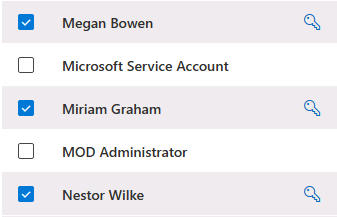

---
lab:
  title: '랩 설정: 관리를 위한 환경 준비'
  module: Module 0 - Lab Setup
---

## WWL 테넌트 - 사용 약관

강사 진행 교육 제공의 일부로 테넌트를 제공하는 경우, 강사 진행 교육에서 실습 랩을 지원하기 위해 테넌트를 사용할 수 있습니다.

테넌트를 실습 랩 외부에서 공유하거나 사용해서는 안 됩니다. 이 과정에서 사용되는 테넌트는 평가판 테넌트이며 클래스가 종료된 후 사용하거나 액세스할 수 없으며 확장판에서도 사용할 수 없습니다.

테넌트를 유료 구독으로 변환해서는 안 됩니다. 이 과정의 일부로 얻은 테넌트는 Microsoft Corporation의 재산으로 유지되며 언제든지 액세스 권한을 획득하고 다시 소유할 수 있는 권리를 보유합니다.

# 랩 설정: 관리를 위한 환경 준비

이 랩에서는 관리 작업을 위한 환경을 구성하고 준비합니다. 제공된 단계를 따르면 필수 기능과 설정이 미리 사용하도록 설정되어 예정된 랩 작업에서 더 쉽게 학습할 수 있습니다. 이 준비에는 필요한 기능 활성화, 관리 권한 설정, 핵심 요소의 적절한 구성 확인이 포함됩니다.

## 작업 - 랩을 위한 사용자 암호 설정

이 작업에서는 랩에 필요한 사용자 계정의 암호를 설정합니다.

1. 클라이언트 1 VM(LON-CL1)에 **lon-cl1\admin** 계정으로 로그인합니다. 암호는 랩 호스팅 공급자가 제공합니다.

1. **Microsoft Edge**에서 **https://admin.microsoft.com**으로 이동한 다음, Microsoft Purview 포털에 MOD 관리자 admin@WWLxZZZZZZ.onmicrosoft.com으로 로그인합니다(ZZZZZZ는 랩 호스팅 공급자가 제공한 고유 테넌트 ID임).

1. 왼쪽 탐색 창에서 **사용자**를 확장한 다음 **활성 사용자**를 선택합니다.

1. 모든 사용자를 선택하려면 **표시 이름** 옆의 확인란을 선택합니다.

1. **MOD 관리자** 및 **Microsoft 서비스 계정** 옆의 확인란의 선택을 취소합니다.

    >[!경고] **MOD 관리자** 또는 **Microsoft 서비스 계정** 암호를 변경하지 마세요. 이는 랩 환경에 부정적인 영향을 미칠 것입니다.
    ><p>
    > 

1. 가운데 작업 리본에서 **암호 초기화**를 선택하여 오른쪽에 있는 **암호 초기화** 플라이아웃 페이지를 엽니다.

1. **암호 자동 만들기** 및 **사용자가 처음 로그인할 때 암호를 변경하도록 요구** 옵션을 선택 취소합니다. 암호 초기화 페이지에서는 옵션을 선택하면 안 됩니다.

1. **암호 초기화** 플라이아웃 페이지에서 확인란이 선택되어 있지 않은지 확인합니다. 암호 필드에 테넌트에서 사용 가능한 모든 사용자 암호를 다시 설정하기 위해 기억할 수 있는 암호를 입력합니다.

    >[!note] 랩 호스팅 공급자가 제공해야 하는 관리자 계정과 동일한 암호로 다시 설정할 수 있습니다. 모든 사용자 암호를 동일한 암호로 설정하는 것은 프로덕션 환경에서는 권장되지 않지만 랩 설정에서는 유용할 수 있습니다.

1. **MOD 관리자** 및 **Microsoft 서비스 계정**을 제외한 모든 사용자 암호를 다시 설정하려면 **암호 초기화** 단추를 선택합니다.

1. **암호가 다시 설정됨** 페이지에서 **닫기** 단추를 선택하여 **활성 사용자** 페이지로 돌아갑니다.

## 작업 - Microsoft Purview 포털에서 감사 사용

이 작업에서는 Microsoft Purview 규정 준수 포털에서 감사를 사용하도록 설정합니다. 이 추적 기능을 통해 포털 작업의 표시 여부와 책임성을 모니터링할 수 있습니다.

1. 클라이언트 1 VM(LON-CL1)에는 **lon-cl1\admin** 계정으로, Microsoft 365에는 MOD 관리자 계정으로 로그인되어 있는 상태여야 합니다.

1. **Microsoft Edge**에서 **`https://compliance.microsoft.com`** 으로 이동합니다.

1. 왼쪽 탐색 창에서 **감사**를 선택합니다.

1. **감사** 페이지에서. **사용자 및 관리자 활동 기록 시작**을 선택하여 감사 로깅을 활성화합니다.

## 작업 - Microsoft Teams에서 이름으로 검색 사용

이 작업에서는 랩 설정을 위해 Microsoft Teams의 **이름으로 검색** 기능을 사용하도록 설정합니다. 이를 통해 조직 내에서 사용자 위치를 쉽게 찾고 연결할 수 있습니다. 정보 장벽 작업 시 가용성을 보장하기 위해 사전에 단계에 따라 활성화합니다.

1. 클라이언트 1 VM(LON-CL1)에는 **lon-cl1\admin** 계정으로, Microsoft 365에는 MOD 관리자 계정으로 로그인되어 있는 상태여야 합니다.

1. **Microsoft Edge**에서 **`https://admin.teams.microsoft.com`** 으로 이동합니다.

1. 왼쪽 탐색 창의 **Teams** 드롭다운에서 **Teams 설정**을 선택합니다.

1. **이름으로 검색**까지 아래로 스크롤하여 이 기능을 사용하도록 설정하려면 이 기능을 **켜기** 전환합니다.

1. 이 설정을 저장하려면 **저장**을 선택합니다.

## 작업 - SharePoint Online 및 OneDrive에서 정보 장벽 사용

이 작업에서는 SharePoint Online 및 OneDrive에서 정보 장벽을 사용하도록 설정하여 안전한 협업을 승격하고 무단 통신을 방지합니다.

1. 클라이언트 1 VM(LON-CL1)에 **lon-cl1\admin** 계정으로 로그인되어 있는 상태여야 합니다.

1. 관리자 권한 PowerShell 창을 엽니다. 이렇게 하려면 마우스 오른쪽 단추로 Windows 단추를 선택한 다음, **Windows PowerShell(관리자)** 을 선택합니다.

1. **사용자 계정 컨트롤** 창에서 **예**를 선택하여 실행을 확인합니다.

1. 다음 cmdlet을 실행하여 최신 버전의 SharePoint Online PowerShell 모듈을 설치합니다.

    ```powershell
    Install-Module -Name Microsoft.Online.SharePoint.PowerShell
    ```

1. PowerShell NuGet 공급자를 설치하라는 메시지가 표시되면 **Y**를 입력하여 공급자를 설치합니다.

1. 신뢰할 수 없는 리포지토리에서 설치하라는 메시지가 표시되면 **Y**를 입력하여 PSGallery에서 모듈을 설치합니다.

1. 다음 cmdlet을 실행하여 SharePoint Online 관리 센터에 연결합니다.

    ```powershell
     Connect-SPOService -Url https://WWLxZZZZZZ-admin.sharepoint.com -Credential admin@WWLxZZZZZZ.onmicrosoft.com
    ```

    >**참고:** ZZZZZZ를 반드시 업데이트합니다. ZZZZZZ는 랩 호스팅 공급자가 제공한 고유 테넌트 ID입니다.

1. 랩 호스팅 공급자에서 제공한 MOD 관리자 암호로 로그인합니다.

1. 다음 명령을 실행하여 SharePoint 및 OneDrive에서 정보 장벽을 사용하도록 설정합니다.

    ```powershell
    Set-SPOTenant -InformationBarriersSuspension $false
    ```

1. 이 작업이 완료되면 PowerShell 창을 닫습니다.
