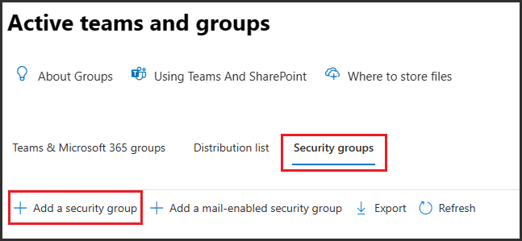
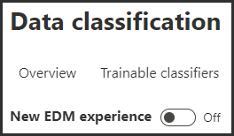

---
lab:
  title: 연습 2 - 중요한 정보 유형 관리
  module: Module 1 - Implement Information Protection
---


# 랩 1 - 연습 2 - 중요한 정보 유형 관리

Contoso Ltd.에서는 이전에 직원들이 티켓 솔루션에서 지원 티켓 관련 작업을 진행할 때 고객의 개인 정보를 실수로 보내는 문제가 발생했습니다. 그래서 이후 이러한 문제가 발생하지 않도록 사용자 교육을 진행하려고 합니다. 그러려면 이메일과 문서에서 대문자 3자와 숫자 6개로 구성된 직원 ID를 식별하는 사용자 지정 중요한 정보 유형이 필요합니다. 가양성 비율을 낮추기 위해 "직원" 및 "ID"를 키워드로 사용할 예정입니다. 이 작업에서는 새로운 사용자 지정 중요한 정보 유형, EDM 기반 분류용 데이터베이스 및 키워드 사전을 만듭니다.

## 작업 1 - 사용자 지정 중요한 정보 유형 만들기

이 연습에서는 보안 및 준수 센터 PowerShell 모듈을 사용하여 새 사용자 지정 중요한 정보 유형을 만듭니다. 이 유형은 "직원" 및 "ID" 키워드와 비슷한 직원 ID 패턴을 인식합니다.

1. 클라이언트 1 VM(LON-CL1)에 **lon-cl1\admin** 계정으로 로그인되어 있는 상태여야 합니다.

1. **Microsoft Edge**에서 **`https://compliance.microsoft.com`** 으로 이동한 다음, Microsoft Purview 포털에 JoniS@WWLxZZZZZZ.onmicrosoft.com으로 로그인합니다(ZZZZZZ는 랩 호스팅 공급자가 제공한 고유 테넌트 ID임). Joni의 암호는 랩 호스팅 공급자가 제공합니다.

1. 왼쪽 창에서 **데이터 분류**를 확장하고 **분류자**를 선택합니다.

1. **데이터 분류란 무엇인가요?** 메시지가 표시되면 **닫기**를 선택합니다.

1. 위쪽 창에서 **중요한 정보 유형**을 선택합니다.  

   >**힌트:** Purview 포털에 **중요한 정보 유형**이 표시되지 않으면 이전 랩에서 규정 준수 관리자로 업데이트된 Joni의 권한이 브라우저에서 업데이트되지 않은 것입니다.  로그아웃했다가 JoniS로 로그인해야 할 수 있습니다.

1. **중요한 정보 유형** 탭에서 **+ 중요한 정보 유형 만들기**를 선택하여 새 중요한 정보 유형 만들기 마법사를 엽니다.

1. **중요한 정보 유형 이름 지정** 페이지에서 다음 정보를 입력합니다.

    - **이름**: Contoso 직원 ID
    - **설명**: Contoso 직원 ID의 패턴입니다.

1. **다음**을 선택합니다.

1. **이 중요한 정보 유형에 대한 패턴 정의** 페이지에서 **+ 패턴 만들기**를 선택합니다.

1. 오른쪽 **새 패턴** 창에서 **+ 기본 요소 추가**를 선택하고 **정규식**을 선택합니다.

1. 새 오른쪽 창에서 **정규식 추가**에서 다음을 입력합니다.

    - **ID**: Contoso ID
    - **정규식**: ```[A-Z]{3}[0-9]{6}```
    - 문자열 일치**

1. **완료**를 선택합니다.

1. **새 패턴** 플라이아웃 페이지의 **지원 요소** 아래에서 **+ 지원 요소 또는 요소 그룹 추가** 드롭다운 메뉴를 선택하고 **키워드 목록**을 선택합니다.

1. 새 오른쪽 창에서 **키워드 목록 추가**에 다음을 입력합니다.

    - **ID**: 직원 ID 키워드
    - **대/소문자 구분 안 함**:
        - *직원*
        - *ID*
    - **대/소문자 구분** 필드에서 *단어 일치* 라디오 단추를 선택합니다.

1. **완료**를 선택합니다.

1. 새 패턴 창에서 **문자 근접** 값을 *100*자로 줄입니다.

1. **생성** 단추를 선택합니다.

1. **이 중요한 정보 유형에 대한 패턴 정의** 페이지로 돌아가서 **다음**을 선택합니다.

1. **규정 준수 정책에 표시할 권장 신뢰 수준 선택** 페이지에서 기본값을 사용하고 **다음**을 선택합니다.

1. **설정 검토 후 완료** 페이지에서 설정을 검토하고 **만들기**를 선택합니다. 만들어지면 **완료**를 선택합니다.

1. 브라우저 창은 열어 둡니다.

100자 범위 내에 대문자 3자, 숫자 6개, 그리고 '직원' 및 'ID' 키워드가 포함되어 있는 패턴의 직원 ID를 식별하는 새 중요한 정보 유형을 만들었습니다.

## 작업 2 - EDM 기반 분류 정보 유형 만들기

추가 검색 패턴으로 직원 데이터의 데이터베이스 스키마를 사용하여 EDM(정확한 데이터 일치) 기반 분류를 만듭니다. 데이터베이스 원본 파일 서식은 직원의 Name, Birthdate, StreetAddress, EmployeeID 데이터 필드에 따라 지정됩니다.

1. 클라이언트 1 VM(LON-CL1)에는 **lon-cl1\admin** 계정으로, Microsoft 365에는 **Joni Sherman**으로 로그인되어 있는 상태여야 합니다.

1. 필요한 Azure AD 보안 그룹을 만들려면 오른쪽 위의 사용자 이미지를 선택한 다음 **로그아웃**을 선택하여 Joni Sherman 계정에서 로그아웃합니다.

1. 브라우저 창을 닫고 새 브라우저 창을 엽니다.

1. **Microsoft Edge**에서 **`https://admin.microsoft.com`** 으로 이동합니다.

1. **계정 선택** 페이지가 표시되면 **다른 계정 사용**을 선택하고 **MOD 관리자**(admin@WWLxZZZZZZ.onmicrosoft.com)로 로그인합니다(여기서 ZZZZZZ는 랩 호스팅 공급자가 제공한 고유 테넌트 ID임).  관리자의 암호는 랩 호스팅 공급자가 제공합니다.

1. 왼쪽 창에서 **Teams 및 그룹**을 확장한 다음 **활성 Teams 및 그룹**을 선택합니다.

1. 활성 팀 및 그룹 페이지의 상단 탐색 모음에서 **보안 그룹**을 선택한 다음 **+ 보안 그룹 추가**를 선택합니다.

    

1. **기본 사항 설정** 화면에서 다음을 입력합니다.
    - **이름**: EDM_DataUploaders
    - **설명**: EDM용 데이터를 업로드하는 사용자입니다.

1. **다음**을 선택합니다.

1. **설정 편집** 페이지에서 **역할 할당**을 기본 설정으로 두고 **다음**을 선택합니다.

1. **검토 및 그룹 추가 완료** 페이지에서 설정을 검토하고 **그룹 만들기**를 선택합니다.

1. **새 그룹 생성됨** 페이지가 표시되면 **닫기**를 선택합니다.

1. 상단 탐색 모음에서 **보안** 탭이 선택되었는지 확인한 다음 **새로 고침**을 선택합니다. 목록에서 새로 만들어진 **EDM_DataUploaders** 그룹을 선택하여 오른쪽에 있는 **EDM_DataUploaders** 플라이아웃 페이지를 엽니다.

1. **구성원** 탭을 선택하고 **구성원 모두 보기 및 관리**를 선택합니다.

1. **그룹 구성원 관리** 화면에서 **(+) 구성원 추가**를 선택합니다.

1. **Joni Sherman**을 선택하고 **추가(1)** 단추를 선택한 다음 뒤쪽 화살표를 선택합니다.

1. **Joni Sherman**이 **구성원** 아래에 있는지 확인합니다.

1. **X** 단추를 눌러 오른쪽 창을 닫습니다.

1. 오른쪽 위에서 모드 관리자 프로필 사진을 선택한 다음 **로그아웃**을 선택합니다. 사진은 작은 메가폰처럼 보입니다. 

1. 브라우저 창을 닫고 새 창을 엽니다.

1. `https://compliance.microsoft.com`에서 Microsoft Purview 포털로 이동합니다.

1. **계정 선택** 페이지가 표시되면 **Joni Sherman**을 선택하고 로그인합니다.

1. **데이터 분류**를 확장하고 **분류자**를 선택한 다음 상단 창에서 **EDM 분류자** 탭을 선택합니다.

   >**참고:** EDM(정확한 데이터 일치) 기반의 SIT(중요한 정보 유형)를 만들고 사용할 수 있도록 하는 것은 다단계 프로세스입니다. 기존 클래식 환경에서 새로운 환경을 사용할 수 있습니다. 이 랩에서는 클래식 환경을 사용하여 EDM 기반의 SIT를 만드는 방법에 대해 설명합니다. 새로운 환경을 사용하여 EDM 기반의 SIT를 만드는 방법에 대한 자세한 내용은 다음을 참조하세요. [정확한 데이터 일치 중요한 정보 유형 워크플로 새로운 경험 만들기](https://learn.microsoft.com/en-us/microsoft-365/compliance/sit-create-edm-sit-unified-ux-workflow?view=o365-worldwide)

1. 클래식 환경을 위해 **새 EDM 환경** 스위치를 **끄기**로 선택했는지 확인합니다.

      

1. **+ EDM 스키마 만들기**를 선택합니다.

1. **새 EDM 스키마** 페이지에서 다음을 입력합니다.
    - **이름**: employeedb
    - **설명**: 직원 데이터베이스 스키마

1. **모든 스키마 필드에서 구분 기호 및 문장 부호 무시**를 사용하도록 설정합니다.

1. **무시할 구분 기호 및 문장 부호 선택** 드롭다운을 클릭하고 하이픈, 마침표, 띄어쓰기, 여는 괄호, 닫는 괄호를 선택합니다.**********

1. 첫 번째 **스키마 필드 이름**에 *Name*을 입력하고 **필드 검색 가능**을 선택합니다.

1. 아래쪽에서 **+ 스키마 데이터 필드 추가**를 선택합니다.

1. **스키마 필드 이름**의 **스키마 필드 2** 아래에 *Birthdate*를 입력합니다.

1. 아래쪽에서 **+ 스키마 데이터 필드 추가**를 다시 선택합니다.

1. **스키마 필드 이름**의 **스키마 필드 3** 아래에 *StreetAddress*를 입력합니다.

1. 마지막으로 아래쪽에서 **+ 스키마 데이터 필드 추가**를 선택합니다.

1. **스키마 필드 이름**의 **스키마 필드 4** 아래에 *EmployeeID*를 입력합니다.

1. **필드 검색 가능**을 선택합니다.

1. **저장**을 선택합니다.

1. 왼쪽 창에서 **EDM 중요한 정보 유형**을 선택합니다.

1. **+ EDM 중요한 정보 유형 만들기**를 선택하여 **EDM 규칙 패키지** 마법사를 엽니다.  

1. **데이터 저장소 스키마 정의** 페이지에서 **기존 EDM 스키마 선택**을 선택합니다.

1. **employeedb**를 선택하고 **추가**를 선택합니다.

1. 데이터 저장소 스키마를 검토하고 **다음**을 선택합니다.

1. **이 EDM 중요한 정보 유형에 대한 패턴 정의** 페이지에서 **+ 패턴 만들기**를 선택합니다.

1. 오른쪽의 **새 패턴** 창에 있는 기본 요소 필드에서 *EmployeeID*를 선택합니다.

1. **기본 요소의 중요한 정보 유형** 아래에서 **+ 중요한 정보 유형 선택**을 선택합니다.

1. **검색** 창에 *Contoso*를 입력하고 Enter 키를 누릅니다.

1. **Contoso 직원 ID**를 선택하고 **완료**를 선택합니다.

1. **새 패턴** 페이지에서 **완료**를 선택합니다.

1. 이 EDM 중요한 정보 유형에 대한 패턴 정의 화면에서 **다음**을 선택합니다.

1. **권장 신뢰 수준 및 문자 근접 선택**에서 기본값을 유지하고 **다음**을 선택합니다.

1. **EDM 중요한 정보 유형 이름 지정 및 설명** 페이지에서 다음을 입력합니다.
    - **이름**: Contoso 직원 EDM
    - **관리자를 위한 설명**: 직원 개인 정보용 EDM 기반 중요한 정보 유형입니다.

1. **다음**을 선택하고 설정을 검토한 후에 **제출**을 선택합니다.

1. **EDM 중요한 정보 유형이 작성됨** 페이지에서 **완료**를 선택합니다.

1. Microsoft Purview 포털을 사용하여 브라우저를 열어 둡니다.

데이터베이스 파일 원본에서 직원 데이터를 식별하는 데 사용할 새 EDM 기반 분류 중요한 정보 유형을 만들었습니다.

## 작업 3 - EDM 기반 분류 데이터 원본 만들기

다음으로는 EDM 기반 분류를 중요한 데이터가 포함된 데이터베이스와 연결하기 위해 EDM Upload Agent 도구를 사용하여 중요한 정보 유형에 해당하는 실제 데이터를 해시하여 업로드해야 합니다.

1. 클라이언트 1 VM(LON-CL1)에는 **lon-cl1\admin** 계정으로, Microsoft 365에는 **Joni Sherman**으로 로그인되어 있는 상태여야 합니다.

1. **Microsoft Edge**에서 **`https://go.microsoft.com/fwlink/?linkid=2088639`** 로 이동하여 EDM 다운로드 에이전트에 액세스합니다.

1. **실행**을 선택하여 도구를 다운로드한 다음 선택합니다.

1. 설치 마법사가 백그라운드에서 열리면 작업 표시줄에서 설치 관리자를 선택합니다.

1. **Microsoft Exact Data Match Upload Agent Setup** 마법사에서 **다음**을 선택합니다.

1. **사용권 계약 조건에 동의합니다**를 선택하고 **다음**을 선택합니다.

1. 기본 **대상 폴더** 경로를 변경하지 말고 **다음**을 선택합니다.

1. **설치**를 선택하여 설치를 수행합니다.

1. **사용자 계정 컨트롤** 창이 열리면 **예**를 선택합니다.

1. 설치가 완료되면 **마침**을 선택합니다.

1. 왼쪽 아래의 Windows 기호를 선택하여 시작 메뉴를 열고 **메모장**을 입력한 후에 시작 메뉴에서 **메모장**을 선택합니다.

1. 메모장 창의 첫 줄에 다음 텍스트를 입력합니다.

    ``` text
    Name,Birthdate,StreetAddress,EmployeeID
    ```

1. Enter 단추를 누르고 메모장 창의 두 번째 줄에 다음 텍스트를 입력합니다.

    ``` text
    Joni Sherman,01.06.1980,1 Main Street,CSO123456
    ```

1. Enter 단추를 누르고 메모장 창의 세 번째 줄에 다음 텍스트를 입력합니다.

    ``` text
    Lynne Robbins,31.01.1985,2 Secondary Street,CSO654321
    ```

1. **파일**, **다른 이름으로 저장**을 차례로 선택하여 파일을 저장합니다.

1. 왼쪽 창에서 **문서**를 선택하고 **파일 이름** 필드에 다음 이름을 입력합니다. *EmployeeData.csv*

1. **파일 형식:** 드롭다운을 선택하고 **모든 파일 (*.*)** 을 선택합니다.

1. **인코딩:** 드롭다운을 선택하고 **UTF-8**을 선택한 다음 **저장**을 선택합니다.

1. 메모장 창을 닫습니다.

1. 마우스 오른쪽 단추로 표시줄의 Windows 기호를 선택하고 **Windows PowerShell(관리자)** 을 선택하여 관리자로 PowerShell을 실행합니다.

1. **사용자 계정 컨트롤** 창이 열리면 **예**를 선택합니다.

1. 다음의 EDM Upload Agent 디렉터리로 이동합니다.

    ``` text
    cd "C:\Program Files\Microsoft\EdmUploadAgent"
    ```

1. 다음 명령 cmdlet을 실행하여 계정에 테넌트에 대한 데이터베이스 업로드 권한을 부여합니다.

    ``` text
    .\EdmUploadAgent.exe /Authorize
    ```

1. **계정 선택** 창이 표시되면 JoniS@WWLxZZZZZZ.onmicrosoft.com으로 로그인합니다(여기서 ZZZZZZ는 랩 호스팅 공급자가 제공한 고유 테넌트 ID임).  Joni의 암호는 랩 호스팅 공급자가 제공합니다.

1. PowerShell에서 다음 스크립트를 실행하여 EDM 기반 분류 중요한 정보 유형의 데이터베이스 스키마 정의를 다운로드합니다.

    ``` text
    .\EdmUploadAgent.exe /SaveSchema /DataStoreName employeedb /OutputDir "C:\Users\Admin\Documents\"
    ```

    참고: 마지막으로 실행한 명령이 실패하면 **EDM_DataUploaders** 그룹 멤버 자격이 적용될 때까지 시간이 좀 더 걸리는 것일 수 있습니다. 스키마 파일을 다운로드할 수 있을 때까지는 최대 1시간이 걸릴 수 있습니다.  실패할 경우 다음 작업으로 진행하고 이 단계는 나중에 돌아옵니다.

1. PowerShell에서 다음 스크립트를 실행하여 데이터베이스 파일을 해시한 다음 EDM 기반 분류 중요한 정보 유형에 업로드합니다.

    ``` text
    .\EdmUploadAgent.exe /UploadData /DataStoreName employeedb /DataFile "C:\Users\Admin\Documents\EmployeeData.csv" /HashLocation "C:\Users\Admin\Documents\" /Schema "C:\Users\Admin\Documents\employeedb.xml"
    ```

1. 다음 명령을 사용하여 업로드 진행률을 확인합니다.

    ``` text
    .\EdmUploadAgent.exe /GetSession /DataStoreName employeedb
    ```

1. 상태가 **완료됨**이면 EDM 데이터를 사용할 준비가 된 것입니다.

    

1. PowerShell 창을 닫습니다.

EDM 기반 분류 중요한 정보 유형용 데이터베이스 파일을 해시하여 업로드했습니다.

## 작업 4 - 키워드 사전 만들기

회사 내의 사용자가 병가를 낸 직원 관련 이메일을 외부로 전송하는 보내는 과정에서 개인 정보 유출 관련 위반이 몇 차례 발생했습니다.  그래서 질병이나 병가 이유와 질환 내용 등이 유출되었습니다.  이런 일은 발생하지 않아야 합니다.

1. 클라이언트 1 VM(LON-CL1)에는 **lon-cl1\admin** 계정으로, Microsoft 365에는 **Joni Sherman**으로 로그인되어 있는 상태여야 합니다.

1. **Microsoft Edge**에는 Microsoft Purview 포털 탭이 계속 열려 있어야 합니다. 해당 탭이 열려 있으면 탭을 선택하고 다음 단계를 진행합니다. 닫았다면 새 탭에서 **`https://compliance.microsoft.com`** 으로 이동합니다.

1. 왼쪽 창에서 **데이터 분류**를 확장한 다음 **분류자**를 선택합니다. 상단 창에서 **중요한 정보 유형** 탭을 선택합니다.

1. **+ 중요한 정보 유형 만들기**를 선택하여 새 중요한 정보 유형 만들기 마법사를 엽니다.

1. **중요한 정보 유형 이름 지정** 페이지에서 다음을 입력합니다.

    - **이름**: Contoso 질병 목록
    - **설명**: 직원이 병가를 요청할 수 있는 질병 목록입니다.

1. **다음**을 선택합니다.

1. **이 중요한 정보 유형에 대한 패턴 정의** 페이지에서 **+ 패턴 만들기**를 선택합니다.

1. **새 패턴** 페이지에서 **기본 요소** 아래의 드롭다운 필드를 선택하고 **키워드 사전**을 선택합니다.

1. **키워드 사전 추가** 페이지에서 다음을 입력합니다.

   - **이름**: 질병 사전
   - **키워드:**
      - {b>유행성 감기<b}
      - {b>인플루엔자<b}
      - {b>감기<b}
      - {b>기관지염<b}
      - {b>중이염<b}  

1. **완료**를 선택합니다.

1. **지원 요소** 아래에서 **+ 지원 요소 또는 요소 그룹 추가** 드롭다운을 선택하고 **키워드 목록**을 선택하여 키워드 사전용 추가 지원 요소를 추가합니다.

1. **키워드 목록 추가** 페이지에서 다음을 입력합니다.

   - **ID**: 직원 결근
   - **대/소문자 구분 안 함**:
     - 직원
     - {b>결근<b}
     - reason

1. **완료**를 선택합니다.

1. **새 패턴** 페이지에서 구성을 검토하고 **만들기**를 선택합니다.

1. **이 중요한 정보 유형에 대한 패턴 정의** 에서 **다음**을 선택합니다.

1. **규정 준수 정책에 표시할 권장 신뢰 수준 선택**에서 기본값을 사용하고 **다음**을 선택합니다.

1. **설정 검토 후 완료** 페이지에서 설정을 검토하고 **만들기**를 선택합니다.  프로세스가 완료되면 **완료**를 선택합니다.

1. Microsoft Purview 포털의 브라우저 창을 열어 둡니다.

키워드 사전을 기반으로 하여 새 중요한 정보 유형을 만들고 가양성 비율을 낮추기 위해 키워드를 더 추가했습니다. 다음 작업을 계속 진행하세요.

## 작업 5 - 사용자 지정 중요한 정보 유형 사용

사용자 지정 중요한 정보 유형은 정책에서 사용하기 전에 항상 테스트해야 합니다. 그렇지 않으면 사용자 지정 검색 패턴이 오작동하여 데이터가 손실되거나 유출될 수 있습니다.

1. 클라이언트 1 VM(LON-CL1)에는 **lon-cl1\admin** 계정으로, Microsoft 365에는 **Joni Sherman**으로 로그인되어 있는 상태여야 합니다.

1. 왼쪽 아래의 Windows 기호를 선택하여 시작 메뉴를 열고 **메모장**을 입력한 후에 시작 메뉴에서 **메모장**을 선택합니다.

1. 메모장 창에 다음 텍스트를 입력합니다.

    ``` text
    Employee Joni Sherman EMP123456 is absent because of the flu/influenza.
    ```

1. **파일**, **다른 이름으로 저장**을 차례로 선택합니다.

1. 왼쪽 창에서 문서를 선택합니다.

1. **파일 이름** 필드에 *SickTestData*를 입력하고 **저장**을 선택합니다.

1. 메모장 창을 닫습니다.

1. **Microsoft Edge**에는 Microsoft Purview 포털 탭이 계속 열려 있어야 합니다. 해당 탭이 열려 있으면 탭을 선택하고 다음 단계를 진행합니다. 닫았다면 새 탭에서 **`https://compliance.microsoft.com`** 으로 이동합니다.

1. 왼쪽 탐색 창에서 **데이터 분류**를 확장한 다음 **분류자**를 선택합니다. **중요한 정보 유형** 탭을 선택합니다.

1. 오른쪽 위에 있는 **검색** 상자에 *Contoso*를 입력하고 Enter 키를 누릅니다.

1. **Contoso 직원 ID**를 선택합니다.

1. **테스트**를 선택합니다.

1. **테스트할 파일 업로드** 페이지에서 **파일 업로드**를 선택합니다.

1. 왼쪽 창에서 **문서**를 선택하고 이름이 *SickTestData*인 파일을 선택한 후에 **열기**를 선택합니다.

1. **테스트**를 선택하여 분석을 시작합니다.

1. **일치 결과** 페이지에서 확인된 일치 항목을 검토합니다.

1. **마침**을 선택하여 테스트를 끝냅니다.

1. 상단 탐색 모음을 사용하여 **중요한 정보 유형**으로 다시 이동합니다.

1. *Contoso*를 검색한 다음 **Contoso 질병 목록**이라는 중요한 정보 유형을 선택합니다.

1. **테스트**를 선택합니다.

1. **테스트할 파일 업로드** 창에서 **파일 업로드**를 선택합니다.

1. 왼쪽 창에서 **문서**를 선택하고 이름이 *SickTestData*인 파일을 선택한 후에 **열기**를 선택합니다.

1. **테스트**를 선택하여 분석을 시작합니다.

1. **일치 결과** 페이지에서 확인된 일치 항목을 검토합니다. 검토가 완료되면 **완료**를 선택합니다.

사용자 지정 중요한 정보 유형 2개를 테스트했으며, 검색 패턴이 적절한 패턴을 인식하는지 유효성을 검사했습니다. 이제 중요한 정보 유형 만들기를 완료했으므로 다음 연습을 진행할 수 있습니다.
