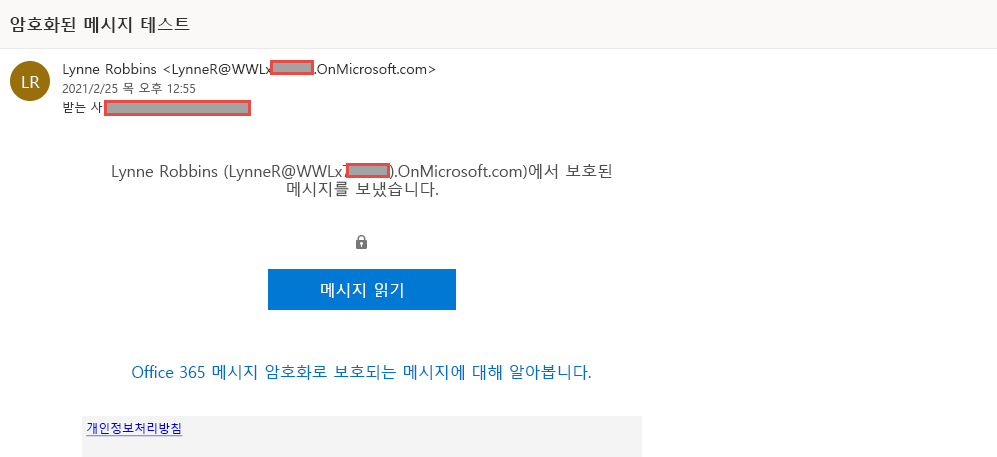

# 랩 1 - 연습 2 - Office 365 메시지 암호화 관리

Joni Sherman이 파일럿 팀과 함께 먼저 구성 및 테스트해야 하는 설정은 Microsoft 365의 기본 제공 OME(Office 365 메시지 암호화)입니다. 이 작업을 위해 Joni는 기본 템플릿을 수정하여 새 브랜딩 템플릿을 만든 다음 파일럿 사용자 중 한 명에게 할당할 예정입니다. 그러면 파일럿 사용자가 자신의 계정으로 OME 기능을 테스트합니다.

### 작업 1 - Azure RMS 기능 확인

이 작업에서는 Exchange Online PowerShell 모듈을 설치하고 Joni Sherman의 컨텍스트에서 테넌트의 Azure RMS 기능이 올바르게 작동하는지를 확인합니다. 지난 연습에서 이 작업을 위해 Joni에게 준수 관리자 역할을 할당했습니다.

1. 클라이언트 1 VM(LON-CL1)에 **lon-cl1\admin** 계정으로 로그인되어 있는 상태여야 합니다.

2. 관리자 권한 PowerShell 창을 엽니다. 이렇게 하려면 마우스 오른쪽 단추로 Windows 단추를 선택한 다음 **Windows PowerShell(관리자)** 을 선택합니다.

3. **사용자 계정 컨트롤** 창에서 **예**를 선택하여 실행을 확인합니다.

4. 다음 cmdlet을 입력하여 최신 Exchange Online PowerShell 모듈 버전을 설치합니다.

    `Install-Module ExchangeOnlineManagement`

5. NuGet 공급자 보안 대화 상자에서 Yes에 해당하는 **Y** 키를 눌러 확인하고 **Enter** 키를 누릅니다. 이 프로세스가 완료될 때까지 몇 초 정도 걸릴 수 있습니다.

6. 신뢰할 수 없는 리포지토리 보안 대화 상자가 표시되면 Yes에 해당하는 **Y** 키를 누르고 **Enter** 키를 누릅니다.  이 프로세스가 완료될 때까지 몇 초 정도 걸릴 수 있습니다.

7. 다음 cmdlet을 입력하여 실행 정책을 변경하고 **Enter** 키를 누릅니다.

    `Set-ExecutionPolicy -ExecutionPolicy RemoteSigned -Scope CurrentUser`

8. Yes에 해당하는 **Y** 키를 눌러 실행 정책 변경을 확인하고 **Enter** 키를 누릅니다. 

9. PowerShell 창을 닫습니다.

10. 일반 PowerShell 창을 엽니다. 이렇게 하려면 마우스 오른쪽 단추로 Windows 단추를 선택한 다음 **Windows PowerShell**을 선택합니다.

11. 다음 cmdlet을 입력하여 Exchange Online PowerShell 모듈을 사용해 테넌트에 연결합니다.

    `Connect-ExchangeOnline`

12. **로그인** 창이 표시되면 JoniS@WWLxZZZZZZ.onmicrosoft.com으로 로그인합니다(여기서 ZZZZZZ는 랩 호스팅 공급자가 제공한 고유 테넌트 ID임).  Joni의 암호는 랩 호스팅 공급자가 제공합니다.

13. 다음 cmdlet을 사용하여 테넌트에서 Azure RMS 및 IRM이 활성화되어 있는지 확인하고 **Enter** 키를 누릅니다.

    `Get-IRMConfiguration | fl AzureRMSLicensingEnabled`

14. 다음 cmdlet을 사용하여 다른 파일럿 사용자인 **Megan Bowen**을 대상으로 Office 365 메시지 암호화에 사용되는 Azure RMS 템플릿을 테스트하고 **Enter** 키를 누릅니다.

    `Test-IRMConfiguration -Sender MeganB@contoso.com -Recipient MeganB@contoso.com`

    

15. 모든 테스트에서 상태가 PASS로 표시되고 오류가 발생하지 않는지 확인합니다.

16. PowerShell 창은 열어 둡니다.

Exchange Online PowerShell 모듈을 설치하고 테넌트에 연결하여 Azure RMS의 기능이 올바르게 작동하는지를 확인했습니다.

### 작업 2 - 기본 OME 템플릿 수정

조직에서 Google, Facebook 등의 외부 ID 공급자에 대한 신뢰를 제한하려는 경우 이 작업을 수행해야 합니다. 이러한 소셜 ID는 OME로 보호되는 메시지 액세스를 위해 기본적으로 활성화되므로 조직의 모든 사용자에 대해 소셜 ID 사용을 비활성화해야 합니다.  

1. 클라이언트 1 VM(LON-CL1)에 **lon-cl1\admin** 계정으로 로그인되어 있는 상태여야 하며 Exchange Online에 연결된 PowerShell 창이 계속 열려 있어야 합니다.

2. 다음 cmdlet을 실행하여 기본 OME 구성을 확인합니다.

    `Get-OMEConfiguration -Identity "OME Configuration" |fl`

3. 설정을 검토하여 SocialIdSignIn 매개 변수가 True로 설정되어 있는지 확인합니다.

4. 다음 cmdlet을 실행하여 OME로 보호되는 테넌트에서 메시지 액세스에 소셜 ID 사용을 제한합니다.

    `Set-OMEConfiguration -Identity "OME Configuration" -SocialIdSignIn:$false`

5. 기본 템플릿 사용자 지정 관련 경고 메시지가 표시되면 Yes에 해당하는 **Y** 키를 누르고 **Enter** 키를 누릅니다.

6. 기본 구성을 다시 확인하여 SocialIdSignIn 매개 변수가 이제 False로 설정되어 있는지 유효성을 검사합니다.

    `Get-OMEConfiguration -Identity "OME Configuration" |fl`

7. 결과에는 SocialIDSignIn이 False로 설정되어 있는 것으로 표시되어야 합니다. PowerShell 창과 클라이언트는 열어 둡니다.

Office 365 메시지 암호화에서 Google, Facebook 등의 외부 ID 공급자 사용을 비활성화했습니다.

### 작업 3 - 기본 OME 템플릿 테스트

테넌트 사용자로부터 Office 365 메시지 암호화로 보호되는 메시지가 수신될 때 외부 받는 사람에게 소셜 ID 대화 상자가 표시되지 않는지를 확인해야 합니다.

1.	**lon-cl2\admin** 계정으로 클라이언트 2 VM(LON-CL2)에 로그인합니다.

2.	작업 표시줄에서 **Microsoft Edge**를 열고 **새로운 Microsoft Edge에 오신 것을 환영합니다.** 창이 표시된 후 **설정 완료**가 나타나면 선택합니다.

3. **확인**을 선택하여 기본 브라우저 설정을 적용한 후 **로그인하지 않고 계속**이 나타나면 선택합니다.

4. **Microsoft Edge**에서 **https://outlook.office.com** 으로 이동한 다음 웹용 Outlook에 ynneR@WWLxZZZZZZ.onmicrosoft.com으로 로그인합니다(여기서 ZZZZZZ는 랩 호스팅 공급자가 제공한 고유 테넌트 ID임).  Lynne Robin의 암호는 랩 호스팅 공급자가 제공합니다. 힌트: 보통 랩 테넌트의 MOD 관리자 암호와 동일합니다.

5. **로그인 상태를 유지하시겠습니까?** 대화 상자에서 **이 메시지를 다시 표시 안 함** 체크박스를 선택하고 **아니요**를 선택합니다.

6. **암호 저장** 대화 상자에서 **저장**을 선택하여 파일럿 사용자의 암호를 브라우저에 저장합니다.

7. **페이지 번역...** 창이 표시되면 아래쪽 화살표를 선택하고 **번역하지 않음...** 을 선택합니다.

8. 웹용 Outlook의 왼쪽 위에서 **새 메시지**를 선택합니다.

9. **받는 사람** 줄에 테넌트 도메인에 속해 있지 않은 기타 타사 전자 메일 주소나 개인 전자 메일 주소를 입력합니다. 제목 줄에는 **비밀 메시지**를, 본문에는 **초특급 비밀 메시지입니다**. 를 입력합니다.

10. 위쪽 창에서 **암호화**를 선택하여 메시지를 암호화합니다.  메시지를 암호화하고 나면 "이 메시지는 암호화되었습니다."라는 알림이 표시됩니다.

11. **보내기**를 선택하여 메시지를 보냅니다.

12. 개인 전자 메일 계정에 로그인하여 Lynne Robbins의 메시지를 엽니다.  Microsoft 계정(예: @outlook.com)으로 해당 전자 메일을 보냈다면 암호화가 자동으로 처리되므로 메시지를 자동으로 확인할 수 있습니다.  반면 다른 전자 메일 서비스(예: @google.com)로 해당 전자 메일을 보냈다면 다음 단계를 수행하여 암호를 처리해야 메시지를 읽을 수 있습니다.

13. **메시지 읽기**를 선택합니다.

14. 소셜 ID가 활성화되어 있지 않으므로 Google 계정을 사용한 인증 단추는 표시되지 않습니다.

15. **일회용 암호로 로그인**을 선택하여 일정 시간 동안만 사용할 수 있는 암호를 받습니다.

16. 개인 전자 메일 포털로 이동하여 제목이 **메시지를 보기 위한 일회용 암호**인 메시지를 엽니다.

17. 암호를 복사하여 OME 포털에 붙여넣은 후에 **계속**을 선택합니다.

18. 암호화된 메시지를 검토합니다.

비활성화된 소셜 ID를 사용하여 수정된 기본 OME 템플릿을 테스트했습니다.

### 작업 4 - 사용자 지정 브랜딩 템플릿 만들기

조직 경리부에서 보내는 보호된 메시지에는 특수 브랜딩을 사용해야 합니다. 이러한 브랜딩에는 사용자 지정된 소개 및 본문 텍스트, 그리고 바닥글의 고지 사항 링크가 포함됩니다. 또한 경리부에서 보내는 메시지는 7일 후에 만료되어야 합니다. 이 작업에서는 새 사용자 지정 OME 구성, 그리고 경리부에서 보내는 모든 메일에 해당 OME 구성을 적용하는 전송 규칙을 만듭니다.

1. 클라이언트 1 VM(LON-CL1)에 **lon-cl1\admin** 계정으로 로그인하고 Exchange Online에 연결된 PowerShell 창이 계속 열려 있어야 합니다.

2. 다음 cmdlet을 실행하여 새 OME 구성을 만듭니다.

    `New-OMEConfiguration -Identity "Finance Department" -ExternalMailExpiryInDays 7` 

3. 템플릿 사용자 지정 관련 경고 메시지가 표시되면 Yes에 해당하는 **Y** 키를 누르고 **Enter** 키를 누릅니다. 

4. 다음 cmdlet을 사용하여 소개 텍스트 메시지를 변경합니다.

    `Set-OMEConfiguration -Identity "Finance Department" -IntroductionText " from Contoso Ltd. finance department has sent you a secure message."`

5. 템플릿 사용자 지정 관련 경고 메시지가 표시되면 Yes에 해당하는 **Y** 키를 누르고 **Enter** 키를 누릅니다.

6. 다음 cmdlet을 사용하여 메시지의 본문 전자 메일 텍스트를 변경합니다.

    `Set-OMEConfiguration -Identity "Finance Department" -EmailText "Encrypted message sent from Contoso Ltd. finance department. Handle the content responsibly."`

7. 템플릿 사용자 지정 관련 경고 메시지가 표시되면 Yes에 해당하는 **Y** 키를 누르고 **Enter** 키를 누릅니다.

8. Contoso 개인정보처리방침 사이트를 가리키도록 고지 사항 URL을 변경합니다.

    `Set-OMEConfiguration -Identity "Finance Department" -PrivacyStatementURL "https://contoso.com/privacystatement.html"`

9. 템플릿 사용자 지정 관련 경고 메시지가 표시되면 Yes에 해당하는 **Y** 키를 누르고 **Enter** 키를 누릅니다.

10. 다음 cmdlet을 사용하여 메일 흐름 규칙을 만듭니다. 이 규칙은 경리팀에서 보내는 모든 메시지에 사용자 지정 OME 템플릿을 적용합니다.  이 프로세스가 완료될 때까지 몇 초 정도 걸릴 수 있습니다.

    `New-TransportRule -Name "Encrypt all mails from Finance team" -FromScope InOrganization -FromMemberOf "Finance Team" -ApplyRightsProtectionCustomizationTemplate "Finance Department" -ApplyRightsProtectionTemplate Encrypt`

11. 다음 cmdlet을 입력하여 변경 내용을 확인합니다.
    `Get-OMEConfiguration -Identity "Finance Department" | Format-List`
    
12. PowerShell은 열어 둡니다.

경리부 직원이 외부 받는 사람에게 메시지를 보내면 사용자 지정 OME 템플릿을 자동 적용하는 새 전송 규칙을 만들었습니다.

### 작업 5 - 사용자 지정 브랜딩 템플릿 테스트

새 사용자 지정 OME 구성의 유효성을 검사하기 위해 경리팀 직원인 Lynne Robbins의 계정을 다시 사용해야 합니다.

1. 클라이언트 2 VM(LON-CL2)에 **lon-cl2\admin** 계정으로 로그인하고, Microsoft 365에는 **Lynne Robbins**로 로그인되어 있는 상태여야 합니다. 

3. 왼쪽 탐색 창에서 **Outlook** 기호를 선택합니다.

4. 웹용 Outlook의 왼쪽 위에서 **새 메시지**를 선택합니다.

5. **받는 사람** 줄에 테넌트 도메인에 속해 있지 않은 기타 타사 전자 메일 주소나 개인 전자 메일 주소를 입력합니다. 제목 줄에는 *재무 보고서*를, 본문에는 *기밀 재무 정보입니다*. 를 입력합니다.

6. **보내기**를 선택하여 메시지를 보냅니다.

7. 개인 전자 메일 계정에 로그인하여 Lynne Robbins의 메시지를 엽니다.

8. 아래 이미지와 같은 Lynne Robbins가 보낸 메시지가 표시됩니다.  **메시지 읽기**를 선택합니다.

    

9. 사용자 지정된 OME 구성에서는 두 옵션을 모두 사용할 수 있으므로 소셜 ID가 활성화됩니다. **일회용 암호로 로그인**을 선택하여 일정 시간 동안만 사용할 수 있는 암호를 받습니다.

10. 개인 전자 메일 포털로 이동하여 제목이 **메시지를 보기 위한 일회용 암호**인 메시지를 엽니다.

11. 암호를 복사하여 OME 포털에 붙여넣은 후에 **계속**을 선택합니다.

12. 사용자 지정 브랜딩이 적용되어 있는 암호화된 메시지를 검토합니다.

새로운 사용자 지정 OME 템플릿을 테스트했습니다. 

# 랩 1 - 연습 3 계속 진행 
