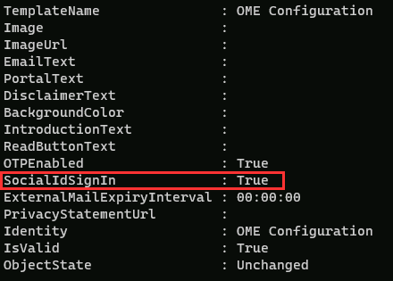

---
lab:
  title: 연습 3 - Microsoft Purview 메시지 암호화 관리
  module: Module 1 - Implement Information Protection
---

# 랩 1 - 연습 3 - Microsoft Purview 메시지 암호화 관리

Contoso Ltd. 내에서 보안 통신을 보장하려면 Microsoft Purview 메시지 암호화를 구성하고 테스트해야 합니다. 여기에는 기본 템플릿을 수정하고 재무 부서를 위한 새 브랜딩 템플릿을 만드는 것이 포함됩니다.

**작업**:

1. Azure RMS 기능 확인
1. 기본 브랜딩 템플릿 수정
1. 기본 브랜딩 템플릿 테스트
1. 사용자 지정 브랜딩 템플릿 만들기
1. 사용자 지정 브랜딩 템플릿 테스트

## 작업 1 - Azure RMS 기능 확인

이 작업에서는 테넌트의 올바른 Azure RMS 기능을 확인합니다.

1. 여전히 클라이언트 1 VM(SC-400-CL1)에 **SC-400-CL1\admin** 계정으로 로그인되어 있는 상태여야 합니다.

1. 작업 표시줄에서 Windows 단추를 마우스 오른쪽 단추로 클릭하여 관리자 권한 PowerShell 창을 연 다음 **터미널(관리자)** 을 선택합니다.

1. **사용자 계정 컨트롤** 창에서 **예**를 선택하여 실행을 확인합니다.

1. 터미널 창에서 **Install-Module** cmdlet을 실행하여 최신 Exchange Online PowerShell 모듈 버전을 설치합니다:

    ```powershell
    Install-Module ExchangeOnlineManagement
    ```

1. NuGet 공급자 보안 대화 상자에서 Yes에 해당하는 **Y** 키를 눌러 확인하고 **Enter** 키를 누릅니다. 이 프로세스를 완료하는 데 약간의 시간이 걸릴 수 있습니다.

1. 신뢰할 수 없는 리포지토리 보안 대화 상자가 표시되면 Yes에 해당하는 **Y** 키를 누르고 **Enter** 키를 누릅니다.  이 프로세스를 완료하는 데 약간의 시간이 걸릴 수 있습니다.

1. 실행 정책을 변경하려면 **Set-ExecutionPolicy** cmdlet을 실행하고 **Enter** 키를 누릅니다.

    ```powershell
    Set-ExecutionPolicy -ExecutionPolicy RemoteSigned -Scope CurrentUser
    ```

1. PowerShell 창을 닫습니다.

1. 작업 표시줄에서 윈도우 단추를 마우스 오른쪽 단추로 클릭한 다음 **터미널**을 선택하여 권한 상승 없이 일반 PowerShell 창을 엽니다.

1. **Connect-ExchangeOnline** cmdlet을 실행하여 Exchange Online PowerShell 모듈을 사용하고 테넌트에 연결합니다:

    ```powershell
    Connect-ExchangeOnline
    ```

1. **로그인** 창이 표시되면 `JoniS@WWLxZZZZZZ.onmicrosoft.com`으로 로그인합니다(여기서 ZZZZZZ는 랩 호스팅 공급자가 제공한 고유 테넌트 ID임). 이전 랩에서 Joni의 암호를 다시 설정한 암호를 사용하게 됩니다.

1. **Get-IRMConfiguration** cmdlet을 실행하여 테넌트에서 Azure RMS 및 IRM이 활성화되어 있는지 확인합니다:

    ```powershell
    Get-IRMConfiguration | fl AzureRMSLicensingEnabled
    ```

   **AzureRMSLicensingEnabled** 결과는 **True**여야 합니다.

1. 사용자 **Megan Bowen**으로 Office 365 메시지 암호화에 사용되는 Azure RMS 템플릿을 테스트하려면 **Test-IRMConfiguration** cmdlet을 실행합니다:

    ```powershell
    Test-IRMConfiguration -Sender MeganB@contoso.com -Recipient MeganB@contoso.com
    ```

    

    모든 테스트에서 상태가 PASS로 표시되고 오류가 발생하지 않는지 확인합니다.

1. PowerShell 창은 열어 둡니다.

Exchange Online PowerShell 모듈을 설치하고 테넌트에 연결하여 Azure RMS의 기능이 올바르게 작동하는지를 확인했습니다.

## 작업 2 – 기본 브랜딩 템플릿 수정

조직에서 Google, Facebook 등의 외부 ID 공급자에 대한 신뢰를 제한하려는 경우 이 작업을 수행해야 합니다. 이러한 소셜 ID는 메시지 암호화로 보호되는 메시지에 액세스하기 위해 기본적으로 활성화되므로 조직의 모든 사용자에 대해 소셜 ID 사용을 비활성화해야 합니다.

1. 계속 클라이언트 1 VM(SC-400-CL1)에 **SC-400-CL1\admin** 계정으로 로그인되어 있어야 하며 Exchange Online이 연결된 상태에서 열려 있는 PowerShell 창이 있어야 합니다.

1. **Get-OMEConfiguration** cmdlet을 실행하여 기본 구성을 확인합니다.

    ```powershell
    Get-OMEConfiguration -Identity "OME Configuration" | fl
    ```

   설정을 검토하고 SocialIdSignIn이 **True**로 설정되어 있는지 확인합니다.

    

1. **Set-OMEConfiguration** cmdlet을 실행하여 OME로 보호되는 테넌트의 메시지에 액세스하는 데 소셜 ID 사용을 제한합니다:

    ```powershell
    Set-OMEConfiguration -Identity "OME Configuration" -SocialIdSignIn:$false
    ```

1. Yes에 해당하는 **Y**를 입력하여 기본 템플릿 사용자 지정에 대한 경고 메시지를 확인한 다음 **Enter** 키를 누릅니다.

1. **Get-OMEConfiguration** cmdlet을 실행하여 기본 구성을 다시 확인하고 유효성을 검사합니다.

    ```powershell
    Get-OMEConfiguration -Identity "OME Configuration" | fl
    ```

    

   결과에는 SocialIDSignIn이 **False**로 설정되어 있는 것으로 표시되어야 합니다. PowerShell 창과 클라이언트는 열어 둡니다.

Office 365 메시지 암호화에서 Google, Facebook 등의 외부 ID 공급자 사용을 비활성화했습니다.

## 작업 3 – 기본 브랜딩 템플릿 테스트

테넌트 사용자로부터 Office 365 메시지 암호화로 보호되는 메시지를 수신할 때 외부 수신자에 대한 소셜 ID 대화 상자가 표시되지 않는지 확인해야 하며, 암호화된 콘텐츠에 액세스할 때 언제든지 OTP를 사용해야 합니다.

1. 계속 클라이언트 1 VM(SC-400-CL1)에 **SC-400-CL1\admin**으로 로그인되어 있는 상태여야 합니다.

1. 작업 표시줄에서 Microsoft Edge를 마우스 오른쪽 버튼으로 클릭하고 **새 InPrivate 창**을 선택하여 InPrivate 창에서 **Microsoft Edge**를 엽니다.

1. **`https://outlook.office.com`** 으로 이동한 다음 웹에서 Outlook에 `LynneR@WWLxZZZZZZ.onmicrosoft.com`으로 로그인합니다(여기서 ZZZZZZ는 랩 호스팅 공급자가 제공하는 고유 테넌트 ID임). Lynne의 암호는 이전 연습에서 설정되었습니다.

1. **로그인 상태를 유지하시겠습니까?** 대화 상자에서 **이 메시지를 다시 표시 안 함** 체크박스를 선택하고 **아니요**를 선택합니다.

1. 웹용 Outlook에서 **새 메일**을 선택합니다.

1. **받는 사람** 줄에 테넌트 도메인에 속해 있지 않은 기타 타사 이메일 주소나 개인 이메일 주소를 입력합니다. 제목 줄에 **`Secret Message`** 를 입력하고 이메일의 본문에 **`My super-secret message.`** 를 입력합니다.

1. 위쪽 창에서 **옵션**을 선택한 다음 **암호화**를 선택하여 메시지를 암호화합니다. 메시지를 암호화하고 나면 “암호화: 이 메시지는 암호화되었습니다. 수신자는 암호화를 제거할 수 없습니다."

      

1. **보내기**를 선택하여 메시지를 보냅니다. Outlook 창을 열어 둡니다.

1. 새 창에서 개인 이메일 계정에 로그인하여 Lynne Robbins의 메시지를 엽니다. Microsoft 계정(예: @outlook.com)으로 해당 이메일을 보냈다면 암호화가 자동으로 처리되므로 메시지를 자동으로 확인할 수 있습니다. 다른 이메일 서비스(예: @gmail.com)로 해당 이메일을 보냈다면 다음 단계를 수행하여 암호화를 처리해야 메시지를 읽을 수 있습니다.

    >**참고:** Lynne Robbins의 메시지가 정크 또는 스팸 폴더에 있는지 확인해야 할 수도 있습니다.

1. **메시지 읽기**를 선택합니다.

1. 소셜 ID가 활성화되어 있지 않으므로 Microsoft 계정이 아닌 계정을 사용한 인증 버튼은 표시되지 않습니다.

1. **일회용 암호로 로그인**을 선택하여 일정 시간 동안만 사용할 수 있는 암호를 받습니다.

1. 개인 이메일 포털로 이동하여 제목이 **메시지를 보기 위한 일회용 암호**인 메시지를 엽니다.

1. 암호를 복사하여 OME 포털에 붙여넣은 후에 **계속**을 선택합니다.

1. 암호화된 메시지를 검토합니다.

비활성화된 소셜 ID를 사용하여 수정된 기본 OME 템플릿을 테스트했습니다.

## 작업 4 - 사용자 지정 브랜딩 템플릿 만들기

조직 경리부에서 보내는 보호된 메시지에는 특수 브랜딩을 사용해야 합니다. 이러한 브랜딩에는 사용자 지정된 소개 및 본문 텍스트, 그리고 바닥글의 고지 사항 링크가 포함됩니다. 또한 경리부에서 보내는 메시지는 7일 후에 만료되어야 합니다. 이 작업에서는 새 사용자 지정 OME 구성, 그리고 경리부에서 보내는 모든 메일에 해당 OME 구성을 적용하는 전송 규칙을 만듭니다.

1. 클라이언트 1 VM(SC-400-CL1)에 **SC-400-CL1\admin** 계정으로 로그인되어 있는 상태여야 하며 Exchange Online에 연결된 PowerShell 창이 계속 열려 있어야 합니다.

1. **New-OMEConfiguration** cmdlet을 실행하여 새 구성을 만듭니다.

    ```powershell
    New-OMEConfiguration -Identity "Finance Department" -ExternalMailExpiryInDays 7
    ```

1. 템플릿 사용자 지정 관련 경고 메시지가 표시되면 Yes에 해당하는 **Y** 키를 누르고 **Enter** 키를 누릅니다.

1. _IntroductionText_ 매개 변수를 사용하여 **Set-OMEConfiguration cmdlet**을 실행해 소개 텍스트를 변경합니다.

    ```powershell
    Set-OMEConfiguration -Identity "Finance Department" -IntroductionText " from Contoso Ltd. finance department has sent you a secure message."
    ```

1. 템플릿 사용자 지정 관련 경고 메시지가 표시되면 Yes에 해당하는 **Y** 키를 누르고 **Enter** 키를 누릅니다.

1. _EmailText_ 매개 변수를 사용하여 **Set-OMEConfiguration** cmdlet을 실행해 본문 이메일 텍스트를 변경합니다.

    ```powershell
    Set-OMEConfiguration -Identity "Finance Department" -EmailText "Encrypted message sent from Contoso Ltd. finance department. Handle the content responsibly."
    ```

1. 템플릿 사용자 지정 관련 경고 메시지가 표시되면 Yes에 해당하는 **Y** 키를 누르고 **Enter** 키를 누릅니다.

1. _PrivacyStatementURL_ 매개 변수를 사용하여 **Set-OMEConfiguration** cmdlet을 실행해 Contoso의 개인정보처리방침 사이트를 가리키도록 고지 사항 URL을 변경합니다.

    ```powershell
    Set-OMEConfiguration -Identity "Finance Department" -PrivacyStatementURL "https://contoso.com/privacystatement.html"
    ```

1. 템플릿 사용자 지정 관련 경고 메시지가 표시되면 Yes에 해당하는 **Y** 키를 누르고 **Enter** 키를 누릅니다.

1. **TransportRule** cmdlet을 사용하여 이메일 흐름 규칙을 만듭니다. 이 규칙은 재무 팀에서 보내는 모든 메시지에 사용자 지정 OME 템플릿을 적용합니다. 이 프로세스가 완료될 때까지 몇 초 정도 걸릴 수 있습니다.

    ```powershell
    New-TransportRule -Name "Encrypt all mails from Finance team" -FromScope InOrganization -FromMemberOf "Finance Team" -ApplyRightsProtectionCustomizationTemplate "Finance Department" -ApplyRightsProtectionTemplate Encrypt
    ```

1. **Get-OMEConfiguration** cmdlet을 실행하여 변경 내용을 확인합니다.

    ```powershell
    Get-OMEConfiguration -Identity "Finance Department" | Format-List
    ```

1. 결과를 검토한 후 PowerShell 창을 닫습니다.

경리부 직원이 외부 받는 사람에게 메시지를 보내면 사용자 지정 브랜딩 템플릿을 자동 적용하는 새 전송 규칙을 만들었습니다.

## 작업 5 - 사용자 지정 브랜딩 템플릿 테스트

새 사용자 지정 구성의 유효성을 검사하기 위해 경리팀 직원인 Lynne Robbins의 계정을 다시 사용해야 합니다.

1. 웹 창에서 InPrivate Outlook을 통해 **Microsoft Edge**로 돌아갑니다. **Lynne Robbins**로 계속 로그인되어 있어야 합니다.

1. 웹용 Outlook의 왼쪽 위에서 **새 메일** 을 선택합니다.

1. **받는 사람** 줄에 테넌트 도메인에 속해 있지 않은 기타 타사 이메일 주소나 개인 이메일 주소를 입력합니다. 제목 줄에 **`Finance Report`** 를 입력하고 이메일 본문에 **`Secret finance information.`** 를 입력합니다.

1. **보내기**를 선택하여 메시지를 보낸 다음, Lynne으로 로그인한 InPrivate 창을 닫습니다.

1. 개인 이메일 계정에 로그인하여 Lynne Robbins의 메시지를 엽니다.

1. 아래 이미지와 같은 Lynne Robbins가 보낸 메시지가 표시됩니다.  **메시지 읽기**를 선택합니다.

    

1. 사용자 지정된 구성에서는 두 옵션을 모두 사용할 수 있으므로 소셜 ID가 활성화됩니다. **일회용 암호로 로그인**을 선택하여 일정 시간 동안만 사용할 수 있는 암호를 받습니다.

1. 개인 이메일 포털로 이동하여 제목이 **메시지를 보기 위한 일회용 암호**인 메시지를 엽니다.

1. 암호를 복사하여 포털에 붙여넣고 **계속**을 선택합니다.

1. 사용자 지정 브랜딩이 적용되어 있는 암호화된 메시지를 검토합니다. 이메일 계정이 열려 있는 창을 닫습니다.

새로운 사용자 지정 템플릿을 성공적으로 테스트했습니다.
