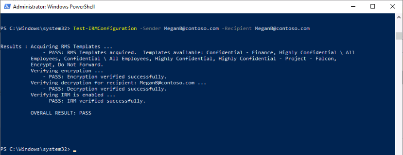
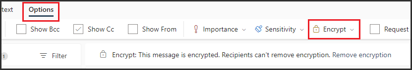

---
lab:
  title: 연습 4 - Microsoft Purview 메시지 암호화 관리
  module: Module 1 - Implement Information Protection
---

# 랩 1 - 연습 4 - Microsoft Purview 메시지 암호화 관리

조니 셔먼이 파일럿 팀과 함께 구성하고 테스트해야 하는 첫 번째 설정은 Microsoft Purview 메시지 암호화. 이를 위해 기본 템플릿을 수정하고 파일럿 사용자 중 한 명에게 할당되는 새 브랜딩 템플릿을 만듭니다. 그런 다음 파일럿 사용자는 자신의 계정으로 메시지 암호화 기능을 테스트합니다.

## 작업 1 – Azure RMS 기능 확인

이 작업에서는 Exchange Online PowerShell 모듈을 설치하고 마지막 연습에서 준수 관리istrator의 역할을 할당받은 Joni Sherman의 컨텍스트에서 테넌트의 올바른 Azure RMS 기능을 확인합니다.

1. 여전히 클라이언트 1 VM(LON-CL1)에 lon-cl1\admin** 계정으로 **로그인해야 합니다.

1. 관리자 권한 PowerShell 창을 엽니다. 이렇게 하려면 마우스 오른쪽 단추로 Windows 단추를 선택한 다음, **Windows PowerShell(관리자)** 을 선택합니다.

1. 예로 **사용자 계정 컨트롤** 창을 **확인합니다**.

1. 다음 cmdlet을 입력하여 최신 Exchange Online PowerShell 모듈 버전을 설치합니다.

    ```powershell
    Install-Module ExchangeOnlineManagement
    ```

1. Y** for Yes를 **사용하여 NuGet 공급자 보안 대화 상자를 확인하고 Enter 키를 누릅니**다**. 이 프로세스를 완료하는 데 다소 시간이 걸릴 수 있습니다.

1. Y** for Yes를 **사용하여 신뢰할 수 없는 리포지토리 보안 대화 상자를 확인하고 Enter 키를 누릅니**다**.  이 프로세스를 완료하는 데 다소 시간이 걸릴 수 있습니다.

1. 다음 cmdlet을 입력하여 실행 정책을 변경하고 Enter 키를 누릅니 **다.**

    ```powershell
    Set-ExecutionPolicy -ExecutionPolicy RemoteSigned -Scope CurrentUser
    ```

1. Y for Yes를 **사용하여 실행 정책 변경을 확인하고 Enter 키를 누릅니**다**.**

1. PowerShell 창을 닫습니다.

1. 권한 상승 없이 일반 PowerShell 창을 엽니다. 이렇게 하려면 마우스 오른쪽 단추로 Windows 단추를 선택한 다음, **Windows PowerShell**을 선택합니다.

1. Exchange Online PowerShell 모듈을 사용하고 테넌트에 연결하려면 다음 cmdlet을 입력합니다.

    ```powershell
    Connect-ExchangeOnline
    ```

1. **로그인** 창이 표시되면 JoniS@WWLxZZZZZZ.onmicrosoft.com으로 로그인합니다(여기서 ZZZZZZ는 랩 호스팅 공급자가 제공한 고유 테넌트 ID임). Joni를 이전 랩에서 재설정한 암호를 사용합니다.

1. 다음 cmdlet을 사용하여 테넌트에서 Azure RMS 및 IRM이 활성화되었는지 확인하고 Enter** 키를 누릅니**다.

    ```powershell
    Get-IRMConfiguration | fl AzureRMSLicensingEnabled
    ```

1. **AzureRMSLicensingEnabled** 결과가 **True**이면 테넌트에 대해 Azure RMS가 활성화됩니다. 다음 단계를 계속합니다. 

1. 다음 cmdlet을 사용하여 다른 파일럿 사용자 **Megan Bowen**에 대해 Office 365 메시지 암호화에 사용되는 Azure RMS 템플릿을 테스트하고 Enter** 키를 누릅니**다.

    ```powershell
    Test-IRMConfiguration -Sender MeganB@contoso.com -Recipient MeganB@contoso.com
    ```

    

1. 모든 테스트가 상태 PASS에 있으며 오류가 표시되지 않는지 확인합니다.

1. PowerShell 창을 열어 둡니다.

Exchange Online PowerShell 모듈을 설치하고 테넌트에 연결했으며 Azure RMS의 올바른 기능을 확인했습니다.

## 작업 2 – 기본 브랜딩 템플릿 수정

조직에는 Google 또는 Facebook과 같은 외국 ID 공급자에 대한 신뢰를 제한해야 하는 요구 사항이 있습니다. 이러한 소셜 ID는 메시지 암호화로 보호되는 메시지에 액세스하기 위해 기본적으로 활성화되므로 조직의 모든 사용자에 대한 소셜 ID 사용을 비활성화해야 합니다.

1. 여전히 클라이언트 1 VM(LON-CL1)에 lon-cl1\admin** 계정으로 **로그인해야 하며 Exchange Online이 연결된 열린 PowerShell 창이 계속 있어야 합니다.

1. 다음 cmdlet을 실행하여 기본 구성을 확인합니다.

    ```powershell
    Get-OMEConfiguration -Identity "OME Configuration" | fl
    ```

1. 설정을 검토하고 SocialIdSignIn 매개 변수가 True로 설정되어 있는지 확인합니다.

1. 다음 cmdlet을 실행하여 OME로 보호되는 테넌트에서 메시지에 액세스하기 위해 소셜 ID의 사용을 제한합니다.

    ```powershell
    Set-OMEConfiguration -Identity "OME Configuration" -SocialIdSignIn:$false
    ```

1. Y** for Yes를 사용하여 기본 템플릿**을 사용자 지정하기 위한 경고 메시지를 확인하고 Enter 키를 누릅니**다**.

1. 기본 구성을 다시 확인하고 유효성을 검사합니다. SocialIdSignIn 매개 변수는 이제 False로 설정됩니다.

    ```powershell
    Get-OMEConfiguration -Identity "OME Configuration" | fl
    ```

1. 결과에 SocialIDSignIn이 False로 설정되어 있음을 보여 줍니다. PowerShell 창과 클라이언트를 열어 둡니다.

Office 365 메시지 암호화에서 Google 및 Facebook과 같은 외국 ID 공급자의 사용을 성공적으로 비활성화했습니다.

## 작업 3 – 기본 브랜딩 템플릿 테스트

테넌트 사용자로부터 Office 365 메시지 암호화로 보호되는 메시지를 수신할 때 외부 수신자에 대한 소셜 ID 대화 상자가 표시되지 않는지 확인해야 하며, 암호화된 콘텐츠에 액세스할 때 언제든지 OTP를 사용해야 합니다.

1. 클라이언트 1 VM(LON-CL1)을 그대로 열어 두고 클라이언트 2 VM(LON-CL2)에 lon-cl2\admin** 계정으로 **로그인합니다.

1. 사용 가능한 모든 Windows 업데이트가 설치되어 있고 클라이언트가 업데이트 설치를 완료하기 위해 다시 시작할 필요가 없는지 확인합니다.

1. 작업 표시줄에서 **Microsoft Edge**를 열고 **Microsoft Edge 시작** 창이 표시되면 **데이터 없이 시작**을 선택하고 **이 데이터 없이 계속**을 선택하고 **검색 확인 및 시작**을 선택합니다.

1. 환영 메시지가 없으면 `https://microsoft.com/edge`로 이동하여 **Windows용 다운로드** 및 **Windows 10**을 선택합니다. **동의 및 다운로드** 및 **실행**을 선택하여 최신 버전의 Edge 브라우저를 설치합니다. 이 작업이 완료되면 이전 단계를 수행합니다.

1. **Microsoft Edge**에서 **`https://outlook.office.com`** 으로 이동한 다음 웹에서 Outlook에 LynneR@WWLxZZZZZZ.onmicrosoft.com으로 로그인합니다(여기서 ZZZZZZ는 랩 호스팅 공급자가 제공하는 고유 테넌트 ID임). 린 로빈의 암호는 랩 호스팅 공급자가 제공해야 합니다. 힌트: 일반적으로 랩 테넌트의 MOD 관리자 암호와 동일합니다.

1. 로그인 상태 **유지 대화 상자**에서** 다시** 표시 안 함 검사 상자를 선택한 다음[ 아니요 **]를 선택합니다**.

1. 암호** 저장 대화 상자에서 저장**을 **선택하여 **파일럿 사용자 암호를 브라우저에 저장합니다.

1. **[번역] 페이지**가 ...창에 표시되면 아래쪽 화살표를 선택하고 [변환 안 하려면...**]을 선택합니다**.

1. 웹용 Outlook의 왼쪽 위에서 **새 메일** 을 선택합니다.

1. To** 줄에 **테넌트에 없는 개인 또는 기타 타사 전자 메일 주소를 입력합니다기본. 제목 줄에는 **비밀 메시지**를, 본문에는 **초특급 비밀 메시지입니다.** 를 입력합니다.

1. 위쪽 창에서 **옵션**을 선택한 다음 **암호화**를 선택하여 메시지를 암호화합니다. 메시지를 암호화하고 나면 “암호화: 이 메시지는 암호화되었습니다. 받는 사람은 암호화를 제거할 수 없습니다."

      

1. 보내기**를 선택하여 **메시지를 보냅니다.

1. 개인 전자 메일 계정에 로그인하고 린 로빈스의 메시지를 엽니다. Microsoft 계정(예: @outlook.com)으로 해당 전자 메일을 보냈다면 암호화가 자동으로 처리되므로 메시지를 자동으로 확인할 수 있습니다. 반면 다른 전자 메일 서비스(예: @gmail.com)으로 해당 전자 메일을 보냈다면 다음 단계를 수행하여 암호를 처리해야 메시지를 읽을 수 있습니다.

    >**참고:** Lynne Robbins의 메시지가 정크 또는 스팸 폴더에 있는지 확인해야 할 수도 있습니다.

1. 메시지** 읽기를 선택합니다**.

1. 소셜 ID를 활성화하지 않으면 Google 계정으로 인증하는 단추가 없습니다.

1. 제한된 시간 암호를 받으려면 일회성 암호**로 로그인을 선택합니다**.

1. 개인 전자 메일 포털로 이동하여 메시지를 볼 수 있는 일회성 암호 제목 **으로 메시지를** 엽니다.

1. 암호를 복사하여 OME 포털에 붙여넣고 계속**을 선택합니다**.

1. 암호화된 메시지를 검토합니다.

1. 클라이언트 1 VM(LON-CL1)을 그대로 열어 둡니다.

비활성화된 소셜 ID를 사용하여 수정된 기본 OME 템플릿을 성공적으로 테스트했습니다.

## 작업 4 – 사용자 지정 브랜딩 템플릿 만들기

조직 재무 부서에서 보낸 보호된 메시지에는 사용자 지정된 소개 및 본문 텍스트와 바닥글의 고지 사항 링크를 비롯한 특별한 브랜딩이 필요합니다. 금융 메시지도 7일 후에 만료됩니다. 이 작업에서는 새 사용자 지정 OME 구성을 만들고 재무 부서에서 보낸 모든 메일에 OME 구성을 적용하는 전송 규칙을 만듭니다.

1. lon-cl1\admin** 계정으로 **클라이언트 1 VM(LON-CL1)에 로그인하고 Exchange Online이 연결된 열린 PowerShell 창이 계속 있어야 합니다.

1. 다음 cmdlet을 실행하여 새 구성을 만듭니다.

    ```powershell
    New-OMEConfiguration -Identity "Finance Department" -ExternalMailExpiryInDays 7
    ```

1. Y** for Yes를 사용하여 템플릿**을 사용자 지정하기 위한 경고 메시지를 확인하고 Enter 키를 누릅니**다**.

1. 다음 cmdlet을 사용하여 소개 문자 메시지를 변경합니다.

    ```powershell
    Set-OMEConfiguration -Identity "Finance Department" -IntroductionText " from Contoso Ltd. finance department has sent you a secure message."
    ```

1. Y** for Yes를 사용하여 템플릿**을 사용자 지정하기 위한 경고 메시지를 확인하고 Enter 키를 누릅니**다**.

1. 다음 cmdlet을 사용하여 메시지의 본문 전자 메일 텍스트를 변경합니다.

    ```powershell
    Set-OMEConfiguration -Identity "Finance Department" -EmailText "Encrypted message sent from Contoso Ltd. finance department. Handle the content responsibly."
    ```

1. Y** for Yes를 사용하여 템플릿**을 사용자 지정하기 위한 경고 메시지를 확인하고 Enter 키를 누릅니**다**.

1. Contoso의 개인정보처리방침 사이트를 가리키도록 고지 사항 URL을 변경합니다.

    ```powershell
    Set-OMEConfiguration -Identity "Finance Department" -PrivacyStatementURL "https://contoso.com/privacystatement.html"
    ```

1. Y** for Yes를 사용하여 템플릿**을 사용자 지정하기 위한 경고 메시지를 확인하고 Enter 키를 누릅니**다**.

1. 다음 cmdlet을 사용하여 재무 팀에서 보낸 모든 메시지에 사용자 지정 OME 템플릿을 적용하는 메일 흐름 규칙을 만듭니다.  이 프로세스가 완료될 때까지 몇 초 정도 걸릴 수 있습니다.

    ```powershell
    New-TransportRule -Name "Encrypt all mails from Finance team" -FromScope InOrganization -FromMemberOf "Finance Team" -ApplyRightsProtectionCustomizationTemplate "Finance Department" -ApplyRightsProtectionTemplate Encrypt
    ```

1. 다음 cmdlet을 입력하여 변경 내용을 확인합니다.

    ```powershell
    Get-OMEConfiguration -Identity "Finance Department" | Format-List
    ```

1. PowerShell을 열어 둡니다.

재무 부서의 구성원이 외부 받는 사람에게 메시지를 보낼 때 사용자 지정 브랜딩 템플릿을 자동으로 적용하는 새 전송 규칙을 성공적으로 만들었습니다.

## 작업 5 – 사용자 지정 브랜딩 템플릿 테스트

새 사용자 지정 구성의 유효성을 검사하려면 재무 팀의 구성원인 린 로빈스의 계정을 다시 사용해야 합니다.

1. 클라이언트 2 VM(LON-CL2)에 lon-cl2\admin** 계정으로 **로그인합니다.

1. 작업 표시줄에서 **Microsoft Edge**를 선택합니다. 웹용 Outlook 탭은 여전히 열려 있어야 하며 **Lynne Robbins**로 로그인해야 합니다.

1. 웹용 Outlook 왼쪽 위에서 새 메시지를** 선택합니다**.

1. To** 줄에 **테넌트에 없는 개인 또는 기타 타사 전자 메일 주소를 입력합니다기본. 제목 줄에 재무 보고서를** 입력**하고 비밀 재무 정보를 입력**합니다.** 입력합니다.

1. 보내기**를 선택하여 **메시지를 보냅니다.

1. 개인 전자 메일 계정에 로그인하고 린 로빈스의 메시지를 엽니다.

1. 아래 이미지처럼 보이는 린 로빈스의 메시지가 표시됩니다.  메시지** 읽기를 선택합니다**.

    

1. 두 옵션을 모두 사용할 수 있으므로 사용자 지정된 구성에 소셜 ID가 활성화되어 있습니다. 제한된 시간 암호를 받으려면 일회성 암호**로 로그인을 선택합니다**.

1. 개인 전자 메일 포털로 이동하여 메시지를 볼 수 있는 일회성 암호 제목 **으로 메시지를** 엽니다.

1. 암호를 복사하여 포털에 붙여넣고 계속**을 선택합니다**.

1. 사용자 지정 브랜딩을 사용하여 암호화된 메시지를 검토합니다.

사용자 지정된 새 템플릿을 성공적으로 테스트했습니다.
