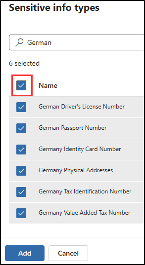

---
lab:
  title: '연습 4: 민감도 레이블 관리'
  module: Module 1 - Implement Information Protection
---

# 랩 1 - 연습 4 - 민감도 레이블 관리

Contoso Ltd.의 시스템 관리자인 Joni Sherman은 HR 부서의 모든 직원 문서가 회사의 정보 보호 정책에 따라 적절하게 레이블이 지정되도록 민감도 레이블 지정 계획을 구현하고 있습니다. Contoso Ltd.는 독일 레니츠헴바흐에 본사를 두고 있으며 내부 데이터 처리 표준 및 지역 규정을 준수하는 것을 목표로 합니다.

**작업**:

1. 민감도 레이블 지원 사용
1. 민감도 레이블 만들기
1. 민감도 레이블 게시
1. 민감도 레이블 적용
1. 자동 레이블 지정 구성

## 작업 1 – 민감도 레이블을 지원하도록 설정

이 작업에서는 필요한 모듈을 설치하고 테넌트에서 민감도 레이블에 대한 지원을 사용하도록 설정합니다.

1. 여전히 클라이언트 1 VM(SC-400-CL1)에 **SC-400-CL1\admin** 계정으로 로그인되어 있는 상태여야 합니다.

1. 작업 표시줄에서 Windows 단추를 마우스 오른쪽 단추로 클릭하여 관리자 권한 PowerShell 창을 연 다음 **터미널(관리자)** 을 선택합니다.

1. **사용자 계정 컨트롤** 창에서 **예**를 선택하고 Enter 키를 눌러 실행을 확인합니다.

1. **설치-모듈** cmdlet을 실행하여 최신 MS Online PowerShell 모듈 버전을 설치합니다.

    ```powershell
    Install-Module -Name MSOnline
    ```

1. Nuget 보안 대화 상자와 신뢰할 수 없는 리포지토리 보안 대화 상자에서 예를 나타내는 **Y**를 확인하고 Enter 키를 누릅니다. 처리를 완료하는 데 시간이 걸릴 수 있습니다.

1. **설치-모듈** cmdlet을 실행하여 최신 SharePoint Online PowerShell 모듈 버전을 설치합니다.

    ```powershell
    Install-Module -Name Microsoft.Online.SharePoint.PowerShell
    ```

1. 신뢰할 수 없는 리포지토리 보안 대화 상자가 표시되면 Yes에 해당하는 **Y** 키를 누르고 Enter 키를 누릅니다.

1. **Connect-MsolService**를 실행하여 MS Online 서비스에 연결합니다.

    ```powershell
    Connect-MsolService
    ```

1. **계정에 로그인** 양식에서 **Joni Sherman**(`JoniS@WWLxZZZZZZ.onmicrosoft.com`)으로 로그인합니다(여기서 ZZZZZZ는 랩 호스팅 공급자가 제공한 고유 테넌트 ID임). Joni의 암호는 이전 연습에서 설정되었습니다.

1. 로그인한 후 터미널 창으로 다시 이동합니다.

1. **Get-Msoldomain** cmdlet을 실행하고 도메인을 변수로 저장합니다.

    ```powershell
    $domain = get-msoldomain
    ```

1. 이전 단계에서 만든 _$domain_ 변수를 사용하여 _$adminurl_에 대한 새 변수를 만듭니다.

    ```powershell
    $adminurl = "https://" + $domain.Name.split('.')[0] + "-admin.sharepoint.com"
    ```

1. 이전 단계에서 만든 _$adminurl_ 변수를 사용하여 **Connect-SPOService** cmdlet을 실행합니다.

    ```powershell
    Connect-SPOService -url $adminurl
    ```

1. **계정에 로그인** 양식에서 **MOD 관리자**로 로그인합니다. `admin@WWLxZZZZZZ.onmicrosoft.com`(여기서 ZZZZZZ는 랩 호스팅 공급자가 제공한 고유 테넌트 ID입니다). 관리자의 암호는 랩 호스팅 공급자가 제공합니다.

1. 로그인한 후 터미널 창으로 다시 이동합니다.

1. **Set-SPOTenant** cmdlet을 실행하여 민감도 레이블이 지원되도록 설정합니다.

    ```powershell
    Set-SPOTenant -EnableAIPIntegration $true
    ```

1. Yes에 해당하는 **Y** 키를 눌러 변경 내용 적용을 확인하고 Enter 키를 누릅니다.

1. PowerShell 창을 닫습니다.

Teams 및 SharePoint 사이트에 대해 민감도 레이블이 지원되도록 설정했습니다.

## 작업 2 - 민감도 레이블 만들기

이 작업에서는 HR 부서가 HR 직원 문서에 적용하기 위해 요청한 민감도 레이블을 만듭니다. 내부 문서용 민감도 레이블과 HR 부서용 하위 레이블을 만듭니다.

1. 여전히 클라이언트 1 VM(SC-400-CL1)에 **SC-400-CL1\admin** 계정으로 로그인되어 있는 상태여야 합니다.

1. **Microsoft Edge**를 열고 **`https://purview.microsoft.com`** 으로 이동합니다. Microsoft Purview에 **Joni Sherman**`JoniS@WWLxZZZZZZ.onmicrosoft.com`으로 로그인합니다. 여기서 ZZZZZZ는 랩 호스팅 공급자가 제공한 고유 테넌트 ID입니다. Joni의 암호는 이전 연습에서 설정되었습니다.

1. Microsoft Purview 포털의 왼쪽 사이드바에서 **솔루션**을 선택한 다음, **정보 보호**를 선택합니다.

1. **Microsoft 정보 보호** 페이지의 왼쪽 사이드바에서 **민감도 레이블**을 선택합니다.

1. **민감도 레이블** 페이지에서 **+ 레이블 만들기**를 선택합니다.

1. **새 민감도 레이블** 구성이 시작됩니다. **이 레이블에 대한 기본 세부 정보 제공**에서 다음을 입력합니다.

    - **이름**: `Internal`
    - **표시 이름**: `Internal`
    - **사용자에 대한 설명**: `Internal sensitivity label.`
    - **관리자**에 대한 설명: `Internal sensitivity label for Contoso.`

1. **다음**을 선택합니다.

1. **이 레이블의 범위 정의** 페이지에서 **항목**을 선택한 다음 **파일** 및 **이메일**을 선택합니다. **모임** 체크박스가 선택되어 있으면 선택이 해제되었는지 확인합니다.

1. **다음**을 선택합니다.

1. **레이블이 지정된 항목에 대한 보호 설정 선택** 페이지에서 **다음**을 선택합니다.

1. **파일 및 이메일의 자동 레이블 지정** 페이지에서 **다음**을 선택합니다.

1. **그룹 및 사이트의 보호 설정 정의** 페이지에서 **다음**을 선택합니다.

1. **스키마화된 데이터 자산에 자동 레이블 지정(미리 보기)** 페이지에서 **다음**을 선택합니다.

1. **설정 검토 후 완료** 페이지에서 **레이블 만들기**를 선택합니다.

1. **민감도 레이블을 만든** 페이지에서 **아직 정책을 만들지 않음**을 선택한 다음 **완료**를 선택합니다.

1. **민감도 레이블** 페이지에서 새로 만든 **내부** 민감도 레이블을 찾습니다. 옆에 있는 세로 줄임표(**...**)를 선택한 다음 드롭다운 메뉴에서 **+ 하위 레이블 만들기**를 선택합니다.

    

1. **새 민감도 레이블** 마법사가 시작됩니다. **이 레이블에 대한 기본 정보 입력** 페이지에서 다음을 입력합니다.

   - **이름**: `Employee data (HR)`
   - **표시 이름**: `Employee data (HR)`
   - **사용자에 대한 설명**: `This HR label is the default label for all specified documents in the HR Department.`
   - **관리자**에 대한 설명: `This label is created in consultation with Ms. Jones (Head of HR department). Contact her, when you want to change settings of the label.`

1. **다음**을 선택합니다.

1. **이 레이블의 범위 정의** 페이지에서 **항목**을 선택한 다음 **파일** 및 **이메일**을 선택합니다. **모임** 체크박스가 선택되어 있으면 선택이 해제되었는지 확인합니다.

1. **다음**을 선택합니다.

1. **레이블이 지정된 항목에 대한 보호 설정 선택** 페이지에서 **액세스 제어** 옵션을 선택한 다음 **다음**을 선택합니다.

1. **액세스 제어** 페이지에서 **액세스 제어 설정 구성**을 선택합니다.

1. 다음 옵션을 사용하여 암호화 설정을 구성합니다.

   - **지금 권한을 할당하시겠습니까 아니면 사용자가 결정하도록 하시겠습니까?**: 지금 권한 할당
   - **콘텐츠에 대한 사용자 액세스 만료**: 안함
   - **오프라인 액세스 허용**: 특정 기간(일 수) 동안만
   - **사용자가 이 기간 동안 콘텐츠에 오프라인으로 액세스할 수 있습니다.**: 15
   - **권한 할당** 링크를 선택합니다. **권한 할당** 플라이아웃 패널에서 **+ 인증된 사용자 모두 추가**를 선택한 다음 **저장**을 선택하여 이 설정을 적용합니다.

1. **액세스 제어** 페이지에서 **다음**을 선택합니다.

1. **파일 및 이메일의 자동 레이블 지정** 페이지에서 **다음**을 선택합니다.

1. **그룹 및 사이트의 보호 설정 정의** 페이지에서 **다음**을 선택합니다.

1. **스키마화된 데이터 자산에 자동 레이블 지정(미리 보기)** 페이지에서 **다음**을 선택합니다.

1. **설정 검토 후 완료** 페이지에서 **레이블 만들기**를 선택합니다.

1. **민감도 레이블을 만든** 페이지에서 **아직 정책을 만들지 않음**을 선택한 다음 **완료**를 선택합니다.

조직 내부 정책용 민감도 레이블과 HR(인적 자원) 부서용 민감도 하위 레이블을 만들었습니다.

## 작업 3 - 민감도 레이블 게시

이제 내부 및 HR 민감도 레이블을 게시합니다. 그러면 HR 사용자가 게시된 민감도 레이블을 HR 문서에 적용할 수 있습니다.

1. 여전히 클라이언트 1 VM(SC-LON-CL1)에는 **SC-400-cl1\admin** 계정으로, Microsoft Purview에는 **Joni Sherman**으로 로그인되어 있는 상태여야 합니다.

1. **Microsoft Edge**에는 Microsoft Purview 포털 탭이 계속 열려 있어야 합니다. 그렇지 않은 경우 **`https://purview.microsoft.com`** > **Solutions** > **Information Protection** > **민감도 레이블**로 이동합니다.

1. **민감도 레이블** 페이지에서 **레이블 게시**를 선택합니다.

1. 민감도 레이블 게시 구성이 시작됩니다.

1. **게시할 민감도 레이블 선택** 페이지에서 **게시할 민감도 레이블 선택** 링크를 선택합니다.

1. **게시할 민감도 레이블** 플라이아웃 패널에서 **내부** 및 **내부/직원 데이터(HR)** 체크박스를 선택한 다음 플라이아웃 패널 하단에서 **추가**를 선택합니다.

1. **게시할 민감도 레이블 선택** 페이지로 돌아가서 **다음**을 선택합니다.

1. **관리 단위 할당** 페이지에서 **다음**을 선택합니다.

1. **사용자 및 그룹에 게시** 페이지에서 **다음**을 선택합니다.

1. **정책 설정** 페이지에서 **다음**을 선택합니다.

1. **문서의 기본 설정**에서 **다음**을 선택합니다.

1. **메일의 기본 설정**에서 **다음**을 선택합니다.

1. **모임 및 달력 일정에 대한 기본 설정**에서 **다음**을 선택합니다.

1. **Power BI 콘텐츠의 기본 설정**에서 **다음**을 선택합니다.

1. **정책 이름 지정 **페이지에서 다음을 입력합니다.

   - **이름**: `Internal HR employee data`
   - **민감도 레이블 정책에 대한 설명을 입력합니다**: `This HR label is to be applied to internal HR employee data.`

1. **다음**을 선택합니다.

1. **검토 후 완료** 페이지에서 **제출**을 선택합니다.

1. **새 정책이 생성됨**에서 **완료**를 선택하여 레이블 정책 게시를 완료합니다.

내부 및 HR 민감도 레이블을 게시했습니다. 변경 내용이 모든 사용자와 서비스에 복제되려면 최대 24시간이 걸릴 수 있습니다.

## 작업 4 - 민감도 레이블 적용

이 작업에서는 Word 및 Outlook 전자 메일에서 민감도 레이블을 만듭니다. 여기서 만든 문서는 OneDrive에 저장되며 전자 메일을 통해 HR 직원에게 전송됩니다.

1. 여전히 클라이언트 1 VM(SC-400-CL1)에 **SC-400-cl1\admin** 계정으로 로그인해야 하며, Microsoft 365에 **Joni Sherman**`JoniS@WWLxZZZZZZ.onmicrosoft.com`(여기서 ZZZZZZ는 랩 호스팅 제공업체에서 제공한 고유 테넌트 ID)로 로그인해야 합니다. Joni의 암호는 이전 연습에서 설정되었습니다.

1. **Microsoft Edge**에서 왼쪽 상단의 미트볼 메뉴를 선택하고 **Word**를 선택해 새 Word 문서를 엽니다.

    

1. 새 문서를 만들려면 **빈 문서**를 선택합니다.

1. **개인정보 옵션** 대화 상자에서 **닫기**를 선택합니다.

1. 새 빈 문서에 다음 텍스트를 입력합니다.

   `Important HR employee document.`

1. 탐색 리본에서 **민감도**를 선택하고 **내부** > **직원 데이터(HR)** 를 선택하여 이 문서에 새로 만든 민감도 레이블을 적용합니다.

    

    >**참고:** 새로 게시된 민감도 레이블을 애플리케이션에 사용할 수 있는 데 24-48시간이 걸릴 수 있습니다. 새로 만든 민감도 레이블을 사용할 수 없는 경우 이 연습에 **기밀** > **모든 직원**을 사용할 수 있습니다.

1. 문서의 왼쪽 상단에서 **문서**를 선택하여 이 파일의 이름을 **`HR Document`** 로 변경합니다. Enter 키를 눌러 이 이름 변경을 적용합니다.

    

1. 탭을 닫아 Word Online 탭으로 돌아갑니다. 왼쪽 상단의 미트볼 메뉴를 선택하고 **Outlook**을 선택하여 웹에서 Outlook을 엽니다.

1. 웹용 Outlook에서 **새 메일**을 선택합니다.

1. **받는 사람** 필드에 이름 **`Allan`** 을 입력하고 드롭다운 목록에서 **Allan Deyoung**을 선택합니다.

1. 제목 줄에 다음을 입력합니다. **`Employee data for HR`** 

1. 이메일 본문에 다음을 입력합니다.

    ``` text
    Dear Mr. Deyoung, 

    Please find attached the important HR employee document. 

    Kind regards,

    Joni Sherman
    ```

1. 상단 탐색 리본에서 페이퍼클립 기호를 선택하여 첨부 파일을 추가합니다. **제안된 파일**에서 **HR 문서.docx**를 선택합니다.

1. **보내기**를 선택하여 문서가 첨부된 이메일 메시지를 보냅니다.

민감도 레이블이 적용된 HR Word 문서를 만들었습니다. 이 문서는 OneDrive에 저장되었습니다. 그런 다음 HR 부서 직원에게 문서를 전자 메일로 보냈습니다. 해당 전자 메일에도 민감도 레이블이 설정되었습니다.

## 작업 5 - 자동 레이블 지정 구성

이 작업에서는 유럽 GDPR(일반 데이터 보호 규정) 관련 정보가 포함되어 있는 것으로 확인된 문서와 전자 메일에 레이블을 자동으로 지정하는 민감도 레이블을 만듭니다.

1. 여전히 클라이언트 1 VM(SC-400-CL1)에 **SC-400-CL1\admin** 계정으로 로그인되어 있는 상태여야 합니다.

1. **Microsoft Edge**에서 **`https://purview.microsoft.com`** 으로 이동하고 Microsoft Purview 포털에 **Joni Sherman**으로 로그인합니다.

1. Microsoft Purview 포털의 왼쪽 사이드바에서 **솔루션**을 선택한 다음, **정보 보호**를 선택합니다. **민감도 레이블**을 선택합니다.

1. **민감도 레이블** 페이지에서 새로 만든 **내부** 민감도 레이블을 찾습니다. 옆에 있는 세로 줄임표(**...**)를 선택한 다음 드롭다운 메뉴에서 **+ 하위 레이블 만들기**를 선택합니다.

1. **새 민감도 레이블** 구성이 시작됩니다. **이 레이블에 대한 기본 정보 입력** 페이지에서 다음을 입력합니다.

   - **이름**: `GDPR Germany`
   - **표시 이름**: `GDPR Germany`
   - **사용자에 대한 설명**: `This document or email contains data related to the European General Data Protection Regulation (GPDR) for the region Germany.`
   - **관리자**에 대한 설명: `This label is auto applied to German GDPR documents.`

1. **다음**을 선택합니다.

1. **이 레이블의 범위 정의** 페이지에서 **항목**을 선택한 다음 **파일** 및 **이메일**을 선택합니다. **모임** 체크박스가 선택되어 있으면 선택이 해제되었는지 확인합니다.

1. **다음**을 선택합니다.

1. **레이블이 지정된 항목에 대한 보호 설정 선택** 페이지에서 **다음**을 선택합니다.

1. **파일 및 이메일에 자동 레이블 지정** 페이지에서 **파일 및 이메일의 자동 레이블 지정**을 사용하도록 설정합니다.

1. **해당 조건과 일치하는 콘텐츠 검색 섹션**에서 **+ 조건 추가** > 를 선택하고 다음이 **포함된 콘텐츠**를 선택합니다.

1. **다음이 포함된 콘텐츠** 섹션에서 **추가** >  텍스트를 선택하고 **중요한 정보** 유형을 선택합니다.

1. **중요한 정보 유형** 플라이아웃 패널에서 독일과 관련된 중요한 정보 유형을 표시하도록 `German`을(를) 검색합니다.

1. **이름** 필드 옆의 확인란을 선택하여 독일어와 관련된 모든 중요한 정보 유형을 선택한 다음 **추가**를 선택합니다.

    

1. **파일 및 이메일의 자동 레이블 지정** 페이지로 돌아가서 **다음**을 선택합니다.

1. **그룹 및 사이트의 보호 설정 정의** 페이지에서 **다음**을 선택합니다.

1. **스키마화된 데이터 자산에 자동 레이블 지정(미리 보기)** 페이지에서 **다음**을 선택합니다.

1. **설정 검토 후 완료** 페이지에서 **레이블 만들기**를 선택합니다.

1. **민감도 레이블을 만든** 페이지에서 **사용자의 앱에 레이블 게시**를 선택한 다음 **완료**를 선택합니다.

1. **자동 레이블 지정 정책 만들기** 플라이아웃 패널에서 **정책 검토**를 선택하고 구성을 시작하여 새 레이블 정책을 만듭니다.

1. **정책 이름 지정** 페이지에서 다음을 입력합니다.

   - **이름**: `GDPR Germany policy`
   - **민감도 레이블 정책에 대한 설명을 입력합니다**: `This auto apply sensitivity labels policy is for the GDPR region of Germany.`

1. **다음**을 선택합니다.

1. **관리 단위 할당** 페이지에서 **다음**을 선택합니다.

1. **레이블을 적용할 위치 선택** 페이지에서 기본값을 선택한 상태로 두고 **다음**을 선택합니다.

1. **일반 또는 고급 규칙 설정** 페이지에서 **다음**을 선택합니다.

1. **모든 위치의 콘텐츠에 대한 규칙 정의** 페이지에서 **다음**을 선택합니다.

1. **정책을 즉시 테스트할 것인지 나중에 테스트할 것인지 결정**에서 **시뮬레이션 모드에서 정책 실행**을 선택한 다음, **시뮬레이션에서 7일 동안 수정되지 않은 경우 자동으로 정책 켜기 ** 체크박스를 선택한 다음, **다음**을 선택합니다.

1. **검토 및 완료** 페이지에서 **정책 만들기**를 선택합니다.

1. **자동 레이블 지정 정책이 만들어짐** 페이지에서 **완료**를 선택합니다.

독일 지역 GDPR 문서용으로 자동 적용 민감도 레이블을 만들어 게시했습니다.

자동 적용된 민감도 레이블을 적용하는 데 최대 24시간이 걸릴 수 있습니다. 이 기간은 25,000개 이상의 문서(즉, 일일 제한)에 적용되는 경우 더 길어집니다.
