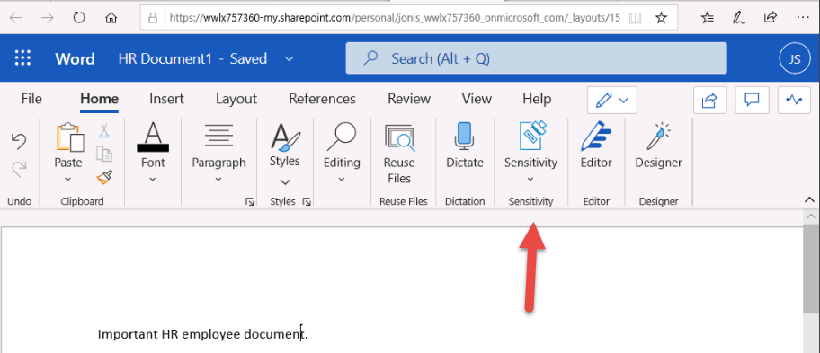

# 랩 1 - 연습 5 - 민감도 레이블 관리

이 랩에서는 Contoso Ltd.의 시스템 관리자인 Joni Sherman으로 작업을 수행하게 됩니다. 
Joni가 소속된 독일 레드니츠헴바치 소재 조직에서는 현재 민감도 관련 계획을 구현하는 중입니다. 구체적으로 설명하자면, 조직 정보 보호 정책의 일환으로 HR 부서의 모든 직원 문서에 민감도 레이블을 표시하는 계획이 진행되고 있습니다.

### 작업 1 - 민감도 레이블을 지원하도록 설정

이 작업에서는 MSOnline 모듈과 SharePoint Online PowerShell 모듈을 설치하고 테넌트에서 민감도 레이블을 지원하도록 설정합니다.

1. **lon-cl1\admin** 계정으로 클라이언트 1 VM(LON-CL1)에 로그인합니다.

2. 관리자 권한 PowerShell 창을 엽니다. 이렇게 하려면 마우스 오른쪽 단추로 시작 메뉴를 선택한 다음 **Windows PowerShell**을 선택하여 관리자로 PowerShell을 실행합니다.

3. **사용자 계정 제어** 창에서 **예**를 선택하고 Enter 키를 눌러 실행을 확인합니다.

4. 다음 cmdlet을 입력하여 최신 MS Online PowerShell 모듈 버전을 설치합니다.

   `Install-Module -Name MSOnline`

5. 신뢰할 수 없는 리포지토리 보안 대화 상자가 표시되면 Yes에 해당하는 **Y** 키를 누르고 Enter 키를 누릅니다.  이 프로세스가 완료될 때까지 몇 초 정도 걸릴 수 있습니다.

6. 다음 cmdlet을 입력하여 최신 SharePoint Online PowerShell 모듈 버전을 설치합니다.

    `Install-Module -Name Microsoft.Online.SharePoint.PowerShell`

7. 신뢰할 수 없는 리포지토리 보안 대화 상자가 표시되면 Yes에 해당하는 **Y** 키를 누르고 Enter 키를 누릅니다.

8. 다음 cmdlet을 입력하여 MS Online 서비스에 연결합니다.

    `Connect-MsolService`

9. **계정에 로그인** 양식에서 **Joni Sherman**으로 로그인합니다. 로그인 ID로는 JoniS@WWLxZZZZZZ.onmicrosoft.com을 사용합니다(여기서 ZZZZZZ는 랩 호스팅 공급자가 제공한 고유 테넌트 ID임).  Joni의 암호는 랩 호스팅 공급자가 제공합니다.

10. 로그인 후 PowerShell 창을 선택합니다.

11. 다음 cmdlet을 입력하여 도메인을 가져옵니다.

    `$domain = get-msoldomain`

12. 다음 cmdlet을 입력하여 SharePoint 관리 URL을 만듭니다.

    `$adminurl = "https://" + $domain.Name.split('.')[0] + "-admin.sharepoint.com"`

13. 다음 cmdlet을 입력하여 SharePoint Online 관리 센터에 로그인합니다.

    `Connect-SPOService -url $adminurl`

14. **계정에 로그인** 양식에서 **MOD 관리자**로 로그인합니다. 로그인 ID로는 admin@WWLxZZZZZZ.onmicrosoft.com을 사용합니다(여기서 ZZZZZZ는 랩 호스팅 공급자가 제공한 고유 테넌트 ID임).  관리자의 암호는 랩 호스팅 공급자가 제공합니다.

15. 로그인 후 PowerShell 창을 선택합니다.

16. 다음 cmdlet을 입력하여 민감도 레이블이 지원되도록 설정합니다.

    `Set-SPOTenant -EnableAIPIntegration $true`

17. Yes에 해당하는 **Y** 키를 눌러 변경 내용 적용을 확인하고 Enter 키를 누릅니다. 

18. PowerShell 창을 닫습니다.

Teams 및 SharePoint 사이트에서 민감도 레이블이 지원되도록 설정했습니다.

### 작업 2 - 민감도 레이블 만들기

이 작업에서는 HR 부서가 HR 직원 문서에 적용하기 위해 요청한 민감도 레이블을 만듭니다. 구체적으로는 내부 문서용 민감도 레이블과 HR 부서용 하위 레이블을 만들 예정입니다.

1. 클라이언트 1 VM(LON-CL1)에 **lon-cl1\admin** 계정으로 로그인되어 있는 상태여야 합니다.

2. **Microsoft Edge**에서 **https://compliance.microsoft.com** 으로 이동한 다음 **Joni Sherman**으로 Microsoft 365 규정 준수 포털에 로그인합니다. 로그인 ID로는 JoniS@WWLxZZZZZZ.onmicrosoft.com을 사용합니다(여기서 ZZZZZZ는 랩 호스팅 공급자가 제공한 고유 테넌트 ID임).  Joni의 암호는 랩 호스팅 공급자가 제공합니다.

3. **Microsoft 365 규정 준수** 포털의 왼쪽 탐색 창에서 **정보 보호**를 선택합니다.  

4. 정보 보호 페이지의 **레이블**에서 **+ 레이블 만들기**를 선택합니다.

5. **새 민감도 레이블** 마법사가 시작됩니다. **레이블 도구 설명 이름 지정 및 만들기** 페이지에서 **이름**, **관리자를 위한 설명** 및 **사용자를 위한 설명**에 다음 정보를 각각 입력합니다.

	- **이름**: 내부
	- **표시 이름**: 내부
	- **사용자를 위한 설명**: 내부용 민감도 레이블입니다.
	- **관리자를 위한 설명**: Contoso 내부용 민감도 레이블입니다.

6. **다음**을 선택합니다.

7. **이 레이블의 범위 정의** 페이지에서 **파일 및 전자 메일** 옵션을 선택합니다.

8. **다음**을 선택합니다.

9. **파일 및 전자 메일의 보호 설정 선택** 페이지에서 **다음**을 선택합니다.

10. **파일 및 전자 메일의 자동 레이블 지정** 페이지에서 **다음**을 선택합니다.

11. **그룹 및 사이트의 보호 설정 정의** 페이지에서 **다음**을 선택합니다.

12. **스키마화된 데이터 자산의 자동 레이블 지정(미리 보기)** 페이지에서 **다음**을 선택합니다. 

13. **설정 검토 후 완료** 페이지에서 **레이블 만들기**를 선택합니다.

14. 레이블이 만들어지며, 만들기가 완료되면 다음 메시지가 표시됩니다. **레이블을 만들었습니다.**

15. **완료**를 선택합니다.

16. 정보 보호 페이지에서 새로 만든 **내부** 레이블을 강조 표시(선택하지는 않음)하고 세로 **[...]** 를 선택합니다.

17. 드롭다운 메뉴에서 **+ 하위 레이블 추가**를 선택합니다.

18. **새 민감도 레이블** 마법사가 시작됩니다. **레이블 도구 설명 이름 지정 및 만들기** 페이지에서 **이름**, **관리자를 위한 설명** 및 **사용자를 위한 설명**에 다음 정보를 각각 입력합니다.

   - **이름**: 직원 데이터(HR)
   - **표시 이름**: 직원 데이터(HR)
   - **사용자를 위한 설명**: 이 HR 레이블은 HR 부서의 지정된 모든 문서에 적용할 기본 레이블입니다.
   - **관리자를 위한 설명**: Jones 씨(HR 부서 책임자)의 자문을 받아 이 레이블을 만들었습니다. 레이블 설정을 변경하려면 Jones 씨에게 문의하세요.

19. **다음**을 선택합니다.

20. **이 레이블의 범위 정의** 페이지에서 **파일 및 전자 메일** 옵션을 선택합니다.

21. **다음**을 선택합니다.

22. **파일 및 전자 메일의 보호 설정 선택** 페이지에서 **파일 및 전자 메일 암호화** 옵션을 선택합니다.

23. **다음**을 선택합니다.

24. **암호화 설정 구성**을 선택합니다.

25. 암호화 설정에 다음 정보를 입력합니다.

   - **지금 권한을 할당하시겠습니까 아니면 사용자가 결정하도록 하시겠습니까?**: 지금 권한 할당
   - **콘텐츠에 대한 사용자 액세스 만료**: 안 함
   - **오프라인 액세스 허용**: 특정 기간(일 수) 동안만
   - **사용자가 이 기간 동안 콘텐츠에 오프라인으로 액세스할 수 있습니다.**: 15

26. **권한 할당** 링크를 선택합니다.

27. 권한 할당 사이드 메뉴에서 **+ 인증된 사용자 모두 추가**를 선택합니다.

28. **저장**을 선택합니다.

29. **암호화** 페이지에서 **다음**을 선택합니다.

30. **파일 및 전자 메일의 자동 레이블 지정** 페이지에서 **다음**을 선택합니다.

31. **그룹 및 사이트의 보호 설정 정의** 페이지에서 **다음**을 선택합니다.

32. **스키마화된 데이터 자산의 자동 레이블 지정(미리 보기)** 페이지에서 **다음**을 선택합니다. 

33. **설정 검토 후 완료** 페이지에서 **레이블 만들기**를 선택합니다.

34. 레이블이 만들어지며, 만들기가 완료되면 **레이블을 만들었습니다.** 라는 메시지가 표시됩니다.

35. **완료**를 선택합니다.

조직 내부 정책용 민감도 레이블과 HR(인적 자원) 부서용 민감도 하위 레이블을 만들었습니다.

### 작업 3 - 민감도 레이블 게시

이제 내부 및 HR 민감도 레이블을 게시합니다. 그러면 HR 사용자가 게시된 민감도 레이블을 HR 문서에 적용할 수 있습니다.

1. 클라이언트 1 VM(LON-CL1)에는 **lon-cl1\admin** 계정으로, Microsoft 365에는 **Joni Sherman**으로 로그인되어 있는 상태여야 합니다.  JoniS@WWLxZZZZZZ.onmicrosoft.com으로 로그인합니다(여기서 ZZZZZZ는 랩 호스팅 공급자가 제공한 고유 테넌트 ID임).  Joni의 암호는 랩 호스팅 공급자가 제공합니다.

2. 그리고 **Microsoft Edge**에는 Microsoft 365 규정 준수 센터 탭이 계속 열려 있어야 합니다. 해당 탭이 열려 있으면 탭을 선택하고 다음 단계를 진행합니다. 해당 탭을 닫았다면 새 탭에서 **https://compliance.microsoft.com** 으로 이동합니다.

3. **Microsoft 365 규정 준수** 포털의 왼쪽 탐색 창에서 **정보 보호**를 선택합니다. 

4. **정보 보호** 페이지의 **레이블** 탭에서 **레이블 게시**를 선택합니다.

5. 민감도 레이블 게시 마법사가 시작됩니다.

6. **게시할 민감도 레이블 선택** 페이지에서 **게시할 민감도 레이블 선택** 링크를 선택합니다.

7. 오른쪽에 **게시할 민감도 레이블** 사이드바가 표시됩니다.

8. **내부** 및 **내부/직원 데이터(HR)** 체크박스를 선택합니다.

9. **추가**를 선택합니다.

10. **게시할 민감도 레이블 선택** 페이지에서 **다음**을 선택합니다.

11. **사용자 및 그룹에 게시** 페이지에서 **다음**을 선택합니다.

12. **정책 설정** 페이지에서 **다음**을 선택합니다.

13. **문서에 기본 레이블 적용** 페이지에서 **다음**을 선택합니다.

14. **전자 메일에 기본 레이블 적용** 페이지에서 **다음**을 선택합니다.

15. **Power BI 콘텐츠(미리 보기)에 기본 레이블 적용** 페이지에서 **다음**을 선택합니다.

16. **정책 이름 지정** 페이지에서 다음 정보를 입력합니다.

   - **이름**: 내부 HR 직원 데이터
   - **민감도 레이블 정책에 대한 설명 입력**: 내부 HR 직원 데이터에 적용할 HR 레이블입니다.

17. **다음**을 선택합니다.

18. **검토 후 완료** 페이지에서 **제출**을 선택합니다.

19. 정책이 만들어지며, 만들기가 완료되면 **새 정책을 만들었습니다.** 라는 메시지가 표시됩니다.

20. **완료**를 선택합니다.

내부 및 HR 민감도 레이블을 게시했습니다. 변경 내용이 모든 사용자와 서비스에 복제되려면 최대 24시간이 걸릴 수 있습니다.

### 작업 4 - 민감도 레이블 사용

이 작업에서는 Word 및 Outlook 전자 메일에서 민감도 레이블을 만듭니다. 여기서 만든 문서는 OneDrive에 저장되며 전자 메일을 통해 HR 직원에게 전송됩니다.

1. 클라이언트 1 VM(LON-CL1)에는 **lon-cl1\admin** 계정으로, Microsoft 365에는 **Joni Sherman** JoniS@WWLxZZZZZZ.onmicrosoft.com(여기서 ZZZZZZ는 랩 호스팅 공급자가 제공한 고유 테넌트 ID임)으로 로그인되어 있는 상태여야 합니다.  Joni의 암호는 랩 호스팅 공급자가 제공합니다.

2. 그리고 **Microsoft Edge**에는 Microsoft 365 규정 준수 센터 탭이 계속 열려 있어야 합니다. 주소 표시줄을 선택하고 **https://portal.office.com** 으로 이동합니다.

3. **Office 365로 작업을 완료하세요**라는 메시지가 표시되면 오른쪽 위의 **X**를 클릭하여 해당 창을 닫습니다.

4. 왼쪽 창의 Microsoft Word 기호를 선택하여 Word Online을 엽니다.

5. **새 빈 문서**를 선택하여 새 문서를 만듭니다.

6. **개인 정보 옵션** 메시지가 표시되면 **닫기**를 선택하여 해당 창을 닫습니다.

7. Word 문서에 다음 내용을 입력합니다. 

   - 중요한 HR 직원 문서입니다.

8. 위쪽 창에서 **민감도**를 선택하여 드롭다운 메뉴를 엽니다. **내부**를 선택하여 레이블을 적용합니다.
    이 연습의 작업 1에서 실행한 스크립트가 테넌트에서 Word의 민감도 레이블을 활성화했습니다.  이렇게 활성화한 레이블을 Microsoft Word Online에서 실제로 사용하려면 1시간이 걸릴 수도 있습니다.  Word에 민감도 레이블 메뉴가 표시되지 않으면 나중에 이 랩을 다시 진행하거나 이 연습의 작업 1을 올바르게 완료했는지 확인해야 할 수 있습니다.
    

9. 창 왼쪽 위에서 **문서 - 저장됨**을 선택하고 파일 이름으로 **HR Document**를 입력한 후에 Enter 키를 누릅니다.

10. 탭을 닫고 Word Online 탭으로 돌아옵니다. 왼쪽 창의 Outlook 기호를 선택하여 웹용 Outlook을 엽니다.

11. 환영 메시지가 표시되면 **X**를 눌러 해당 창을 닫습니다.

12. 웹용 Outlook의 창 왼쪽 위에서 **새 메시지**를 선택합니다.

13. 받는 사람 필드에 이름으로 **Allan**을 입력하고 드롭다운 목록에서 **Allan Deyoung**을 선택합니다.

14. 제목 필드에 다음 제목을 입력합니다. **HR용 직원 데이터**

15. 전자 메일 메시지 내(페이지 아래쪽의 큰 콘텐츠 패널)에 다음 메시지를 삽입합니다. 

    Deyoung 님, 

    중요한 HR 직원 문서를 첨부합니다. 

	감사합니다.

	Joni Sherman

16. 아래쪽 메뉴의 클립 기호를 선택하고 **제안된 첨부 파일** 아래에서 **HR Document.docx**를 선택하여 문서를 첨부합니다.

17. **보내기**를 선택하여 문서가 첨부된 전자 메일 메시지를 보냅니다.

18. 브라우저 창은 열어 둡니다.

민감도 레이블이 적용된 HR Word 문서를 만들었습니다. 이 문서는 OneDrive에 저장되었습니다. 그런 다음 HR 부서 직원에게 문서를 전자 메일로 보냈습니다. 해당 전자 메일에도 민감도 레이블이 설정되었습니다.

### 작업 5 - 자동 레이블 지정 구성

이 작업에서는 유럽 GDPR(일반 데이터 보호 규정) 관련 정보가 포함되어 있는 것으로 확인된 문서와 전자 메일에 레이블을 자동으로 지정하는 민감도 레이블을 만듭니다.

1. 클라이언트 1 VM(LON-CL1)에 **lon-cl1\admin** 계정으로 로그인되어 있는 상태여야 합니다.

2. **Microsoft Edge**에서 **https://compliance.microsoft.com** 으로 이동한 다음 **Joni Sherman**으로 Microsoft 365 규정 준수 포털에 로그인합니다.

3. **Microsoft 365 규정 준수** 포털의 왼쪽 탐색 창에서 **정보 보호**를 선택합니다.  

4. 정보 보호 페이지에서 기존 **내부** 레이블을 강조 표시(선택하지는 않음)하고 3개의 점 표시를 선택합니다.

5. **+ 하위 레이블 추가** 메뉴 항목을 선택합니다.

6. **새 민감도 레이블** 마법사가 시작됩니다. **레이블 도구 설명 이름 지정 및 만들기** 페이지에서 다음 정보를 입력합니다.

   - **이름**: 독일 GDPR
   - **표시 이름**: 독일 GDPR
   - **사용자를 위한 설명**: 이 문서나 전자 메일에는 독일 지역에 적용되는 유럽 GDPR(일반 데이터 보호 규정) 관련 데이터가 포함되어 있습니다.
   - **관리자를 위한 설명**: 독일 GDPR 문서에 자동 적용되는 레이블입니다.

7. **다음**을 선택합니다.

8. **이 레이블의 범위 정의** 페이지에서 **파일 및 전자 메일** 옵션을 선택합니다.

9. **다음**을 선택합니다.

10. **파일 및 전자 메일의 보호 설정 선택** 페이지에서 **다음**을 선택합니다.

11. **파일 및 전자 메일에 자동 레이블 지정** 페이지에서 **파일 및 전자 메일의 자동 레이블 지정**을 사용하도록 설정합니다.

12. **해당 조건과 일치하는 콘텐츠 검색** 섹션에서 **+조건 추가**를 선택하고 **다음이 포함된 콘텐츠**를 선택합니다.

13. **다음이 포함된 콘텐츠** 섹션에서 **추가** 텍스트를 선택하고 **중요한 정보 유형**을 선택합니다.

14. 오른쪽에 **중요한 정보 유형** 패널이 표시됩니다.

15. **중요한 정보 유형 검색** 검색 패널에 다음 정보를 입력합니다. 

    `German`

16. Enter 단추를 누르면 결과에 독일 관련 중요한 정보 유형이 표시됩니다.

17. **모두 선택** 체크박스를 선택합니다.

18. **추가**를 선택합니다.

19. **다음**을 선택합니다.

20. **그룹 및 사이트의 보호 설정 정의** 페이지에서 **다음**을 선택합니다.

21. **스키마화된 데이터 자산의 자동 레이블 지정(미리 보기)** 페이지에서 **다음**을 선택합니다. 

22. **설정 검토 후 완료** 페이지에서 **레이블 만들기**를 선택합니다.

23. 레이블이 만들어지며, 만들기가 완료되면 다음 메시지가 표시됩니다. **레이블을 만들었습니다**.

24. **완료**를 선택합니다.

25. **정보 보호** 페이지에서 **레이블 게시**를 선택합니다.

26. 민감도 레이블 게시 마법사가 시작됩니다.

27. **게시할 민감도 레이블 선택** 페이지에서 **게시할 민감도 레이블 선택** 링크를 선택합니다.

28. 오른쪽에 **게시할 민감도 레이블** 사이드바가 표시됩니다.

29. **내부** 및 **내부/독일 GDPR** 체크박스를 선택합니다.

30. **추가**를 선택합니다.

31. **게시할 민감도 레이블 선택** 페이지에서 **다음**을 선택합니다.

32. **사용자 및 그룹에 게시** 페이지에서 **다음**을 선택합니다.

33. **정책 설정** 페이지에서 **다음**을 선택합니다.

34. **문서에 기본 레이블 적용** 페이지에서 **다음**을 선택합니다.

35. **전자 메일에 기본 레이블 적용** 페이지에서 **다음**을 선택합니다.

36. **Power BI 콘텐츠에 기본 레이블 적용(미리 보기)** 페이지에서 **다음**을 선택합니다. 

37. **정책 이름 지정** 페이지에서 다음 정보를 입력합니다.

   - **이름**: 독일 GDPR 정책
   - **민감도 레이블 정책에 대한 설명 입력**: 독일 지역 GDPR용 민감도 레이블 자동 적용 정책입니다.

38. **다음**을 선택합니다.

39. **검토 후 완료** 페이지에서 **제출**을 선택합니다.

40. 정책이 만들어지며, 만들기가 완료되면 **새 정책을 만들었습니다.**라는 메시지가 표시됩니다.

41. **완료**를 선택합니다.

독일 지역 GDPR 문서용으로 자동 적용 민감도 레이블을 만들어 게시했습니다.

자동 적용 민감도 레이블이 적용될 때까지는 최대 24시간이 걸릴 수 있습니다. 단, 25,000개(일일 제한)가 넘는 문서에 레이블을 적용하면 이 기간은 더 이상 적용되지 않습니다.

## 랩 1을 완료했습니다. 랩 2 - 연습 1로 넘어가세요.
