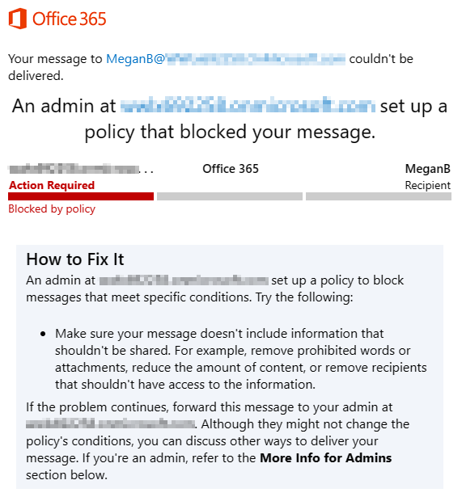
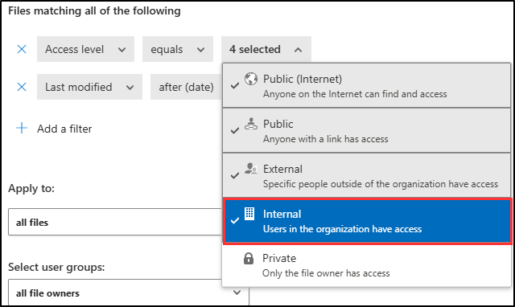

---
lab:
  title: 연습 1 - DLP 정책 관리
  module: Module 2 - Implement Data Loss Prevention
---
## WWL 테넌트 - 사용 약관

강사 진행 교육 제공의 일부로 테넌트를 제공하는 경우, 강사 진행 교육에서 실습 랩을 지원하기 위해 테넌트를 사용할 수 있습니다.

테넌트를 실습 랩 외부에서 공유하거나 사용해서는 안 됩니다. 이 과정에서 사용되는 테넌트는 평가판 테넌트이며 클래스가 종료된 후 사용하거나 액세스할 수 없으며 확장판에서도 사용할 수 없습니다.

테넌트를 유료 구독으로 변환해서는 안 됩니다. 이 과정의 일부로 얻은 테넌트는 Microsoft Corporation의 재산으로 유지되며 언제든지 액세스 권한을 획득하고 다시 소유할 수 있는 권리를 보유합니다.

# 랩 2 - 연습 1 - DLP 정책 관리

Contoso Ltd.에 새로 입사한 준수 관리자인 Joni Sherman이 회사 Microsoft 365 테넌트에서 데이터 손실 방지 기능을 구성하는 작업을 맡게 되었습니다. Contoso Ltd.는 미국의 운전 학원이며, 중요한 고객 정보가 조직 외부로 유출되지 않도록 해야 합니다.

**작업**:

1. 시뮬레이션 모드에서 DLP 정책 만들기
1. DLP 정책 수정
1. PowerShell에서 DLP 정책 만들기
1. DLP 정책 테스트
1. 시뮬레이션 모드에서 정책 활성화
1. 정책 우선 순위 수정
1. Microsoft 365 Defender에서 파일 모니터링 사용
1. Microsoft 365 Defender용 파일 정책 만들기
1. Power Platform에 대한 DLP 정책 만들기

## 작업 1 - 시뮬레이션 모드에서 DLP 정책 만들기

이 연습에서는 사용자가 민감한 데이터를 공유하지 못하도록 보호하는 DLP(데이터 손실 방지) 정책을 만들게 됩니다. 여기서 만들 DLP 정책은 사용자가 신용카드 정보가 포함된 콘텐츠를 공유하려는 경우 이를 사용자에게 알리고 해당 정보를 전송할 수 있는 정당성을 제공할 수 있도록 합니다. 차단 조치가 아직 사용자에게 영향을 미치지 않도록 하기 위해 이 정책은 시뮬레이션 모드에서 구현됩니다.

1. 클라이언트 1 VM(SC-400-CL1)에 **SC-400-CL1\admin** 계정으로 로그인합니다.

1. **Microsoft Edge**에서 **`https://purview.microsoft.com`** 으로 이동하고 Microsoft Purview 포털에 **Joni Sherman**으로 로그인합니다. `JoniS@WWLxZZZZZZ.onmicrosoft.com`으로 로그인합니다(여기서 ZZZZZZ는 랩 호스팅 공급자가 제공한 고유 테넌트 ID입니다). Joni의 암호는 이전 연습에서 설정되었습니다.

1. 왼쪽 사이드바에서 **솔루션**을 선택한 다음 **데이터 손실 방지**를 선택합니다.

1. 왼쪽 사이드바에서 **정책**을 선택합니다.

1. **정책** 페이지에서 **+ 정책 만들기**를 선택하여 새 데이터 손실 방지 정책 생성을 위한 구성을 시작합니다.

1. **템플릿으로 시작하기 또는 사용자 지정 정책 만들기** 페이지에서 **사용자 지정**을 카테고리로 선택한 다음 **규정**에서 **사용자 지정 정책**을 선택합니다.

1. **다음**을 선택합니다.

1. **DLP 정책 이름 지정** 페이지에서 다음을 입력합니다.

   - **이름**: `Credit Card DLP Policy`
   - **설명**: `Protect credit card numbers from being shared`

1. **다음**을 선택합니다.

1. **관리 단위 할당** 페이지에서 **다음**을 선택합니다.

1. **정책을 적용할 위치 선택하기** 페이지에서 **Teams 채팅 및 채널 메시지**에 대해서만 위치를 사용 설정합니다. 다른 위치를 선택한 경우 선택 취소합니다.

1. **다음**을 선택합니다.

1. **정책 설정 정의하기** 페이지에서 **고급 DLP 규칙 만들기 또는 사용자 지정하기**를 선택한 후 **다음**을 선택합니다.

1. **고급 DLP 규칙 사용자 지정** 페이지에서 **+ 규칙 만들기**를 선택합니다.

1. **규칙 만들기** 플라이아웃 페이지의 **이름** 필드에 `Credit card information`을 이름으로 입력합니다.

1. **조건**에서 **+ 조건 추가**를 선택한 다음 **콘텐츠 포함**을 선택합니다.

1. 새 **콘텐츠 포함** 영역에서 **추가**를 선택한 다음 **중요한 정보 유형**을 선택합니다.

1. **중요한 정보 유형** 페이지에서 **신용 카드 번호**를 선택하고 **추가**를 선택합니다.

1. **+ 조건 추가**를 선택한 다음 **콘텐츠가 Microsoft 365에서 공유됨**을 선택합니다.

1. 새 **콘텐츠가 Microsoft 365에서 공유됨** 섹션에서 **내 조직 내부 사용자 전용** 옵션을 선택합니다.

1. **작업**에서 **+ 작업 추가**를 선택한 다음 **Microsoft 365 위치에서 액세스 제한 또는 콘텐츠 암호화**를 선택합니다.

1. 새로운 **Microsoft 365 위치에서 액세스 제한 또는 콘텐츠 암호화** 영역에서 **모든 사람 차단**을 선택합니다.

1. **사용자 알림**에서 **알림을 사용하여 사용자에게 알리고 중요한 정보의 적절한 사용에 관해 교육하도록 지원** 옵션을 **켜고** **정책 팁으로 Office 365 서비스에서 사용자에게 알림** 확인란을 선택합니다.

1. **사용자 재정의**에서 **사용자가 Fabric(Power BI 포함), Exchange, SharePoint, OneDrive 및 Teams의 정책 제한을 재정의할 수 있도록 허용** 체크박스를 선택합니다.

1. **재정의하려면 비즈니스 타당성 필요** 확인란을 선택합니다.

1. **인시던트 보고서**의 **관리자 경고 및 보고서에서 이 심각도 수준 사용** 드롭다운에서 **낮음**을 선택합니다.

1. **규칙 만들기** 플라이아웃 패널 하단에서 **저장**를 선택합니다.

1. **고급 DLP 규칙 사용자 지정**으로 돌아가서 **다음**을 선택합니다.

1. **정책 모드** 페이지에서 **시뮬레이션 모드에서 정책 실행**을 선택하고 **시뮬레이션 모드에서 정책 팁 표시**의 확인란을 선택합니다.

1. **다음**을 선택합니다.

1. **검토 및 완료** 페이지에서 설정을 검토한 후 **제출**을 선택합니다.

1. **새로 만든 정책** 페이지에서 **완료**를 선택합니다.

이제 Microsoft Teams 채팅 및 채널에서 신용 카드 번호를 검사하는 DLP 정책을 만들었으므로 사용자가 정책을 재정의할 수 있는 비즈니스 타당성을 제공할 수 있습니다.

## 작업 2 - DLP 정책 수정

이 작업에서는 이전 작업에서 만든 기존 DLP 정책을 수정하여 이메일에서 신용 카드 정보도 검사합니다. 이렇게 수정하면 중요한 데이터가 더 많은 통신 채널에서 보호됩니다.

1. 클라이언트 1 VM(SC-400-CL1)에는 여전히 **SC-400-CL1\admin** 계정으로 로그인해야 하며, Microsoft 365에는 **Joni Sherman**으로 로그인되어 있는 상태여야 합니다.

1. Microsoft Purview의 **정책** 페이지에 계속 있어야 합니다. 그렇지 않은 경우 **Microsoft Edge**를 열고 `https://purview.microsoft.com`로 이동합니다. **솔루션** > **데이터 손실 방지** > **정책**을 선택합니다.

1. **정책** 페이지에서 최근에 생성한 **신용카드 DLP 정책** 체크박스를 선택한 다음 **정책 편집**을 선택하여 정책 구성을 엽니다.

1. **DLP 정책 이름 지정** 페이지에서 **다음**을 선택합니다.

1. **관리 단위 할당** 페이지에서 **다음**을 선택합니다.

1. **정책을 적용할 위치 선택** 페이지에서 **이메일 교환** 확인란을 선택하여 이 위치를 DLP 정책에 추가합니다.

1. **다음**을 선택하여 **검토 및 완료** 페이지에 도달할 때까지 진행합니다.

1. **검토 및 완료** 페이지에서 **제출**을 선택하여 변경한 내용을 정책에 적용합니다.

1. 정책이 업데이트되면 **정책 업데이트됨** 페이지에서 **완료**를 선택합니다.

이메일 검사를 포함하도록 DLP 정책을 성공적으로 수정하여 중요한 정보의 보호를 강화했습니다.

## 작업 3 - PowerShell에서 DLP 정책 만들기

이 작업에서는 PowerShell을 사용하여 Contoso 직원 ID를 보호하고 Exchange를 통해 공유되지 않도록 하는 DLP 정책을 만들 것입니다. 이 정책은 이러한 중요한 데이터를 공유하려는 사용자에게 알림을 보내고 이메일에 직원 ID가 포함된 경우 해당 이메일을 차단합니다.

1. 여전히 클라이언트 1 VM(SC-400-CL1)에 **SC-400-CL1\admin** 계정으로 로그인되어 있는 상태여야 합니다.

1. 작업 표시줄에서 Windows 단추를 마우스 오른쪽 단추로 클릭하여 관리자 권한 PowerShell 창을 연 다음 **터미널(관리자)** 을 선택합니다.

1. **Connect-IPPSSession** cmdlet을 실행하여 보안 및 규정 준수 PowerShell에 연결합니다.

   ```powershell
   Connect-IPPSSession
   ```

1. **계정에 로그인하기** 팝업 창에서 **Joni Sherman**`JoniS@WWLxZZZZZZ.onmicrosoft.com`(여기서 ZZZZZZ는 랩 호스팅 제공업체에서 제공한 고유 테넌트 ID)로 로그인합니다. Joni의 암호는 이전 연습에서 설정되었습니다.

1. 모든 Exchange 사서함을 검사하는 DLP 정책을 만들려면 **New-DlpCompliancePolicy** cmdlet을 실행합니다.

   ```powershell
   New-DlpCompliancePolicy -Name "EmployeeID DLP Policy" -Comment "This policy blocks sharing of Employee IDs" -ExchangeLocation All
   ```

1. **New-DlpComplianceRule** cmdlet을 실행하여 이전 단계에서 만든 DLP 정책에 DLP 규칙을 추가합니다.

   ```powershell
   New-DlpComplianceRule -Name "EmployeeID DLP rule" -Policy "EmployeeID DLP Policy" -BlockAccess $true -ContentContainsSensitiveInformation @{Name="Contoso Employee IDs"}
   ```

1. **Get-DLPComplianceRule** cmdlet을 실행하여 **EmployeeID DLP 규칙**를 검토합니다.

   ```powershell
   Get-DLPComplianceRule -Identity "EmployeeID DLP rule"
   ```

Exchange에서 Contoso 직원 ID를 검사하는 PowerShell을 사용하여 DLP 정책을 성공적으로 만들었습니다.

## 작업 4 - DLP 정책 테스트

이 작업에서는 이전 작업에서 만든 DLP 정책을 테스트합니다.

1. 계속 클라이언트 1 VM(SC-400-CL1)에 **SC-400-CL1\admin** 계정으로 로그인하고 Microsoft 365에 Joni Sherman으로 로그인해야 합니다.

1. Microsoft Edge 브라우저 창을 열고 **`https://outlook.office.com`**(으)로 이동

1. 왼쪽 위에서 **새 메일** 단추를 선택하여 새 이메일 메시지를 작성합니다.

1. **받는 사람** 필드에 `Megan`를 입력하고 **Megan Bowen**의 이메일 주소를 선택합니다.

1. 제목 필드에 `Help with employee information`를 입력합니다.

1. 이메일 본문에 다음을 입력합니다.

   ``` text
   Please help me with the start dates for the following employees:
   ABC123456
   DEF678901
   GHI234567

   Thank you, 
   Joni Sherman
   ```

1. 메시지 창의 오른쪽 위에 있는 **보내기** 단추를 선택하여 이메일을 보냅니다.

1. 이메일을 전송할 수 없으며 DLP 정책에 의해 차단되었다는 메시지가 표시됩니다.

      

DLP 정책을 성공적으로 테스트했습니다.

## 작업 5 - 시뮬레이션 모드에서 정책 활성화

이 작업에서는 시뮬레이션 모드에서 만든 **신용 카드 DLP 정책**을 활성화하여 보호 조치를 시행합니다.

1. 클라이언트 1 VM(SC-400-CL1)에는 여전히 **SC-400-CL1\admin** 계정으로 로그인해야 하며, Microsoft 365에는 **Joni Sherman**으로 로그인되어 있는 상태여야 합니다.

1. **Microsoft Edge**에서 `https://purview.microsoft.com` > **솔루션** > **데이터 손실 방지**로 이동한 다음 왼쪽 사이드바에서 **정책**을 선택하여 DLP 정책으로 이동합니다.

1. **정책** 페이지에서 **신용카드 DLP 정책** 확인란을 선택하고 **정책 편집**을 선택하면 정책 구성이 열립니다.

1. **정책 모드** 페이지에 도달할 때까지 **다음**을 선택하고 **즉시 정책 활성화**를 선택합니다.

1. **검토 및 완료**에서 **제출**을 선택합니다.

1. **정책이 업데이트됨** 페이지에서 **완료**를 선택합니다.

DLP 정책을 성공적으로 활성화하여 신용 카드 정보를 공유하려는 시도가 차단되고 비즈니스 타당성이 필요한지 확인했습니다.

## 작업 6 - 정책 우선 순위 수정

이전 작업에서 DLP 정책 2개를 만들었습니다. 이번에는 두 정책 중 제한 수준이 더 높은 정책에 제한 수준이 낮은 정책보다 높은 우선 순위를 지정해야 합니다. 이러한 이유로 EmployeeID DLP 정책을 더 높은 우선 순위로 이동하려고 합니다.

1. 클라이언트 1 VM(SC-400-CL1)에는 여전히 **SC-400-CL1\admin** 계정으로 로그인해야 하며, Microsoft 365에는 **Joni Sherman**으로 로그인되어 있는 상태여야 합니다.

1. **Microsoft Edge**에서 Microsoft Purview 포털 탭은 계속 **정책** 페이지에 열려 있어야 합니다. 그렇지 않은 경우 **Microsoft Edge**를 열고 `https://purview.microsoft.com`로 이동합니다. **솔루션** > **데이터 손실 방지** > **정책**을 선택합니다.

1. **정책** 페이지에서 **EmployeeID DLP 정책** DLP 정책을 선택합니다.

1. 상단 탐색 리본에서 **우선순위 변경**을 선택한 다음 **맨 위로 이동(최고 우선순위)** 을 선택합니다.

1. **데이터 손실 방지** 창에서 **새로 고침**을 선택하고 정책 표의 **순서** 열에서 우선 순위를 검토합니다.

정책 우선 순위를 성공적으로 수정하여 콘텐츠를 일치시킬 때 가장 제한적인 DLP 정책이 먼저 적용되도록 했습니다.

## 작업 7 - Microsoft 365 Defender에서 파일 모니터링 사용

Microsoft 365 Defender의 파일 정책을 사용하여 OneDrive 및 SharePoint Online 위치에서 파일을 보호하려고 합니다. 파일 정책을 만들기 전에 Microsoft 365 Defender가 조직의 파일을 검색할 수 있도록 파일 모니터링을 사용하도록 설정해야 합니다.

1. 여전히 클라이언트 1 VM(SC-400-CL1)에 **SC-400-CL1\admin** 계정으로 로그인되어 있는 상태여야 합니다.

1. **Microsoft Edge**에는 Microsoft Purview 포털 탭이 계속 열려 있어야 합니다. 오른쪽 위에 있는 Joni Sherman의 프로필 사진을 선택하여 Joni의 계정에서 로그아웃합니다. **로그아웃**을 선택한 다음 브라우저 창을 닫습니다.

1. **Microsoft Edge**를 열고 **`https://security.microsoft.com`**(으)로 이동한 다음 Microsoft 365 Defender 포털에 **MOD 관리자** `admin@WWLxZZZZZZ.onmicrosoft.com`(으)로 로그인합니다(ZZZZZZ는 랩 호스팅 공급자가 제공한 고유 테넌트 ID임). 관리자의 암호는 랩 호스팅 공급자가 제공합니다.

1. 왼쪽 사이드바에서 **시스템**을 확장한 다음 **설정**를 선택합니다.

1. **설정** 페이지에서 **클라우드 앱**을 선택합니다.

1. **클라우드 앱** 창 내의 왼쪽 창에서 **Information Protection** 섹션까지 아래로 스크롤한 다음 **Files**를 선택합니다.

1. **파일 모니터링 활성화** 확인란을 선택한 다음 아직 표시되어 있지 않은 경우 **저장**을 선택합니다.

Microsoft 365 Defender에서 파일 모니터링을 사용하도록 설정했으며 이제 파일 정책을 사용하여 파일에서 중요한 콘텐츠를 검사할 수 있습니다.

## 작업 8 - Microsoft 365 Defender용 파일 정책 만들기

이 작업에서는 Microsoft 365 Defender에서 파일 정책을 만들어 OneDrive 및 SharePoint Online의 파일에서 신용 카드 정보를 검사합니다. 정책은 중요한 데이터가 포함된 파일을 자동으로 격리합니다.

1. 여전히 클라이언트 1 VM(SC-400-CL1)에 **SC-400-CL1\admin** 계정으로 로그인되어 있는 상태여야 합니다.

1. 오른쪽 상단의 **MA** 아이콘을 선택한 다음 **로그아웃**을 선택하여 MOD 관리자 계정에서 로그아웃합니다. 로그아웃한 후 브라우저 창을 닫습니다.

1. **Microsoft Edge**를 열고 **`https://security.microsoft.com`**(으)로 이동한 다음, Microsoft 365 Defender 포털에 **Joni Sherman** `JoniS@WWLxZZZZZZ.onmicrosoft.com`(으)로 로그인합니다(ZZZZZZ는 랩 호스팅 공급자가 제공한 고유 테넌트 ID임). Joni의 암호는 이전 연습에서 설정되었습니다.

1. **Microsoft 365 Defender** 포털의 왼쪽 탐색에서 아래로 스크롤하여 **클라우드 앱** 섹션으로 이동합니다. **정책**을 확장한 다음 **정책 관리**를 선택합니다.

1. **정책** 페이지에서 **+ 정책 만들기**를 선택한 다음 **정책 파일 만들기**를 선택합니다.

1. **파일 정책 만들기** 페이지에서 **정책 템플릿** 선택 영역을 **템플릿 없음**으로 둡니다.

1. **정책 이름** 및 **설명** 필드에 다음을 입력합니다.

   - **정책 이름**: `Credit card information for files`
   - **설명**: `Protect credit card numbers from being shared in files.`

1. **정책 심각도**를 **낮음**(조명이 켜진 아이콘 하나)으로 설정하고 **카테고리**가 **DLP**로 설정되어 있는지 확인합니다. 파일 정책의 경우 DLP가 기본값입니다.

    

1. **다음과 모두 일치하는 파일** 영역에서 드롭다운 메뉴 **퍼블릭(인터넷), 외부, 퍼블릭**을 확장하고 **내부**를 추가합니다.

    

1. **검사 방법** 드롭다운 메뉴에서 **데이터 분류 서비스**를 선택합니다.

1. **검사 유형 선택...** 드롭다운 메뉴에서 **중요한 정보 유형...** 을 선택합니다.

1. **중요한 정보 유형 선택** 대화 상자에서 `Credit card`를 검색한 다음 **신용 카드 번호** 확인란을 선택합니다.

1. **중요한 정보 유형 선택** 화면의 오른쪽 위 모서리에서 **완료**를 선택합니다.

1. **경고** 아래에서 **각각의 일치 파일에 대한 경고 만들기** 체크박스를 선택하고 옵션을 검토합니다. **기본 설정으로 저장**을 선택하여 설정을 기본값으로 유지합니다.

1. **거버넌스 작업** 섹션에서 **Microsoft 비즈니스용 OneDrive**를 확장하고 **사용자 격리에 넣기**를 선택합니다.

1. **거버넌스 작업** 섹션에서 **Microsoft SharePoint Online**을 확장하고 **사용자 격리에 넣기** 확인란을 선택합니다.

1. 페이지 아래쪽에서 **만들기**를 선택하여 파일 정책을 만듭니다.

1. 오른쪽 위에 있는 Joni Sherman의 프로필 사진을 선택하여 Joni의 계정에서 로그아웃합니다. **로그아웃**을 선택한 다음 브라우저 창을 닫습니다.

OneDrive 및 SharePoint에서 신용 카드 정보가 있는 파일을 검색하고 격리하는 파일 정책을 성공적으로 만들었습니다.

## 작업 9 - Power Platform에 대한 DLP 정책 만들기

회사에서 Power Automate 흐름을 사용하여 SharePoint Online과 Salesforce 간에 데이터를 공유합니다. 이 작업에서는 기존 흐름은 계속 작동하도록 허용하지만 SharePoint Online과 비업무용으로 정의된 앱 간에 데이터를 공유하는 흐름 생성을 방지하는 Power Platform용 DLP 정책을 만듭니다.

1. 여전히 클라이언트 1 VM(SC-400-CL1)에 **SC-400-CL1\admin** 계정으로 로그인되어 있는 상태여야 합니다.

1. **Microsoft Edge**에서 **`https://admin.powerplatform.microsoft.com`** 으로 이동한 다음 Power Platform 관리 센터에 **MOD 관리자** `admin@WWLxZZZZZZ.onmicrosoft.com`으로 로그인합니다(ZZZZZZ는 랩 호스팅 공급자가 제공한 고유 테넌트 ID임). 관리자의 암호는 랩 호스팅 공급자가 제공합니다.

1. **Power Platform 관리 센터**의 왼쪽 사이드바에서 **정책**에 대한 드롭다운을 선택하고 **데이터 정책**을 선택합니다.

1. **데이터 정책** 페이지에서 **+ 새 정책**을 선택합니다.

1. **정책 이름 지정** 페이지에서 `Tenant-wide SharePoint Policy`를 정책 이름으로 입력 한 다음, **다음**을 선택합니다.

1. **커넥터 할당** 페이지의 **비업무용|기본값** 탭에서 **SharePoint** 및 **Salesforce**를 선택한 다음, 페이지 상단에서 **업무용으로 이동**을 선택합니다.

    

1. **커넥터 할당** 페이지에서 **업무용** 탭을 선택하여 SharePoint 및 Salesforce가 탭에 표시되는지 확인한 후, **다음**을 선택하세요.

1. **사용자 지정 커넥터 패턴** 페이지에서 **다음**을 선택합니다.

1. **범위 정의** 페이지에서 **모든 환경 추가**를 선택한 후, **다음**을 선택합니다.

1. **정책 검토 및 만들기** 페이지에서 정책 설정을 검토한 후, **정책 만들기**를 선택합니다.

1. 오른쪽 상단의 **MA** 아이콘을 선택한 다음 **로그아웃**을 선택하여 MOD 관리자 계정에서 로그아웃합니다. 로그아웃한 후 브라우저 창을 닫습니다.

SharePoint Online과 비업무용 커넥터 간의 데이터 흐름이 제어되도록 Power Platform DLP 정책을 성공적으로 만들었습니다.
