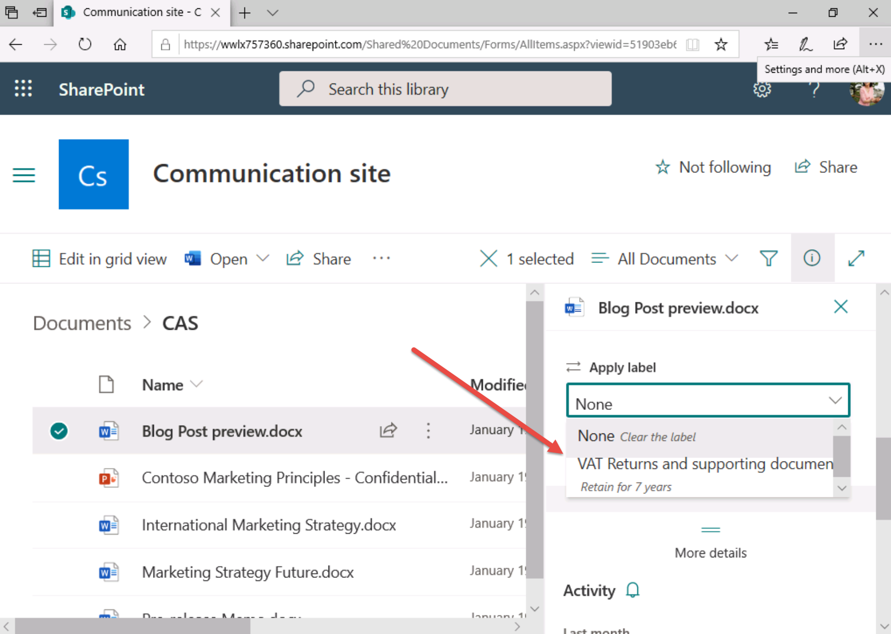

# 랩 3 - 연습 2 - 보존 레이블 구현

이 연습에서는 Contoso Ltd.의 시스템 관리자인 Joni Sherman으로 작업을 수행하게 됩니다. Joni가 소속된 영국 서드베리 소재의 기업인 Contoso Ltd.는 재무 정보 보존 의무를 준수해야 합니다. 

이 의무를 준수하기 위해 경리부에서 VAT(부가가치세) 환급용 문서와 지원 문서 및 신용 카드 영수증에 보존 레이블을 설정하는 보존 계획을 작성했습니다.
 
### 작업 1 - 보존 레이블 만들기

이 작업에서는 VAT 환급 정보가 포함된 문서와 이메일에 할당할 수 있는 보존 레이블과 신용 카드 영수증에 적용할 수 있는 보존 레이블을 만듭니다.

1. **lon-cl1\admin** 계정으로 클라이언트 1 VM(LON-CL1)에 로그인합니다.

2. **Microsoft Edge**에서 **https://compliance.microsoft.com** 으로 이동한 다음 **Joni Sherman**으로 Microsoft 365 규정 준수 포털에 로그인합니다.

3. **Microsoft 365 규정 준수** 포털의 왼쪽 탐색 창에서 **정책**을 선택하고 **데이터** 아래에서 **보존**을 선택합니다.

4. 정보 거버넌스 페이지에서 **레이블** 탭을 선택합니다.

5. **+ 레이블 만들기** 단추를 선택합니다.

6. **보존 레이블의 이름 지정** 페이지의 **이름**, **관리자를 위한 설명** 및 **사용자를 위한 설명**에 다음 정보를 각각 입력합니다.

	- **이름**: VAT 환급 및 지원 문서
	- **사용자를 위한 설명**: 법률에 따라 7년 동안 보존할 수 있도록 VAT 문서에 이 레이블을 할당하세요.
	- **관리자를 위한 설명**: 7년 동안 보존해야 하는 VAT 환급 정보입니다.

7. **다음** 단추를 선택합니다.

8. **보존 설정 정의** 페이지에서 **특정 기간 동안 항목 보존** 설정을 사용하도록 설정합니다.

9. **보존 설정 정의** 섹션에서 다음 정보를 입력합니다.
	- **보존 기간**: 7년
	- **보존 기간 시작 기준**: 항목 작성 시
	- **보존 기간 종료 시**: 아무 작업도 하지 않음
	

10. **다음** 단추를 선택합니다.

11. **검토 후 완료** 페이지에서 **레이블 만들기** 단추를 선택합니다.  *보존 레이블이 생성되었습니다.* 페이지에서 **아무 작업도 하지 않음** 옵션을 선택하고 **완료**를 선택합니다.

12. **정보 거버넌스** 페이지의 **레이블** 탭으로 돌아옵니다.  이후 연습에서 레이블을 게시하겠습니다.

13. **+ 레이블 만들기** 단추를 선택합니다.

14. **보존 레이블의 이름 지정** 페이지의 **이름**, **사용자를 위한 설명** 및 **관리자를 위한 설명**에 다음 정보를 각각 입력합니다.
	- **이름**: 신용 카드 영수증
	- **사용자를 위한 설명**: 3년 동안 보존할 수 있도록 신용 카드 영수증에 자동 적용되는 레이블입니다.
	- **관리자를 위한 설명**: 3년 동안 보존해야 하는 신용 카드 영수증용 자동 적용 보존 레이블입니다.

15. **다음** 단추를 선택합니다.

16. **보존 설정 정의** 섹션에서 다음 정보를 입력합니다.
	- **보존 기간**: 3년
	- **보존 기간 시작 기준**: 항목 작성 시
	- **보존 기간 종료 시**: 아무 작업도 하지 않음
	

17. **다음** 단추를 선택합니다.

18. **검토 후 완료** 페이지에서 **레이블 만들기** 단추를 선택합니다. *보존 레이블이 생성되었습니다.* 페이지에서 **아무 작업도 하지 않음** 옵션을 선택하고 **완료**를 선택합니다.

보존 기간이 7년인 VAT 환급 문서용 보존 레이블과 보존 기간이 3년인 신용 카드 영수증용 보존 레이블을 만들었습니다.

### 작업 2 - 보존 레이블 게시

이 작업에서는 작업 1에서 만든 VAT 환급 문서 보존 레이블을 게시합니다. 그러면 경리부 사용자들이 Exchange 전자 메일에 있는 문서 및 SharePoint 문서에 게시된 레이블을 적용할 수 있습니다.

1. 클라이언트 1 VM(LON-CL1)에는 **lon-cl1\admin** 계정으로, Microsoft 365에는 **Joni Sherman**으로 로그인되어 있는 상태여야 합니다. 

2. 그리고 **Microsoft Edge**에는 Microsoft 365 규정 준수 포털 탭이 계속 열려 있어야 합니다. 해당 탭이 열려 있으면 탭을 선택하고 다음 단계를 진행합니다. 해당 탭을 닫았다면 새 탭에서 **https://compliance.microsoft.com** 으로 이동합니다.

3. **Microsoft 365 규정 준수** 포털의 왼쪽 탐색 창에서 **정책**을 선택하고 **데이터** 아래에서 **보존**을 선택합니다.

4. **정보 거버넌스** 페이지에서 **레이블** 탭을 선택합니다.

5. 작업 1에서 만든 **VAT 환급 및 지원 문서** 레이블을 선택합니다.

6. **레이블 게시** 아이콘 단추를 선택합니다.

7. **게시할 레이블 선택** 페이지에서 **다음** 단추를 선택합니다.

8. **만들 보존 정책의 유형 선택** 페이지에서 **정적** 항목을 선택합니다.

9. **다음** 단추를 선택합니다.

10. **위치 선택** 페이지에서 **특정 위치를 선택하겠습니다.** 옵션을 사용하도록 설정합니다.

11. 다음 정보를 입력합니다.
	- **Exchange 이메일** 위치 - **상태**: 켜짐
	- **SharePoint 사이트** 위치 - **상태**: 켜짐
	- **OneDrive 계정** 위치 - **상태**: 켜짐
	- **Office 365 그룹** 위치 - **상태**: OFF

12. **다음** 단추를 선택합니다.

13. **정책 이름 지정** 페이지의 **이름** 및 **설명**에 다음 정보를 각각 입력합니다.

	- **이름**: VAT 환급 및 지원 문서 보존 레이블
	- **설명**: VAT 환급 및 지원 문서 보존 레이블입니다. 보존 기간은 3년이며 적용 대상은 Exchange 이메일 및 SharePoint 사이트 위치입니다.

14. **다음** 단추를 선택합니다.

15. **설정 검토** 페이지에서 **제출** 단추를 선택합니다.  정책이 만들어지면 **완료**를 선택합니다.

VAT 환급 및 지원 문서용 보존 레이블을 게시했습니다.

### 작업 3 - 자동 적용 보존 레이블 게시

이 작업에서도 작업 1에 이어 정보가 보존되도록 신용 카드 영수증 보존 레이블을 자동 적용합니다.

1. 클라이언트 1 VM(LON-CL1)에는 **lon-cl1\admin** 계정으로, Microsoft 365에는 **Joni Sherman**으로 로그인되어 있는 상태여야 합니다. 

2. 그리고 **Microsoft Edge**에는 Microsoft 365 규정 준수 포털 탭이 계속 열려 있어야 합니다. 해당 탭이 열려 있으면 탭을 선택하고 다음 단계를 진행합니다. 해당 탭을 닫았다면 새 탭에서 **https://compliance.microsoft.com** 으로 이동합니다.

3. **Microsoft 365 규정 준수** 포털의 왼쪽 탐색 창에서 **정책**을 선택하고 **데이터** 아래에서 **보존**을 선택합니다.

4. **정보 거버넌스** 페이지에서 **레이블** 탭을 선택합니다.

5. 작업 1에서 만든 **신용 카드 영수증** 레이블을 선택합니다.

6. **레이블 자동 적용** 아이콘 단추를 선택합니다.  그러면 콘텐츠에 자동으로 레이블 적용 마법사가 표시됩니다.

7. **자동 레이블 지정 정책 이름 지정** 페이지의 **이름** 및 **설명**에 다음 정보를 각각 입력합니다.
	- **이름**: 신용 카드 영수증 자동 적용
	- **설명**: 신용 카드 영수증 자동 적용 보존 레이블입니다. 모든 위치에서 보존 기간은 3년입니다.

8. **다음** 단추를 선택합니다.

9. **이 레이블에 적용할 콘텐츠의 유형 선택** 페이지에서 이 레이블에 적용할 콘텐츠의 유형 선택에 대해 다음 옵션을 선택합니다.

	- **중요한 정보가 포함된 콘텐츠에 레이블 적용**

10. **다음** 단추를 선택합니다.

11. **중요한 정보가 포함된 콘텐츠** 페이지에서 **금융** 범주를 선택합니다. 

12. 그러면 템플릿 범주 패널 오른쪽에 금융 템플릿이 표시됩니다. 

13. 재무 템플릿 패널에서 결과 아래쪽으로 스크롤하여 **영국 금융 데이터**를 선택합니다.

14. **다음** 단추를 선택합니다.

15. **중요한 정보가 포함된 콘텐츠 정의** 페이지에서 **다음** 단추를 선택합니다.

16. **만들 보존 정책의 유형 선택** 페이지에서 **정적** 항목을 선택합니다. 

17. **정책을 적용할 위치 선택** 페이지에서 다음 옵션을 **사용하도록 설정**합니다. **Exchange 전자 메일, OneDrive 계정, SharePoint 사이트 및 Microsoft 365 그룹** 옵션을 사용하도록 설정하고 **다음**을 선택합니다.

18. **자동 적용할 레이블 선택** 페이지에서 **다음**을 선택합니다.

19. **자동 적용할 레이블 선택** 페이지에서 **제출** 단추를 선택합니다.  정책이 만들어지면 **완료**를 선택합니다.

자동 적용할 보존 레이블을 게시했습니다. 앞으로 7일 동안 신용 카드 정보가 포함된 모든 문서에 방금 게시한 신용 카드 영수증 레이블이 자동 적용됩니다. 이러한 항목에는 보존 기간 3년이 적용됩니다.

### 작업 4 - Outlook 이메일에서 보존 레이블 사용

이 작업에서는 Outlook 전자 메일에 보존 레이블을 할당합니다.

1. **lon-cl1\admin** 계정으로 클라이언트 1 VM(LON-CL1)에 로그인합니다.

2. 페이지 아래쪽의 작업 표시줄에서 시작 단추를 선택하고 아래쪽으로 스크롤한 다음 **Outlook**을 선택합니다. 필요한 경우 **Megan Bowen**으로 로그인합니다. 로그인 ID로는 MeganB@WWLxZZZZZZ.onmicrosoft.com을 사용합니다(여기서 ZZZZZZ는 랩 호스팅 공급자가 제공한 고유 테넌트 ID임).  Megan의 암호는 랩 호스팅 공급자가 제공합니다.

3. Outlook 애플리케이션에서 **받은 편지함**을 선택합니다.

4. 가운데 창의 첫 번째 전자 메일 항목을 마우스 오른쪽 단추로 선택하고 **정책 할당**을 선택합니다.

5. 보존 정책 목록이 표시됩니다.

6. **VAT 환급 및 지원 문서** 정책이 사용 가능하면 해당 정책을 선택하고, 아니면 기존 정책에서 **1개월 후 삭제**를 선택합니다(이 연습 내에서 설정을 적용하기 위한 용도로만 사용됨).  **참고**: 게시된 보존 레이블이 Exchange Online에 표시되려면 7일이 걸릴 수 있습니다. 사서함에는 데이터 10MB가 포함되어 있어야 합니다.

7. **Outlook**은 열어 둡니다.

Outlook 전자 메일에 보존 레이블을 적용했습니다.

### 작업 5 - Outlook 폴더용 보존 레이블 사용

이 작업에서는 Outlook 폴더에 보존 레이블을 할당합니다.

1. 클라이언트 1 VM(LON-CL1)에 **lon-cl1\admin** 계정으로 로그인되어 있는 상태여야 하며 **Outlook**이 열려 있어야 합니다. **Outlook**이 열려 있지 않으면 다시 열고 **Megan Bowen**으로 로그인합니다.

2.  왼쪽 창에서 **받은 편지함**을 선택하고 마우스 오른쪽 단추를 클릭합니다.

3.  **새 폴더...** 를 선택하고 다음을 입력합니다. VAT 환급

4.  **확인** 단추를 선택합니다.

4.  왼쪽 창에서 새로 만든 **VAT 환급** 폴더를 마우스 오른쪽 단추로 클릭합니다.

5.  메뉴에서 **속성**을 선택합니다.

6.  **정책** 탭을 선택합니다.

7.  **VAT 환급 및 지원 문서** 정책이 사용 가능하면 **폴더 정책** 드롭다운 목록에서 해당 정책을 설정하고, 아니면 기존 정책에서 **5년 후 삭제**를 선택합니다(이 연습 내에서 설정을 적용하기 위한 용도로만 사용됨). **참고** 게시된 보존 레이블이 Exchange Online에 표시되려면 7일이 걸릴 수 있습니다. 사서함에는 데이터 10MB가 포함되어 있어야 합니다.

8. **확인** 단추를 선택합니다.

9. 오른쪽 위에서 **X** 단추를 선택하여 Outlook 애플리케이션을 닫습니다.

Outlook 폴더에 보존 레이블을 적용했습니다. 이 하위 작업에서 선택한 설정에 따라 이 폴더 내의 모든 전자 메일에 기본 보존 레이블이 할당됩니다.

Outlook 폴더에 보존 레이블을 적용했습니다.

### 작업 6 - SharePoint에서 보존 레이블 사용

이 작업에서는 SharePoint 문서 라이브러리의 문서에 보존 레이블을 적용합니다.

1. 클라이언트 1 VM(LON-CL1)에 **lon-cl1\admin** 계정으로 로그인되어 있는 상태여야 합니다.

2. **Microsoft Edge**에서 **https://www.office.com** 으로 이동한 다음 **Joni Sherman**으로 Microsoft 365에 로그인합니다.

3. Microsoft O365 방문 페이지에서 왼쪽 위 모서리의 앱 시작 관리자 아이콘(점 9개로 표시된 아이콘)을 선택하고 하위 메뉴에서 **SharePoint**를 선택합니다.

4. SharePoint 시작 페이지에서 아래쪽으로 스크롤한 다음 **커뮤니케이션 사이트** SharePoint 사이트를 선택합니다. **참고**: 검색 창에 **커뮤니케이션 사이트**를 입력하고 검색합니다.

5. 위쪽 탐색 모음에서 **문서** 링크를 선택합니다.

6. **CAS** 폴더를 선택합니다.

7. CAS 폴더 내에서 **Blog Post preview.docx** 문서를 강조 표시합니다(선택은 하지 않음).

8. 강조 표시된 문서에서 세로 **[...]** 단추를 선택합니다..  **추가** 옵션 위에 마우스를 올려 놓습니다.

9. 확장된 메뉴 선택 항목에서 **규정 준수 세부 정보** 단추를 선택합니다.

10. 측면 메뉴가 표시됩니다.  **레이블 상태**의 경우 *없음*이 표시되어야 하고 표시되면 선택합니다.  그러면 레이블을 적용할 수 있는 새 브라우저 탭이 열립니다.

11. **VAT 환급 및 지원 문서** 옵션이 사용 가능하면 **레이블 적용**을 해당 옵션으로 설정하고 **저장**을 선택합니다. 보존 레이블이 게시되려면 시간이 다소 걸릴 수도 있으므로 이 옵션을 즉시 사용하지는 못할 수도 있습니다. 이 옵션을 사용할 수 없어도 괜찮으므로 다음 작업을 계속 진행하세요. 언제든이 이 작업으로 돌아와 다시 시도하세요.

    

SharePoint의 문서에 보존 레이블을 적용했습니다.

### 작업 7 - OneDrive에서 보존 레이블 사용

이 작업에서는 OneDrive의 문서에 보존 레이블을 적용합니다.

1. 클라이언트 1 VM(LON-CL1)에는 **lon-cl1\admin** 계정으로, Microsoft 365에는 **Joni Sherman**으로 로그인되어 있는 상태여야 합니다. 

2. **Microsoft Edge**에서 **https://www.office.com** 으로 이동한 다음 **Joni Sherman**으로 Microsoft 365에 로그인합니다.

3. Microsoft O365 방문 페이지에서 왼쪽 위 모서리의 앱 시작 관리자 아이콘(점 9개로 표시된 아이콘)을 선택하고 하위 메뉴에서 **OneDrive**를 선택합니다.

4. OneDrive 애플리케이션 내에서 **Contractor Legal Info.docx** 문서를 강조 표시합니다(선택은 하지 않음).

5. 강조 표시된 문서에서 세로 점 3개 **[...]** 단추를 선택합니다.

6. 메뉴 선택 항목에서 **세부 정보** 단추를 선택합니다.  

7. 오른쪽에 측면 메뉴가 나타납니다.  **레이블 적용** 옵션이 표시되어야 하고 표시되면 선택합니다.

8. **VAT 환급 및 지원 문서** 옵션이 사용 가능하면 **보존 레이블 적용**을 해당 옵션으로 설정합니다. 보존 레이블이 게시되려면 시간이 다소 걸릴 수도 있으므로 이 옵션을 즉시 사용하지는 못할 수도 있습니다. 이 옵션을 사용할 수 없어도 괜찮으므로 다음 작업을 계속 진행하세요. 언제든이 이 작업으로 돌아와 다시 시도하세요.

OneDrive의 문서에 보존 레이블을 적용했습니다.

# 랩 3 - 연습 3으로 넘어가세요.
