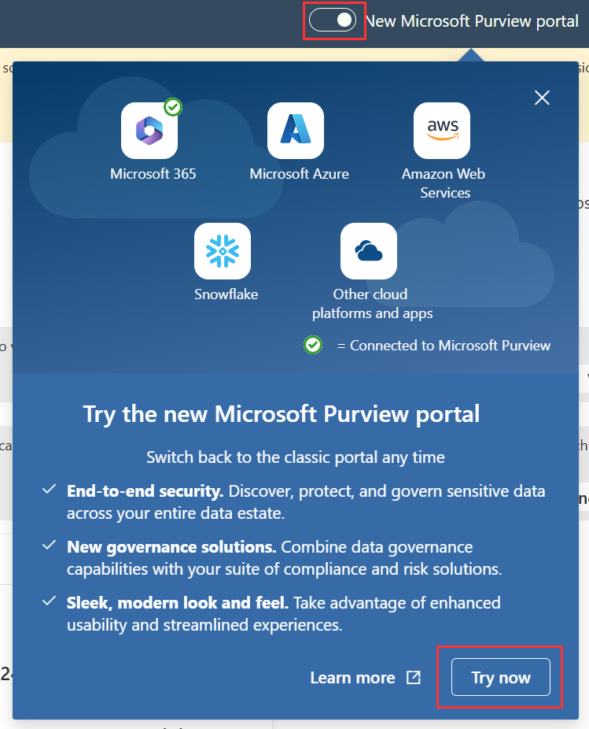

---
lab:
  title: 연습 1 - 준수 관리자 살펴보기
  module: Module 4 - Monitor and investigate data and activities by using Microsoft Purview
---

## WWL 테넌트 - 사용 약관

강사 진행 교육 제공의 일부로 테넌트를 제공하는 경우, 강사 진행 교육에서 실습 랩을 지원하기 위해 테넌트를 사용할 수 있습니다.

테넌트를 실습 랩 외부에서 공유하거나 사용해서는 안 됩니다. 이 과정에서 사용되는 테넌트는 평가판 테넌트이며 클래스가 종료된 후 사용하거나 액세스할 수 없으며 확장판에서도 사용할 수 없습니다.

테넌트를 유료 구독으로 변환해서는 안 됩니다. 이 과정의 일부로 얻은 테넌트는 Microsoft Corporation의 재산으로 유지되며 언제든지 액세스 권한을 획득하고 다시 소유할 수 있는 권리를 보유합니다.

# 랩 4 - 연습 1 - 준수 관리자 살펴보기

Joni Sherman은 조직의 Microsoft 365 테넌트 내에서 규정 준수를 구성하고 유지 관리하는 Contoso Ltd.의 규정 준수 관리자입니다. Contoso Ltd.는 재무 부문에서 운영되는 사무실을 보유하고 있으며 미국의 GLBA(Gramm-Leach-Bliley Act)를 비롯한 다양한 규정 요구 사항을 따릅니다.

Microsoft 365 환경 내의 GLBA 요구 사항에 특히 포커스를 맞춘 규정 준수 평가를 수행해야 하는 책임이 있습니다. 이 평가에는 현재 규정 준수 상태를 평가하고, 잠재적인 규정 준수 격차를 식별하고, 이를 해결하기 위한 적절한 측정값을 구현하는 것이 포함됩니다.

**작업**:

1. 준수 관리자 권한 할당
1. 규정준수 관리자 살펴보기
1. 평가 만들기
1. 개선 작업 할당
1. 개선 작업에 대한 작업
1. 개선 작업 수동 업데이트

## 작업 1 - 준수 관리자 권한 할당

이 작업에서는 준수 관리자를 사용하여 평가를 만드는 데 필요한 권한을 Joni에게 부여합니다. 또한 Megan에게 개선 작업이 할당된 경우 개선 작업을 수행하는 데 필요한 권한을 부여하게 됩니다.

1. **SC-400-CL1\admin** 계정으로 클라이언트 1 VM(SC-400-CL1)에 로그인합니다. 암호는 랩 호스팅 공급자가 제공합니다.

1. **Microsoft Edge**에서 주소 표시줄을 선택하고 **`https://purview.microsoft.com`** 로 이동한 후 Microsoft Purview 규정 준수 포털에 **MOD 관리자** `admin@WWLxZZZZZZ.onmicrosoft.com`으로 로그인합니다. 여기서 ZZZZZZ는 랩 호스팅 공급자가 제공한 고유 테넌트 ID입니다. 관리자의 암호는 랩 호스팅 공급자가 제공합니다.

1. 왼쪽 사이드바에서 **설정**을 선택합니다.

1. **설정** 페이지의 왼쪽 사이드바에서 **역할 및 범위**를 확장한 다음, **역할 그룹**을 선택합니다.

1. **Microsoft Purview 솔루션 역할 그룹**에서 `Compliance Manager`를 검색한 다음, **준수 관리자 관리자**를 선택합니다.

1. 오른쪽의 **준수 관리자 관리자** 플라이아웃 패널에서 **편집**을 선택하여 이 역할 그룹을 관리하는 구성을 시작합니다.

1. **역할 그룹의 구성원 편집** 페이지에서 **+사용자 선택**을 선택합니다.

1. **사용자 선택** 페이지에서 `Joni`를 검색한 다음, **Joni Sherman**에 대한 체크박스를 선택합니다. 패널 아래쪽에 있는 **선택** 버튼을 선택합니다.

1. **역할 그룹 멤버 편집** 페이지로 돌아가서 **다음**을 선택합니다.

1. **역할 그룹 검토 및 완료**에서 **저장**을 선택합니다.

1. **역할 그룹이 업데이트됨** 페이지에서 **완료**를 선택합니다.

1. **Microsoft Purview 솔루션 역할 그룹**으로 돌아가서 **준수 관리자의 기여자**를 선택합니다.

1. 오른쪽의 **준수 관리자 기여자** 플라이아웃 패널에서 **편집**을 선택합니다.

1. **역할 그룹의 구성원 편집** 페이지에서 **+사용자 선택**을 선택합니다.

1. **사용자 선택** 페이지에서 `Megan`을 검색한 다음 **Megan Bowen**에 대한 체크박스를 선택합니다. 패널 아래쪽에 있는 **선택** 버튼을 선택합니다.

1. **역할 그룹 멤버 편집** 페이지로 돌아가서 **다음**을 선택합니다.

1. **역할 그룹 검토 및 완료**에서 **저장**을 선택합니다.

1. **역할 그룹이 업데이트됨** 페이지에서 **완료**를 선택합니다.

1. 오른쪽 위쪽에서 **MA**를 선택하여 MOD 관리자 계정에서 로그아웃한 다음, **로그아웃**을 선택합니다.

이 작업에서는 준수 관리자를 사용하여 평가를 만드는 데 필요한 권한을 Joni에게 부여하고 Megan에게 할당될 때 개선 작업을 수행할 수 있는 적절한 권한도 할당했습니다.

## 작업 2 - 준수 관리자 살펴보기

이 작업에서는 Microsoft Purview 규정 준수 포털 내 준수 관리자의 기능을 살펴보겠습니다.

1. **Microsoft Edge**를 열고 **`https://purview.microsoft.com`** 으로 이동합니다. Microsoft Purview 규정 준수 포털에 **Joni Sherman**으로 로그인합니다. Joni의 암호는 이전 연습에서 설정되었습니다.

1. 왼쪽 사이드바에서 **솔루션** 버튼을 선택한 다음, **준수 관리자**를 선택합니다.

1. 준수 관리자는 **개요** 페이지로 열립니다. 아래쪽으로 스크롤하여 페이지에서 제공되는 모든 정보를 확인합니다. 이 페이지에는 준수 점수, 획득한 포인트와 Microsoft 관리 포인트가 표시됩니다. **전반적인 규정 준수 점수**, **주요 개선 작업**, **점수에 영향을 미치는 솔루션**, 범주별 **규정 준수 점수 내역**이 표시됩니다.

1. 왼쪽 사이드바에서 **개선 작업**을 선택합니다. 이것은 조직의 준수 점수를 높일 수 있는 작업입니다. 개선 조치를 취한 후 포인트가 업데이트되려면 최대 24시간이 걸릴 수 있습니다. 사용 가능한 필터를 살펴봅니다.

1. **개선 작업** 페이지에서 **`Enable self-service password reset`** 을 검색한 다음 선택합니다. 그러면 **셀프 서비스 암호 재설정 사용** 개선 작업의 새 탭이 열립니다. 개선 조치와 관련하여 제공되는 정보를 검토합니다. 이 페이지에서 _소유자_를 할당하거나 개선 작업에 할당된 소유자, _구현 상태_, _테스트 상태_, _서비스_, _테스트 형식_ 및 _테스트 원본_을 볼 수 있습니다. **세부 정보** 탭을 선택하여 개선 작업에 대한 구현 정보를 보고, **증거**를 선택하여 이전에 업로드된 증거를 업로드하고 보며, **관련 컨트롤**을 선택하여 해당 개선 작업이 포함된 컨트롤을 볼 수도 있습니다.

   >**참고**: **셀프 서비스 암호 재설정 사용** 개선 작업이 표시되지 않는 경우 이전 작업에서 액세스를 부여한 후 사용 권한을 복제하는 데 몇 분 정도 걸릴 수 있습니다.

1. Microsoft Edge에서 **셀프 서비스 암호 재설정 사용** 탭을 닫아 이 개선 작업을 종료합니다. 그러면 **개선 작업** 페이지가 다시 표시됩니다.

1. 왼쪽 사이드바에서 **솔루션**을 선택합니다. 이 페이지에서는 솔루션이 점수와 남은 개선 기회 어떻게 기여하는지 확인할 수 있습니다.

1. 왼쪽 사이드바에서 **평가**를 선택합니다. 이 페이지에는 **Microsoft 365의 데이터 보호 기준**이 표시됩니다. 이는 Microsoft가 Microsoft 365의 준수 관리자에서 제공하는 기본 기준 평가입니다. 이 기준 평가에는 데이터 보호 및 일반 데이터 거버넌스 관련 주요 규정 및 표준에 해당하는 컨트롤 집합이 포함되어 있습니다. 조직의 특정 요구를 충족하도록 평가를 직접 추가하면 준수 관리자를 더욱 유용하게 활용할 수 있습니다.

1. **데이터 보호 기준** 평가를 선택합니다. 페이지 왼쪽에는 **세부 정보** 및 **정보**가 포함된 개요가 있습니다. **정보** 섹션을 확장하고 Microsoft 35 데이터 보호 기준에 대한 설명을 검토합니다. 페이지 오른쪽에서 진행률 탭 및 개선 작업에 사용할 수 있는 정보를 확인합니다. 페이지 맨 위에는 **컨트롤**, **개선 작업**, **Microsoft 작업**에 대한 자세한 정보 보기를 선택할 수 있는 탭이 있습니다. 자세히 살펴보겠습니다.

1. 왼쪽 사이드바에서 **규정**을 선택합니다. 이 페이지에는 조직에서 사용할 수 있는 규정 목록이 표시됩니다. 특정 규정에 대한 평가를 만들어 준수 여부를 추적할 수 있습니다.

이 작업에서는 준수 개요, 개선 작업, 솔루션 및 평가 검토를 포함하여 Microsoft Purview 규정 준수 포털 내 준수 관리자의 기능을 탐색하고 주요 기능에 대한 인사이트를 얻었습니다.

## 작업 3 - 평가 만들기

1. 계속 Joni의 계정으로 로그인되어 있어야 하며 Microsoft Purview 포털 내의 **준수 관리자**에 로그인되어 있어야 합니다.

1. 왼쪽 사이드바에서 **평가**를 선택합니다.

1. **+ 평가 추가**를 선택하여 평가 만들기 구성을 시작합니다.

1. **규정을 기준으로 평가** 페이지에서 **규정 선택**을 선택합니다.

1. **규정 선택** 플라이아웃 선택 패널에서 `Gramm`을 검색한 다음, **Gramm-Leach-Bliley Act, Title V, Subtitle A, Financial Privacy** 체크박스를 선택합니다.

1. 패널 아래에서 **저장**을 선택합니다.

1. **규정을 기준으로 평가** 페이지로 돌아가서 **다음**을 선택합니다.

1. **평가 이름** 아래의 **이름 및 그룹 추가** 페이지에서 `GLBA Compliance Assessment`를 입력합니다. **기존 그룹 사용**에서 선택된 _기본 그룹_을 그대로 두고 **다음**을 선택합니다.

1. **서비스 선택** 페이지에서 기본 **Microsoft 365** 선택 항목을 그대로 두고 **다음**을 선택합니다.

1. **검토 및 완료** 페이지에서 선택 사항을 검토한 후 화면 하단에서 **평가 만들기**를 선택합니다.

1. **새로 만든 평가** 페이지에서 **완료**를 선택하여 새 평가를 확인합니다.

1. 브라우저 창은 열어 둡니다.

준수 관리자 내에서 GLBA 준수 평가를 성공적으로 만들었으므로 Microsoft 365에서 Contoso Ltd.의 GLBA(Gramm-Leach-Bliley Act) 준수 여부를 평가할 수 있습니다.

## 작업 4 - 개선 작업 할당

이 작업에서는 준수 관리자 내에서 새 평가를 만들어 Contoso Ltd.의 GLBA(Gramm-Leach-Bliley Act) 준수 여부를 평가합니다.

1. 여전히 Joni의 계정으로 로그인되어 있어야 하며 Microsoft Purview 규정 준수 포털 내의 **준수 관리자**에 로그인되어 있어야 합니다. 이전 작업에서 만들어진 **GLBA 준수 평가**를 진행해야 합니다.

1. 방금 만들어진 평가에 대한 추가 정보를 보려면 왼쪽의 **세부 정보** 및 **정보** 창을 확장합니다.

1. **GLBA 준수 평가** 아래 상단 이동 경로에서 **개선 작업**을 선택합니다.

1. Gramm-Leach-Bliley Act 규정을 준수하기 위해 사용할 수 있는 **개선 작업**을 살펴봅니다.

1. 개선 작업 목록 오른쪽 위의 검색 표시줄에서 `DLP`를 검색합니다.

1. **US Gramm Leach Bliley Act에 대한 기본 DLP 정책 사용**에 대한 개선 작업을 선택합니다. 새로 만든 평가에 대한 **US Gramm Leach Bliley Act에 대한 기본 DLP 정책 사용** 개선 작업을 표시하는 새 창이 열립니다.

1. **US Gramm Leach Bliley Act에 기본 DLP 정책 사용** 페이지에서 소유자 아래의 드롭다운을 선택하여 **소유자 할당**을 선택합니다.

1. 드롭다운에서 _제안된 사용자_ 아래의 **Megan Bowen**을 선택하여 Megan에게 이 개선 작업을 할당한 다음 **US Gramm Leach Bliley Act에 대한 기본 DLP 정책 사용** 페이지 오른쪽 상단에서 **저장**을 선택합니다. 작업 세부 정보가 저장되었다는 메시지가 표시됩니다.

## 작업 5 - 개선 작업에 대한 작업

이 작업에서는 준수 관리자에 할당된 개선 작업을 검토하고 그에 따라 조치를 취하게 됩니다.

1. **SC-400-CL1\admin**으로 열려 있는 클라이언트 1 VM(SC-400-CL1)에 로그인하고, Joni Sherman으로 Microsoft 365에 로그인해야 합니다. 화면 오른쪽 상단에서 Joni Sherman의 이미지를 선택하고 **로그아웃**을 선택하여 계정에서 로그아웃합니다.

1. **Microsoft Edge**를 열고 **`https://outlook.office.com`** 으로 이동합니다.

1. Megan Bowen의 계정인 `MeganB@WWLxZZZZZZ.onmicrosoft.com`으로 로그인합니다. 여기서 ZZZZZZ는 랩 호스팅 공급자가 제공한 고유 테넌트 ID입니다.

1. Megan의 받은 편지함에는 **새로운 개선 작업 항목이 사용자에게 할당됨**이라는 제목의 이메일이 있을 것입니다.

1. 이 메시지를 선택하고 **작업 항목 보기 >** 를 클릭하여 할당된 개선 작업을 엽니다. 그러면 최근 Megan에게 할당된 직접적인 개선 작업이 시작됩니다.

   >**참고**: Megan의 사서함에 이 이메일이 표시되지 않으면 `https://purview.microsoft.com/compliancemanager/assessmentspage`로 이동합니다. 왼쪽 사이드바에서 **GLBA 준수 평가** > **개선 작업**을 선택하고 `DLP`를 검색한 다음, **US Gramm Leach Bliley Act에 대한 기본 DLP 정책 사용** 개선 작업을 선택합니다.

1. 개선 작업의 **세부 정보** 탭에서 **구현 방법**에 대한 참고 사항을 검토합니다. **필수 조건 및 라이선스 요구 사항**에서 **지금 시작**을 선택합니다. 그러면 개선 작업 구현을 시작할 수 있는 **데이터 손실 방지** 페이지가 바로 열립니다.

1. 이를 통해 클래식 규정 준수 포털의 **데이터 손실 방지** 페이지로 직접 이동합니다. 왼쪽 위에서 토글을 선택하여 **새 Microsoft Purview 포털**로 이동한 다음, **지금 시도**를 선택합니다.

   

   그러면 새 Microsoft Purview 포털의 **데이터 손실 방지** 페이지로 직접 이동되는 새 탭이 열립니다.

1. **데이터 손실 방지** 페이지의 왼쪽 사이드바에서 **정책**을 선택한 다음 **+ 정책 만들기**를 선택합니다.

1. **템플릿으로 시작 또는 사용자 지정 정책 만들기** 페이지의 **범주**에서 **재무**를 선택하여 재무 DLP 정책 템플릿 목록을 엽니다.

1. **규정**에서 **U.S. Gramm-Leach-Bliley Act(GLBA) Enhanced** 템플릿을 선택한 다음, **다음**을 선택합니다.

1. **DLP 정책 이름 지정** 페이지에서 **이름** 필드에 기본 이름을 그대로 두고 **다음**을 선택합니다.

1. **관리 단위 할당** 페이지에서 **다음**을 선택합니다.

1. **정책을 적용할 위치 선택** 페이지에서 다음을 선택합니다.

   - 전자 메일 교환
   - SharePoint 사이트
   - OneDrive 계정
   - Teams 채팅 및 채널 메시지
   - 장치
   - 다른 모든 위치 선택 취소

1. **다음**을 선택합니다.

1. **정책 설정 정의** 페이지에서 기본값을 선택된 상태로 두고 **다음**을 선택합니다.

1. **보호할 정보** 페이지에서 보호된 정보를 검토한 후 **다음**을 선택합니다.

1. **보호 작업** 페이지에서 기본값을 선택된 상태로 두고 **다음**을 선택합니다.

1. **액세스 사용자 지정 및 설정 재정의** 페이지에서 기본값을 선택된 상태로 두고 **다음**을 선택합니다.

1. **정책 모드** 페이지에서 **즉시 정책 사용**을 선택한 후 **다음**을 선택합니다.

1. **검토 및 완료** 페이지에서 **제출**을 선택하여 새 DLP 정책을 만들고 활성화합니다.

1. **새로 만든 정책** 페이지에서 **완료**를 선택합니다.

1. **데이터 손실 방지** 페이지로 돌아가면 할당된 개선 작업을 충족하는 **U.S. Gramm-Leach-Bliley Act(GLBA) Enhanced**에 대한 새 DLP 정책이 표시됩니다.

1. 오른쪽 위에 있는 **MB** 아이콘을 선택한 다음 **로그아웃**을 선택하고, 모든 브라우저 창을 닫아 Megan의 계정에서 로그아웃합니다.

**U.S. GLBA(Gramm-Leach-Bliley Act) Enhanced**에 대한 새 DLP 정책의 만들기 및 활성화를 완료하면 할당된 개선 작업의 요구 사항을 충족하게 됩니다.

## 작업 6 - 개선 작업 수동 업데이트

1. **SC-400-CL1\admin**으로 열려 있는 클라이언트 1 VM(SC-400-CL1)에 로그인해야 합니다.

1. **Microsoft Edge**를 열고 **`https://purview.microsoft.com`** 으로 이동합니다.

1. Joni Sherman의 계정인 `JoniS@WWLxZZZZZZ.onmicrosoft.com`으로 로그인합니다. 여기서 ZZZZZZ는 랩 호스팅 공급자가 제공한 고유 테넌트 ID입니다.

1. 왼쪽 사이드바에서 **솔루션**을 선택한 다음, **준수 관리자**를 선택합니다.

1. 왼쪽 사이드바에서 **평가**를 선택한 다음 이전 작업에서 만든 **GLBA 준수 평가**를 선택합니다.

1. **GLBA 준수 평가** 페이지에서 **개선 작업**을 선택합니다.

1. 오른쪽 상단의 검색창에서 `DLP`을 검색합니다.

1. 새 브라우저 탭에서 이 개선 조치를 열려면 **US Gramm Leach Bliley Act에 대한 기본 DLP 정책 사용**을 선택합니다.

1. **US Gramm Leach Bliley Act에 대한 기본 DLP 정책 사용** 페이지에서 **테스트 유형**이 자동으로 설정된 경우 **자동**에서 **수동**으로 변경합니다. 페이지 오른쪽 상단에서 **저장**을 선택합니다.

      

1. 페이지 오른쪽 상단에서 **세부 정보 편집**을 선택하여 **작업 세부 정보 편집** 플라이아웃 패널을 엽니다.

1. **구현** 탭에서 **구현 상태** 드롭다운을 선택하고 상태를 **구현됨**으로 변경합니다.

1. **구현 날짜**에서 날짜를 오늘 날짜로 변경합니다.

1. 플라이아웃 패널 상단의 **테스트 및 확인** 탭을 선택합니다.

1. **테스트 상태** 드롭다운에서 **평가되지 않음**을 선택합니다.

1. 플라이아웃 패널 하단에서 **저장**을 선택합니다.

   구현 상태 및 테스트 상태는 개선 작업 페이지에서 업데이트되어야 합니다.

1. **US Gramm Leach Bliley Act에 대한 기본 DLP 정책 사용** 개선 작업 페이지 오른쪽 상단에서 **저장**을 선택하여 이 개선 작업에 대한 모든 변경 내용을 저장합니다.

1. 오른쪽 상단 모서리에 있는 사용자 이미지를 선택하고 **로그아웃**을 선택하여 Joni Sherman의 계정에서 로그아웃합니다.

개선 작업을 성공적으로 업데이트했습니다.
