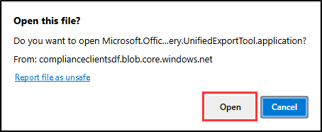

---
lab:
  title: 연습 2 - eDiscovery(표준) 및 콘텐츠 검색을 사용한 사례 조사
  module: Module 4 - Monitor and investigate data and activities by using Microsoft Purview
---

# 랩 4 - 연습 2 - eDiscovery(표준) 및 콘텐츠 검색을 사용한 사례 조사

사용자는 Contoso Ltd.의 준수 관리자인 Joni Sherman입니다. 현재 Contoso Ltd.는 전 직원이 제기한 부당한 해고 소송을 처리하고 있습니다. 모든 관련 전자 데이터를 보존하고 법적 의무를 충족하기 위해 액세스할 수 있도록 하는 것은 규정 준수 관리자의 책임입니다. 이 연습에서는 eDiscovery(표준) 및 콘텐츠 검색을 사용하여 사례를 효과적으로 관리하고 Contoso Ltd.가 소송에 필요한 전자 증거를 제공할 수 있도록 합니다.

**작업**:

1. eDiscovery에 대한 권한 할당
1. eDiscovery(표준) 케이스 만들기
1. eDiscovery(표준) 보류 만들기
1. 사서함에서 검색 및 제거 수행
1. eDiscovery(표준) 검색 만들기
1. 검색 결과 및 보고서 내보내기
1. eDiscovery(표준) 사례 마무리

## 작업 1 – eDiscovery에 대한 권한 할당

이 작업에서는 Joni Sherman 계정에 필요한 eDiscovery 권한을 할당합니다. 이러한 권한을 사용하면 잘못된 종료 사례에 필요한 eDiscovery 데이터를 관리하고 내보낼 수 있습니다.

1. 클라이언트 1 VM(SC-400-CL1)에 **SC-400-CL1\admin** 계정으로 로그인합니다.

1. **Microsoft Edge**에서 **`https://purview.microsoft.com`** 으로 이동한 다음, Microsoft Purview 포털에 **MOD 관리자** `admin@WWLxZZZZZZ.onmicrosoft.com`으로 로그인합니다(ZZZZZZ는 랩 호스팅 공급자가 제공한 고유 테넌트 ID임). 관리자의 암호는 랩 호스팅 공급자가 제공합니다.

1. 왼쪽 사이드바에서 **설정**을 선택합니다.

1. **설정** 페이지에서 **역할 및 범위**를 확장한 다음,  **역할 그룹**을 선택합니다.

1. **Microsoft Purview 솔루션용 역할 그룹** 페이지에서 `eDiscovery`을(를) 검색하고 **eDiscovery Manager** 역할 그룹을 선택합니다.

1. **eDiscovery Manager** 플라이아웃 패널에서 **편집**을 선택합니다.

1. **eDiscovery 관리자 관리** 페이지에서 **사용자 선택**을 선택합니다.

1. **사용자 선택** 플라이아웃 페이지에서 `Joni`을(를) 검색한 다음 **Joni Sherman**에 대한 확인란을 선택합니다. 패널 아래쪽에 있는 **선택** 버튼을 선택합니다.

1. **eDiscovery Manager 관리** 페이지로 돌아가서 **다음**을 선택합니다.

1. **eDiscovery 관리자(Administrator) 관리** 페이지에서 **다음**을 선택합니다.

1. **역할 그룹 검토 및 완료** 페이지에서 **저장**을 선택합니다.

1. **역할 그룹이 업데이트됨**에서 **완료**를 선택합니다.

1. 창 오른쪽 위에서 **MA**를 선택하여 MOD 관리자 계정에서 로그아웃하고 **로그아웃**을 선택합니다.

Joni의 계정에 필요한 eDiscovery 권한을 성공적으로 할당했습니다.

## 작업 2 - eDiscovery(표준) 사례 만들기

다음으로, 부당한 종료 소송에 대한 eDiscovery(표준) 사례를 만듭니다. 이 사건은 소송과 관련된 모든 활동 및 데이터에 대한 중앙 리포지토리 역할을 합니다.

1. **SC-400-CL1\admin** 계정으로 클라이언트 1 VM(SC-400-CL1)에 로그인합니다.

1. **Microsoft Edge**에서 **`https://purview.microsoft.com`** 으로 이동한 다음, Microsoft Purview 포털에 **Joni Sherman** `JoniS@WWLxZZZZZZ.onmicrosoft.com`으로 로그인합니다(ZZZZZZ는 랩 호스팅 공급자가 제공한 고유 테넌트 ID임).

1. 왼쪽 사이드바에서 **솔루션**을 선택한 다음 eDiscovery를 선택합니다.

1. **eDiscovery** 페이지의 왼쪽 사이드바에서 **표준 사례**를 선택합니다.

1. **eDiscovery(표준)** 페이지에서 **+ 사례 만들기**를 선택합니다.

1. **새 사례** 플라이아웃 패널에서 다음을 입력합니다.

   - **이름**: `Wrongful Termination Case`
   - **설명**: `Wrongful termination lawsuit filed against Contoso Ltd. by a former employee.`

1. **저장**을 선택합니다.

1. **eDiscovery(표준)** 페이지로 돌아가서 새로 만든 **부당 해고 사례**를 선택합니다.

1. 부당 해고 사례 페이지에서 **설정** 탭을 선택한 다음 **액세스 및 사용 권한**에서 **선택** 단추를 선택합니다.

1. **액세스 및 사용 권한** 플라이아웃 페이지의 **사용자**에서 **+ 추가**를 선택합니다.

1. **멤버 추가** 플라이아웃 패널에서 `Diego`을(를) 검색한 다음 **Diego Siciliani**에 대한 확인란을 선택합니다.  패널 아래쪽에서 **추가**를 선택하여 Diego에게 eDiscovery 사례에 대한 액세스 권한을 부여합니다.

1. **액세스 및 사용 권한** 페이지로 돌아가서 **닫기**를 선택하여 사례 설정 페이지로 돌아갑니다.

이제 "부당 해고 사례"라는 eDiscovery(표준) 사례를 성공적으로 만들고 액세스 및 사용 권한을 관리하는 멤버로 Diego Siciliani를 추가했습니다.

## 작업 3 - eDiscovery(표준) 보류 만들기

작업 2에서는 이전에 만든 "부당 해고 사례"의 일부로 eDiscovery(표준) 보류를 만듭니다. 이 보류는 Contoso Ltd.의 부당 해고 소송과 관련된 모든 관련 전자 데이터를 보존합니다.

1. 계속 Joni의 계정으로 Microsoft Purview에 로그인한 상태여야 하며, eDiscovery(표준)의 부당 해고 케이스의 **설정** 페이지에 있어야 합니다. 그렇지 않은 경우, `https://purview.microsoft.com`으로 이동하여 Joni Sherman으로 로그인합니다. **솔루션** > **eDiscovery** > **표준 사례** > **부당 해고 사례**를 선택합니다.

1. 상단 탐색 모음에서 **보류** 탭을 선택합니다.

1. 부당 해고 사례의 **보류** 페이지에서 **+ 만들기**를 선택합니다.

1. **보존 이름 지정** 페이지의 **새 보존** 구성에서 다음을 입력합니다.

   - **이름**: `Wrongful Termination Hold`
   - **설명**: `Legal hold to preserve all relevant electronic data related to the Wrongful Termination Case.`

1. **위치 선택** 페이지에서 **Exchange 사서함** 위치를 선택합니다.

1. **Exchange 사서함** 오른쪽의 **포함**에서 **사용자, 그룹 또는 팀 선택**을 선택합니다.

1. 오른쪽의 **Exchange 사서함** 플라이아웃 패널의 **검색** 필드에서 `Lidia`를 검색한 다음, **Lidia Holloway** 체크박스를 선택합니다. 패널 아래에서 **완료**를 선택합니다.

1. **위치 선택** 페이지에서 **다음**을 선택합니다.

1. **쿼리** 페이지에서 **새 쿼리 작성기 사용** 토글이 설정되어 있는지 확인합니다.

1. **필터** 아래, **AND** 연산자 아래에서 **필터 선택**을 선택한 다음 **날짜**를 선택합니다.

1. **날짜** 필터에 연산자를 적용하기 위한 **연산자 선택** 필드가 새로 나타납니다. **Between** 연산자를 사용하고 기본 날짜 범위를 선택한 상태로 둡니다.

1. **다음**을 선택합니다.

1. **설정 검토** 페이지에서 **제출**을 선택합니다.

1. 법적 보존을 만들었으면 **성공** 메시지가 있는 페이지에서 **완료**를 선택합니다.

**부당 해고 사례**를 만들고 액세스 및 사용 권한을 관리하는 구성원으로 Diego Siciliani를 추가했습니다. 이 사례는 이제 추가 eDiscovery 작업을 수행할 준비가 되었습니다.

## 작업 4 - 사서함에서 검색 및 제거 수행

사례 관련 데이터에 대한 자세한 검색을 수행하기 전에 데이터 세트를 오염시킬 수 있는 피싱 이메일을 제거하는 것이 중요합니다. 이 작업에서는 검색 및 제거 작업을 수행하여 모든 사서함에서 원치 않는 이메일을 제거합니다.

1. 계속 Joni의 계정으로 Microsoft Purview에 로그인되어 있어야 하며 Microsoft Purview 내의 **준수 관리자**여야 합니다. 그렇지 않은 경우, `https://purview.microsoft.com`으로 이동하여 Joni Sherman으로 로그인합니다. **솔루션** > **eDiscovery**를 선택합니다.

1. 왼쪽 사이드바에서 **콘텐츠 검색**을 확장한 다음 **검색**을 선택합니다.

1. 1. **콘텐츠 검색** 페이지에서 **+ 새 검색**을 선택합니다.

1. **새 검색** 구성의 **이름 및 설명** 페이지에서 검색 이름으로 `Phishing mail removal`를 입력한 다음, **다음**을 선택합니다.

1. **위치** 페이지에서 **Exchange 사서함** 위치를 선택한 다음, **다음**을 선택합니다.

1. **키워드** 상자의 **검색 조건 정의** 페이지에서 `From:phishingmail@outlook.com AND subject:"Password changed"`을 입력한 다음, **다음**을 선택합니다.

1. **검색 항목을 검토한 후 만들기** 창에서 **제출**을 선택합니다.

1. 검색이 만들어지면 **새 검색이 만들어짐** 페이지에서 **완료**를 선택합니다.

1. 검색이 만들어지면 **Security & Compliance PowerShell**을 사용하여 제거를 시작해야 합니다. 시작 메뉴에서 Windows 단추를 마우스 오른쪽 단추로 클릭한 다음 **터미널(관리자)** 을 선택합니다.

1. **Connect-IPPSSession** cmdlet을 실행하여 **보안 및 규정 준수 PowerShell**에 연결합니다.

    ```powershell
    Connect-IPPSSession
    ```

1. 로그인 프롬프트가 표시되면 **MOD 관리자**(`admin@WWLxZZZZZZ.onmicrosoft.com`)로 로그인합니다(여기서 ZZZZZZ는 랩 호스팅 공급자가 제공한 고유 테넌트 ID임).

1. **New-ComplianceSearchAction** cmdlet을 실행하여 **피싱 이메일 제거** 검색에서 찾은 결과를 제거합니다.

    ```powershell
    New-ComplianceSearchAction -SearchName "Phishing mail removal" -Purge -PurgeType HardDelete
    ```

1. 예의 터미널 창에 **Y**를 입력한 다음, **Enter** 키를 눌러 작업을 확인합니다.

1. 터미널 창을 닫습니다.

사서함에서 피싱 이메일을 제거했습니다. 이를 통해 후속 검색이 관련 및 합법적인 데이터에만 초점을 맞출 수 있습니다.

## 작업 3 - eDiscovery(표준) 검색 만들기

사서함이 정리되면 이제 eDiscovery(표준) 검색을 만들어 부당 해고 소송과 관련된 모든 전자 데이터를 식별하고 수집합니다. 이 검색은 사례에 필요한 증거를 수집하는 데 도움이 됩니다.

1. Microsoft Purview에는 계속 Joni로 로그인되어 있어야 합니다. `https://purview.microsoft.com`으로 이동하여 Joni Sherman으로 로그인합니다.

1. **솔루션**을 선택한 다음 **eDiscovery**를 선택합니다.

1. 왼쪽 사이드바에서 **eDiscovery(표준)** 를 선택한 다음, 이전 작업에서 만든 **부당 해고 사례**를 선택합니다.

1. 부당 해고 사례 내의 위쪽 탐색 모음에서 **검색** 탭을 선택합니다.

1. 부당 해고 사례 페이지의 **검색** 페이지에서 **+ 새 검색**을 선택합니다.

1. **새 검색** 구성의 **이름 및 설명** 페이지에서 다음을 입력합니다.

   - **이름**: `Wrongful Termination Search`
   - **설명**: `Search to identify and collect all relevant electronic data related to the Wrongful Termination Case.`

1. **위치** 페이지에서 **Exchange 사서함**, **SharePoint 사이트** 및 **Exchange 공용 폴더**에 대해 **켜기**를 선택한 후 **다음**을 선택합니다.

1. **검색 조건 정의** 페이지에서 **KQL 편집기**의 라디오 단추를 선택합니다.

1. KQL 편집기 상자에 다음을 입력합니다.

    ```text
    To:Lidia OR From:Lidia OR Cc:Lidia OR Bcc:Lidia
    ```

1. **다음**을 선택합니다.

1. **검색 항목을 검토한 후 만들기** 페이지에서 **제출**을 선택합니다.

1. 검색을 만들었으면 **새 검색이 만들어짐** 페이지에서 **완료**를 선택합니다.

KQL 편집기를 사용하여 **부당 해고 검색**을 만들었습니다. 이 검색은 사례와 관련된 모든 관련 전자 데이터를 식별하고 수집하는 데 도움이 됩니다.

## 작업 6 - 검색 결과 및 보고서 내보내기

이 작업에서는 검색 결과를 내보내고 자세한 보고서를 생성합니다. 이러한 내보내기 및 보고서는 수집된 데이터를 검토하고 분석하여 부당 해고 사례를 지원하는 데 중요합니다.

1. 계속 Joni의 계정으로 Microsoft Purview에 로그인해야 하며 eDiscovery(표준)의 부당 해고 사례의 **검색** 페이지에 계속 있어야 합니다. 그렇지 않은 경우, `https://purview.microsoft.com`으로 이동하여 Joni Sherman으로 로그인합니다. ***솔루션** > **eDiscovery** > **표준 케이스** > **부당 해고 케이스**를 선택합니다.

1. **검색** 페이지에서 **부당 해고 검색**에 대한 필드(체크박스 아님)를 선택합니다.

1. 오른쪽의 **부당 해고 검색** 플라이아웃 페이지에서 패널 아래쪽에 있는 **작업** 드롭다운을 선택한 다음, **결과 내보내기**를 선택합니다.

1. **결과 내보내기** 페이지의 **출력 옵션**에서 **형식을 인식할 수 없거나, 암호화되어 있거나, 다른 이유로 인덱싱되지 않은 항목을 제외한 모든 항목**을 선택합니다.

1. **다음으로 Exchange 콘텐츠 내보내기**에서 **사서함마다 PST 파일 1개씩**을 선택합니다.

1. 아래로 스크롤하여 **Exchange 콘텐츠에 대한 중복 제거 사용** 및 **SharePoint 파일에 대한 버전 포함** 체크박스를 선택합니다.

1. 패널 아래에 있는 예측 보고서를 검토하여 내보낼 항목의 유형, 항목 수 및 크기를 파악한 다음, **내보내기**를 선택합니다.

1. **Microsoft Purview** 팝업이 표시되어 **작업이 만들어졌음**을 알려 줍니다. **확인**을 선택합니다.

1. **검색** 페이지로 돌아가서 위쪽 탐색 모음에서 **내보내기** 탭을 선택합니다. **Wrongful Termination Search_Export**라는 작업을 선택합니다.

    >**참고**: 내보내기 상태가 **예약하는 중...** 으로 표시되어 있으면 **내보내기 키**를 사용할 수 있을 때까지 **새로 고침**을 선택합니다. 몇 분 정도 걸릴 수 있습니다.

1. 내보내기 키가 사용 가능하면 **부당 해고 검색_내보내기** 플라이아웃 패널의 **내보내기 키**에서 **클립보드에 복사**를 선택하여 내보내기 키를 복사합니다.

1. **부당 해고 검색_내보내기** 패널의 위에서 **결과 다운로드**를 선택하여 결과를 다운로드합니다.

1. Microsoft Edge에서 파일을 열라는 메시지가 표시됩니다. eDiscovery 내보내기 도구입니다. 메시지가 표시되면 **열기**를 선택합니다.

   

1. **애플리케이션 설치** 창에서 **설치**를 선택하여 **Microsoft Office 365 eDiscovery 내보내기 도구**를 설치하고 **설치**를 선택합니다

1. eDiscovery 내보내기 도구의 **원본에 연결하는 데 사용할 내보내기 키 붙여넣기:** 필드에서 이전 단계에서 복사한 **내보내기 키**를 붙여넣습니다.

1. **다운로드한 파일을 저장하는 데 사용할 위치 선택:** 에서 **찾아보기**를 선택합니다.

1. **폴더 찾아보기** 창에서 **문서**를 선택한 다음, **확인**을 선택합니다.

1. **eDiscovery 내보내기 도구**로 돌아와서 **시작**을 선택하여 파일을 내보냅니다.

1. **처리가 완료됨**에 대한 녹색 확인 표시가 나타나면 결과가 다운로드된 것입니다. **닫기**를 선택하여 창을 닫습니다.

1. **eDiscovery 내보내기 도구**에서 **내보내기 위치:** 링크를 선택하여 로컬로 내보낸 파일을 엽니다.

1. 내보내기의 콘텐츠 탐색:

    **내보내기의 포함 항목:**
    - **내보내기 요약:** 검색된 콘텐츠 원본 수, 검색 결과의 예상 및 다운로드 크기, 내보낸 예상 및 다운로드된 항목 수를 포함하여 내보내기의 요약이 포함된 Excel 문서입니다.
    - **매니페스트:** 검색 결과에 포함된 각 항목에 대한 정보가 포함된 매니페스트 파일(XML 형식).
    - **Results:** 검색 결과의 인덱싱된 각 항목에 대한 세부 정보를 제공하는 Excel 문서입니다. 이메일의 경우 메시지 위치, 날짜, 제목, 보낸 사람 및 받는 사람이 포함됩니다. SharePoint 및 비즈니스용 OneDrive 문서의 경우 문서 URL, 사이트 모음 URL, 수정 날짜 및 문서 이름이 포함됩니다.
    - **건너뛴 항목:** 폴더 또는 문서 집합과 같이 다운로드되지 않는 항목에 대한 정보가 포함된 Excel 문서입니다.
    - **Trace.log:** 내보내기 프로세스에 대한 자세한 로깅 정보를 포함하며 내보내기 중에 문제를 파악하는 데 도움이 될 수 있습니다.
    - 모든 검색 결과 및 내보내기 보고서는 콘텐츠 검색과 이름이 같은 폴더에 포함됩니다. 내보낸 이메일 메시지는 **Exchange**라는 폴더에 있습니다. 문서는 **SharePoint**라는 폴더에 있습니다.

    **부당 해고 검색**에 대한 검색 결과를 내보냈습니다.

1. 내보내기를 탐색한 후 폴더 창을 닫고 Microsoft Edge의 Microsoft Purview 브라우저 창으로 돌아가서 **부당 해고 검색_내보내기** 패널에서 **닫기**를 선택합니다.

1. **내보내기** 페이지로 돌아가서 **검색** 탭을 선택합니다.

1. **검색** 페이지에서 **부당 해고 검색**에 대한 필드(체크박스 아님)를 선택합니다.

1. 오른쪽의 **부당 해고 검색** 플라이아웃 패널에서 패널 아래쪽에 있는 **작업** 드롭다운을 선택한 다음, **보고서 내보내기**를 선택합니다.

1. **보고서 내보내기** 페이지의 **출력 옵션**에서 **형식을 인식할 수 없거나, 암호화되어 있거나, 다른 이유로 인덱싱되지 않은 항목을 제외한 모든 항목**을 선택합니다.

1. **Exchange 콘텐츠에 중복 제거를 사용하도록 설정**하려면 체크박스를 선택한 다음 **보고서 생성**을 선택합니다.

1. **Microsoft Purview** 팝업이 표시되어 **작업이 만들어졌음**을 알려 줍니다. **확인**을 선택합니다.

1. **검색** 페이지로 돌아가서 위쪽 탐색 모음에서 **내보내기** 탭을 선택합니다. **Wrongful Termination Search_ReportsOnly**라는 보고서가 있어야 합니다.

    >**참고**: 내보내기 상태가 **예약하는 중...** 으로 표시되어 있으면 **내보내기 키**를 사용할 수 있을 때까지 **새로 고침**을 선택합니다. 몇 분 정도 걸릴 수 있습니다.

1. 내보내기 키가 사용 가능하면 **부당 해고 검색_보고서만** 플라이아웃 패널의 **내보내기 키**에서 **클립보드에 복사**를 선택하여 내보내기 키를 복사합니다.

1. **Wrongful Termination Search_ReportsOnly** 페이지의 맨 위에서 **보고서 다운로드**를 선택하여 보고서를 다운로드합니다.

1. 메시지가 표시되면 **열기**를 선택하여 eDiscovery 내보내기 도구를 엽니다.

1. eDiscovery 내보내기 도구의 **원본에 연결하는 데 사용할 내보내기 키 붙여넣기:** 필드에서 이전 단계에서 복사한 **내보내기 키**를 붙여넣습니다.

1. **다운로드한 파일을 저장하는 데 사용할 위치 선택:** 에서 **찾아보기**를 선택합니다.

1. **폴더 찾아보기** 창에서 **문서**를 선택한 다음, **확인**을 선택합니다.

1. **eDiscovery 내보내기 도구**로 돌아와서 **시작**을 선택하여 보고서를 다운로드합니다.

1. **처리가 완료됨**에 대한 녹색 확인 표시가 나타나면 보고서가 다운로드된 것입니다. **닫기**를 선택하여 창을 닫습니다.

1. **eDiscovery 내보내기 도구**에서 **내보내기 위치:** 링크를 선택하여 로컬로 다운로드한 보고서를 엽니다.

1. 보고서의 콘텐츠 탐색:

    **보고서의 포함 항목:**
    - **내보내기 요약:** 검색된 콘텐츠 원본 수, 검색 결과의 예상 및 다운로드 크기, 내보낸 예상 및 다운로드된 항목 수를 포함하여 내보내기의 요약이 포함된 Excel 문서입니다.
    - **매니페스트:** 검색 결과에 포함된 각 항목에 대한 정보가 포함된 매니페스트 파일(XML 형식).
    - **Results:** 검색 결과의 인덱싱된 각 항목에 대한 세부 정보를 제공하는 Excel 문서입니다. 이메일의 경우 메시지 위치, 날짜, 제목, 보낸 사람 및 받는 사람이 포함됩니다. SharePoint 및 비즈니스용 OneDrive 문서의 경우 문서 URL, 사이트 모음 URL, 수정 날짜 및 문서 이름이 포함됩니다.
    - **Trace.log:** 내보내기 프로세스에 대한 자세한 로깅 정보를 포함하며 내보내기 중에 문제를 파악하는 데 도움이 될 수 있습니다.

1. 내보낸 결과 검토가 완료되면 eDiscovery 내보내기 도구와 파일 탐색기 창을 닫은 다음 Microsoft Edge로 다시 이동합니다.

**부당 해고 검색**에 대한 검색 결과를 내보내고 필요한 보고서를 생성했습니다. 이러한 문서에는 내보내기 요약, 매니페스트, 자세한 항목 결과 및 추적 로그가 포함됩니다. 이러한 결과를 검토하고 분석하여 사례와 관련된 인사이트를 파악합니다.

## 작업 7 - eDiscovery(표준) 사례 종료

이 마지막 작업에서는 부당 해고 소송에 대한 eDiscovery 사례를 종료합니다. 이 단계에서는 필요한 모든 데이터 컬렉션 및 검토 작업이 완료되었음을 보여 줍니다.

1. 계속 Joni의 계정으로 Microsoft Purview에 로그인해야 하며 eDiscovery(표준)의 부당 해고 사례의 **내보내기** 페이지에 계속 있어야 합니다. 그렇지 않은 경우, `https://purview.microsoft.com`으로 이동하여 Joni Sherman으로 로그인합니다. ***솔루션** > **eDiscovery** > **표준 케이스** > **부당 해고 케이스**를 선택합니다.

1. **홈** 탭을 선택한 다음, **x 사례 종료**를 선택합니다.

1. 케이스를 닫으면 모든 보류가 해제되어 데이터가 손실될 수 있음을 알리는 **경고** 대화 상자를 검토합니다.

1. 경고 메시지에서 **확인**을 선택합니다.

사례를 다시 여는 옵션을 사용하여 **부당 해고 사례**를 종료했습니다. 즉, 모든 eDiscovery 작업이 완료되고 다음 단계에 대해 사례가 준비됩니다. 해당 작업은 Contoso Ltd.가 소송에 대비하도록 보장합니다.
