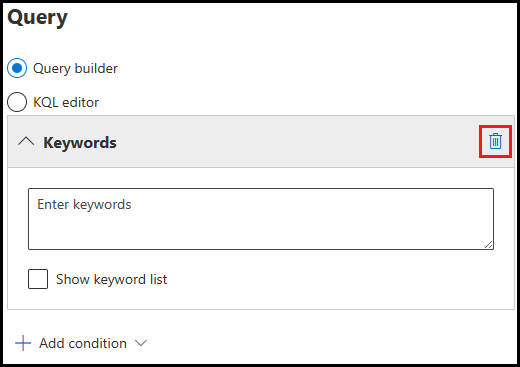

---
lab:
  title: 연습 2 - eDiscovery(표준) 및 콘텐츠 검색을 사용하여 사례 조사
  module: Module 4 - Monitor and investigate data and activities by using Microsoft Purview
---

# 랩 4 - 연습 2 - eDiscovery(표준) 및 콘텐츠 검색

현재 Contoso Ltd.의 규정 준수 관리 주체인 Joni Sherman은 전 직원이 제기한 부당한 해고 소송을 처리하고 있습니다. 귀하의 책임의 일환으로, 여러분은 사건과 관련된 필요한 전자 데이터를 보존하는 임무를 맡게 됩니다. 이를 위해 eDiscovery(표준)를 사용하여 관련 정보를 식별하고 보호합니다. eDiscovery 기술을 사용하면 Contoso Ltd.가 소송에 필요한 전자 증거를 보존하고 액세스하여 법적 의무를 충족할 수 있는지 확인합니다.

## 작업 1 - eDiscovery(표준) 사례 만들기

이 작업에서는 eDiscovery(표준) 사례를 Joni Sherman으로 만듭니다.

1. 클라이언트 1 VM(LON-CL1)에 lon-cl1\admin** 계정으로 **로그인합니다.

1. **Microsoft Edge**에서 **https://compliance.microsoft.com**으로 이동한 다음, Microsoft Purview 포털에 **Joni Sherman** JoniS@WWLxZZZZZZ.onmicrosoft.com으로 로그인합니다(ZZZZZZ는 랩 호스팅 공급자가 제공한 고유 테넌트 ID임).

1. 왼쪽 탐색 창에서 eDiscovery**에 대한 **드롭다운을 선택한 다음, 표준을** 선택합니다**.

1. **eDiscovery(표준)** 에서 + 사례** 만들기를 선택합니다**.

1. **새 사례** 플라이아웃 페이지의 **이름** 필드에 잘못된 종료 사례를** 입력**합니다.

1. **설명** 필드에 이 **eDiscovery 사건은 전 직원이 Contoso Ltd.를 상대로 제기한 부당한 해고 소송과 관련이 있습니다.** 그런 다음 저장**을 선택합니다**.

1. **eDiscovery(표준)** 페이지로 돌아가서 새로 만든 **잘못된 종료 사례를** 선택합니다.

1. 잘못된 종료 사례 페이지의 위쪽 탐색 모음에서 설정 선택한 **다음, 액세스 및 권한** 아래에서 **선택** 단추를 선택합니다**.**

1. **액세스 및 권한** 플라이아웃 페이지의 사용자** 아래에서 **+ 추가**를 선택합니다**.

1. **Diego_에 대한 _구성원** 추가 플라이아웃 페이지에서 디에고 시칠리아니_ 왼쪽의 _검사 상자를 선택한 다음, 페이지 맨 아래에 있는 추가**를 선택하여 **Diego에게 eDiscovery 사례에 대한 액세스 권한을 부여합니다.

1. **액세스 및 사용 권한** 페이지로 돌아가서 닫기를** 선택하여 **사례 설정 페이지로 돌아갑니다.

이제 "잘못된 종료 사례"라는 eDiscovery(표준) 사례를 성공적으로 만들고 액세스 및 권한을 관리하는 멤버로 Diego Siciliani를 추가했습니다.

## 작업 2 - eDiscovery(표준) 보류 만들기

작업 2에서는 이전에 만든 "잘못된 종료 사례"의 일부로 eDiscovery(표준) 보류를 만듭니다. 이 보류는 Contoso Ltd. 부당 해지 소송과 관련된 모든 관련 전자 데이터를 보존합니다.

1. 여전히 Joni의 계정으로 로그인해야 합니다. 그렇지 않은 경우 Microsoft Edge를 열고 **Microsoft Purview 포털로 이동하여**https://compliance.microsoft.com** Joni Sherman**으로 **로그인합니다.**

1. 왼쪽 탐색 창에서 eDiscovery**로 이동**한 다음, 표준을** 선택합니다**.

1. **이전 작업에서 만든 잘못된 종료 사례를** 선택한 다음, 보류**를 선택합니다**.

1. **잘못된 종료 사례의 보류** 페이지에서 + 만들기**를 선택합니다**.

1. 오른쪽의 **새 보류** 플라이아웃 페이지에서 이름** 필드의 **보류** 이름 아래에 **잘못된 종료 보류_를 입력_합니다. 설명 필드에 이 _법적 보존은 Contoso Ltd. 부당 해지 소송과 관련이 있으며 사건과 관련된 모든 관련 전자 데이터를 보존하도록 설계되었습니다._ 다음을 선택합니다****.** ** 

1. **위치** 선택 페이지에서 Exchange 사서함을** 선택합니다**. 포함에서 **사용자, 그룹 또는 팀** 선택을 선택합니다**.**

1. 오른쪽**의 **Exchange 사서함** 플라이아웃 페이지에서 검색** 필드에서 Lidia를 _검색한 다음, Lidia_ Holloway**의 왼쪽**에 있는 검사 상자를 선택합니다. **완료**를 선택합니다.

1. **위치** 선택 페이지로 돌아가서 다음**을 선택합니다**.

1. **쿼리** 페이지에서 쿼리 작성**기가 선택되어 있는지 확인하고 **키워드** 상자에서 **휴지통을 선택하여 이 검색 조건을 제거합니다.

      

1. + 조건** 추가에 대한 드롭다운을 **선택한 다음, 날짜를** 선택합니다**.

1. 날짜 필드에 기본 날짜 범위를 그대로 **** 두고 다음**을 선택합니다**.

1. **설정** 검토 페이지에서 제출**을 선택합니다**.

1. 보류 **가 성공했다**는 메시지가 표시됩니다. 이 페이지에서 완료**를 선택합니다**.

eDiscovery(표준) 보류를 성공적으로 만들었습니다.

## 작업 3 - eDiscovery(표준) 검색 만들기

작업 3에서는 이전에 만든 "잘못된 종료 사례" 내에서 eDiscovery(표준) 검색을 수행합니다. 이 검색은 Contoso Ltd. 부당 해지 소송과 관련된 모든 관련 전자 데이터를 식별하고 수집하는 것을 목표로 합니다.

1. 여전히 Joni의 계정으로 로그인해야 합니다. 그렇지 않은 경우 Microsoft Edge를 열고 **Microsoft Purview 포털로 이동하여**https://compliance.microsoft.com** Joni Sherman**으로 **로그인합니다.**

1. 왼쪽 탐색 창에서 eDiscovery**로 이동**한 다음, 표준을** 선택합니다**.

1. **이전 작업에서 만든 잘못된 종료 사례를** 선택한 다음 검색을 선택합니다****.

1. **잘못된 종료 사례 페이지의 검색** 페이지에서 + 새 검색**을 선택합니다**.

1. **새 검색** 마법사의 **이름 및 설명** 페이지에서 이름** 필드에 잘못된 종료 검색_을 **입력_합니다. **설명** 필드에 입력 _이 검색은 Contoso Ltd. 부당 해지 소송과 관련이 있으며 사건과 관련된 모든 관련 전자 데이터를 식별하고 수집하도록 설계되었습니다._ **다음**을 선택합니다.

1. **위치** 페이지에서 Exchange 사서함 **, ****SharePoint 사이트** 및 **Exchange 공용 폴더에 대해 **켜**기를 선택한 다음, 다음**을** 선택합니다**.

1. **검색 조건** 정의 페이지에서 KQL 편집**기 방사형을 **선택합니다.

1. KQL 편집기 상자에 다음을 입력합니다.

    ```text
    To:Lidia OR From:Lidia OR Cc:Lidia OR Bcc:Lidia
    ```

1. **다음**을 선택합니다.

1. **검색 검토 및 만들기** 페이지에서 제출**을 선택합니다**.

1. **새로 만든** 검색 페이지에서 완료**를 선택합니다**.

KQL 편집기를 사용하여 "잘못된 종료 검색"을 성공적으로 만들고 검색 조건을 정의함으로써 Contoso Ltd. 부당 해지 소송과 관련된 모든 관련 전자 데이터를 식별하고 수집하는 검색 프로세스를 시작했습니다.

## 작업 4: 검색 결과 내보내기

이 작업에서는 "잘못된 종료 검색"에서 얻은 검색 결과를 내보냅니다.

1. 여전히 Joni의 계정으로 로그인해야 합니다. 그렇지 않은 경우 Microsoft Edge에서 **Joni Sherman**으로 Microsoft Purview 포털로 **이동하여 **https://compliance.microsoft.com** 로그인합니다.**

1. 왼쪽 탐색 창에서 eDiscovery**로 이동**한 다음, 표준을** 선택합니다**.

1. **이전 작업에서 만든 잘못된 종료 사례를** 선택한 다음 검색을 선택합니다****.

1. **검색** 섹션에서 이전 작업에서 수행된 잘못된 종료 검색**을 선택합니다**.

1. 오른쪽의 **잘못된 종료 검색** 플라이아웃 페이지에서 페이지 아래쪽의 작업** 드롭다운을 선택한 **다음, 결과** 내보내기를 선택합니다**.

1. 출력 옵션 아래의 결과 내보내기 페이지에서 인식할 수 없는 형식이거나 암호화되거나 다른 이유로** 인덱싱되지 않은 항목을 제외한 모든 항목을 선택합니다**.** ****** 

1. Exchange 콘텐츠** 내보내기에서 **각 사서함**에 대해 하나의 PST 파일을 선택합니다**.

1. 아래로 스크롤하여 Exchange 콘텐츠 **** 에 중복 제거를 사용하도록 설정하고 SharePoint 파일**의 **버전 포함을 위해 검사 상자를 선택합니다.

1. 화면 맨 아래에 있는 예측 보고서를 검토하여 항목 유형, 항목 수 및 내보낼 항목의 크기를 파악한 다음 내보내기를 선택합니다****.

1. **작업이 생성**되었음을 알리는 **규정 준수** 팝업이 표시됩니다. **확인**을 선택합니다.

1. **검색** 페이지로 돌아가서 위쪽 탐색 모음에서 내보내기** 탭을 선택합니다**. 잘못된 종료 Search_Export 작업을 **선택합니다.**

    >**참고**: 내보내기의 상태 일정**으로 표시**되어 있으면 내보내기 키를** 사용할 수 있게 될 때까지 새로 고침**을 **선택합니다**.

1. **잘못된 종료 Search_Export** 플라이아웃 페이지의 내보내기 키** 아래에서 **클립보드**로 복사를 **선택하여 내보내기 키를 복사합니다.

1. 잘못된 종료 Search_Export** 페이지의 맨 위에서 **결과 다운로드를 선택하여 **결과를** 다운로드합니다.

1. **eDiscovery 내보내기 도구**를 설치하라는 메시지가 표시되면 **설치**를 선택합니다.

1. eDiscovery 내보내기 도구의 **원본**에 연결하는 데 사용할 내보내기 키를 붙여넣습니다. 필드, 이전 단계에서 복사한 내보내기 키**에 **붙여넣습니다.

1. 다운로드한 파일을 저장하는 데 사용할 위치 선택에서 **찾아보기를** 선택합니다**.**

1. **폴더** 찾아보기 창에서 문서를** 선택한 **다음 확인을** 선택합니다**.

1. eDiscovery 내보내기 도구**로 **돌아가서 시작을** 선택하여 **파일을 내보냅니다.

1. 처리에 대한 **녹색 검사 표시가 완료되면 완료됩니다.** 결과가 다운로드되었습니다. **닫기**를 선택하여 창을 닫습니다.

1. **eDiscovery 내보내기 도구**에서 내보내기 위치**의 링크를 **선택하여 로컬로 내보낸 파일을 엽니다.

1. 내보내기의 내용을 탐색합니다.

    **내보내기 포함:**
    - **내보내기 요약:** 검색된 콘텐츠 원본 수, 검색 결과의 예상 및 다운로드 크기, 내보낸 예상 및 다운로드한 항목 수를 포함하여 내보내기의 요약이 포함된 Excel 문서입니다.
    - **매니페스트:** 검색 결과에 포함된 각 항목에 대한 정보를 포함하는 매니페스트 파일(XML 형식)입니다.
    - **결과:** 검색 결과의 인덱싱된 각 항목에 대한 세부 정보를 제공하는 Excel 문서입니다. 전자 메일의 경우 메시지 위치, 날짜, 제목, 보낸 사람 및 받는 사람이 포함됩니다. SharePoint 및 비즈니스용 OneDrive 문서의 경우 문서 URL, 사이트 모음 URL, 수정 날짜 및 문서 이름이 포함됩니다.
    - **건너뛴 항목:** 폴더 또는 문서 집합과 같이 다운로드되지 않는 항목에 대한 정보가 포함된 Excel 문서입니다.
    - **Trace.log:** 내보내기 프로세스에 대한 자세한 로깅 정보를 포함하며 내보내기 중에 문제를 파악하는 데 도움이 될 수 있습니다.
    - 모든 검색 결과 및 내보내기 보고서는 콘텐츠 검색과 이름이 같은 폴더에 포함됩니다. 내보낸 전자 메일 메시지는 Exchange**라는 **폴더에 있습니다. 문서는 SharePoint**라는 **폴더에 있습니다.

잘못된 종료 검색에 대한 **검색 결과를 성공적으로 내보냅니다**.

## 작업 5: 검색 보고서 내보내기

이 작업에서는 "잘못된 종료 검색"에서 얻은 검색 결과를 검토하여 사례와 관련된 잠재적인 보안 또는 규정 준수 문제를 식별합니다.

1. 여전히 Joni의 계정으로 로그인해야 합니다. 그렇지 않은 경우 Microsoft Edge에서 **Joni Sherman**으로 Microsoft Purview 포털로 **이동하여 **https://compliance.microsoft.com** 로그인합니다.**

1. 왼쪽 탐색 창에서 eDiscovery**로 이동**한 다음, 표준을** 선택합니다**.

1. **이전 작업에서 만든 잘못된 종료 사례를** 선택한 다음 검색을 선택합니다****.

1. **검색** 섹션에서 이전 작업에서 수행된 잘못된 종료 검색**을 선택합니다**.

1. 오른쪽의 **잘못된 종료 검색** 플라이아웃 페이지에서 페이지 아래쪽의 작업** 드롭다운을 선택한 **다음 보고서** 내보내기를 선택합니다**.

1. 보고서 내보내기 페이지의 출력 옵션**에서 **인식할 수 없는 형식이 있거나 암호화되었거나 다른 이유로** 인덱싱되지 않은 항목을 제외한 모든 항목을 선택합니다**.** ** 

1. **보고서 생성**을 선택합니다.

1. **작업이 생성**되었음을 알리는 **규정 준수** 팝업이 표시됩니다. **확인**을 선택합니다.

1. **검색** 페이지로 돌아가서 위쪽 탐색 모음에서 내보내기** 탭을 선택합니다**. 잘못된 종료 Search_ReportsOnly** 보고서가 **있어야 합니다.

1. **잘못된 종료 Search_ReportsOnly** 보고서를 **선택하면 잘못된 종료 Search_ReportsOnly** 플라이아웃 페이지가 오른쪽에 표시됩니다.

1. **잘못된 종료 Search_ReportsOnly** 플라이아웃 페이지의 내보내기 키**에서 **클립보드**로 복사를 **선택하여 내보내기 키를 복사합니다.

1. 잘못된 종료 Search_ReportsOnly** 페이지의 맨 위에서 **보고서 다운로드를 선택하여 **보고서를** 다운로드합니다.

1. **eDiscovery 내보내기 도구**를 설치하라는 메시지가 표시되면 **설치**를 선택합니다. 도구가 이미 설치된 경우 열기**를 선택합니다**.

1. eDiscovery 내보내기 도구의 **원본**에 연결하는 데 사용할 내보내기 키를 붙여넣습니다. 필드, 이전 단계에서 복사한 내보내기 키**에 **붙여넣습니다.

1. 다운로드한 파일을 저장하는 데 사용할 위치 선택에서 **찾아보기를** 선택합니다**.**

1. **폴더** 찾아보기 창에서 문서를** 선택한 **다음 확인을** 선택합니다**.

1. eDiscovery 내보내기 도구**로 **돌아가서 보고서를 다운로드하려면 시작을** 선택합니다**.

1. 처리에 대한 **녹색 검사 표시가 완료되면** 보고서가 다운로드됩니다. **닫기**를 선택하여 창을 닫습니다.

1. **eDiscovery 내보내기 도구**에서 내보내기 위치**의 링크를 **선택하여 로컬로 다운로드한 보고서를 엽니다.

1. 보고서의 내용을 탐색합니다.

    **보고서에 포함됨:**
    - **내보내기 요약:** 검색된 콘텐츠 원본 수, 검색 결과의 예상 및 다운로드 크기, 내보낸 예상 및 다운로드한 항목 수를 포함하여 내보내기의 요약이 포함된 Excel 문서입니다.
    - **매니페스트:** 검색 결과에 포함된 각 항목에 대한 정보를 포함하는 매니페스트 파일(XML 형식)입니다.
    - **결과:** 검색 결과의 인덱싱된 각 항목에 대한 세부 정보를 제공하는 Excel 문서입니다. 전자 메일의 경우 메시지 위치, 날짜, 제목, 보낸 사람 및 받는 사람이 포함됩니다. SharePoint 및 비즈니스용 OneDrive 문서의 경우 문서 URL, 사이트 모음 URL, 수정 날짜 및 문서 이름이 포함됩니다.
    - **Trace.log:** 내보내기 프로세스에 대한 자세한 로깅 정보를 포함하며 내보내기 중에 문제를 파악하는 데 도움이 될 수 있습니다.

1. 내보낸 결과 검토가 완료되면 eDiscovery 내보내기 도구와 파일 탐색기 창을 닫은 다음 Microsoft Edge로 다시 이동합니다.

잘못된 종료 검색에 대한 **검색 보고서를 성공적으로 내보냅니다**. 보고서에는 내보내기 요약, 매니페스트, 자세한 항목 결과 및 추적 로그와 같은 정보가 포함됩니다. 이러한 결과를 검토하고 분석하여 사례와 관련된 인사이트를 파악합니다. 검토를 완료하면 eDiscovery 내보내기 도구 및 파일 탐색기 창을 닫을 수 있습니다.
