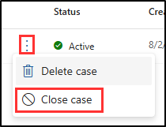

---
lab:
  title: 연습 3 - eDiscovery(프리미엄)를 사용하여 사례 조사
  module: Module 4 - Monitor and investigate data and activities by using Microsoft Purview
---

# 랩 4 - 연습 3 - eDiscovery(표준) 및 콘텐츠 검색을 사용한 사례 조사

사용자는 Contoso Ltd의 규정 준수 관리자인 Joni Sherman입니다. 이 회사는 현재 잠재적인 지적 재산권 도용에 관한 법적 조사를 받고 있습니다. 규정 준수 관리자는 법적 및 내부 검토 의무를 충족하기 위해 모든 관련 전자 데이터를 보존하고 액세스할 수 있도록 해야 합니다. 이 연습에서는 eDiscovery(프리미엄)를 사용하여 사례를 효과적으로 관리하여 Contoso Ltd.가 조사에 필요한 전자 증거를 제공할 수 있도록 합니다.

1. eDiscovery(프리미엄) 사례 만들기
1. 사례에 보유자 추가
1. 컬렉션 추정 만들기 및 실행
1. 검토 집합에 컬렉션을 커밋
1. 검토 집합 살펴보기
1. 검색 결과 내보내기
1. eDiscovery(프리미엄) 케이스 닫기

## 작업 1 - eDiscovery(프리미엄) 사례 만들기

먼저 eDiscovery(프리미엄) 사례를 만들어 조사를 시작합니다. 이 경우는 지적 재산권 도용 조사와 관련된 모든 활동 및 데이터에 대한 중앙 리포지토리가 됩니다.

1. **SC-400-cl1\admin** 계정으로 클라이언트 1 VM(SC-400-CL1)에 로그인합니다.

1. **Microsoft Edge**에서 **`https://purview.microsoft.com`** 으로 이동한 다음, Microsoft Purview 포털에 **Joni Sherman** `JoniS@WWLxZZZZZZ.onmicrosoft.com`으로 로그인합니다(ZZZZZZ는 랩 호스팅 공급자가 제공한 고유 테넌트 ID임).

1. 왼쪽 사이드바에서 **솔루션**을 선택한 다음 **eDiscovery**를 선택합니다.

1. **eDiscovery** 페이지의 왼쪽 사이드바에서 **프리미엄 사례**를 확장한 다음 **사례**를 선택합니다.

1. **eDiscovery(프리미엄)** 페이지에서 **+ 사례 만들기**를 선택합니다.

1. 오른쪽의 **사례 이름 지정** 플라이아웃 패널에서 다음을 입력합니다.

   - **이름**: `Contoso IP Theft Investigation`
   - **설명**: `Case for the 2024 investigation into potential intellectual property theft involving relevant emails and documents.`
   - **Docket 번호**: `2024-IP-INV-001`

1. **다음**을 선택합니다.

1. **팀 구성원 추가 및 설정 구성** 페이지의 **사용자** 필드에서 `Joni`를 검색하고 **Joni Sherman**을 선택합니다. Joni와 함께 조사를 수행하기 위해 `Megan`을 검색하고 **Megan Bowen**을 사용자로 추가합니다.

1. 다른 값을 기본값으로 유지한 다음, **다음**을 선택합니다.

1. **사례 검토** 페이지에서 **제출**을 선택합니다.

1. 사례가 생성되면 **새 사례가 준비됨** 페이지에서 **완료**를 선택합니다.

새 eDiscovery 사례를 만들었습니다.

## 작업 2 – 사례에 보유자 추가

이제 사례를 만들었으므로 보유자를 추가해야 합니다. 보유자는 조사에 대한 관련 정보를 소유할 수 있는 개인입니다.

1. Microsoft Purview에는 계속 Joni로 로그인되어 있어야 합니다. eDiscovery(프리미엄)의 **Contoso IP 도난 조사** 사례 **개요** 페이지에 있어야 합니다.

   그렇지 않은 경우, `https://purview.microsoft.com`으로 이동하여 Joni Sherman으로 로그인합니다. **솔루션** > **eDiscovery** > **프리미엄 케이스** > **Contoso IP 도용 조사**를 선택합니다.

1. 상단 탐색 모음에서 **데이터 원본** 탭을 선택한 다음 **데이터 원본 추가** > **새 보유자 추가** 드롭다운을 선택합니다.

1. **새 보유자** 플라이아웃 패널의 **보유자 선택** 아래에 `Patti`을 입력한 다음 **Patti Fernandez**를 선택합니다. 보유자 추가 필드에 `Pradeep`을 입력한 다음 **Pradeep Gupta**를 선택하여 다른 보유자를 추가합니다.

1. **다음**을 선택합니다.

1. **보류 설정** 페이지에서 Patti와 Pradeep이 법적 보존으로 선택되었는지 확인하고 **다음**을 선택합니다.

1. **관리자 검토** 페이지에서 **제출**을 선택합니다.

1. 보유자를 선택한 후 **새 보유자 생성** 페이지에서 **완료**를 선택합니다.

1. **데이터 원본** 페이지에서 **원본 상태**, **인덱싱 상태**, **보류 상태**가 모두 성공적으로 완료되었다고 표시될 때까지 새로 고침합니다.

**Contoso IP 도난 조사** 사례에 보유자를 성공적으로 추가했습니다.

## 작업 3 – 컬렉션 추정 만들기 및 실행

보유자가 추가되면 이제 컬렉션 추정을 실행하여 데이터 볼륨 및 관련성에 대한 개요를 얻을 수 있습니다.

1. Microsoft Purview에는 계속 Joni로 로그인되어 있어야 합니다. eDiscovery(프리미엄)의 **데이터 소스** 페이지에서 **Contoso IP 도용 조사** 사례를 확인해야 합니다.  

   그렇지 않은 경우, `https://purview.microsoft.com`으로 이동하여 Joni Sherman으로 로그인합니다. **솔루션** > **eDiscovery** > **프리미엄 케이스** > **Contoso IP 도용 조사**를 선택합니다.

1. 상단 탐색 모음에서 **컬렉션** 탭을 선택한 다음 **+ 새 컬렉션**을 선택합니다.

1. **새 컬렉션** 구성의 **이름 및 설명** 페이지에서 다음을 입력합니다.

   - **이름**: `IP Theft Data Collection`
   - **설명**: `Collecting emails and documents relevant to the 2024 investigation into potential intellectual property theft at Contoso Ltd.`

1. **다음**을 선택합니다.

1. **관리 데이터 소스 선택**에서 **+ 관리자 선택**을 선택합니다.

1. **관리자 선택** 플라이아웃 패널에서 **Pradeep Gupta** 및 **Patti Fernandez**의 확인란을 선택한 다음 패널 하단에서 **추가**를 선택합니다.

1. **관리 데이터 소스 선택하기** 페이지로 돌아가서 **다음**을 선택합니다.

1. **비관리 데이터 소스 선택**에서 **다음**을 선택합니다.

1. **추가 위치**에서 이 위치에 대한 상태를 **켜기**로 설정합니다:

   - Exchange 사서함
   - 공용 폴더 공유

1. **다음**을 선택합니다.

1. **검색 쿼리 정의하기** 페이지에서 **KQL 편집기** 사용 옵션을 선택합니다. KQL 편집기 상자에 다음을 입력합니다.

   `(Subject:"confidential" OR Subject:"intellectual property" OR ConversationBody:"confidential" OR ConversationBody:"intellectual property" OR ConversationBody:"trade secret" OR Subject:"trade secret") AND (From:"@contoso.com" OR To:"@contoso.com")`

1. **다음**을 선택합니다.

1. **컬렉션 검토 및 생성하기** 페이지에서 **제출**를 선택합니다.

1. 컬렉션 추정이 생성되면 **새 컬렉션 생성하기** 페이지에서 **완료**를 선택합니다.

1. **컬렉션** 페이지로 돌아가서 컬렉션 추정의 진행 상황을 검토합니다. **새로고침** 버튼을 사용하여 페이지를 새로고침하고 컬렉션 추정의 상태를 확인합니다. 추정 상태가 **예상됨**으로 업데이트되고 **미리 보기 상태**가 **성공**로 업데이트되면 컬렉션 추정이 완료된 것입니다.

    >**팁**: 컬렉션 추정이 완료되면 고급 검색을 위해 다른 쿼리를 작성하거나 KQL 편집기를 사용하여 자유롭게 실험해 보세요. 이렇게 하려면 컬렉션 추정의 왼쪽에 있는 확인란을 선택하고 **컬렉션 편집**을 선택합니다. 그러면 **검색 쿼리 정의** 페이지로 직접 이동합니다. 쿼리를 수정하고 새 컬렉션 추정을 제출하여 쿼리가 컬렉션 추정을 변경하는 방법을 살펴볼 수 있습니다.

1. **IP 도 데이터 컬렉션**을 선택하고 컬렉션 추정을 탐색합니다.

   - **요약 탭**: 검색된 항목, 조회된 위치, 파일 유형 등 컬렉션 통계에 대한 개요를 제공합니다.
   - **데이터 원본 탭**: 컬렉션에 포함된 관리 및 비관리 데이터 원본에 대한 정보를 표시합니다.
   - **검색 통계 탭**: 항목 수 및 데이터 볼륨을 포함하여 마지막 컬렉션 추정의 자세한 통계를 표시합니다.
   - **컬렉션 옵션 탭**: 클라우드 첨부 파일 및 대화 스레드를 포함하여 컬렉션을 구성할 때 사용할 수 있는 다양한 옵션을 나열하고 설명합니다.

**IP 도용 데이터 컬렉션** 컬렉션 추정을 성공적으로 만들고 검토했습니다.

## 작업 4 - 검토 집합에 컬렉션을 커밋합니다.

컬렉션이 만족스럽게 완료되면 자세한 분석을 위해 검토 에 커밋합니다.

1. 여전히 **Contoso IP 도용 조사** 케이스의 **컬렉션** 페이지에 있어야 합니다.

   그렇지 않은 경우, `https://purview.microsoft.com`으로 이동하여 Joni Sherman으로 로그인합니다. **솔루션** > **eDiscovery** > **프리미엄 케이스** > **Contoso IP 도용 조사** > **컬렉션**을 선택합니다.

1. **IP 도용 데이터 컬렉션** 컬렉션을 선택합니다.

1. 오른쪽의 **IP 도용 데이터 컬렉션** 플라이아웃 패널에서 **컬렉션 커밋**을 선택합니다.

1. **검토 집합에 항목 커밋하기** 페이지에서 **새 검토 집합에 추가하기** 옵션이 선택되어 있는지 확인하고 이름을 지정합니다.`Case2024 Data Breach Review`

1. 다른 기본값은 선택한 상태로 두고 **커밋**를 선택하여 컬렉션을 검토 집합에 커밋합니다.

컬렉션을 검토 집합에 성공적으로 커밋했습니다.

## 작업 5 – 검토 집합 살펴보기

컬렉션을 검토 집합에 커밋한 후 이제 검토 집합을 탐색하여 수집된 항목으로 수행할 수 있는 작업을 확인합니다.

1. 여전히 **Contoso IP 도용 조사** 케이스의 **컬렉션** 페이지에 있어야 합니다.

   그렇지 않은 경우, `https://purview.microsoft.com`으로 이동하여 Joni Sherman으로 로그인합니다. **솔루션** > **eDiscovery** > **프리미엄 케이스** > **Contoso IP 도용 조사** > **컬렉션**을 선택합니다.

1. 위쪽 탐색 모음에서 **리뷰 세트** 탭을 선택한 다음, 새로 만든 **Case2024 데이터 위반 검토** 리뷰 세트를 선택합니다.

1. 오른쪽의 **Case2024 데이터 위반 검토** 플라이아웃 패널에서 페이지 맨 아래에 있는 **리뷰 세트 열기**를 선택합니다.

1. 리뷰 세트의 항목으로 수행할 수 있는 작업을 살펴봅니다.

   - **필터**: 조건을 적용하여 리뷰 세트에 표시된 항목의 범위를 좁힐 수 있습니다.
   - **태그**: 구성 및 식별을 개선하기 위해 특정 태그가 있는 문서에 레이블을 지정할 수 있습니다.
   - **그룹**: 가족 또는 대화와 같은 관련 항목별로 리뷰 세트 콘텐츠를 구성할 수 있습니다.
   - **원본 보기**: 선택한 문서를 원래 형식으로 표시하는 서식 있는 보기를 제공합니다.
   - **일반 텍스트 보기**: 포함된 이미지 및 서식을 무시하고 문서의 추출된 텍스트를 표시합니다.
   - **주석 달기**: 사용자가 문서에 태그, 편집 및 기타 주석을 적용할 수 있습니다.
   - **메타데이터 보기**: 자세한 인사이트를 위해 선택한 문서와 연결된 다양한 메타데이터를 표시합니다.

1. 리뷰 세트를 살펴본 후에는 추가 분석을 위해 항목을 내보낼 수 있습니다.

리뷰 세트를 성공적으로 열고 검토했습니다.

## 작업 6 - 검색 결과 내보내기

작업을 저장하고 추가 분석을 사용 설정하려면 검색 결과를 내보냅니다.

1. eDiscovery(프리미엄)의 **Case2024 데이터 위반 검토** 리뷰 세트에 계속 있어야 합니다.

   그렇지 않은 경우, `https://purview.microsoft.com`으로 이동하여 Joni Sherman으로 로그인합니다. **솔루션** > **eDiscovery** > **프리미엄 사례** > **Contoso IP 도난 조사** > **리뷰 세트** > **Case2024 데이터 위반 검토** > **리뷰 세트 열기 **를 선택합니다.

1. **작업**에 대한 드롭다운()을 선택한 다음 **내보내기**를 선택합니다.

1. 오른쪽의 **내보내기 옵션** 플라이아웃 패널에 다음을 입력합니다.

   - **내보내기 이름**: `Case2024_DataBreach_Export`
   - **설명**: `Export of collected emails and documents for the 2024 data breach investigation case.`
   - **다음 문서 내보내기**: 리뷰 세트의 모든 문서
   - **출력 옵션**: 압축된 디렉터리 구조

1. 플라이아웃 페이지 아래쪽에서 **내보내기** 단추를 선택합니다.

1. 리뷰 세트를 내보낼 수 있도록 **작업이 생성되었다**는 알림이 표시됩니다. 이 알림에서 **확인**을 선택합니다.

1. 작업 상태를 확인하려면 왼쪽 사이드바에서 **프리미엄 사례**를 확장한 다음 **사례**를 선택합니다. **Contoso IP 도난 조사** 사례를 선택한 다음 위쪽 탐색 창에서 **작업** 탭을 선택합니다.

   여기서는 **Contoso IP 도난 조사** 사례에 대해 실행되는 모든 작업 목록을 볼 수 있습니다.

1. **내보내기 준비** 작업에 대한 상태가 **성공**으로 업데이트되면 내보내기가 완료됩니다.

1. 내보낸 리뷰 세트에 액세스하려면 위쪽 탐색 영역에서 **내보내기** 탭을 선택합니다.

1. **Case2024_DataBreach_Export** 내보내기를 선택합니다.

1. 오른쪽의 **Case2024_DataBreach_Export** 플라이아웃 패널에서 내보낸 각 파일의 왼쪽 옆에 있는 확인란을 선택하고 **다운로드**를 선택합니다. 그러면 내보낸 항목의 .csv 요약 및 zip 파일이 다운로드됩니다.

    >**팁**: 내보낸 파일을 다운로드하려면 팝업 차단을 사용하지 않도록 설정해야 할 수 있습니다.

검토할 검색 결과를 성공적으로 내보냈습니다.

## 작업 7 – eDiscovery(프리미엄) 사례 마무리

이 마지막 작업에서는 지식 재산권 도용 조사에 대한 eDiscovery 사례를 마무리합니다. 이 단계에서는 필요한 모든 데이터 컬렉션 및 검토 작업이 완료되었음을 보여 줍니다.

1. Microsoft Purview의 eDiscovery에서 여전히 Joni Sherman으로 로그인해야 합니다.

1. 왼쪽 사이드바에서 **프리미엄 케이스**를 선택한 다음 **케이스**를 선택합니다.

1. **Contoso IP 도용 조사** 필드에서 세로 줄임표를 선택한 다음 **사례 닫기**를 선택합니다.

   

1. 케이스를 닫으면 모든 보류가 해제되어 데이터가 손실될 수 있음을 알리는 **경고** 대화 상자를 검토합니다.

1. 경고 메시지에서 **확인**을 선택합니다.

1. 케이스의 상태는 **종료됨**이 될 때까지 **닫기**로 업데이트됩니다.

1. **Microsoft Edge**에는 Microsoft Purview 포털 탭이 계속 열려 있어야 합니다. 오른쪽 위에 있는 Joni Sherman의 프로필 사진을 선택하여 Joni의 계정에서 로그아웃합니다. **로그아웃**을 선택한 다음 브라우저 창을 닫습니다.

**Contoso IP 도용 조사** 사례를 성공적으로 종료하여 모든 eDiscovery 작업이 완료되었으며 해당 사례는 다음 단계를 진행할 준비가 되었습니다.
